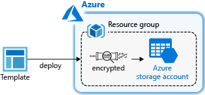
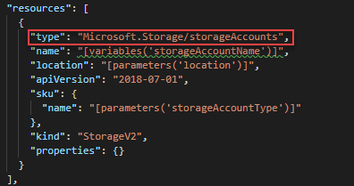
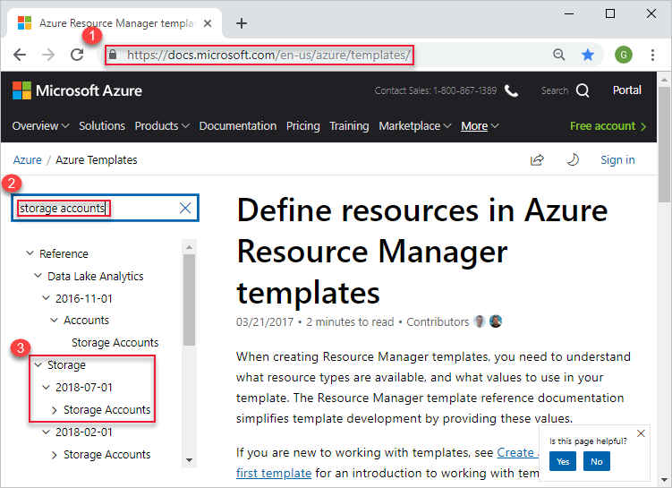
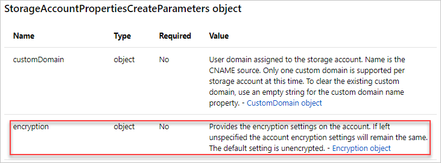
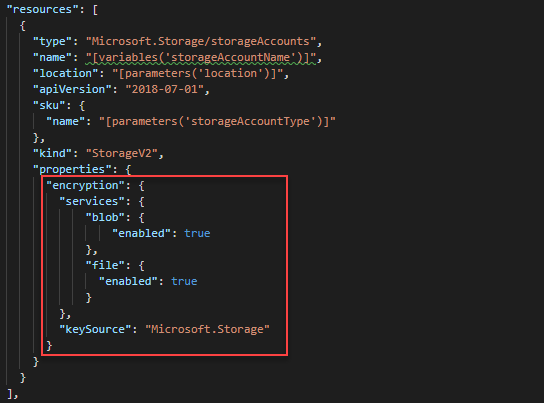
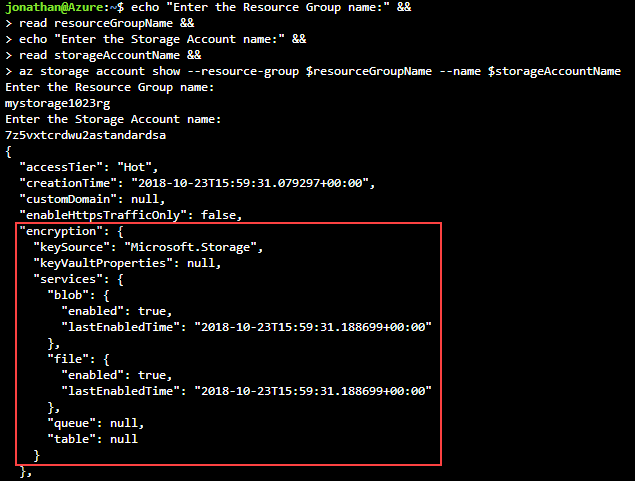

---
title: Utilize template reference
description: Utilize the Azure Resource Manager template reference to create a template for deploying an encrypted storage account.
author: mumian
ms.date: 03/04/2019
ms.topic: tutorial
ms.author: jgao
ms.custom: seodec18
---

# Tutorial: Utilize the Azure Resource Manager template reference

Learn how to find the template schema information, and use the information to create Azure Resource Manager templates.

In this tutorial, you use a base template from Azure Quickstart templates. Using template reference documentation, you customize the template to create an encrypted Storage account.



This tutorial covers the following tasks:

> [!div class="checklist"]
> * Open a Quickstart template
> * Understand the template
> * Find the template reference
> * Edit the template
> * Deploy the template

If you don't have an Azure subscription, [create a free account](https://azure.microsoft.com/free/) before you begin.

## Prerequisites

To complete this article, you need:

* [Visual Studio Code](https://code.visualstudio.com/) with [Resource Manager Tools extension](./resource-manager-quickstart-create-templates-use-visual-studio-code.md#prerequisites).

## Open a Quickstart template

[Azure QuickStart Templates](https://azure.microsoft.com/resources/templates/) is a repository for Resource Manager templates. Instead of creating a template from scratch, you can find a sample template and customize it. The template used in this quickstart is called [Create a standard storage account](https://azure.microsoft.com/resources/templates/101-storage-account-create/). The template defines an Azure Storage account resource.

1. From Visual Studio Code, select **File**>**Open File**.
2. In **File name**, paste the following URL:

    ```url
    https://raw.githubusercontent.com/Azure/azure-quickstart-templates/master/101-storage-account-create/azuredeploy.json
    ```
3. Select **Open** to open the file.
4. Select **File**>**Save As** to save the file as **azuredeploy.json** to your local computer.

## Understand the schema

1. From VS Code, collapse the template to the root level. You have the simplest structure with the following elements:

    

    * **$schema**: specify the location of the JSON schema file that describes the version of the template language.
    * **contentVersion**: specify any value for this element to document significant changes in your template.
    * **parameters**: specify the values that are provided when deployment is executed to customize resource deployment.
    * **variables**: specify the values that are used as JSON fragments in the template to simplify template language expressions.
    * **resources**: specify the resource types that are deployed or updated in a resource group.
    * **outputs**: specify the values that are returned after deployment.

2. Expand **resources**. There is a `Microsoft.Storage/storageAccounts` resource defined. The template creates a non-encrypted Storage account.

    

## Find the template reference

1. Browse to [Azure Template reference](https://docs.microsoft.com/azure/templates/).
2. In the **Filter by title** box, enter **storage accounts**.
3. Select **Reference/Template reference/Storage/&lt;Version>/Storage Accounts** as shown in the following screenshot:

    

    If you don't know which version to choose, use the latest version.

4. Find the encryption-related definition information.  

    ```json
    "encryption": {
      "services": {
        "blob": {
          "enabled": boolean
        },
        "file": {
          "enabled": boolean
        }
      },
      "keySource": "string",
      "keyvaultproperties": {
        "keyname": "string",
        "keyversion": "string",
        "keyvaulturi": "string"
      }
    },
    ```

    On the same web page, the following description confirms the `encryption` object is used to create an encrypted storage account.

    

    And there are two ways for managing the encryption key. You can use Microsoft-managed encryption keys with Storage Service Encryption, or you can use your own encryption keys. To keep this tutorial simple, you use the `Microsoft.Storage` option, so you don't have to create an Azure Key Vault.

    

    Your encryption object shall look like:

    ```json
    "encryption": {
        "services": {
            "blob": {
                "enabled": true
            },
            "file": {
              "enabled": true
            }
        },
        "keySource": "Microsoft.Storage"
    }
    ```

## Edit the template

From Visual Studio Code, modify the template so that the resources element looks like:



## Deploy the template

Refer to the [Deploy the template](./resource-manager-quickstart-create-templates-use-visual-studio-code.md#deploy-the-template) section in the Visual Studio Code quickstart for the deployment procedure.

The following screenshot shows the CLI command for listing the newly created storage account, which indicates encryption has been enabled for the blob storage.



## Clean up resources

When the Azure resources are no longer needed, clean up the resources you deployed by deleting the resource group.

1. From the Azure portal, select **Resource group** from the left menu.
2. Enter the resource group name in the **Filter by name** field.
3. Select the resource group name.  You shall see a total of six resources in the resource group.
4. Select **Delete resource group** from the top menu.

## Next steps

In this tutorial, you learned how to use template reference to customize an existing template. To learn how to create multiple storage account instances, see:

> [!div class="nextstepaction"]
> [Create multiple instances](./resource-manager-tutorial-create-multiple-instances.md)
