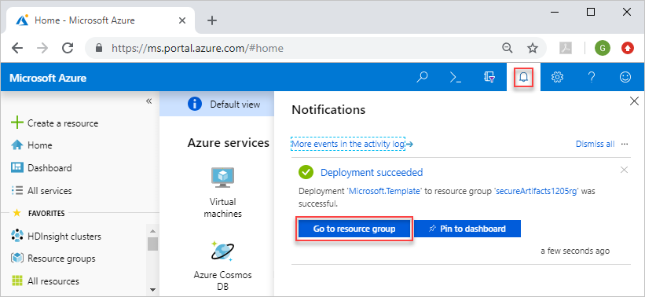
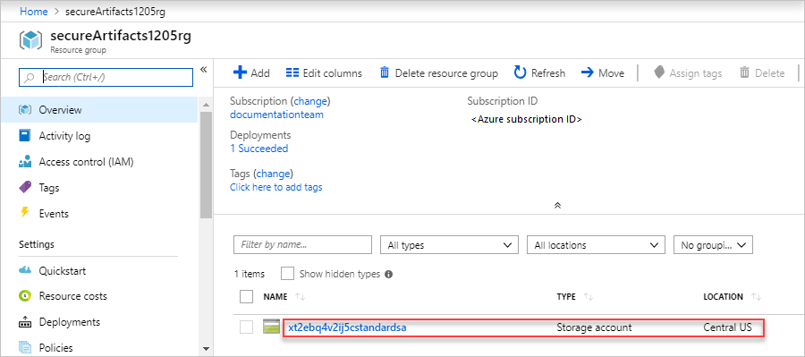
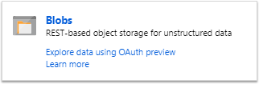
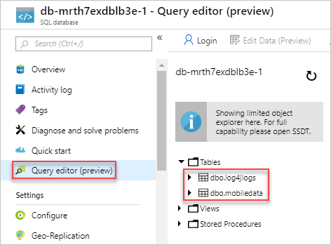

---
title: Secure artifacts in Azure Resource Manager template deployments | Microsoft Docs
description: Learn how to secure the artifacts used in your Azure Resource Manager templates.
services: azure-resource-manager
documentationcenter: ''
author: mumian
manager: dougeby
editor: 

ms.service: azure-resource-manager
ms.workload: multiple
ms.tgt_pltfrm: na
ms.devlang: na
ms.date: 12/07/2018
ms.topic: tutorial
ms.author: jgao
---

# Tutorial: Secure artifacts in Azure Resource Manager template deployments

Learn how to secure the artifacts used in your Azure Resource Manager templates using Azure Storage account with shared access signatures (SAS). Deployment artifacts are any files, in addition to the main template file, that are needed to complete a deployment. For example, in [Tutorial: Import SQL BACPAC files with Azure Resource Manager templates](./resource-manager-tutorial-deploy-sql-extensions-bacpac.md), the main template creates an Azure SQL Database; it also calls a BACPAC file to create tables and insert data. The BACPAC file is an artifact. The artifact is stored in an Azure storage account with public access. In this tutorial, you use SAS to grant limited access to the BACPAC file in your own Azure Storage account. For more information about SAS, see [Using shared access signatures (SAS)](../storage/common/storage-dotnet-shared-access-signature-part-1.md).

To learn how to secure linked template, see [Tutorial: Create linked Azure Resource Manager templates](./resource-manager-tutorial-create-linked-templates.md).

This tutorial covers the following tasks:

> [!div class="checklist"]
> * Prepare a BACPAC file
> * Open an existing template
> * Edit the template
> * Deploy the template
> * Verify the deployment

If you don't have an Azure subscription, [create a free account](https://azure.microsoft.com/free/) before you begin.

[!INCLUDE [updated-for-az](../../includes/updated-for-az.md)]

## Prerequisites

To complete this article, you need:

* [Visual Studio Code](https://code.visualstudio.com/) with the Resource Manager Tools extension. See [Install the extension
](./resource-manager-quickstart-create-templates-use-visual-studio-code.md#prerequisites).
* Review [Tutorial: Import SQL BACPAC files with Azure Resource Manager templates](./resource-manager-tutorial-deploy-sql-extensions-bacpac.md). The template used in this tutorial is the one developed in that tutorial. A download link of the completed template is provided in this article.
* To increase security, use a generated password for the SQL Server administrator account. Here is a sample for generating a password:

    ```azurecli-interactive
    openssl rand -base64 32
    ```
    Azure Key Vault is designed to safeguard cryptographic keys and other secrets. For more information, see [Tutorial: Integrate Azure Key Vault in Resource Manager Template deployment](./resource-manager-tutorial-use-key-vault.md). We also recommend you to update your password every three months.

## Prepare a BACPAC file

In this section, you prepare the BACPAC file so the file is accessible securely when you deploy the Resource Manager template. There are five procedures in this section:

* Download the BACPAC file.
* Create an Azure Storage account.
* Create a Storage account Blob container.
* Upload the BACPAC file to the container.
* Retrieve the SAS token of the BACPAC file.

To automate these steps using a PowerShell script, see the script from [Upload the linked template](./resource-manager-tutorial-create-linked-templates.md#upload-the-linked-template).

### Download the BACPAC file

Download the [BACPAC file](https://armtutorials.blob.core.windows.net/sqlextensionbacpac/SQLDatabaseExtension.bacpac), and save the file to your local computer with the same name, **SQLDatabaseExtension.bacpac**.

### Create a storage account

1. Select the following image to open a Resource Manager template in the Azure portal.

    <a href="https://portal.azure.com/#create/Microsoft.Template/uri/https%3a%2f%2fraw.githubusercontent.com%2fAzure%2fazure-quickstart-templates%2fmaster%2f101-storage-account-create%2fazuredeploy.json" target="_blank"></a>
2. Enter the following properties:

    * **Subscription**: Select your Azure subscription.
    * **Resource Group**: Select **Create new** and give it a name. A resource group is a container for Azure resources for the management purpose. In this tutorial, you can use the same resource group for the storage account and the Azure SQL Database. Make a note of this resource group name, you need it when you create the Azure SQL Database later in the tutorials.
    * **Location**: Select a region. For example, **Central US**. 
    * **Storage Account Type**: use the default value, which is **Standard_LRS**.
    * **Location**: Use the default value, which is **[resourceGroup().location]**. That means you use the resource group location for the storage account.
    * **I agree to the terms and conditions started above**: (selected)
3. Select **Purchase**.
4. Select the notification icon (the bell icon) on the upper right corner of the portal to see the deployment status.

    
5. After the storage account is deployed successfully, select **Go to resource group** from the notification pane to open the resource group.

### Create a Blob container

A Blob container is needed before you can upload any files. 

1. Select the storage account to open it. You shall see only one storage account listed in the resource group. Your storage account name is different from the one shown in the following screenshot.

    

2. Select the **Blobs** tile.

    
3. Select **+ Container** from the top to create a new container.
4. Enter the following values:

    * **Name**: enter **sqlbacpac**. 
    * **Public access level**: use the default value, **Private (no anonymous access)**.
5. Select **OK**.
6. Select **sqlbacpac** to open the newly created container.

### Upload the BACPAC file to the container

1. Select **Upload**.
2. Enter the following values:

    * **Files**: Following the instructions to select the BACPAC file you downloaded earlier. The default name is **SQLDatabaseExtension.bacpac**.
    * **Authentication type**: Select **SAS**.  *SAS* is the default value.
3. Select **Upload**.  Once the file is uploaded successfully, the file name shall be listed in the container.

### <a name="generate-a-sas-token" />Generate a SAS token

1. Right-click **SQLDatabaseExtension.bacpac** from the container, and then select **Generate SAS**.
2. Enter the following values:

    * **Permission**: Use the default, **Read**.
    * **Start and expiry date/time**: The default value gives you eight hours to use the SAS token. If you need more time to complete this tutorial, update **Expiry**.
    * **Allowed IP addresses**: Leave this field blank.
    * **Allowed protocols**: use the default value: **HTTPS**.
    * **Signing key**: use the default value: **Key 1**.
3. Select **Generate blob SAS token and URL**.
4. Make a copy of **Blob SAS URL**. In the middle of the URL is the file name **SQLDatabaseExtension.bacpac**.  The file name divides the URL into three parts:

    - **Artifact location**: https://xxxxxxxxxxxxxx.blob.core.windows.net/sqlbacpac/. Make sure the location ends with a "/".
    - **BACPAC file name**: SQLDatabaseExtension.bacpac.
    - **Artifact location SAS token**: Make sure the token precedes with a "?."

    You need these three values in [Deploy the template](#deploy-the-template).

## Open an existing template

In this session, you modify the template you created in [Tutorial: Import SQL BACPAC files with Azure Resource Manager templates](./resource-manager-tutorial-deploy-sql-extensions-bacpac.md) to call the BACPAC file with a SAS token.  The template developed in the SQL extension tutorial is shared at [https://armtutorials.blob.core.windows.net/sqlextensionbacpac/azuredeploy.json](https://armtutorials.blob.core.windows.net/sqlextensionbacpac/azuredeploy.json).

1. From Visual Studio Code, select **File**>**Open File**.
2. In **File name**, paste the following URL:

    ```url
    https://armtutorials.blob.core.windows.net/sqlextensionbacpac/azuredeploy.json
    ```
3. Select **Open** to open the file.

    There are five resources defined in the template:

    * `Microsoft.Sql/servers`. See the [template reference](https://docs.microsoft.com/azure/templates/microsoft.sql/2015-05-01-preview/servers).
    * `Microsoft.SQL/servers/securityAlertPolicies`. See the [template reference](https://docs.microsoft.com/azure/templates/microsoft.sql/2014-04-01/servers/databases/securityalertpolicies).
    * `Microsoft.SQL/servers/filewallRules`. See the [template reference](https://docs.microsoft.com/azure/templates/microsoft.sql/2015-05-01-preview/servers/firewallrules).
    * `Microsoft.SQL/servers/databases`.  See the [template reference](https://docs.microsoft.com/azure/templates/microsoft.sql/servers/databases).
    * `Microsoft.SQL/server/databases/extensions`.  See the [template reference](https://docs.microsoft.com/azure/templates/microsoft.sql/2014-04-01/servers/databases/extensions).

    It is helpful to get some basic understanding of the template before customizing it.
4. Select **File**>**Save As** to save a copy of the file to your local computer with the name **azuredeploy.json**.

## Edit the template

Add the following additional parameters:

```json
"_artifactsLocation": {
    "type": "string",
    "metadata": {
        "description": "The base URI where artifacts required by this template are located."
    }
},
"_artifactsLocationSasToken": {
    "type": "securestring",
    "metadata": {
        "description": "The sasToken required to access _artifactsLocation."
    },
    "defaultValue": ""
},
"bacpacFileName": {
    "type": "string",
    "defaultValue": "SQLDatabaseExtension.bacpac",
    "metadata": {
        "description": "The bacpac for configure the database and tables."
    }
}
```


Update the value of the following two elements:

```json
"storageKey": "[parameters('_artifactsLocationSasToken')]",
"storageUri": "[uri(parameters('_artifactsLocation'), parameters('bacpacFileName'))]",
```

## Deploy the template

[!INCLUDE [updated-for-az](../../includes/updated-for-az.md)]

Refer to the [Deploy the template](./resource-manager-tutorial-create-multiple-instances.md#deploy-the-template) section for the deployment procedure. Use the following PowerShell deployment script instead:

```azurepowershell
$resourceGroupName = Read-Host -Prompt "Enter the Resource Group name"
$location = Read-Host -Prompt "Enter the location (i.e. centralus)"
$adminUsername = Read-Host -Prompt "Enter the virtual machine admin username"
$adminPassword = Read-Host -Prompt "Enter the admin password" -AsSecureString
$artifactsLocation = Read-Host -Prompt "Enter the artifacts location"
$artifactsLocationSasToken = Read-Host -Prompt "Enter the artifacts location SAS token" -AsSecureString
$bacpacFileName = Read-Host -Prompt "Enter the BACPAC file name"

New-AzResourceGroup -Name $resourceGroupName -Location $location
New-AzResourceGroupDeployment `
    -ResourceGroupName $resourceGroupName `
    -adminUser $adminUsername `
    -adminPassword $adminPassword `
    -_artifactsLocation $artifactsLocation `
    -_artifactsLocationSasToken $artifactsLocationSasToken `
    -bacpacFileName $bacpacFileName `
    -TemplateFile azuredeploy.json
```

Use a generated password. See [Prerequisites](#prerequisites).
For the values of _artifactsLocation, _artifactsLocationSasToken and bacpacFileName, see [Generate a SAS token](#generate-a-sas-token).

## Verify the deployment

In the portal, select the SQL database from the newly deployed resource group. Select **Query editor (preview)**, and then enter the administrator credentials. You shall see two tables imported into the database:



## Clean up resources

When the Azure resources are no longer needed, clean up the resources you deployed by deleting the resource group.

1. From the Azure portal, select **Resource group** from the left menu.
2. Enter the resource group name in the **Filter by name** field.
3. Select the resource group name.  You shall see a total of six resources in the resource group.
4. Select **Delete resource group** from the top menu.

## Next steps

In this tutorial, you deployed a SQL Server, a SQL Database, and imported a BACPAC file using SAS token. To learn how to deploy Azure resources across multiple regions, and how to use safe deployment practices, see

> [!div class="nextstepaction"]
> [Use Azure Deployment Manager](./resource-manager-tutorial-deploy-vm-extensions.md)
