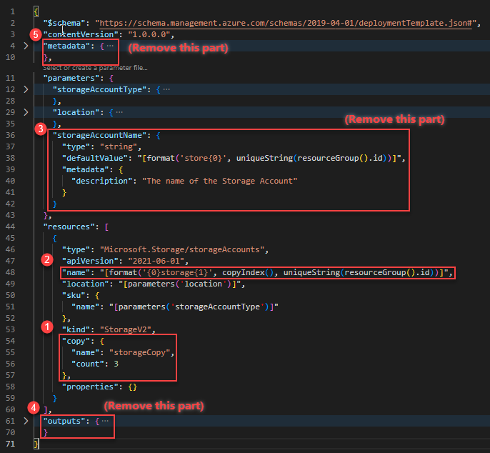

# Tutorial: Create multiple resource instances with ARM templates

Learn how to iterate in your Azure Resource Manager template (ARM template) to create multiple instances of an Azure resource. In this tutorial, you modify a template to create three storage account instances.


This tutorial covers the following tasks:

> [!div class="checklist"]
> * Open a Quickstart template
> * Edit the template
> * Deploy the template

If you don't have an Azure subscription, [create a free account](https://azure.microsoft.com/free/) before you begin.

For a Learn module that covers resource copy, see [Manage complex cloud deployments by using advanced ARM template features](/training/modules/manage-deployments-advanced-arm-template-features/).

## Prerequisites

To complete this article, you need:

* Visual Studio Code with Resource Manager Tools extension. See [Quickstart: Create ARM templates with Visual Studio Code](quickstart-create-templates-use-visual-studio-code.md).

## Open a Quickstart template

[Azure Quickstart Templates](https://azure.microsoft.com/resources/templates/) is a repository for ARM templates. Instead of creating a template from scratch, you can find a sample template and customize it. The template used in this quickstart is called [Create a standard storage account](https://azure.microsoft.com/resources/templates/storage-account-create/). The template defines an Azure Storage account resource.

1. From Visual Studio Code, select **File** > **Open File**.
1. In **File name**, paste the following URL:

    ```url
    https://raw.githubusercontent.com/Azure/azure-quickstart-templates/master/quickstarts/microsoft.storage/storage-account-create/azuredeploy.json
    ```

1. Select **Open** to open the file.
1. There is a `Microsoft.Storage/storageAccounts` resource defined in the template. Compare the template to the [template reference](/azure/templates/Microsoft.Storage/storageAccounts). It's helpful to get some basic understanding of the template before customizing it.
1. Select **File** > **Save As** to save the file as _azuredeploy.json_ to your local computer.

## Edit the template

The existing template creates one storage account. You customize the template to create three storage accounts.

From Visual Studio Code, make the following four changes:



1. Add a `copy` element to the storage account resource definition. In the `copy` element, you specify the number of iterations and a variable for this loop. The count value must be a positive integer and can't exceed 800.
2. The `copyIndex()` function returns the current iteration in the loop. You use the index as the name prefix. `copyIndex()` is zero-based. To offset the index value, you can pass a value in the `copyIndex()` function. For example, `copyIndex(1)`.
3. Delete the `variables` element, because it's not used anymore.
4. Delete the `outputs` element. It's no longer needed.

The completed template looks like:

```json
{
  "$schema": "https://schema.management.azure.com/schemas/2019-04-01/deploymentTemplate.json#",
  "contentVersion": "1.0.0.0",
  "parameters": {
    "storageAccountType": {
      "type": "string",
      "defaultValue": "Standard_LRS",
      "allowedValues": [
        "Standard_LRS",
        "Standard_GRS",
        "Standard_ZRS",
        "Premium_LRS"
      ],
      "metadata": {
        "description": "Storage Account type"
      }
    },
    "location": {
      "type": "string",
      "defaultValue": "[resourceGroup().location]",
      "metadata": {
        "description": "Location for all resources."
      }
    }
  },
  "resources": [
    {
      "type": "Microsoft.Storage/storageAccounts",
      "apiVersion": "2019-04-01",
      "name": "[concat(copyIndex(),'storage', uniqueString(resourceGroup().id))]",
      "location": "[parameters('location')]",
      "sku": {
        "name": "[parameters('storageAccountType')]"
      },
      "kind": "StorageV2",
      "copy": {
        "name": "storagecopy",
        "count": 3
      },
      "properties": {}
    }
  ]
}
```

For more information about creating multiple instances, see [Resource iteration in ARM templates](./copy-resources.md)

## Deploy the template

1. Sign in to the [Azure Cloud Shell](https://shell.azure.com)

1. Choose your preferred environment by selecting either **PowerShell** or **Bash** (for CLI) on the upper left corner. Restarting the shell is required when you switch.

    

1. Select **Upload/download files**, and then select **Upload**. See the previous screenshot. Select the file you saved in the previous section. After uploading the file, you can use the `ls` command and the `cat` command to verify the file was uploaded successfully.

1. From the Cloud Shell, run the following commands. Select the tab to show the PowerShell code or the CLI code.

    # [CLI](#tab/CLI)

    ```azurecli
    echo "Enter a project name that is used to generate resource group name:" &&
    read projectName &&
    echo "Enter the location (i.e. centralus):" &&
    read location &&
    resourceGroupName="${projectName}rg" &&
    az group create --name $resourceGroupName --location "$location" &&
    az deployment group create --resource-group $resourceGroupName --template-file "$HOME/azuredeploy.json"
    ```

    # [PowerShell](#tab/PowerShell)

    ```azurepowershell
    $projectName = Read-Host -Prompt "Enter a project name that is used to generate resource group name"
    $location = Read-Host -Prompt "Enter the location (i.e. centralus)"
    $resourceGroupName = "${projectName}rg"

    New-AzResourceGroup -Name $resourceGroupName -Location "$location"
    New-AzResourceGroupDeployment -ResourceGroupName $resourceGroupName -TemplateFile "$HOME/azuredeploy.json"
    ```

    ---

After a successful template deployment you can display the three storage accounts created in the specified resource group. Compare the storage account names with the name definition in the template.

# [CLI](#tab/azure-cli)

```azurecli
echo "Enter a project name that is used to generate resource group name:" &&
read projectName &&
resourceGroupName="${projectName}rg" &&
az storage account list --resource-group $resourceGroupName &&
echo "Press [ENTER] to continue ..."
```

# [PowerShell](#tab/azure-powershell)

```azurepowershell
$projectName = Read-Host -Prompt "Enter a project name that is used to generate resource group name"
$resourceGroupName = "${projectName}rg"

Get-AzStorageAccount -ResourceGroupName $resourceGroupName
Write-Host "Press [ENTER] to continue ..."
```

---

## Clean up resources

When the Azure resources are no longer needed, clean up the resources you deployed by deleting the resource group.

1. From the Azure portal, select **Resource group** from the left menu.
2. Enter the resource group name in the **Filter by name** field.
3. Select the resource group name.  You shall see a total of three resources in the resource group.
4. Select **Delete resource group** from the top menu.

## Next steps

In this tutorial, you learned how to create multiple storage account instances. In the next tutorial, you develop a template with multiple resources and multiple resource types. Some of the resources have dependent resources.

> [!div class="nextstepaction"]
> [Create dependent resources](./template-tutorial-create-templates-with-dependent-resources.md)
