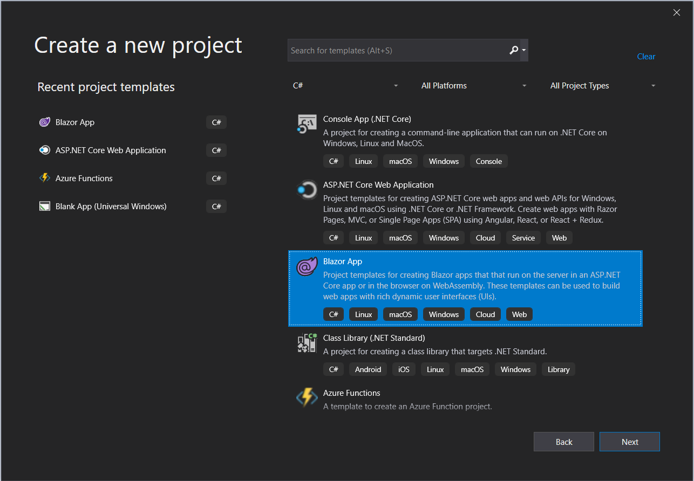
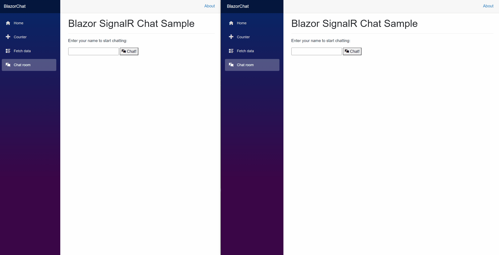
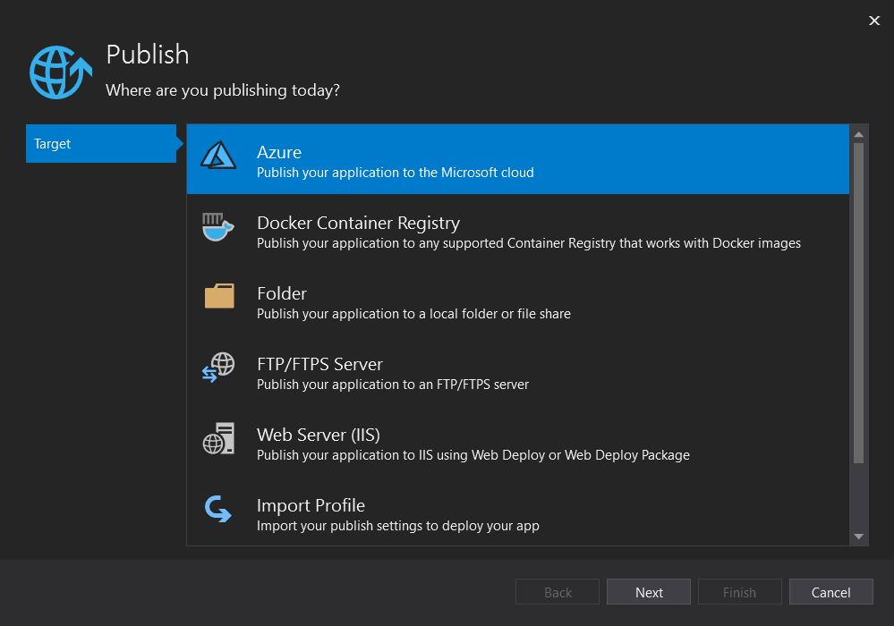
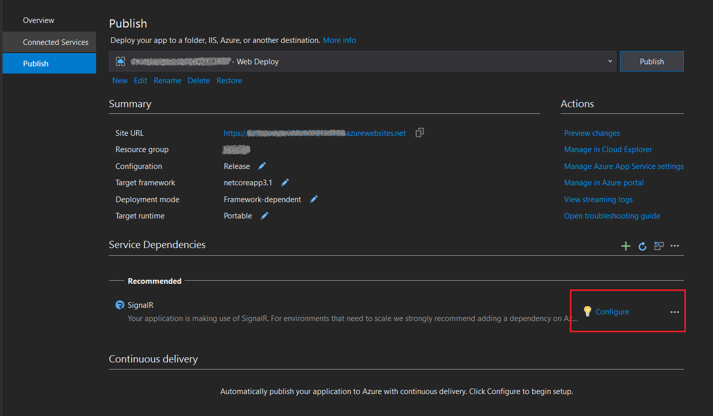
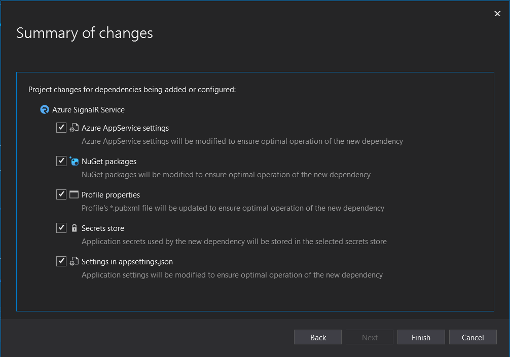
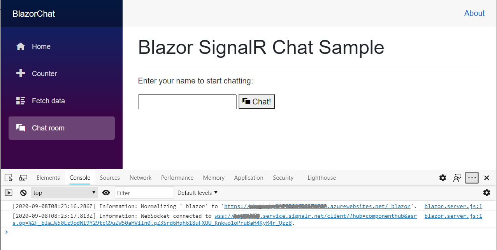

# Tutorial: Build a Blazor Server chat app

This tutorial shows you how to build and modify a Blazor Server app. You'll learn how to:
> [!div class="checklist"] 
> * Build a simple chat room with the Blazor Server app template.
> * Work with Razor components.
> * Use event handling and data binding in Razor components.
> * Quick-deploy to Azure App Service in Visual Studio.
> * Migrate from local SignalR to Azure SignalR Service.

Ready to start?

> [!div class="nextstepaction"]
> [Step by step build](#prerequisites)

> [!div class="nextstepaction"]
> [Try Blazor demo now](https://asrs-blazorchat-live-demo.azurewebsites.net/chatroom)

## Prerequisites

* Install [.NET Core 3.0 SDK](https://dotnet.microsoft.com/download/dotnet-core/3.0) (Version >= 3.0.100)
* Install [Visual Studio 2019](https://visualstudio.microsoft.com/vs/) (Version >= 16.3)


[Having issues? Let us know.](https://aka.ms/asrs/qsblazor)

## Build a local chat room in Blazor Server app

Beginning in Visual Studio 2019 version 16.2.0, Azure SignalR Service is built into the web application publish process to make managing the dependencies between the web app and SignalR service much more convenient. You can work in a local SignalR instance in a local development environment and work in Azure SignalR Service for Azure App Service at the same time without any code changes.

1. Create a Blazor chat app:
   1. In Visual Studio, choose **Create a new project**. 
   1. Select **Blazor App**. 
   1. Name the application and choose a folder. 
   1. Select the **Blazor Server App** template.
    
       > [!NOTE]
       > Make sure that you've already installed .NET Core SDK 3.0+ to enable Visual Studio to correctly recognize the target framework.
   
       [  ](media/signalr-tutorial-build-blazor-server-chat-app/blazor-chat-create.png#lightbox)
   
   5. You also can create a project by running the [`dotnet new`](/dotnet/core/tools/dotnet-new) command in the .NET CLI:
   
       ```dotnetcli
       dotnet new blazorserver -o BlazorChat
       ```
   
1. Add a new C# file called `BlazorChatSampleHub.cs` and create a new class `BlazorChatSampleHub` deriving from the `Hub` class for the chat app. For more information on creating hubs, see [Create and Use Hubs](/aspnet/core/signalr/hubs#create-and-use-hubs). 
   
   ```cs
   using System;
   using System.Threading.Tasks;
   using Microsoft.AspNetCore.SignalR;
   
   namespace BlazorChat
   {
       public class BlazorChatSampleHub : Hub
       {
           public const string HubUrl = "/chat";
   
           public async Task Broadcast(string username, string message)
           {
               await Clients.All.SendAsync("Broadcast", username, message);
           }
   
           public override Task OnConnectedAsync()
           {
               Console.WriteLine($"{Context.ConnectionId} connected");
               return base.OnConnectedAsync();
           }
   
           public override async Task OnDisconnectedAsync(Exception e)
           {
               Console.WriteLine($"Disconnected {e?.Message} {Context.ConnectionId}");
               await base.OnDisconnectedAsync(e);
           }
       }
   }
   ```
   
1. Add an endpoint for the hub in the `Startup.Configure()` method.
   
   ```cs
   app.UseEndpoints(endpoints =>
   {
       endpoints.MapBlazorHub();
       endpoints.MapFallbackToPage("/_Host");
       endpoints.MapHub<BlazorChatSampleHub>(BlazorChatSampleHub.HubUrl);
   });
   ```
   
1. Install the `Microsoft.AspNetCore.SignalR.Client` package to use the SignalR client.

   ```dotnetcli
   dotnet add package Microsoft.AspNetCore.SignalR.Client --version 3.1.7
   ```

1. Create a new [Razor component](/aspnet/core/blazor/components/) called `ChatRoom.razor` under the `Pages` folder to implement the SignalR client. Follow the steps below or use the [ChatRoom.razor](https://github.com/aspnet/AzureSignalR-samples/tree/master/samples/BlazorChat/Pages/ChatRoom.razor) file.

   1. Add the [`@page`](/aspnet/core/mvc/views/razor#page) directive and the using statements. Use the [`@inject`](/aspnet/core/mvc/views/razor#inject) directive to inject the [`NavigationManager`](/aspnet/core/blazor/fundamentals/routing#uri-and-navigation-state-helpers) service.
      
      ```razor
      @page "/chatroom"
      @inject NavigationManager navigationManager
      @using Microsoft.AspNetCore.SignalR.Client;
      ```

   1. In the `@code` section, add the following members to the new SignalR client to send and receive messages.
      
      ```razor
      @code {
          // flag to indicate chat status
          private bool _isChatting = false;
          
          // name of the user who will be chatting
          private string _username;
      
          // on-screen message
          private string _message;
          
          // new message input
          private string _newMessage;
          
          // list of messages in chat
          private List<Message> _messages = new List<Message>();
          
          private string _hubUrl;
          private HubConnection _hubConnection;
      
          public async Task Chat()
          {
              // check username is valid
              if (string.IsNullOrWhiteSpace(_username))
              {
                  _message = "Please enter a name";
                  return;
              };
      
              try
              {
                  // Start chatting and force refresh UI.
                  _isChatting = true;
                  await Task.Delay(1);

                  // remove old messages if any
                  _messages.Clear();
         
                  // Create the chat client
                  string baseUrl = navigationManager.BaseUri;
      
                  _hubUrl = baseUrl.TrimEnd('/') + BlazorChatSampleHub.HubUrl;
      
                  _hubConnection = new HubConnectionBuilder()
                      .WithUrl(_hubUrl)
                      .Build();
      
                  _hubConnection.On<string, string>("Broadcast", BroadcastMessage);
      
                  await _hubConnection.StartAsync();
      
                  await SendAsync($"[Notice] {_username} joined chat room.");
              }
              catch (Exception e)
              {
                  _message = $"ERROR: Failed to start chat client: {e.Message}";
                  _isChatting = false;
              }
          }
      
          private void BroadcastMessage(string name, string message)
          {
              bool isMine = name.Equals(_username, StringComparison.OrdinalIgnoreCase);
      
              _messages.Add(new Message(name, message, isMine));
      
              // Inform blazor the UI needs updating
              InvokeAsync(StateHasChanged);
          }
      
          private async Task DisconnectAsync()
          {
              if (_isChatting)
              {
                  await SendAsync($"[Notice] {_username} left chat room.");
      
                  await _hubConnection.StopAsync();
                  await _hubConnection.DisposeAsync();
      
                  _hubConnection = null;
                  _isChatting = false;
              }
          }
      
          private async Task SendAsync(string message)
          {
              if (_isChatting && !string.IsNullOrWhiteSpace(message))
              {
                  await _hubConnection.SendAsync("Broadcast", _username, message);
      
                  _newMessage = string.Empty;
              }
          }
      
          private class Message
          {
              public Message(string username, string body, bool mine)
              {
                  Username = username;
                  Body = body;
                  Mine = mine;
              }
      
              public string Username { get; set; }
              public string Body { get; set; }
              public bool Mine { get; set; }
      
              public bool IsNotice => Body.StartsWith("[Notice]");
      
              public string CSS => Mine ? "sent" : "received";
          }
      }
      ```

   1. Add the UI markup before the `@code` section to interact with the SignalR client.
      
      ```razor
      <h1>Blazor SignalR Chat Sample</h1>
      <hr />
      
      @if (!_isChatting)
      {
          <p>
              Enter your name to start chatting:
          </p>
      
          <input type="text" maxlength="32" @bind="@_username" />
          <button type="button" @onclick="@Chat"><span class="oi oi-chat" aria-hidden="true"></span> Chat!</button>
      
          // Error messages
          @if (_message != null)
          {
              <div class="invalid-feedback">@_message</div>
              <small id="emailHelp" class="form-text text-muted">@_message</small>
          }
      }
      else
      {
          // banner to show current user
          <div class="alert alert-secondary mt-4" role="alert">
              <span class="oi oi-person mr-2" aria-hidden="true"></span>
              <span>You are connected as <b>@_username</b></span>
              <button class="btn btn-sm btn-warning ml-md-auto" @onclick="@DisconnectAsync">Disconnect</button>
          </div>
          // display messages
          <div id="scrollbox">
              @foreach (var item in _messages)
              {
                  @if (item.IsNotice)
                  {
                      <div class="alert alert-info">@item.Body</div>
                  }
                  else
                  {
                      <div class="@item.CSS">
                          <div class="user">@item.Username</div>
                          <div class="msg">@item.Body</div>
                      </div>
                  }
              }
              <hr />
              <textarea class="input-lg" placeholder="enter your comment" @bind="@_newMessage"></textarea>
              <button class="btn btn-default" @onclick="@(() => SendAsync(_newMessage))">Send</button>
          </div>
      }
      ```

1. Update the `NavMenu.razor` component to insert a new `NavLink` component to link to the chat room under `NavMenuCssClass`.

   ```razor
   <li class="nav-item px-3">
       <NavLink class="nav-link" href="chatroom">
           <span class="oi oi-chat" aria-hidden="true"></span> Chat room
       </NavLink>
   </li>
   ```
   
1. Add a few CSS classes to the `site.css` file to style the UI elements in the chat page.

   ```css
   /* improved for chat text box */
   textarea {
       border: 1px dashed #888;
       border-radius: 5px;
       width: 80%;
       overflow: auto;
       background: #f7f7f7
   }
   
   /* improved for speech bubbles */
   .received, .sent {
       position: relative;
       font-family: arial;
       font-size: 1.1em;
       border-radius: 10px;
       padding: 20px;
       margin-bottom: 20px;
   }
   
   .received:after, .sent:after {
       content: '';
       border: 20px solid transparent;
       position: absolute;
       margin-top: -30px;
   }
   
   .sent {
       background: #03a9f4;
       color: #fff;
       margin-left: 10%;
       top: 50%;
       text-align: right;
   }
   
   .received {
       background: #4CAF50;
       color: #fff;
       margin-left: 10px;
       margin-right: 10%;
   }
   
   .sent:after {
       border-left-color: #03a9f4;
       border-right: 0;
       right: -20px;
   }
   
   .received:after {
       border-right-color: #4CAF50;
       border-left: 0;
       left: -20px;
   }
   
   /* div within bubble for name */
   .user {
       font-size: 0.8em;
       font-weight: bold;
       color: #000;
   }
   
   .msg {
       /*display: inline;*/
   }
   ```

1. Press <kbd>F5</kbd> to run the app. Now, you can initiate the chat:

   [  ](media/signalr-tutorial-build-blazor-server-chat-app/blazor-chat.gif#lightbox)
   
[Having issues? Let us know.](https://aka.ms/asrs/qsblazor)

## Publish to Azure

When you deploy the Blazor app to Azure App Service, we recommend that you use [Azure SignalR Service](/aspnet/core/signalr/scale#azure-signalr-service). Azure SignalR Service allows for scaling up a Blazor Server app to a large number of concurrent SignalR connections. In addition, the SignalR service's global reach and high-performance datacenters significantly aid in reducing latency due to geography.

> [!IMPORTANT]
> In a Blazor Server app, UI states are maintained on the server side, which means a sticky server session is required to preserve state. If there is a single app server, sticky sessions are ensured by design. However, if there are multiple app servers, there are chances that the client negotiation and connection may go to different servers which may lead to an inconsistent UI state management in a Blazor app. Hence, it is recommended to enable sticky server sessions as shown below in *appsettings.json*:
>
> ```json
> "Azure:SignalR:ServerStickyMode": "Required"
> ```

1. Right-click the project and go to **Publish**. Use the following settings:
   * **Target**: Azure
   * **Specific target**: All types of **Azure App Service** are supported.
   * **App Service**: Create or select the App Service instance.

   [  ](media/signalr-tutorial-build-blazor-server-chat-app/blazor-chat-profile.gif#lightbox)

1. Add the Azure SignalR Service dependency.

   After the creation of the publish profile, you can see a recommendation message to add Azure SignalR service under **Service Dependencies**. Select **Configure** to create a new or select an existing Azure SignalR Service in the pane.

   [  ](media/signalr-tutorial-build-blazor-server-chat-app/blazor-chat-dependency.png#lightbox)

   The service dependency will carry out the following activities to enable your app to automatically switch to Azure SignalR Service when on Azure:

   * Update [`HostingStartupAssembly`](/aspnet/core/fundamentals/host/platform-specific-configuration) to use Azure SignalR Service.
   * Add the Azure SignalR Service NuGet package reference.
   * Update the profile properties to save the dependency settings.
   * Configure the secrets store as per your choice.
   * Add the configuration in *appsettings.json* to make your app target Azure SignalR Service.

   [  ](media/signalr-tutorial-build-blazor-server-chat-app/blazor-chat-dependency-summary.png#lightbox)

1. Publish the app.

   Now the app is ready to be published. Upon the completion of the publishing process, the app automatically launches in a browser.
 
   > [!NOTE]
   > The app may require some time to start due to the Azure App Service deployment start latency. You can use the browser debugger tools (usually by pressing <kbd>F12</kbd>) to ensure that the traffic has been redirected to Azure SignalR Service.

   [  ](media/signalr-tutorial-build-blazor-server-chat-app/blazor-chat-azure.png#lightbox)
   
[Having issues? Let us know.](https://aka.ms/asrs/qsblazor)

## Enable Azure SignalR Service for local development

1. Add a reference to the Azure SignalR SDK using the following command.

   ```dotnetcli
   dotnet add package Microsoft.Azure.SignalR --version 1.5.1
   ```

1. Add a call to `AddAzureSignalR()` in `Startup.ConfigureServices()` as demonstrated below.

   ```cs
   public void ConfigureServices(IServiceCollection services)
   {
       ...
       services.AddSignalR().AddAzureSignalR();
       ...
   }
   ```

1. Configure the Azure SignalR Service connection string either in *appsettings.json* or by using the [Secret Manager](/aspnet/core/security/app-secrets?tabs=visual-studio#secret-manager) tool.

> [!NOTE]
> Step 2 can be replaced with configuring [Hosting Startup Assemblies](/aspnet/core/fundamentals/host/platform-specific-configuration) to use the SignalR SDK.
>
> 1. Add the configuration to turn on Azure SignalR Service in *appsettings.json*:
>
>     ```json
>     "Azure": {
>       "SignalR": {
>         "Enabled": true,
>         "ConnectionString": <your-connection-string>       
>       }
>     }
>    
>    ```
>
> 1. Configure the hosting startup assembly to use the Azure SignalR SDK. Edit *launchSettings.json* and add a configuration like the following example inside `environmentVariables`:
>
>     ```json
>    "environmentVariables": {
>         ...,
>        "ASPNETCORE_HOSTINGSTARTUPASSEMBLIES": "Microsoft.Azure.SignalR"
>      }
>  
>     ```
>

[Having issues? Let us know.](https://aka.ms/asrs/qsblazor)

## Clean up resources

To clean up the resources created in this tutorial, delete the resource group using the Azure portal.

## Additional resources

* [ASP.NET Core Blazor](/aspnet/core/blazor)

## Next steps

In this tutorial, you learned how to:

> [!div class="checklist"]
> * Build a simple chat room with the Blazor Server app template.
> * Work with Razor components.
> * Use event handling and data binding in Razor components.
> * Quick-deploy to Azure App Service in Visual Studio.
> * Migrate from local SignalR to Azure SignalR Service.

Read more about high availability:
> [!div class="nextstepaction"]
> [Resiliency and disaster recovery](signalr-concept-disaster-recovery.md)
