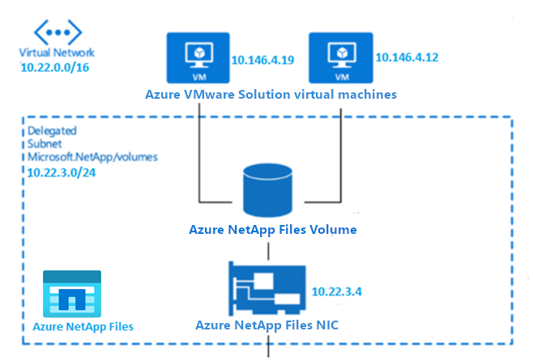

# Azure NetApp Files with Azure VMware Solution

In this article, we'll walk through the steps of integrating Azure NetApp Files with Azure VMware Solution-based workloads. The guest operating system will run inside virtual machines (VMs) accessing Azure NetApp Files volumes. 

## Azure NetApp Files overview

[Azure NetApp Files](../azure-netapp-files/azure-netapp-files-introduction.md) is an Azure service for migration and running the most demanding enterprise file-workloads in the cloud. This includes databases, SAP, and high-performance computing applications, with no code changes.

### Features
(Services where Azure NetApp Files are used.)

- **Active Directory connections**: Azure NetApp Files supports [Active Directory Domain Services and Azure Active Directory Domain Services](../azure-netapp-files/azure-netapp-files-create-volumes-smb.md#decide-which-domain-services-to-use).

- **Share Protocol**: Azure NetApp Files supports Server Message Block (SMB) and Network File System (NFS) protocols. This support means the volumes can be mounted on the Linux client and can be mapped on Windows client.

- **Azure VMware Solution**: Azure NetApp Files shares can be mounted from VMs that are created in the Azure VMware Solution environment.

Azure NetApp Files is available in many Azure regions and supports cross-region replication. For information on Azure NetApp Files configuration methods, see [Storage hierarchy of Azure NetApp Files](../azure-netapp-files/azure-netapp-files-understand-storage-hierarchy.md).

## Reference architecture

The following diagram illustrates a connection via Azure ExpressRoute to an Azure VMware Solution private cloud. The Azure VMware Solution environment accesses the Azure NetApp Files share, which is mounted on Azure VMware Solution VMs.

This article covers instructions to set up, test, and verify the Azure NetApp Files volume as a file share for Azure VMware Solution VMs. In this scenario, we've used the NFS protocol. Azure NetApp Files and Azure VMware Solution are created in the same Azure region.

## Prerequisites 

> [!div class="checklist"]
> * Azure subscription with Azure NetApp Files enabled
> * Subnet for Azure NetApp Files
> * Linux VM on Azure VMware Solution
> * Windows VMs on Azure VMware Solution

## Regions supported

List of supported regions can be found at [Azure Products by Region](https://azure.microsoft.com/global-infrastructure/services/?products=netapp,azure-vmware&regions=all).

## Verify pre-configured Azure NetApp Files 

Follow the step-by-step instructions in the following articles to create and Mount Azure NetApp Files volumes onto Azure VMware Solution VMs.

- [Create a NetApp account](../azure-netapp-files/azure-netapp-files-create-netapp-account.md)
- [Set up a capacity pool](../azure-netapp-files/azure-netapp-files-set-up-capacity-pool.md)
- [Create an SMB volume for Azure NetApp Files](../azure-netapp-files/azure-netapp-files-create-volumes-smb.md)
- [Create an NFS volume for Azure NetApp Files](../azure-netapp-files/azure-netapp-files-create-volumes.md)
- [Delegate a subnet to Azure NetApp Files](../azure-netapp-files/azure-netapp-files-delegate-subnet.md)

The following steps include verification of the pre-configured Azure NetApp Files created in Azure on Azure NetApp Files Premium service level.

1. In the Azure portal, under **STORAGE**, select **Azure NetApp Files**. A list of your configured Azure NetApp Files will show. 

    :::image type="content" source="media/net-app-files/azure-net-app-files-list.png" alt-text="Screenshot showing list of pre-configured Azure NetApp Files."::: 

2. Select a configured NetApp Files account to view its settings. For example, select **Contoso-anf2**. 

3. Select **Capacity pools** to verify the configured pool. 

    :::image type="content" source="media/net-app-files/net-app-settings.png" alt-text="Screenshot showing options to view capacity pools and volumes of a configured NetApp Files account.":::

    The Capacity pools page opens showing the capacity and service level. In this example, the storage pool is configured as 4 TiB with a Premium service level.

4. Select **Volumes** to view volumes created under the capacity pool. (See preceding screenshot.)

5. Select a volume to view its configuration.  

    :::image type="content" source="media/net-app-files/azure-net-app-volumes.png" alt-text="Screenshot showing volumes created under the capacity pool.":::

    A window opens showing the configuration details of the volume.

    :::image type="content" source="media/net-app-files/configuration-of-volume.png" alt-text="Screenshot showing configuration details of a volume.":::

    You can see that the volume anfvolume has a size of 200 GiB and is in capacity pool anfpool1.  It's exported as an NFS file share via 10.22.3.4:/ANFVOLUME. One private IP from the Azure Virtual Network (VNet) was created for Azure NetApp Files and the NFS path to mount on the VM. To learn about Azure NetApp Files volume performance by size or "Quota," see [Performance considerations for Azure NetApp Files](../azure-netapp-files/azure-netapp-files-performance-considerations.md). 

## Verify pre-configured Azure VMware Solution VM share mapping

To make an Azure NetApp Files share accessible to an Azure VMware Solution VM, it's important to understand SMB and NFS share mapping. Only after configuring the SMB or NFS volumes, can they be mounted as documented here.

- SMB share: Create an Active Directory connection before deploying an SMB volume. The specified domain controllers must be accessible by the delegated subnet of Azure NetApp Files for a successful connection. Once the Active Directory is configured within the Azure NetApp Files account, it will appear as a selectable item while creating SMB volumes.

- NFS share: Azure NetApp Files contributes to creating the volumes using NFS or dual protocol (NFS and SMB). A volume's capacity consumption counts against its pool's provisioned capacity. NFS can be mounted to the Linux server by using the command lines or /etc/fstab entries.

## Use Cases of Azure NetApp Files with Azure VMware Solution

The following are just a few compelling Azure NetApp Files use cases. 
- Horizon profile management
- Citrix profile management
- Remote Desktop Services profile management
- File shares on Azure VMware Solution

## Next steps

Now that you've covered integrating Azure NetApp Files with your Azure VMware Solution workloads, you may want to learn about:

- [Resource limits for Azure NetApp Files](../azure-netapp-files/azure-netapp-files-resource-limits.md#resource-limits).
- [Guidelines for Azure NetApp Files network planning](../azure-netapp-files/azure-netapp-files-network-topologies.md).
- [Cross-region replication of Azure NetApp Files volumes](../azure-netapp-files/cross-region-replication-introduction.md). 
- [FAQs about Azure NetApp Files](../azure-netapp-files/azure-netapp-files-faqs.md).
