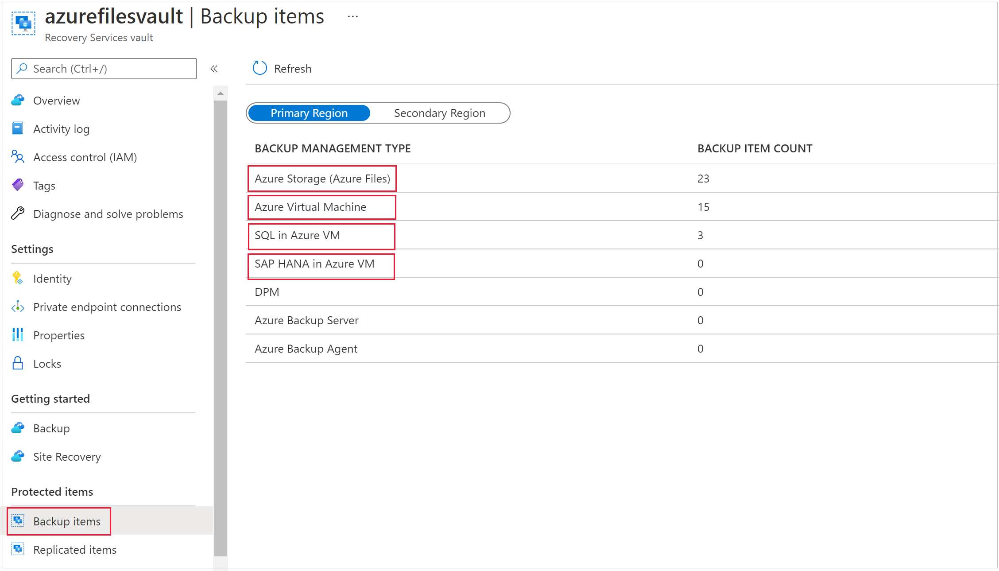
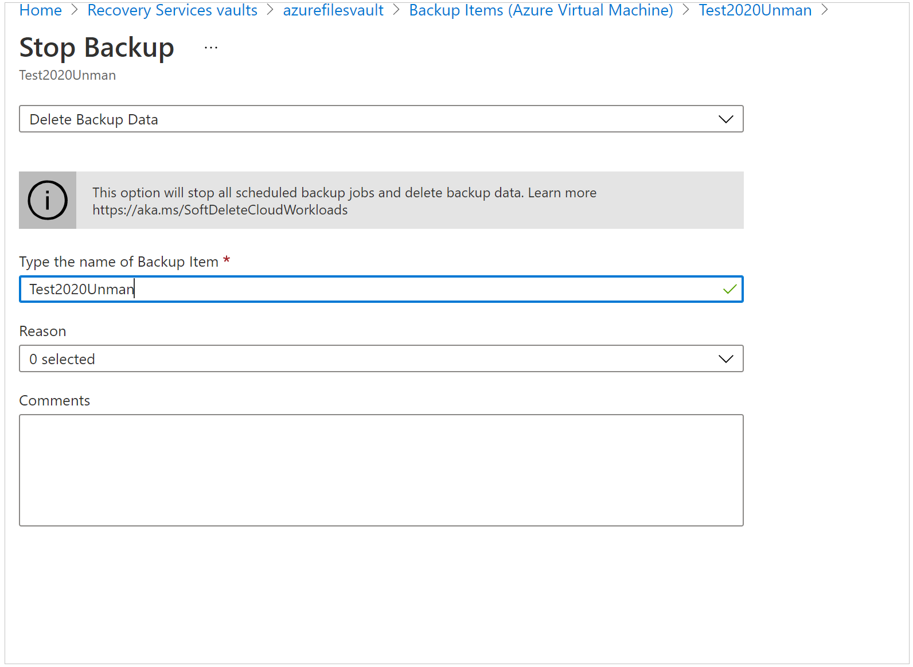
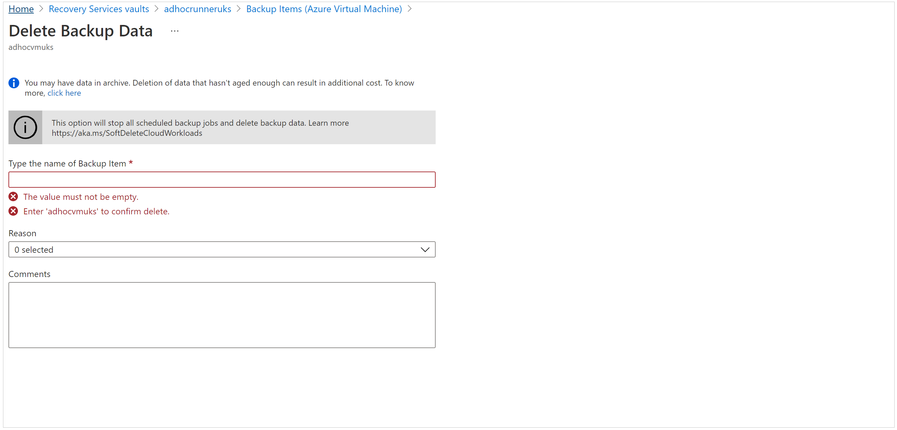
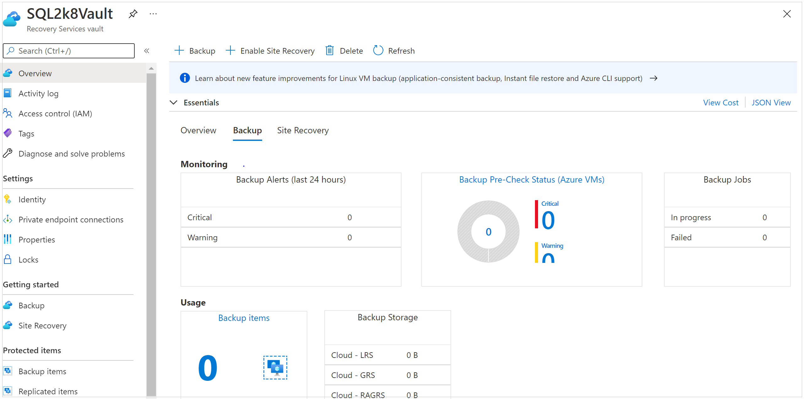

---
title: Delete a Microsoft Azure Backup Recovery Services vault 
description: In this article, learn how to remove dependencies and then delete a Microsoft Azure Backup Recovery Services (MARS) vault.
author: dcurwin
manager: carmonm
ms.service: backup
ms.topic: conceptual
ms.date: 09/20/2019
ms.author: dacurwin
---
# Delete an Azure Backup Recovery Services vault

This article describes how to delete a Microsoft [Azure Backup](backup-overview.md) Recovery Services (MARS) vault. It contains instructions for removing dependencies and then deleting a vault.

## Before you start

You can't delete a Recovery Services vault that has dependencies, such as protected servers or backup management servers, associated with it.

- Vaults that contain backup data can't be deleted (even if you've stopped protection but retained the backup data).

- If you delete a vault that contains dependencies, the following message appears:

  

- If you delete an on-premises protected item from a portal that contains dependencies, a warning message appears:

  

- If backup items are in soft deleted state below warning message appears and you will have to wait until they are permanently deleted. For more information, see this [article](https://aka.ms/SoftDeleteCloudWorkloads).

   
  
To delete the vault, choose the scenario that matches your setup and follow the recommended steps:

Scenario | Steps to remove dependencies to delete vault |
-- | --
I have on-premises files and folders protected by using the Azure Backup agent, backing up to Azure | Perform the steps in [Delete backup items from the MARS management console](#delete-backup-items-from-the-mars-management-console)
I have on-premises machines that are protected by using MABS (Microsoft Azure Backup Server) or DPM (System Center Data Protection Manager) to Azure | Perform the steps in [Delete backup items from the MABS management console](#delete-backup-items-from-the-mabs-management-console)
I have protected items in the cloud (for example, an laaS virtual machine or an Azure Files share)  | Perform the steps in [Delete protected items in the cloud](#delete-protected-items-in-the-cloud)
I have protected items both on premises and in the cloud | Perform the steps in all of the following sections, in the following order: <br> 1. [Delete protected items in the cloud](#delete-protected-items-in-the-cloud)<br> 2. [Delete backup items from the MARS management console](#delete-backup-items-from-the-mars-management-console) <br> 3. [Delete backup items from the MABS Management console](#delete-backup-items-from-the-mabs-management-console)
I don't have any protected items on-premises or cloud; however, I am still getting the Vault deletion error | Perform the steps in [Delete the Recovery Services vault by using Azure Resource Manager](#delete-the-recovery-services-vault-by-using-azure-resource-manager)

## Delete protected items in the cloud

First, read the **[Before you start](#before-you-start)** section to understand the dependencies and vault deletion process.

To stop protection and delete the backup data, perform the following steps:

1. From the portal, go to **Recovery Services vault**, and then go to **Backup items**. Then, choose the protected items in the cloud (for example, Azure Virtual Machines, Azure Storage [the Azure Files service], or SQL Server on Azure Virtual Machines).

    

2. Right-click to select the backup item. Depending on whether the backup item is protected or not, the menu displays either the **Stop Backup** pane or the **Delete Backup Data** pane.

    - If the **Stop Backup** pane appears, select **Delete Backup Data** from the drop-down menu. Enter the name of the backup item (this field is case-sensitive), and then select a reason from the drop-down menu. Enter your comments, if you have any. Then, select **Stop backup**.

        

    - If the **Delete Backup Data** pane appears, enter the name of the backup item (this field is case-sensitive), and then select  a reason from the drop-down menu. Enter your comments, if you have any. Then, select **Delete**.

         

3. Check the **Notification** icon:  After the process finishes, the service displays the following message: *Stopping backup and deleting backup data for "*Backup Item*"*. *Successfully completed the operation*.
4. Select **Refresh** on the **Backup Items** menu, to make sure the backup item was deleted.

      

## Delete protected items on premises

First, read the **[Before you start](#before-you-start)** section to understand the dependencies and vault deletion process.

1. From the vault dashboard menu, select **Backup Infrastructure**.
2. Depending on your on-premises scenario, choose the one of the following options:

      - For MARS, select **Protected Servers** and then  **Azure Backup Agent**. Then, select the server that you want to delete.

        

      - For MABS or DPM, select **Backup Management Servers**. Then, select the server that you want to delete.

          

3. The **Delete** pane appears with a warning message.

     

     Review the warning message and the instructions in the consent check box.
    > [!NOTE]
    >- If the protected server is synced with Azure services and backup items exist, the consent check box will display the number of dependent backup items and the link to view the backup items.
    >- If the protected server is not synced with Azure services and backup items exist, the consent check box will display only the number of backup items.
    >- If there are no backup items, the consent check box will ask for deletion.

4. Select the consent check box, and then select **Delete**.

5. Check the **Notification** icon . After the operation finishes, the service displays the message: *Stopping backup and deleting backup data for "Backup Item."* *Successfully completed the operation*.
6. Select **Refresh** on the **Backup Items** menu, to make sure the backup item is deleted.

After this process finishes, you can delete the backup items from management console:

- [Delete backup items from the MARS management console](#delete-backup-items-from-the-mars-management-console)
- [Delete backup items from the MABS management console](#delete-backup-items-from-the-mabs-management-console)

### Delete backup items from the MARS management console

1. Open the MARS management console, go to the **Actions** pane, and select **Schedule Backup**.
2. From the **Modify or Stop a Scheduled Backup** page, select **Stop using this backup schedule and delete all the stored backups**. Then, select **Next**.

    

3. From the **Stop a Scheduled Backup** page, select **Finish**.

    
4. You are prompted to enter a security PIN (personal identification number), which you must generate manually. To do this, first sign in to the Azure portal.
5. Go to **Recovery Services vault** > **Settings** > **Properties**.
6. Under **Security PIN**, select **Generate**. Copy this PIN. The PIN is valid for only five minutes.
7. In the management console, paste the PIN, and then select **OK**.

    

8. In the **Modify Backup Progress** page, the following message appears: *Deleted backup data will be retained for 14 days. After that time, backup data will be permanently deleted.*  

    

After you delete the on-premises backup items, follow the next steps from the portal.

### Delete backup items from the MABS management console

There are two methods you can use to delete backup items from the MABS management console.

#### Method 1

To stop protection and delete backup data, do the following steps:

1. Open the DPM Administrator Console, and then select **Protection** on the navigation bar.
2. In the display pane, select the protection group member that you want to remove. Right-click to select the **Stop Protection of Group Members** option.
3. From the **Stop Protection** dialog box, select **Delete protected data**, and then select the **Delete storage online** check box. Then, select **Stop Protection**.

    

    The protected member status changes to *Inactive replica available*.

4. Right-click the inactive protection group and select **Remove inactive protection**.

    

5. From the **Delete Inactive Protection** window, select the **Delete online storage** check box, and then select **OK**.

    

#### Method 2

Open the **MABS management** console. Under **Select data protection method**, clear the  **I want online protection** check box.

  

After you delete the on-premises backup items, follow the next steps from the portal.

## Delete the Recovery Services vault

1. When all dependencies have been removed, scroll to the **Essentials** pane in the vault menu.
2. Verify that there aren't any backup items, backup management servers, or replicated items listed. If items still appear in the vault, refer to the [Before you start](#before-you-start) section.

3. When there are no more items in the vault, select **Delete** on the vault dashboard.

    

4. Select **Yes** to verify that you want to delete the vault. The vault is deleted. The portal returns to the **New** service menu.

## Delete the Recovery Services vault by using PowerShell

First, read the **[Before you start](#before-you-start)** section to understand the dependencies and vault deletion process.

To stop protection and delete the backup data:

- If you are using SQL in Azure VMs backup and enabled auto-protection for SQL instances, first disable the auto-protection.

    ```PowerShell
        Disable-AzRecoveryServicesBackupAutoProtection
           [-InputItem] <ProtectableItemBase>
           [-BackupManagementType] <BackupManagementType>
           [-WorkloadType] <WorkloadType>
           [-PassThru]
           [-VaultId <String>]
           [-DefaultProfile <IAzureContextContainer>]
           [-WhatIf]
           [-Confirm]
           [<CommonParameters>]
    ```

  [Learn more](https://docs.microsoft.com/powershell/module/az.recoveryservices/disable-azrecoveryservicesbackupautoprotection?view=azps-2.6.0) on how to disable protection for an Azure Backup-protected item.

- Stop protection and delete data for all backup-protected items in cloud (ex. laaS VM, Azure File Share etc.):

    ```PowerShell
       Disable-AzRecoveryServicesBackupProtection
       [-Item] <ItemBase>
       [-RemoveRecoveryPoints]
       [-Force]
       [-VaultId <String>]
       [-DefaultProfile <IAzureContextContainer>]
       [-WhatIf]
       [-Confirm]
       [<CommonParameters>]
    ```

    [Learn more](https://docs.microsoft.com/powershell/module/az.recoveryservices/disable-azrecoveryservicesbackupprotection?view=azps-2.6.0&viewFallbackFrom=azps-2.5.0) about disables protection for a Backup-protected item.

- For on-premises Files and Folders protected using Azure Backup Agent (MARS) backing up to Azure, use the following PowerShell command to delete the backed-up data from each MARS PowerShell module:

    ```powershell
    Get-OBPolicy | Remove-OBPolicy -DeleteBackup -SecurityPIN <Security Pin>
    ```

    Post where the following prompt would appear:

    *Microsoft Azure Backup Are you sure you want to remove this backup policy? Deleted backup data will be retained for 14 days. After that time, backup data will be permanently deleted. <br/>
    [Y] Yes  [A] Yes to All  [N] No  [L] No to All  [S] Suspend  [?] Help (default is "Y"):*

- For on-premises machines protected using MABS (Microsoft Azure Backup Server) or DPM to Azure (System Center Data Protection Manager), use the following command to delete the backed-up data in Azure.

    ```powershell
    Get-OBPolicy | Remove-OBPolicy -DeleteBackup -SecurityPIN <Security Pin>
    ```

    Post where the following prompt would appear:

   *Microsoft Azure Backup*
   Are you sure you want to remove this backup policy? Deleted backup data will be retained for 14 days. After that time, backup data will be permanently deleted. <br/>
   [Y] Yes  [A] Yes to All  [N] No  [L] No to All  [S] Suspend  [?] Help (default is "Y"):*

After deleting the backed-up data, un-register any on-premises containers and management servers.

- For on-premises Files and Folders protected using Azure Backup Agent (MARS) backing up to Azure:

    ```PowerShell
    Unregister-AzRecoveryServicesBackupContainer
              [-Container] <ContainerBase>
              [-PassThru]
              [-VaultId <String>]
              [-DefaultProfile <IAzureContextContainer>]
              [-WhatIf]
              [-Confirm]
              [<CommonParameters>]
    ```

    [Learn more](https://docs.microsoft.com/powershell/module/az.recoveryservices/unregister-azrecoveryservicesbackupcontainer?view=azps-2.6.0) about un-registering a Windows Server or other container from the vault.

- For on-premises machines protected using MABS (Microsoft Azure Backup Server) or DPM to Azure (System Center Data Protection Manage:

    ```PowerShell
        Unregister-AzRecoveryServicesBackupManagementServer
          [-AzureRmBackupManagementServer] <BackupEngineBase>
          [-PassThru]
          [-VaultId <String>]
          [-DefaultProfile <IAzureContextContainer>]
          [-WhatIf]
          [-Confirm]
          [<CommonParameters>]
    ```

    [Learn more](https://docs.microsoft.com/powershell/module/az.recoveryservices/unregister-azrecoveryservicesbackupcontainer?view=azps-2.6.0) about un-registering a Backup management container from the vault.

After permanently deleting backed up data and un-registering all containers, proceed to delete the vault.

To delete a Recovery Services vault:

   ```PowerShell
       Remove-AzRecoveryServicesVault
      -Vault <ARSVault>
      [-DefaultProfile <IAzureContextContainer>]
      [-WhatIf]
      [-Confirm]
      [<CommonParameters>]
   ```

[Learn more](https://docs.microsoft.com/powershell/module/az.recoveryservices/remove-azrecoveryservicesvault) about deleting a recovery services vault.

## Delete the Recovery Services vault by using CLI

First, read the **[Before you start](#before-you-start)** section to understand the dependencies and vault deletion process.

> [!NOTE]
> Currently, Azure Backup CLI supports managing only Azure VM backups, so the following command to delete the vault works only if the vault contains Azure VM backups. You cannot delete a vault using Azure Backup CLI, if the vault contains any backup item of type other than Azure VMs.

To delete existing Recovery services vault, perform the below:

- To stop protection and delete the backup data

    ```CLI
    az backup protection disable --container-name
                             --item-name
                             [--delete-backup-data {false, true}]
                             [--ids]
                             [--resource-group]
                             [--subscription]
                             [--vault-name]
                             [--yes]
    ```

    For more information, see this [article](/cli/azure/backup/protection#az-backup-protection-disable).

- Delete an existing Recovery services vault:

    ```CLI
    az backup vault delete [--force]
                       [--ids]
                       [--name]
                       [--resource-group]
                       [--subscription]
                       [--yes]
    ```

    For more information, see this [article](https://docs.microsoft.com/cli/azure/backup/vault?view=azure-cli-latest)

## Delete the Recovery Services vault by using Azure Resource Manager

This option to delete the Recovery Services vault is recommended only if all of the dependencies are removed and you're still getting the *Vault deletion error*. Try any or all of the following tips:

- From the **Essentials** pane in the vault menu, verify that there aren't any backup items, backup management servers, or replicated items listed. If there are backup items, refer the [Before you start](#before-you-start) section.
- Try [deleting the vault from the portal](#delete-the-recovery-services-vault) again.
- If all of the dependencies are removed and you're still getting the *Vault deletion error*, use the ARMClient tool to perform the following steps (after the note).

1. Go to [chocolatey.org](https://chocolatey.org/) to download and install Chocolatey. Then, install ARMClient by running the following command:

   `choco install armclient --source=https://chocolatey.org/api/v2/`
2. Sign in to your Azure account, and then run the following command:

    `ARMClient.exe login [environment name]`

3. In the Azure portal, gather the subscription ID and resource group name for the vault you want to delete.

For more information on the ARMClient command, see [ARMClient README](https://github.com/projectkudu/ARMClient/blob/master/README.md).

### Use the Azure Resource Manager client to delete a Recovery Services vault

1. Run the following command by using your subscription ID, resource group name, and vault name. If you don’t have any dependencies, the vault is deleted when you run the following command:

   ```azurepowershell
   ARMClient.exe delete /subscriptions/<subscriptionID>/resourceGroups/<resourcegroupname>/providers/Microsoft.RecoveryServices/vaults/<recovery services vault name>?api-version=2015-03-15
   ```

2. If the vault is not empty, you'll receive the following error message: *Vault cannot be deleted as there are existing resources within this vault.* To remove a protected item or container within a vault, run the following command:

   ```azurepowershell
   ARMClient.exe delete /subscriptions/<subscriptionID>/resourceGroups/<resourcegroupname>/providers/Microsoft.RecoveryServices/vaults/<recovery services vault name>/registeredIdentities/<container name>?api-version=2016-06-01
   ```

3. In the Azure portal, make sure that the vault is deleted.

## Next steps

[Learn about Recovery Services vaults](backup-azure-recovery-services-vault-overview.md)<br/>
[Learn about monitoring and managing Recovery Services vaults](backup-azure-manage-windows-server.md)
