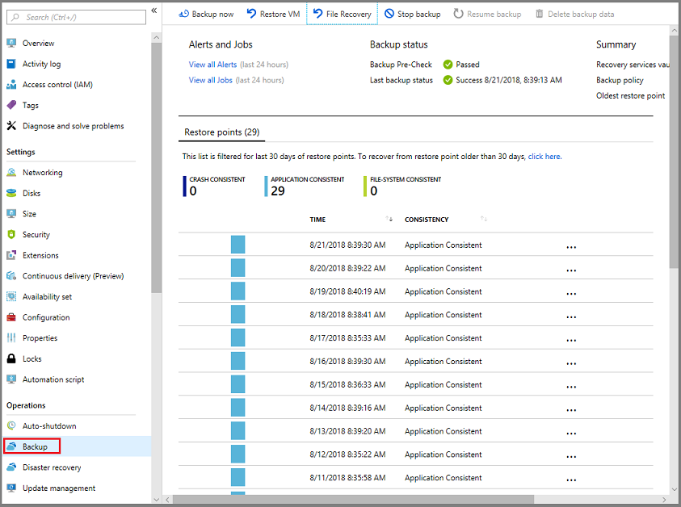
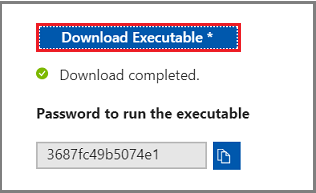
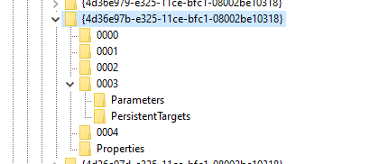
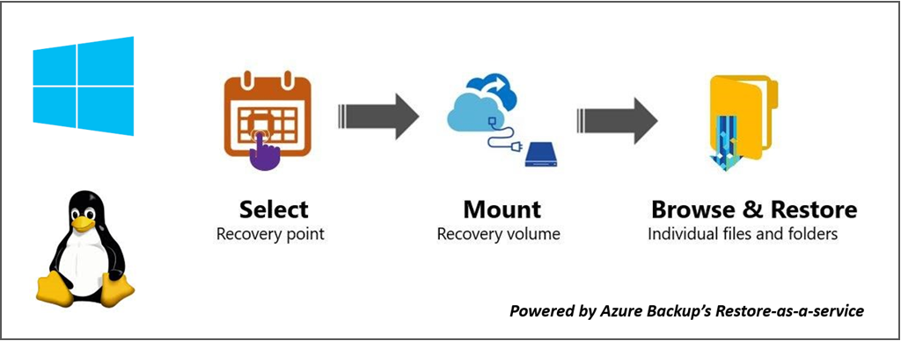

# Recover files from Azure virtual machine backup

Azure Backup provides the capability to restore [Azure virtual machines (VMs) and disks](./backup-azure-arm-restore-vms.md) from Azure VM backups, also known as recovery points. This article explains how to recover files and folders from an Azure VM backup. Restoring files and folders is available only for Azure VMs deployed using the Resource Manager model and protected to a Recovery services vault.

> [!NOTE]
> This feature is available for Azure VMs deployed using the Resource Manager model and protected to a Recovery Services vault.
> File recovery from an encrypted VM backup is not supported.
>

## Mount the volume and copy files

To restore files or folders from the recovery point, go to the virtual machine and choose the desired recovery point.

1. Sign in to the [Azure portal](https://portal.Azure.com) and in the left pane, select **Virtual machines**. From the list of virtual machines, select the virtual machine to open that virtual machine's dashboard.

2. In the virtual machine's menu, select **Backup** to open the Backup dashboard.

    

3. In the Backup dashboard menu, select **File Recovery**.

    

    The **File Recovery** menu opens.

    

4. From the **Select recovery point** drop-down menu, select the recovery point that holds the files you want. By default, the latest recovery point is already selected.

5. To download the software used to copy files from the recovery point, select **Download Executable** (for Windows Azure VMs) or **Download Script** (for Linux Azure VMs, a python script is generated).

    

    Azure downloads the executable or script to the local computer.

    

    To run the executable or script as an administrator, it's suggested you save the downloaded file to your computer.

6. The executable or script is password protected and requires a password. In the **File Recovery** menu, select the copy button to load the password into memory.

    

7. Make sure [you have the right machine](#selecting-the-right-machine-to-run-the-script) to execute the script. If the right machine is the same machine where you downloaded the script, then you can continue to the download section. From the download location (usually the *Downloads* folder), right-click the executable or script and run it with Administrator credentials. When prompted, type the password or paste the password from memory, and press **Enter**. Once the valid password is entered, the script connects to the recovery point.

    

8. For Linux machines, a python script is generated. One needs to download the script and copy it to the relevant/compatible Linux server. You may have to modify the permissions to execute it with ```chmod +x <python file name>```. Then run the python file with ```./<python file name>```.

Refer to the [Access requirements](#access-requirements) section to make sure the script is run successfully.

### Identifying volumes

#### For Windows

When you run the executable, the operating system mounts the new volumes and assigns drive letters. You can use Windows Explorer or File Explorer to browse those drives. The drive letters assigned to the volumes may not be the same letters as the original virtual machine. However, the volume name is preserved. For example, if the volume on the original virtual machine was "Data Disk (E:`\`)", that volume can be attached on the local computer as "Data Disk ('Any letter':`\`). Browse through all volumes mentioned in the script output until you find your files or folder.  

   

#### For Linux

In Linux, the volumes of the recovery point are mounted to the folder where the script is run. The attached disks, volumes, and the corresponding mount paths are shown accordingly. These mount paths are visible to users having root level access. Browse through the volumes mentioned in the script output.

  

## Closing the connection

After identifying the files and copying them to a local storage location, remove (or unmount) the additional drives. To unmount the drives, on the **File Recovery** menu in the Azure portal, select **Unmount Disks**.


Once the disks have been unmounted, you receive a message. It may take a few minutes for the connection to refresh so that you can remove the disks.

In Linux, after the connection to the recovery point is severed, the OS doesn't remove the corresponding mount paths automatically. The mount paths exist as "orphan" volumes and are visible, but throw an error when you access/write the files. They can be manually removed. The script, when run, identifies any such volumes existing from any previous recovery points and cleans them up upon consent.

> [!NOTE]
> Make sure that the connection is closed after the required files are restored. This is important, especially in the scenario where the machine in which the script is executed is also configured for backup. In case the connection is still open, the subsequent backup might fail with an error "UserErrorUnableToOpenMount". This happens because the mounted drives/volumes are assumed to be available and when accessed they might fail because the underlying storage i.e., the iSCSI target server may not available. Cleaning up the connection will remove these drives/volumes and so they will not be available during backup.

## Selecting the right machine to run the script

If the script is successfully downloaded, then the next step is to verify whether the machine on which you plan to execute the script  is the right machine. Following are the requirements to be fulfilled on the machine.

### Original backed up machine versus another machine

1. If the backed-up machine is a large disk VM - that is, the number of disks is greater than 16 disks or each disk is greater than 4 TB, then the script **must be executed on another machine** and [these requirements](#file-recovery-from-virtual-machine-backups-having-large-disks) have to be met.
1. Even if the backed-up machine isn't a large disk VM, in [these scenarios](#special-configurations) the script can't be run on the same backed-up VM.

### OS requirements on the machine

The machine where the script needs to be executed must meet [these OS requirements](#system-requirements).

### Access requirements for the machine

The machine where the script needs to be executed must meet [these access requirements](#access-requirements).

## Special configurations

### Dynamic disks

If the protected Azure VM has volumes with one or both of the following characteristics, you can't run the executable script on the same VM.

- Volumes that span multiple disks (spanned and striped volumes)
- Fault-tolerant volumes (mirrored and RAID-5 volumes) on dynamic disks

Instead, run the executable script on any other computer with a compatible operating system.

### Windows Storage Spaces

Windows Storage Spaces is a Windows technology that enables you to virtualize storage. With Windows Storage Spaces you can group industry-standard disks into storage pools. Then you use the available space in those storage pools to create virtual disks, called storage spaces.

If the protected Azure VM uses Windows Storage Spaces, you can't run the executable script on the same VM. Instead, run the executable script on any other machine with a compatible operating system.

### LVM/RAID arrays

In Linux, Logical volume manager (LVM) and/or software RAID Arrays are used to manage logical volumes over multiple disks. If the protected Linux VM uses LVM and/or RAID Arrays, you can't run the script on the same VM. Instead run the script on any other machine with a compatible OS and which supports the file system of the protected VM.

The following script output displays the LVM and/or RAID Arrays disks and the volumes with the partition type.

   

To bring these partitions online, run the commands in the following sections.

#### For LVM partitions

Once the script is run, the LVM partitions are mounted in the physical volume(s)/disk(s) specified in the script output. The process is to

1. Get the unique list of volume group names from the physical volumes or disks
2. Then list the logical volumes in those volume groups
3. Then mount the logical volumes to a desired path.

##### Listing volume group names from physical volumes

To list the volume group names:

```bash
pvs -o +vguuid
```

This command will list all physical volumes (including the ones present before running the script), their corresponding volume group names, and the volume group's unique user IDs (UUIDs). A sample output of the command is shown below.

```bash
PV         VG        Fmt  Attr PSize   PFree    VG UUID

  /dev/sda4  rootvg    lvm2 a--  138.71g  113.71g EtBn0y-RlXA-pK8g-de2S-mq9K-9syx-B29OL6

  /dev/sdc   APPvg_new lvm2 a--  <75.00g   <7.50g njdUWm-6ytR-8oAm-8eN1-jiss-eQ3p-HRIhq5

  /dev/sde   APPvg_new lvm2 a--  <75.00g   <7.50g njdUWm-6ytR-8oAm-8eN1-jiss-eQ3p-HRIhq5

  /dev/sdf   datavg_db lvm2 a--   <1.50t <396.50g dhWL1i-lcZS-KPLI-o7qP-AN2n-y2f8-A1fWqN

  /dev/sdd   datavg_db lvm2 a--   <1.50t <396.50g dhWL1i-lcZS-KPLI-o7qP-AN2n-y2f8-A1fWqN
```

The first column (PV) shows the physical volume, the subsequent columns show the relevant volume group name, format, attributes, size, free space, and the unique ID of the volume group. The command output shows all physical volumes. Refer to the script output and identify the volumes related to the backup. In the above example, the script output would have shown /dev/sdf and /dev/sdd. And so, the *datavg_db* volume group belongs to script and the *Appvg_new* volume group belongs to the machine. The final idea is to make sure a unique volume group name should have one unique ID.

###### Duplicate Volume groups

There are scenarios where volume group names can have 2 UUIDs after running the script. It means that the volume group names in the machine where the script is executed and in the backed-up VM are same. Then we need to rename the backed-up VMs volume groups. Take a look at the below example.

```bash
PV         VG        Fmt  Attr PSize   PFree    VG UUID

  /dev/sda4  rootvg    lvm2 a--  138.71g  113.71g EtBn0y-RlXA-pK8g-de2S-mq9K-9syx-B29OL6

  /dev/sdc   APPvg_new lvm2 a--  <75.00g   <7.50g njdUWm-6ytR-8oAm-8eN1-jiss-eQ3p-HRIhq5

  /dev/sde   APPvg_new lvm2 a--  <75.00g   <7.50g njdUWm-6ytR-8oAm-8eN1-jiss-eQ3p-HRIhq5

  /dev/sdg   APPvg_new lvm2 a--  <75.00g  508.00m lCAisz-wTeJ-eqdj-S4HY-108f-b8Xh-607IuC

  /dev/sdh   APPvg_new lvm2 a--  <75.00g  508.00m lCAisz-wTeJ-eqdj-S4HY-108f-b8Xh-607IuC

  /dev/sdm2  rootvg    lvm2 a--  194.57g  127.57g efohjX-KUGB-ETaH-4JKB-MieG-EGOc-XcfLCt
```

The script output would have shown /dev/sdg, /dev/sdh, /dev/sdm2 as attached. So, the corresponding VG names are Appvg_new and rootvg. But the same names are also present in the machine's VG list. We can verify that one VG name has two UUIDs.

Now we need to rename VG names for script-based volumes, for example: /dev/sdg, /dev/sdh, /dev/sdm2. To rename the volume group, use the following command

```bash
vgimportclone -n rootvg_new /dev/sdm2
vgimportclone -n APPVg_2 /dev/sdg /dev/sdh
```

Now we have all VG names with unique IDs.

###### Active volume groups

Make sure that the Volume groups corresponding to script's volumes are active. The below command is used to display active volume groups. Check whether the script's related volume groups are present in this list.

```bash
vgdisplay -a
```  

Otherwise, activate the volume group by using the below command.

```bash
#!/bin/bash
vgchange –a y  <volume-group-name>
```

##### Listing logical volumes within Volume groups

Once we get the unique, active list of VGs related to the script, then the logical volumes present in those volume groups can be listed using the below command.

```bash
#!/bin/bash
lvdisplay <volume-group-name>
```

This command displays the path of each logical volume as 'LV Path'.

##### Mounting logical volumes

To mount the logical volumes to the path of your choice:

```bash
#!/bin/bash
mount <LV path from the lvdisplay cmd results> </mountpath>
```

> [!WARNING]
> Do not use 'mount -a'. This command mounts all devices described in '/etc/fstab'. This might mean duplicate devices can get mounted. Data can be redirected to devices created by script, which do not persist the data, and so might result in data loss.

#### For RAID arrays

The following command displays details about all raid disks:

```bash
#!/bin/bash
mdadm –detail –scan
```

 The relevant RAID disk is displayed as `/dev/mdm/<RAID array name in the protected VM>`

Use the mount command if the RAID disk has physical volumes:

```bash
#!/bin/bash
mount [RAID Disk Path] [/mountpath]
```

If the RAID disk has another LVM configured in it, then use the preceding procedure for LVM partitions but use the volume name in place of the RAID Disk name.

## System requirements

### For Windows OS

The following table shows the compatibility between server and computer operating systems. When recovering files, you can't restore files to a previous or future operating system version. For example, you can't restore a file from a Windows Server 2016 VM to Windows Server 2012 or a Windows 8 computer. You can restore files from a VM to the same server operating system, or to the compatible client operating system.

|Server OS | Compatible client OS  |
| --------------- | ---- |
| Windows Server 2019    | Windows 10 |
| Windows Server 2016    | Windows 10 |
| Windows Server 2012 R2 | Windows 8.1 |
| Windows Server 2012    | Windows 8  |
| Windows Server 2008 R2 | Windows 7   |

### For Linux OS

In Linux, the OS of the computer used to restore files must support the file system of the protected virtual machine. When selecting a computer to run the script, ensure the computer has a compatible OS, and uses one of the versions identified in the following table:

|Linux OS | Versions  |
| --------------- | ---- |
| Ubuntu | 12.04 and above |
| CentOS | 6.5 and above  |
| RHEL | 6.7 and above |
| Debian | 7 and above |
| Oracle Linux | 6.4 and above |
| SLES | 12 and above |
| openSUSE | 42.2 and above |

> [!NOTE]
> We have found some issues in running the file recovery script on machines with SLES 12 SP4 OS and we are investigating with the SLES team.
> Currently, running the file recovery script is working on machines with SLES 12 SP2 and SP3 OS versions.
>

The script also requires Python and bash components to execute and connect securely to the recovery point.

|Component | Version  |
| --------------- | ---- |
| bash | 4 and above |
| python | 2.6.6 and above  |
| TLS | 1.2 should be supported  |

## Access requirements

If you run the script on a computer with restricted access, ensure there's access to:

- `download.microsoft.com`
- Recovery Service URLs (geo-name refers to the region where the recovery service vault resides)
  - `https://pod01-rec2.geo-name.backup.windowsazure.com` (For Azure public regions)
  - `https://pod01-rec2.geo-name.backup.windowsazure.cn` (For Azure China 21Vianet)
  - `https://pod01-rec2.geo-name.backup.windowsazure.us` (For Azure US Government)
  - `https://pod01-rec2.geo-name.backup.windowsazure.de` (For Azure Germany)
- Outbound ports 53 (DNS), 443, 3260

> [!NOTE]
>
> - The downloaded script file name will have the **geo-name** to be filled in the URL. For example: The downloaded script name begins with \'VMname\'\_\'geoname\'_\'GUID\', like *ContosoVM_wcus_12345678*
> - The URL would be <https://pod01-rec2.wcus.backup.windowsazure.com>"
>

For Linux, the script requires 'open-iscsi' and 'lshw' components to connect to the recovery point. If the components don't exist on the computer where the script is run, the script asks for permission to install the components. Provide consent to install the necessary components.

The access to `download.microsoft.com` is required to download components used to build a secure channel between the machine where the script is run and the data in the recovery point.

## File recovery from Virtual machine backups having large disks

This section explains how to perform file recovery from backups of Azure Virtual machines with more than 16 disks or each disk size is greater than 4 TB.

Since file recovery process attaches all disks from the backup, when large number of disks (>16) or large disks (> 4 TB each) are used, the following action points are recommended:

- Keep a separate restore server (Azure VM D2v3 VMs) for file recovery. You can use that only for file recovery and then shut it down when not required. Restoring on the original machine isn't recommended since it will have significant impact on the VM itself.
- Then run the script once to check if the file recovery operation succeeds.
- If the file recovery process hangs (the disks are never mounted or they're mounted but volumes don't appear), perform the following steps.
  - If the restore server is a Windows VM:
    - Ensure that the OS is WS 2012 or higher.
    - Ensure the registry keys are set as suggested below in the restore server and make sure to reboot the server. The number beside the GUID can range from 0001-0005. In the following example, it's 0004. Navigate through the registry key path until the parameters section.

    

```registry
- HKEY_LOCAL_MACHINE\SYSTEM\CurrentControlSet\Services\Disk\TimeOutValue – change this from 60 to 1200
- HKEY_LOCAL_MACHINE\SYSTEM\ControlSet001\Control\Class\{4d36e97b-e325-11ce-bfc1-08002be10318}\0003\Parameters\SrbTimeoutDelta – change this from 15 to 1200
- HKEY_LOCAL_MACHINE\SYSTEM\ControlSet001\Control\Class\{4d36e97b-e325-11ce-bfc1-08002be10318}\0003\Parameters\EnableNOPOut – change this from 0 to 1
- HKEY_LOCAL_MACHINE\SYSTEM\ControlSet001\Control\Class\{4d36e97b-e325-11ce-bfc1-08002be10318}\0003\Parameters\MaxRequestHoldTime - change this from 60 to 1200
```

- If the restore server is a Linux VM:
  - In the file /etc/iscsi/iscsid.conf, change the setting from:
    - node.conn[0].timeo.noop_out_timeout = 5  to node.conn[0].timeo.noop_out_timeout = 30
- After making the change above, run the script again. With these changes, it's highly probable that the file recovery will succeed.
- Each time user downloads a script, Azure Backup initiates the process of preparing the recovery point for download. With large disks, this process will take considerable time. If there are successive bursts of requests, the target preparation will go into a download spiral. Therefore, it's recommended to download a script from Portal/PowerShell/CLI, wait for 20-30 minutes (a heuristic) and then run it. By this time, the target is expected to be ready for connection from script.
- After file recovery, make sure you go back to the portal and select **Unmount disks** for recovery points where you weren't able to mount volumes. Essentially, this step will clean any existing processes/sessions and increase the chance of recovery.

## Troubleshooting

If you have problems while recovering files from the virtual machines, check the following table for additional information.

| Error Message / Scenario | Probable Cause | Recommended action |
| ------------------------ | -------------- | ------------------ |
| Exe output: *Exception caught while connecting to target* | The script isn't able to access the recovery point    | Check whether the machine fulfills the [previous access requirements](#access-requirements). |  
| Exe output: *The target has already been logged in via an iSCSI session.* | The script was already executed on the same machine and the drives have been attached | The volumes of the recovery point have already been attached. They may NOT be mounted with the same drive letters of the original VM. Browse through all the available volumes in the file explorer for your file. |
| Exe output: *This script is invalid because the disks have been dismounted via portal/exceeded the 12-hr limit. Download a new script from the portal.* |    The disks have been dismounted from the portal or the 12-hour limit was exceeded | This particular exe is now invalid and can't be run. If you want to access the files of that recovery point-in-time, visit the portal for a new exe.|
| On the machine where the exe is run: The new volumes aren't dismounted after the dismount button is clicked | The iSCSI initiator on the machine isn't responding/refreshing its connection to the target and maintaining the cache. |  After clicking **Dismount**, wait a few minutes. If the new volumes aren't dismounted, browse through all volumes. Browsing all volumes forces the initiator to refresh the connection, and the volume is dismounted with an error message that the disk isn't available.|
| Exe output: The script is run successfully but "New volumes attached" is not displayed on the script output |    This is a transient error    | The volumes will have been already attached. Open Explorer to browse. If you're using the same machine for running scripts every time, consider restarting the machine and the list should be displayed in the subsequent exe runs. |
| Linux specific: Not able to view the desired volumes | The OS of the machine where the script is run may not recognize the underlying filesystem of the protected VM | Check whether the recovery point is crash-consistent or file-consistent. If file-consistent, run the script on another machine whose OS recognizes the protected VM's filesystem. |
| Windows specific: Not able to view the desired volumes | The disks may have been attached but the volumes weren't configured | From the disk management screen, identify the additional disks related to the recovery point. If any of these disks are in an offline state, try bringing them online by right-clicking on the disk and select **Online**.|

## Security

This section discusses the various security measures taken for the implementation of file recovery from Azure VM backups.

### Feature flow

This feature was built to access the VM data without the need to restore the entire VM or VM disks and with the minimum number of steps. Access to VM data is provided by a script (which mounts the recovery volume when run as shown below) and it forms the cornerstone of all security implementations:

  

### Security implementations

#### Select Recovery point (who can generate script)

The script provides access to VM data, so it's important to regulate who can generate it in the first place. You need to sign in into the Azure portal and be [RBAC authorized](backup-rbac-rs-vault.md#mapping-backup-built-in-roles-to-backup-management-actions) to generate the script.

File recovery needs the same level of authorization as required for VM restore and disks restore. In other words, only authorized users can view the VM data can generate the script.

The generated script is signed with the official Microsoft certificate for the Azure Backup service. Any tampering with the script means the signature is broken, and any attempt to run the script is highlighted as a potential risk by the OS.

#### Mount Recovery volume (who can run script)

Only an Admin can run the script and it should run in elevated mode. The script only runs a pre-generated set of steps and doesn't accept input from any external source.

To run the script, a password is required that is only shown to the authorized user at the time of generation of script in the Azure portal or PowerShell/CLI. This is to ensure the authorized user who downloads the script is also responsible for running the script.

#### Browse files and folders

To browse files and folders, the script uses the iSCSI initiator in the machine and connects to the recovery point that is configured as an iSCSI target. Here you can imagine scenarios where one is trying to imitate/spoof either/all components.

We use a mutual CHAP authentication mechanism so that each component authenticates the other. This means it's extremely difficult for a fake initiator to connect to the iSCSI target and for a fake target to be connected to the machine where the script is run.

The data flow between the recovery service and the machine is protected by building a secure TLS tunnel over TCP ([TLS 1.2 should be supported](#system-requirements) in the machine where script is run).

Any file Access Control List (ACL) present in the parent/backed up VM is preserved in the mounted file system as well.

The script gives read-only access to a recovery point and is valid for only 12 hours. If you wish to remove the access earlier, then sign into Azure Portal/PowerShell/CLI and perform **unmount disks** for that particular recovery point. The script will be invalidated immediately.

## Next steps

- For any problems while restoring files, refer to the [Troubleshooting](#troubleshooting) section
- Learn how to [restore files via PowerShell](./backup-azure-vms-automation.md#restore-files-from-an-azure-vm-backup)
- Learn how to [restore files via Azure CLI](./tutorial-restore-files.md)
- After VM is restored, learn how to [manage backups](./backup-azure-manage-vms.md)
