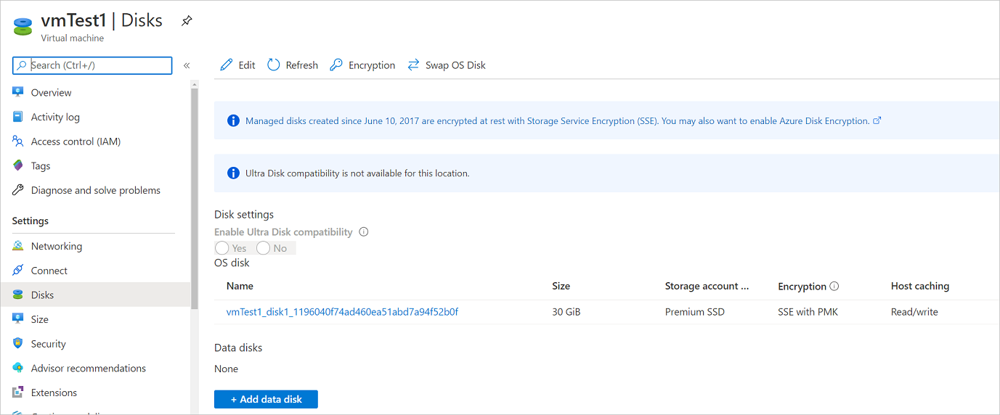
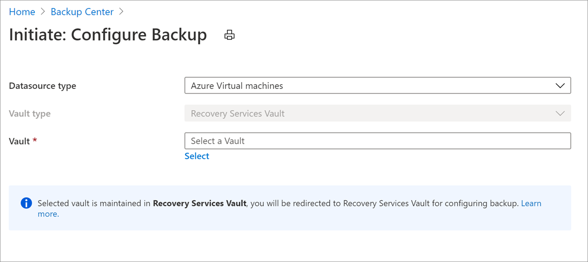
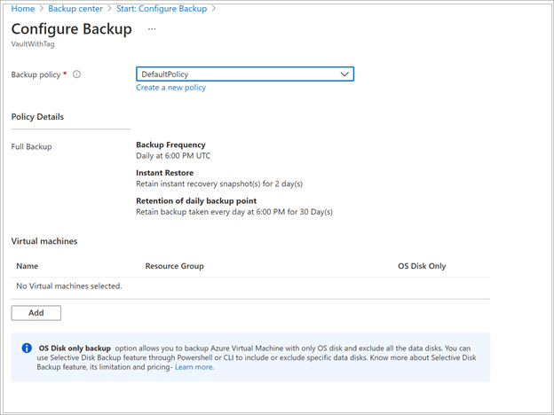
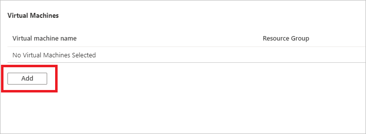
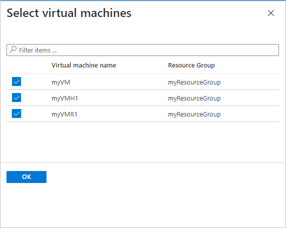
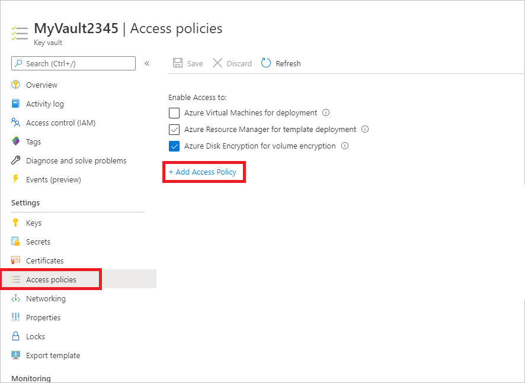

# Back up and restore encrypted Azure virtual machines

This article describes how to back up and restore Windows or Linux Azure virtual machines (VMs) with encrypted disks using the [Azure Backup](backup-overview.md) service. For more information, see [Encryption of Azure VM backups](backup-azure-vms-introduction.md#encryption-of-azure-vm-backups).

## Encryption using platform-managed keys

By default, all the disks in your VMs are automatically encrypted-at-rest using platform-managed keys (PMK) that use [storage service encryption](../storage/common/storage-service-encryption.md). You can back up these VMs using Azure Backup without any specific actions required to support encryption on your end. For more information about encryption with platform-managed keys, [see this article](../virtual-machines/disk-encryption.md#platform-managed-keys).

## Encryption using customer-managed keys

When you encrypt disks with custom-managed keys (CMK), the key used for encrypting the disks is stored in the Azure Key Vault and is managed by you. Storage Service Encryption (SSE) using CMK differs from Azure Disk Encryption (ADE) encryption. ADE uses the encryption tools of the operating system. SSE encrypts data in the storage service, enabling you to use any OS or images for your VMs. For more information about encryption of managed disks with customer-managed keys, see [this article](../virtual-machines/disk-encryption.md#customer-managed-keys).

## Encryption support using ADE

Azure Backup supports backup of Azure VMs that have their OS/data disks encrypted with Azure Disk Encryption (ADE). ADE uses BitLocker for encryption of Windows VMs, and the dm-crypt feature for Linux VMs. ADE integrates with Azure Key Vault to manage disk-encryption keys and secrets. Key Vault Key Encryption Keys (KEKs) can be used to add an additional layer of security, encrypting encryption secrets before writing them to Key Vault.

Azure Backup can back up and restore Azure VMs using ADE with and without the Azure AD app, as summarized in the following table.

**VM disk type** | **ADE (BEK/dm-crypt)** | **ADE and KEK**
--- | --- | ---
**Unmanaged** | Yes | Yes
**Managed**  | Yes | Yes

- Learn more about [ADE](../security/fundamentals/azure-disk-encryption-vms-vmss.md), [Key Vault](../key-vault/general/overview.md), and [KEKs](../virtual-machine-scale-sets/disk-encryption-key-vault.md#set-up-a-key-encryption-key-kek).
- Read the [FAQ](../security/fundamentals/azure-disk-encryption-vms-vmss.md) for Azure VM disk encryption.

### Limitations

- You can back up and restore encrypted VMs within the same subscription and region.
- Azure Backup supports VMs encrypted using standalone keys. Any key that's a part of a certificate used to encrypt a VM isn't currently supported.
- You can back up and restore encrypted VMs within the same subscription and region as the Recovery Services Backup vault.
- Encrypted VMs can’t be recovered at the file/folder level. You need to recover the entire VM to restore files and folders.
- When restoring a VM, you can't use the [replace existing VM](backup-azure-arm-restore-vms.md#restore-options) option for encrypted VMs. This option is only supported for unencrypted managed disks.

## Before you start

Before you start, do the following:

1. Make sure you have one or more [Windows](../virtual-machines/linux/disk-encryption-overview.md) or [Linux](../virtual-machines/linux/disk-encryption-overview.md) VMs with ADE enabled.
2. [Review the support matrix](backup-support-matrix-iaas.md) for Azure VM backup
3. [Create](backup-create-rs-vault.md) a Recovery Services Backup vault if you don't have one.
4. If you enable encryption for VMs that are already enabled for backup, you simply need to provide Backup with permissions to access the Key Vault so that backups can continue without disruption. [Learn more](#provide-permissions) about assigning these permissions.

In addition, there are a couple of things that you might need to do in some circumstances:

- **Install the VM agent on the VM**: Azure Backup backs up Azure VMs by installing an extension to the Azure VM agent running on the machine. If your VM was created from an Azure Marketplace image, the agent is installed and running. If you create a custom VM, or you migrate an on-premises machine, you might need to [install the agent manually](backup-azure-arm-vms-prepare.md#install-the-vm-agent).

## Configure a backup policy

1. If you haven't yet created a Recovery Services backup vault, follow [these instructions](backup-create-rs-vault.md).
1. Open the vault in the portal, and select **+Backup** in the **Overview** section.

    

1. In **Backup goal** > **Where is your workload running?** select **Azure**.
1. In **What do you want to back up?** select **Virtual machine**. Then select **Backup**.

      

1. In **Backup policy** > **Choose backup policy**, select the policy that you want to associate with the vault. Then select **OK**.
    - A backup policy specifies when backups are taken, and how long they're stored.
    - The details of the default policy are listed under the drop-down menu.

    

1. If you don't want to use the default policy, select **Create New**, and [create a custom policy](backup-azure-arm-vms-prepare.md#create-a-custom-policy).

1. Under **Virtual Machines**, select **Add**.

    

1. Choose the encrypted VMs you want to back up using the select policy, and select **OK**.

      

1. If you're using Azure Key Vault, on the vault page, you'll see a message that Azure Backup needs read-only access to the keys and secrets in the Key Vault.

    - If you receive this message, no action is required.

        

    - If you receive this message, you need to set permissions as described in the [procedure below](#provide-permissions).

        

1. Select **Enable Backup** to deploy the backup policy in the vault, and enable backup for the selected VMs.

## Trigger a backup job

The initial backup will run in accordance with the schedule, but you can run it immediately as follows:

1. In the vault menu, select **Backup items**.
2. In **Backup Items**, select **Azure Virtual Machine**.
3. In the **Backup Items** list, select the ellipses (...).
4. Select **Backup now**.
5. In **Backup Now**, use the calendar control to select the last day that the recovery point should be retained. Then select **OK**.
6. Monitor the portal notifications. You can monitor the job progress in the vault dashboard > **Backup Jobs** > **In progress**. Depending on the size of your VM, creating the initial backup may take a while.

## Provide permissions

Azure Backup needs read-only access to back up the keys and secrets, along with the associated VMs.

- Your Key Vault is associated with the Azure AD tenant of the Azure subscription. If you're a **Member user**, Azure Backup acquires access to the Key Vault without further action.
- If you're a **Guest user**, you must provide permissions for Azure Backup to access the key vault.

To set permissions:

1. In the Azure portal, select **All services**, and search for **Key vaults**.
1. Select the key vault associated with the encrypted VM you're backing up.
1. Select **Access policies** > **Add Access Policy**.

    

1. In **Add access policy** > **Configure from template (optional)**, select **Azure Backup**.
    - The required permissions are prefilled for **Key permissions** and **Secret permissions**.
    - If your VM is encrypted using **BEK only**, remove the selection for **Key permissions** since you only need permissions for secrets.

    

1. Select **Add**. **Backup Management Service** is added to **Access policies**.

    

1. Select **Save** to provide Azure Backup with the permissions.

## Restore an encrypted VM

Encrypted VMs can only be restored by restoring the VM disk as explained below. **Replace existing** and **Restore VM** aren't supported.

Restore encrypted VMs as follows:

1. [Restore the VM disk](backup-azure-arm-restore-vms.md#restore-disks).
2. Recreate the virtual machine instance by doing one of the following:
    1. Use the template that's generated during the restore operation to customize VM settings, and trigger VM deployment. [Learn more](backup-azure-arm-restore-vms.md#use-templates-to-customize-a-restored-vm).
    2. Create a new VM from the restored disks using PowerShell. [Learn more](backup-azure-vms-automation.md#create-a-vm-from-restored-disks).
3. For Linux VMs, reinstall the ADE extension so the data disks are open and mounted.

## Next steps

If you run into any issues, review these articles:

- [Common errors](backup-azure-vms-troubleshoot.md) when backing up and restoring encrypted Azure VMs.
- [Azure VM agent/backup extension](backup-azure-troubleshoot-vm-backup-fails-snapshot-timeout.md) issues.