# Restore Azure Managed Disks (in preview)

>[!IMPORTANT]
>Azure Disk Backup is in preview without a service level agreement, and it's not recommended for production workloads. For more information, see [Supplemental Terms of Use for Microsoft Azure Previews](https://azure.microsoft.com/support/legal/preview-supplemental-terms/). For region availability, see the [support matrix](disk-backup-support-matrix.md).
>
>[Fill out this form](https://forms.office.com/Pages/ResponsePage.aspx?id=v4j5cvGGr0GRqy180BHbR1vE8L51DIpDmziRt_893LVUNFlEWFJBN09PTDhEMjVHS05UWFkxUlUzUS4u) to sign-up for the preview.

This article explains how to restore [Azure Managed Disks](https://docs.microsoft.com/azure/virtual-machines/managed-disks-overview) from a restore point created by Azure Backup.

Currently, the Original-Location Recovery (OLR) option of restoring by replacing existing the source disk from where the backups were taken isn't supported. You can restore from a recovery point to create a new disk either in the same resource group as that of the source disk from where the backups were taken or in any other resource group. This is known as Alternate-Location Recovery (ALR) and this helps to keep both the source disk and the restored (new) disk.

In this article, you'll learn how to:

- Restore to create a new disk

- Track the restore operation status

## Restore to create a new disk

Backup Vault uses Managed Identity to access other Azure resources. To restore from backup, Backup vault’s managed identity requires a set of permissions on the resource group where the disk is to be restored.

Backup vault uses a system assigned managed identity, which is restricted to one per resource and is tied to the lifecycle of this resource. You can grant permissions to the managed identity by using Azure role-based access control (Azure RBAC). Managed identity is a service principal of a special type that may only be used with Azure resources. Learn more about [Managed Identities](https://docs.microsoft.com/azure/active-directory/managed-identities-azure-resources/overview).

The following pre-requisites are required to perform a restore operation:

1. Assign the **Disk Restore Operator** role to the Backup Vault’s managed identity on the Resource group where the disk will be restored by the Azure Backup service.

    >[!NOTE]
    > You can choose the same resource group as that of the source disk from where backups are taken or to any other resource group within the same or a different subscription.

    1. Go to the resource group where the disk is to be restored to. For example, the resource group is *TargetRG*.

    1. Go to **Access control (IAM)** and select **Add role assignments**

    1. On the right context pane, select **Disk Restore Operator** in the **Role** dropdown list. Select the backup vault’s managed identity and **Save**.

        >[!TIP]
        >Type the backup vault's name to select the vault’s managed identity.

        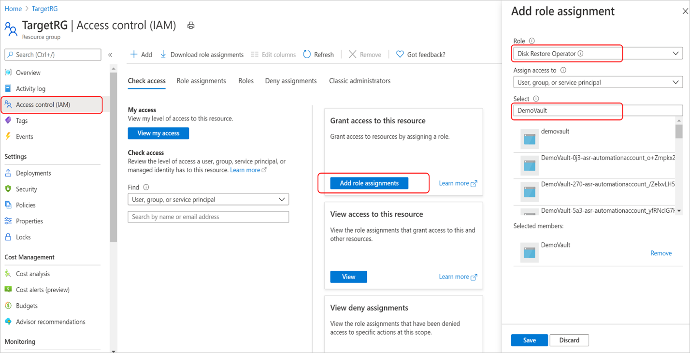

1. Verify that the backup vault's managed identity has the right set of role assignments on the resource group where the disk will be restored.

    1. Go to **Backup vault - > Identity** and select **Azure role assignments**

        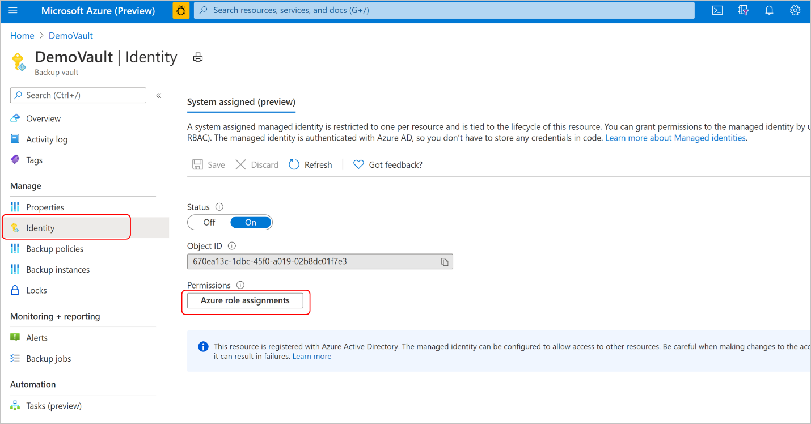

    1. Verify that the role, resource name, and resource type appear correctly.

        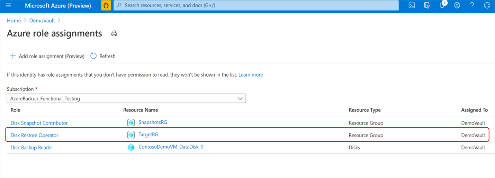

    >[!NOTE]
    >While the role assignments are reflected correctly on the portal, it may take approximately 15 minutes for the permission to be applied on the backup vault’s managed identity.
    >
    >During scheduled backups or an on-demand backup operation, Azure Backup stores the disk incremental snapshots in the Snapshot Resource Group provided during configuring backup of the disk. Azure Backup uses these incremental snapshots during the restore operation. If the snapshots are deleted or moved from the Snapshot Resource Group or if the Backup vault role assignments are revoked on the Snapshot Resource Group, the restore operation will fail.

1. If the disk to be restored is encrypted with [customer-managed keys (CMK)](https://docs.microsoft.com/azure/virtual-machines/disks-enable-customer-managed-keys-portal) or using [double encryption using platform-managed keys and customer-managed keys](https://docs.microsoft.com/azure/virtual-machines/disks-enable-double-encryption-at-rest-portal), then assign the **Reader** role permission to the Backup Vault’s managed identity on the **Disk Encryption Set** resource.

Once the prerequisites are met, follow these steps to perform the restore operation.

1. In the [Azure portal](https://portal.azure.com/), go to **Backup center**. Select **Backup instances** under the **Manage** section. From the list of backup instances, select the disk backup instance for which you want to perform the restore operation.

    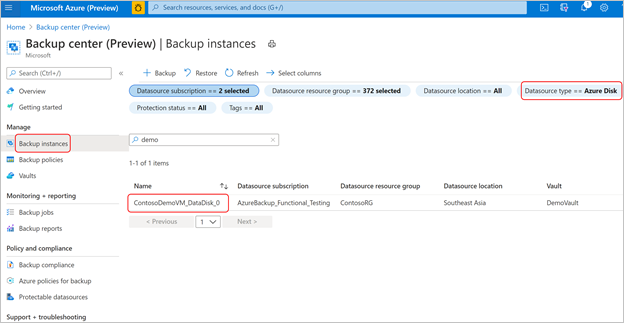

    Alternately, you can perform this operation from the Backup vault you used to configure backup for the disk.

1. In the **Backup instance** screen, select the restore point that you want to use to perform the restore operation and select **Restore**.

    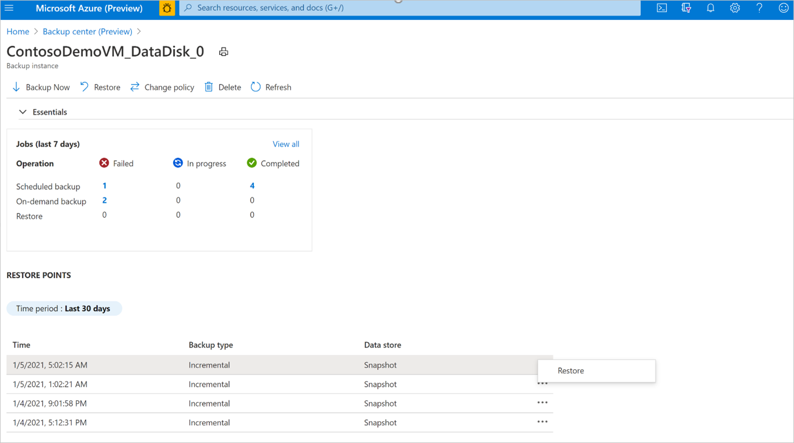

1. In the **Restore** workflow, review the **Basics** and **Select recovery point** tab information, and select **Next: Restore parameters**.

    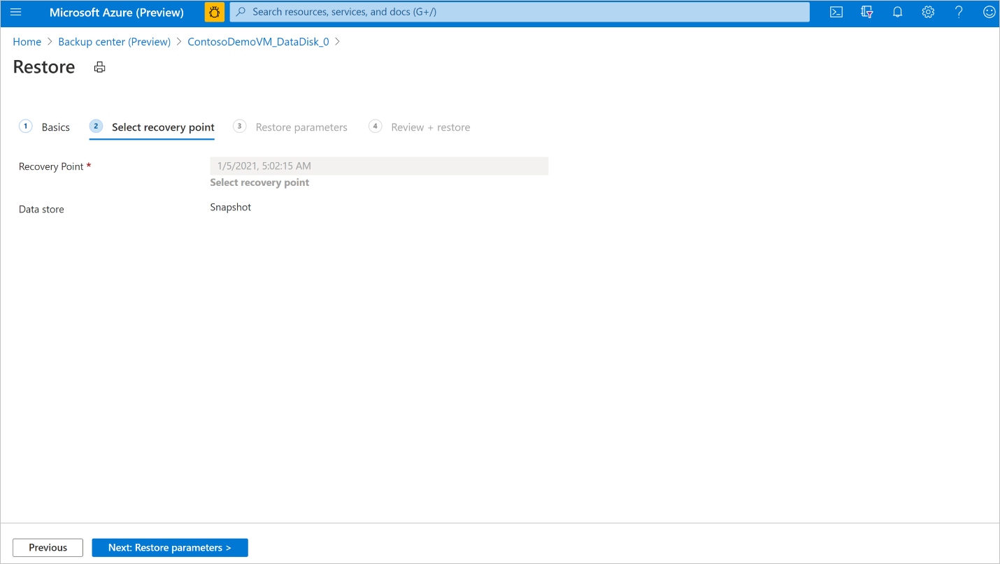

1. In the **Restore parameters** tab, select the **Target subscription** and **Target resource group** where you want to restore the backup to. Provide the name of the disk to be restored. Select **Next: Review + restore**.

    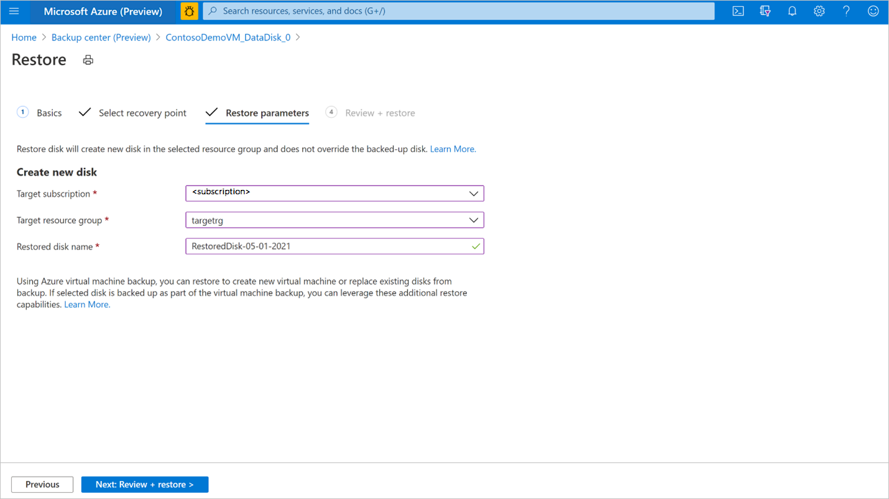

    >[!TIP]
    >Disks being backed up by Azure Backup using the Disk Backup solution can also be backed up by Azure Backup using the Azure VM backup solution with the Recovery Services vault. If you have configured protection of the Azure VM to which this disk is attached, you can also use the Azure VM restore operation. You can choose to restore the VM, or disks and files or folders from the recovery point of the corresponding Azure VM backup instance. For more information, see [Azure VM backup](https://docs.microsoft.com/azure/backup/about-azure-vm-restore).

1. Once the validation is successful, select **Restore** to start the restore operation.

    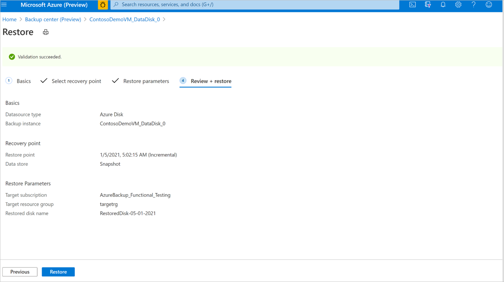

    >[!NOTE]
    > Validation might take few minutes to complete before you can trigger restore operation. Validation may fail if:
    >
    > - a disk with the same name  provided in **Restored disk name** already exists in the **Target resource group**
    > - the Backup vault's managed identity doesn't have valid role assignments on the **Target resource group**
    > - the Backup vault's managed identity role assignments are revoked on the **Snapshot resource group** where incremental snapshots are stored
    > - If incremental snapshots are deleted or moved from the snapshot resource group

Restore will create a new disk from the selected recovery point in the target resource group that was provided during the restore operation. To use the restored disk on an existing virtual machine, you'll need to perform more steps:

- If the restored disk is a data disk, you can attach an existing disk to a virtual machine. If the restored disk is OS disk, you can swap the OS disk of a virtual machine from the Azure portal under the **Virtual machine** pane - > **Disks** menu in the **Settings** section.

    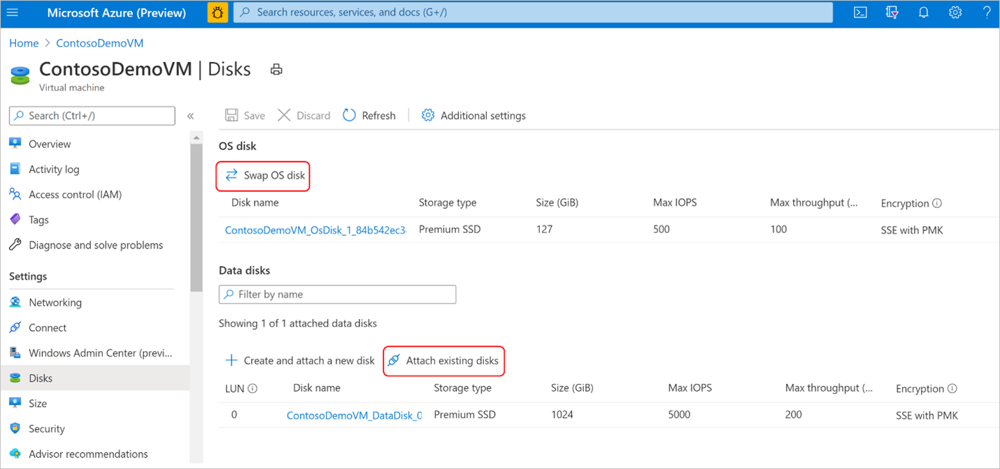

- For Windows virtual machines, if the restored disk is a data disk, follow the instructions to [detach the original data disk](https://docs.microsoft.com/azure/virtual-machines/windows/detach-disk#detach-a-data-disk-using-the-portal) from the virtual machine. Then [attach the restored disk](https://docs.microsoft.com/azure/virtual-machines/windows/attach-managed-disk-portal) to the virtual machine. Follow the instructions to [swap the OS disk](https://docs.microsoft.com/azure/virtual-machines/windows/os-disk-swap) of the virtual machine with the restored disk.

- For Linux virtual machines, if the restored disk is a data disk, follow the instructions to [detach the original data disk](https://docs.microsoft.com/azure/virtual-machines/linux/detach-disk#detach-a-data-disk-using-the-portal) from the virtual machine. Then [attach the restored disk](https://docs.microsoft.com/azure/virtual-machines/linux/attach-disk-portal#attach-an-existing-disk) to the virtual machine. Follow the instructions to [swap the OS disk](https://docs.microsoft.com/azure/virtual-machines/linux/os-disk-swap) of  the virtual machine with the restored disk.

It's recommended that you revoke the **Disk Restore Operator** role assignment from the Backup vault's managed identity on the **Target resource group** after the successful completion of restore operation.

## Track a restore operation

After you trigger the restore operation, the backup service creates a job for tracking. Azure Backup displays notifications about the job in the portal. To view the restore job progress:

1. Go to the **Backup instance** screen. It shows the jobs dashboard with operation and status for the past seven days.

    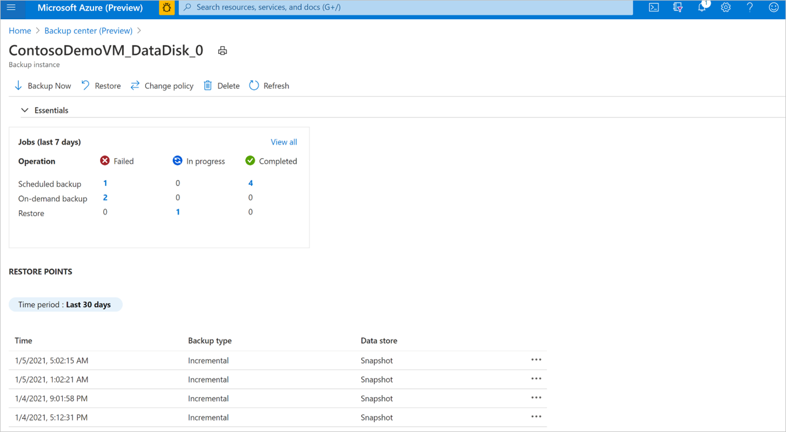

1. To view the status of the restore operation, select **View all** to show ongoing and past jobs of this backup instance.

    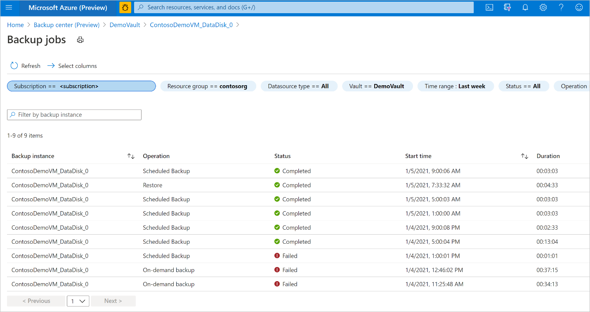

1. Review the list of backup and restore jobs and their status. Select a job from the list of jobs to view job details.

    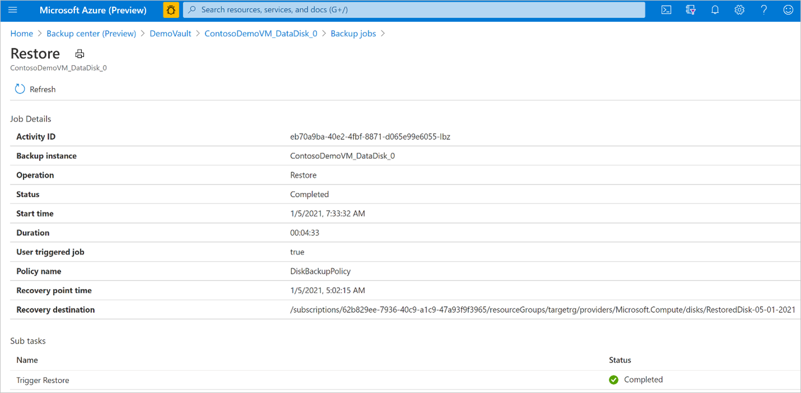

## Next steps

- [Azure Disk Backup FAQ](disk-backup-faq.md)
