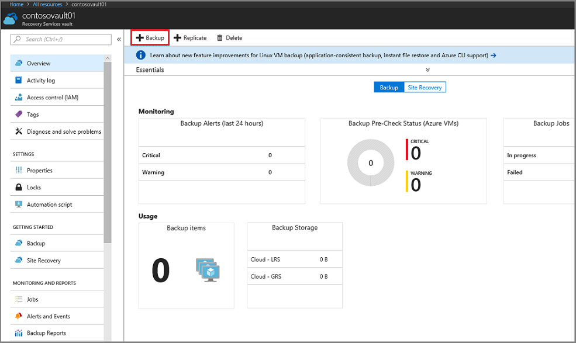
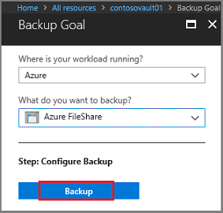
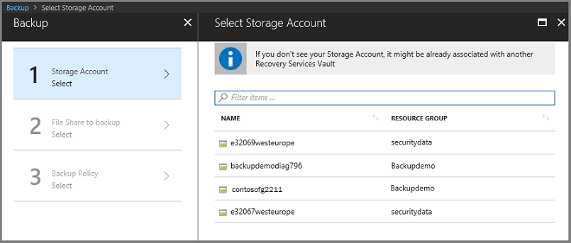
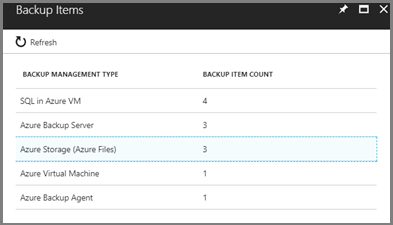
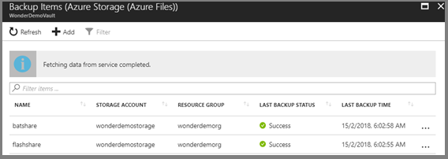
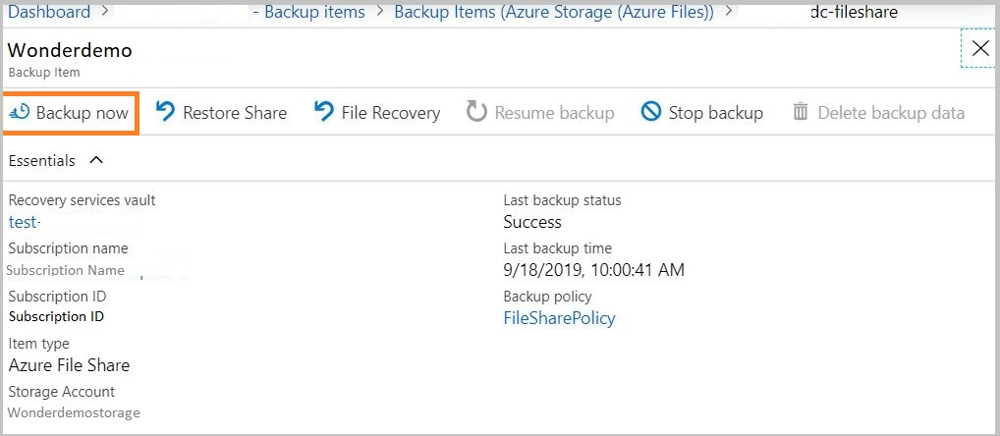

# Back up Azure file shares in the Azure portal

This tutorial explains how to use the Azure portal to back up [Azure file shares](../storage/files/storage-files-introduction.md).

In this guide, you learn how to:
> [!div class="checklist"]
>
> * Configure a Recovery Services vault to back up Azure Files
> * Run an on-demand backup job to create a restore point

## Prerequisites

Before you can back up an Azure file share, ensure that it's present in one of the [supported Storage Account types](tutorial-backup-azure-files.md#limitations-for-azure-file-share-backup-during-preview). Once you have verified this, you can protect your file shares.

## Limitations for Azure file share backup during preview

Backup for Azure file shares is in preview. Azure file shares in both general-purpose v1 and general-purpose v2 storage accounts are supported. The following backup scenarios aren't supported for Azure file shares:

* You can't protect Azure file shares in storage accounts that have Virtual Networks or Firewall enabled.
* There is no CLI available for protecting Azure Files using Azure Backup.
* The maximum number of scheduled backups per day is one.
* The maximum number of on-demand backups per day is four.
* Use [resource locks](https://docs.microsoft.com/cli/azure/resource/lock?view=azure-cli-latest) on the storage account to prevent accidental deletion of backups in your Recovery Services vault.
* Do not delete snapshots created by Azure Backup. Deleting snapshots can result in loss of recovery points and/or restore failures.
* Do not delete file shares that are protected by Azure Backup. The current solution will delete all snapshots taken by Azure Backup once the file share is deleted and hence lose all restore points

Back up for Azure File Shares in Storage Accounts with [zone redundant storage](../storage/common/storage-redundancy-zrs.md) (ZRS) replication is currently available only in Central US (CUS), East US (EUS), East US 2 (EUS2), North Europe (NE), SouthEast Asia (SEA), West Europe (WE) and West US 2 (WUS2).

## Configuring backup for an Azure file share

This tutorial assumes you already have established an Azure file share. To back up your Azure file share:

1. Create a Recovery Services vault in the same region as your file share. If you already have a vault, open your vault's Overview page and click **Backup**.

    

2. In the **Backup Goal** menu, from **What do you want to back up?**, choose Azure FileShare.

    

3. Click **Backup** to configure the Azure file share to your Recovery Services vault.

   

    Once the vault is associated with the Azure file share, the Backup menu opens and prompts you to select a Storage account. The menu displays all supported Storage Accounts in the region where your vault exists that aren't already associated with a Recovery Services vault.

   

4. In the list of Storage accounts, select an account, and click **OK**. Azure searches the storage account for files shares that can be backed up. If you recently added your file shares and do not see them in the list, allow a little time for the file shares to appear.

   

5. From the **File Shares** list, select one or more of the file shares you want to back up, and click **OK**.

6. After choosing your File Shares, the Backup menu switches to the **Backup policy**. From this menu either select an existing backup policy, or create a new one, and then click **Enable Backup**.

   

    After establishing a backup policy, a snapshot of the File Shares will be taken at the scheduled time, and the recovery point is retained for the chosen period.

## Create an on-demand backup

After configuring the backup policy, you'll want to create an on-demand backup to ensure your data is protected until the next scheduled backup.

### To create an on-demand backup

1. Open the Recovery Services vault that contains the file share recovery points, and click **Backup Items**. The list of Backup Item types appears.

   

2. From the list, select **Azure Storage (Azure Files)**. The list of Azure file shares appears.

   

3. From the list of Azure file shares, select the desired file share. The Backup Item menu for the selected file share opens.

   

4. From the Backup Item menu, click **Backup Now**. Because this is an on-demand backup job, there is no retention policy associated with the recovery point. The **Backup Now** dialog opens. Specify the last day you want to retain the recovery point.

   

## Next steps

In this tutorial, you used the Azure portal to:

> [!div class="checklist"]
>
> * Configure a Recovery Services vault to back up Azure Files
> * Run an on-demand backup job to create a restore point

Continue to the next article to restore from a backup of an Azure file share.

> [!div class="nextstepaction"]
> [Restore from backup of Azure file shares](./backup-azure-files.md#restore-from-backup-of-azure-file-share)
