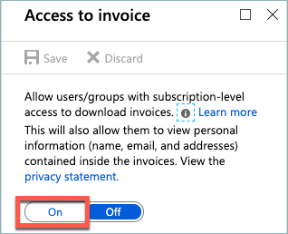

# Manage access to billing information for Azure

For most subscriptions, you can give billing information access to members of your team from **Subscriptions** in the Azure portal. If you're an Azure customer with an Enterprise Agreement (EA customer) and are the Enterprise Administrator, you can give permissions to the Department Administrators and Account Owners in the Enterprise portal.

## Give access to billing

All except EA customers can grant access to Azure billing information by assigning one of the following user roles to members of your team:

- Account Administrator
- Service Administrator
- Co-administrator
- Owner
- Contributor
- Reader
- Billing Reader

To assign roles, see [Manage access using RBAC and the Azure portal](../role-based-access-control/role-assignments-portal.md).

Those roles have access to billing information in the [Azure portal](https://portal.azure.com/). People that are assigned those roles can also use the [Billing APIs](billing-usage-rate-card-overview.md) to programmatically get invoices and usage details. For more information, see [Roles in Azure RBAC](../role-based-access-control/built-in-roles.md).

###  Allow users to download invoices

After you assign the appropriate roles to members of your team, the Account Administrator must turn on access to download invoices in the Azure portal. Invoices older than December 2016 are available only to the Account Administrator.

1. Sign in to the [Azure portal](https://portal.azure.com/).
1. As the Account Administrator, select your subscription from the [Subscriptions blade](https://portal.azure.com/#blade/Microsoft_Azure_Billing/SubscriptionsBlade) in Azure portal.

1. Select **Invoices** and then **Access to invoices**.

    

1. Select **On** and save.

    

The Account Administrator can also configure to have invoices sent via email. To learn more, see [Get your invoice in email](billing-download-azure-invoice-daily-usage-date.md).

## Give read-only access to billing

Assign the Billing Reader role to someone that needs read-only access to the subscription billing information but not the ability to manage or create Azure services. This role is appropriate for users in an organization who are responsible for the financial and cost management for Azure subscriptions.

If you're an EA customer, an Account Owner or Department Administrator can assign the Billing Reader role to team members. But for that Billing Reader to view billing information for the department or account, the Enterprise Administrator must enable  **AO view charges** or **DA view charges** policies in the Enterprise portal.

The Billing Reader feature is in preview, and does not yet support non-global clouds.

1. Sign in to the [Azure portal](https://portal.azure.com/).
1. Select your subscription from the [Subscriptions blade](https://portal.azure.com/#blade/Microsoft_Azure_Billing/SubscriptionsBlade) in Azure portal.

1. Select **Access control (IAM)**.
1. Select **Role assignments** to view all the role assignments for this subscription.
1. Select **Add role assignment**.
1. In the **Role** drop-down list, choose **Billing Reader**.
1. In the **Select** textbox, type the name or email for the user you want to add.
1. Select the user.
1. Select **Save**.
1. After a few moments, the user is assigned the Billing Reader role at the subscription scope.
1. The Billing Reader receives an email with a link to sign in.

    

## Allow Department Administrator or Account Owner billing access

The Enterprise Administrator can allow the Department Administrators and Account Owners to view usage details and the costs associated to the Departments and Accounts that they manage.

1. As the Enterprise Administrator, sign in to the [EA portal](https://ea.azure.com/).
1. Select **Manage**.
1. Under **Enrollment**, change the **DA view charges** to **Enabled** for the Department Admin to view usage and costs.
1. Change **AO view charges** to **Enabled** for the Account Owner to view usage and costs.

For more information, see [Understand Azure Enterprise Agreement administrative roles in Azure](billing-understand-ea-roles.md).

## Only Account Admins can access Account Center

The Account Administrator is the legal owner of the subscription. By default, the person who signed up for or bought the Azure subscription is the Account Administrator, unless the [subscription ownership was transferred](billing-subscription-transfer.md) to somebody else. The Account Administrator can create subscriptions, cancel subscriptions, change the billing address for a subscription, and manage access policies for the subscription from the [Account Center](https://account.azure.com/Subscriptions).

## Next steps

- Users in other roles, such as Owner or Contributor, can access not just billing information, but Azure services as well. To manage these roles, see [Manage access using RBAC and the Azure portal](../role-based-access-control/role-assignments-portal.md).
- For more information about roles, see [Built-in roles for Azure resources](../role-based-access-control/built-in-roles.md).

## Need help? Contact us.

If you have questions or need help, [create a support request](https://portal.azure.com/#blade/Microsoft_Azure_Support/HelpAndSupportBlade/newsupportrequest).
