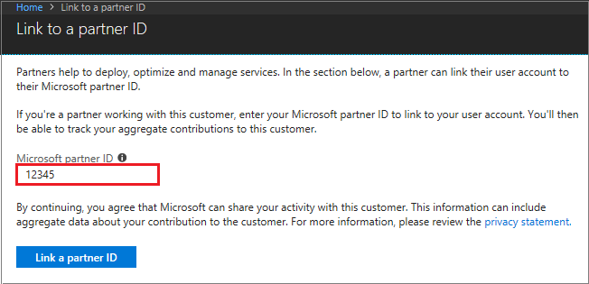

---
title: Link an Azure account to a partner ID | Microsoft Docs
description: Track engagements with Azure customers by linking a partner ID to the user account that you use to manage the customer's resources. 
services: billing
author: dhirajgandhi
manager: dhgandhi

ms.author: banders
ms.date: 03/12/2018
ms.service: billing
ms.devlang: na
ms.topic: conceptual
ms.tgt_pltfrm: na
ms.workload: na
---

# Link a partner ID to your Azure accounts

As a partner, you can track your impact across your customer engagements. You can link your partner ID to the accounts that are used to manage a customer's resources.

## Get access from your customer

Before you link your partner ID, your customer must give you access to their Azure resources by using one of the following options:

- **Guest user**: Your customer can add you as a guest user and assign any role-based access control (RBAC) roles. For more information, see [Add guest users from another directory](https://docs.microsoft.com/azure/active-directory/active-directory-b2b-what-is-azure-ad-b2b).

- **Directory account**: Your customer can create a user account for you in their own directory and assign any RBAC role.

- **Service principal**: Your customer can add an app or script from your organization in their directory and assign any RBAC role. The identity of the app or script is known as a service principal.

## Link to a partner ID

When you have access to the customer's resources, use the Azure portal, PowerShell, or the Azure CLI to link your Microsoft Partner Network ID (MPN ID) to your user ID or service principal. Link the partner ID in each customer tenant.

### Use the Azure portal to link to a new partner ID

1. Go to [Link to a partner ID](https://portal.azure.com/#blade/Microsoft_Azure_Billing/managementpartnerblade) in the Azure portal.

2. Sign in to the Azure portal.

3. Enter the Microsoft partner ID. The partner ID is the [Microsoft Partner Network](https://partner.microsoft.com/) ID for your organization.

   

4. To link a partner ID for another customer, switch the directory. Under **Switch directory**, select your directory.

   

### Use PowerShell to link to a new partner ID

1. Install the [AzureRM.ManagementPartner](https://www.powershellgallery.com/packages/AzureRM.ManagementPartner) PowerShell module.

2. Sign in to the customer's tenant with either the user account or the service principal. For more information, see [Sign in with PowerShell](https://docs.microsoft.com/powershell/azure/authenticate-azureps).
 
   ```azurepowershell-interactive
    C:\> Connect-AzureRmAccount -TenantId XXXXXXXX-XXXX-XXXX-XXXX-XXXXXXXXXXXX 
   ```


3. Link to the new partner ID. The partner ID is the [Microsoft Partner Network](https://partner.microsoft.com/) ID for your organization.

    ```azurepowershell-interactive
    C:\> new-AzureRmManagementPartner -PartnerId 12345 
    ```

#### Get the linked partner ID
```azurepowershell-interactive
C:\> get-AzureRmManagementPartner 
```

#### Update the linked partner ID
```azurepowershell-interactive
C:\> Update-AzureRmManagementPartner -PartnerId 12345 
```
#### Delete the linked partner ID
```azurepowershell-interactive
C:\> remove-AzureRmManagementPartner -PartnerId 12345 
```

### Use the Azure CLI to link to a new partner ID
1. Install the Azure CLI extension.

    ```azurecli-interactive
    C:\ az extension add --name managementpartner
    ``` 

2. Sign in to the customer's tenant with either the user account or the service principal. For more information, see [Sign in with the Azure CLI](https://docs.microsoft.com/cli/azure/authenticate-azure-cli?view=azure-cli-latest).

    ```azurecli-interactive
    C:\ az login --tenant <tenant>
    ``` 

3. Link to the new partner ID. The partner ID is the [Microsoft Partner Network](https://partner.microsoft.com/) ID for your organization.

     ```azurecli-interactive
     C:\ az managementpartner create --partner-id 12345
      ```  

#### Get the linked partner ID
```azurecli-interactive
C:\ az managementpartner show
``` 

#### Update the linked partner ID
```azurecli-interactive
C:\ az managementpartner update --partner-id 12345
``` 

#### Delete the linked partner ID
```azurecli-interactive
C:\ az managementpartner delete --partner-id 12345
``` 

## Next steps

Join the discussion in the [Microsoft Partner Community](https://aka.ms/PALdiscussion) to receive updates or send feedback.

## Frequently asked questions

**Who can link the partner ID?**

Any user from the partner organization who manages a customer's Azure resources can link the partner ID to the account.

**Can a partner ID be changed after it's linked?**

Yes. A linked partner ID can be changed, added, or removed.

**What if a user has an account in more than one customer tenant?**

The link between the partner ID and the account is done for each customer tenant. Link the partner ID in each customer tenant.

**Can other partners or customers edit or remove the link to the partner ID?**

The link is associated at the user account level. Only you can edit or remove the link to the partner ID. The customer and other partners can't change the link to the partner ID. 


**Which MPN ID should I use if my company has multiple?**

You can use any valid MPN ID except virual orgnization(v-org) MPN ID. Most partners choose to use the MPN ID for the geography where the customer is based or services are being delivered.

**Where can I find influenced revenue reporting for linked partner ID?**

You can find influenced revenue reporting at [My Insights dashboard](https://partner.microsoft.com/membership/reports/myinsights). You need to select Partner Admin Link as the partner association type.

**Why can't I see my customer in the reports?**

You can't see the customer in the reports due to following reasons

1. The linked user account doesn't have [Role Based Access ](https://docs.microsoft.com/azure/role-based-access-control/overview) on any customer Azure subscription or resource.

2. The Azure subscription where the user has [Role Based Access ](https://docs.microsoft.com/azure/role-based-access-control/overview) access doesn't have any usage.

**Does link partner ID works with Azure Stack?**

Yes, You can link your partner ID for Azure Stack.

