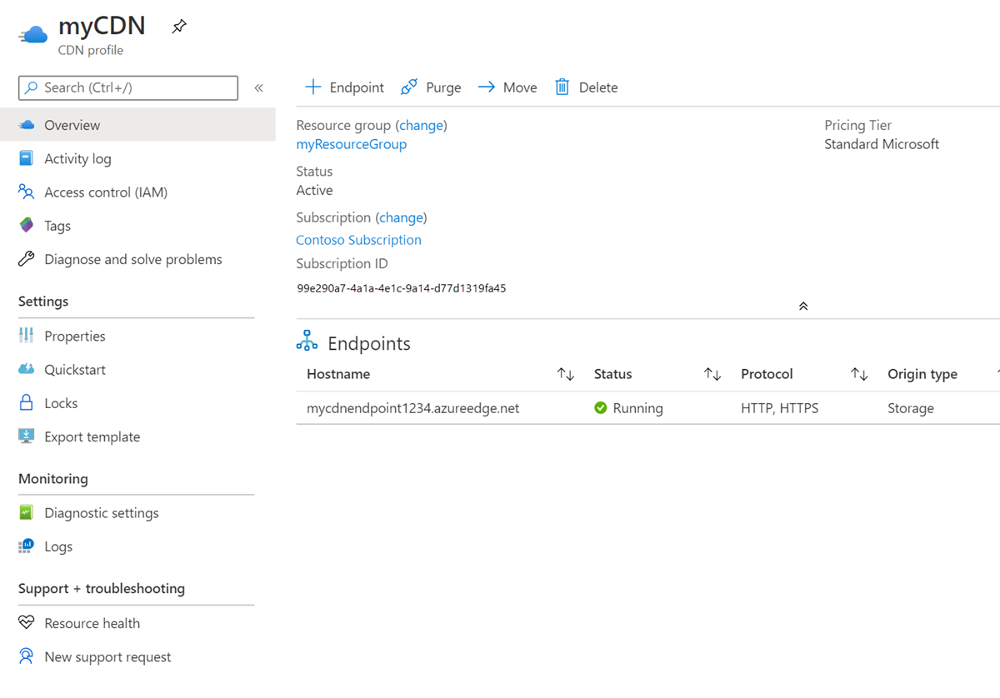
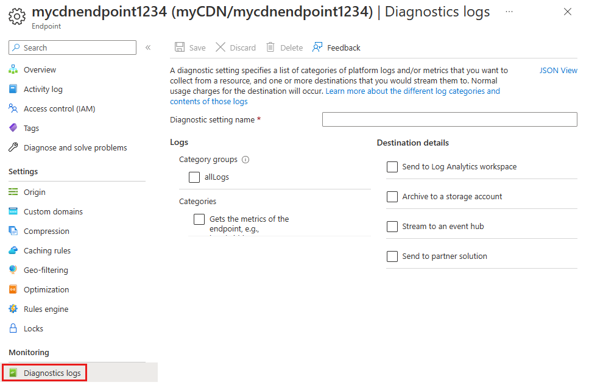
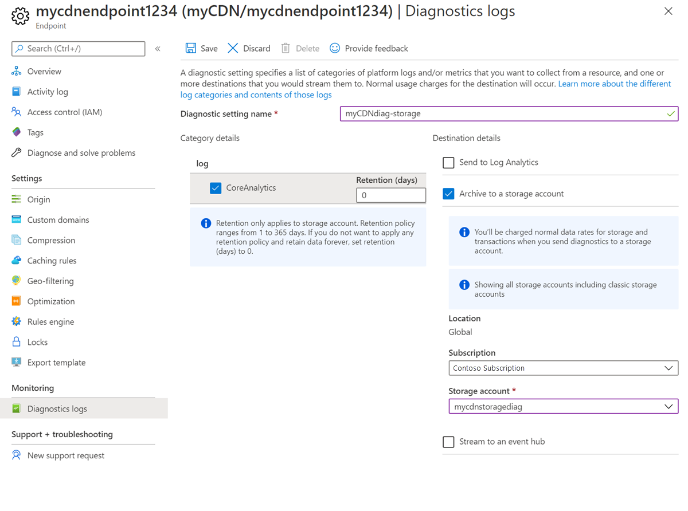

# Azure diagnostic logs

Azure diagnostic logs is available for all CDN endpoints belonging to Verizon (Standard and Premium) and Akamai (Standard) CDN Profiles. For more information, see [Diagnostic Logs](https://docs.microsoft.com/azure/monitoring-and-diagnostics/monitoring-overview-of-diagnostic-logs).

With this feature, you can view core analytics and save them into one or more destinations including:

 - Azure Storage account
 - Azure Event Hubs
 - [OMS Log Analytics repository](https://docs.microsoft.com/azure/log-analytics/log-analytics-get-started)
 
This feature is available for all CDN endpoints belonging to Verizon (Standard and Premium) and Akamai (Standard) CDN Profiles.

For more information about diagnostic logs, see [Diagnostic Logs](https://docs.microsoft.com/azure/monitoring-and-diagnostics/monitoring-overview-of-diagnostic-logs).

Azure diagnostics logs allow you to export basic usage metrics from your CDN endpoint to a variety of sources so that you can consume them in a customized way. For example, you can do the following types of data export:

- Export data to blob storage, export to CSV, and generate graphs in Excel.
- Export data to Event Hubs and correlate with data from other Azure services.
- Export data to log analytics and view data in your own OMS work space

The following figure shows a typical CDN core analytics view into data.


*Figure 1 - CDN core analytics view*

The following walkthrough goes through the schema of the core analytics data, steps involved in enabling the feature and delivering them to various destinations, and consuming from these destinations.

## Enable logging with Azure portal

> [!NOTE]
> The diagnostics logs are turned **off** by default. 

Follow the steps below to enable logging with CDN core analytics:

Sign in to the [Azure portal](http://portal.azure.com). If you don't already have CDN enabled for your workflow, [Enable Azure CDN](cdn-create-new-endpoint.md) before you continue.

1. In the portal, navigate to **CDN profile**.
2. Select a CDN profile, then select the CDN endpoint that you want to enable **Diagnostics Logs**.

	

3. Go to **Diagnostics Logs** blade Under **Monitoring** section, then change the status to **On**.

	

### Enable logging with Azure Storage
	
To use Azure Storage to store the logs, select **Archive to a storage account**, select retention days, and click **CoreAnalytics** under **Log**.



*Figure 2 - Logging with Azure Storage*

### Logging with OMS Log Analytics

To use OMS Log Analytics to store the logs, follow these steps:

1. From the **Diagnostics Logs** blade Under **Monitoring**, select **Send to Log Analytics** from 

        

2. Configure the Log Analytics logging by clicking on Configure. This takes you to a dialog where you can select a previous workspace or create a new one.

    

3. Click **Create New Workspace**.

    

4. Next you must select a new workspace name, existing subscription, resource group (new or existing), location, and pricing tier. You have the option of pinning this configuration to your dashboard. Click OK to complete the configuration.

    Next you should see your workspace with your OMS Workspace and Resource group names. Names must be unique and can only use letters, numbers, and hyphens. Spaces and underscores are not allowed. 

    

5. You next get a short message saying that your workspace has been created and you are returned to your logging configuration screen. You can confirm the name of your Log Analytics workspace.

    

    Once you have set up the Log Analytics configuration, make sure you also check the CoreAnalytics box for CDN logging.

6. If everything is to your liking, click the **Save** button at the top of the configuration dialog.

    

    The **Save** button is no longer active and that the ON/OFF button is now ON, but blue instead of purple.

7. If you want to see your new OMS workspace, go to your Azure portal Dashboard, click the name of your Log Analytics workspace. Next you will see your workspace (make sure that OMS Workspace is highlighted on the left). Click on the OMS Portal tile to see your workspace in the OMS repository. 

     

    Your OMS repository is now ready to log data. In order to consume that data, you must use an [OMS Solution](#consuming-oms-log-analytics-data), covered later in this article.

For more information about log data delays, see [Log data delays](#log-data-delays).

## Enable logging with PowerShell

Below is an example on how to enable and get Diagnostic Logs via the Azure PowerShell Cmdlets.

###Enabling Diagnostic Logs in a Storage Account

First log in and select a subscription:

    Login-AzureRmAccount 

    Select-AzureSubscription -SubscriptionId 


To Enable Diagnostic Logs in a Storage Account, use this command:

```powershell
    Set-AzureRmDiagnosticSetting -ResourceId "/subscriptions/{subscriptionId}/resourcegroups/{resourceGroupName}/providers/Microsoft.Cdn/profiles/{profileName}/endpoints/{endpointName}" -StorageAccountId "/subscriptions/{subscriptionId}/resourceGroups/{resourceGroupName}/providers/Microsoft.ClassicStorage/storageAccounts/{storageAccountName}" -Enabled $true -Categories CoreAnalytics
```
To Enable Diagnostics Logs in an OMS workspace, use this command:

```powershell
    Set-AzureRmDiagnosticSetting -ResourceId "/subscriptions/`{subscriptionId}<subscriptionId>
    .<subscriptionName>" -WorkspaceId "/subscriptions/<workspaceId>.<workspaceName>" -Enabled $true -Categories CoreAnalytics 
```


## Consuming diagnostics logs from Azure Storage
This section describes the schema of the CDN core analytics, how these are organized inside of an Azure Storage Account and provides sample code to download the logs into a CSV file.

### Using Microsoft Azure Storage Explorer
Before you can access the core analytics data from the Azure Storage Account, you first need a tool to access the contents in a storage account. While there are several tools available in the market, the one that we recommend is the Microsoft Azure Storage Explorer. You can download the tool from [here](http://storageexplorer.com/). After downloading and installing the software, configure it to use the same Azure Storage Account that was configured as a destination to the CDN Diagnostics Logs.

1.	Open **Microsoft Azure Storage Explorer**
2.	Locate the storage account
3.	Go to the **“Blob Containers”** node under this storage account and expand the node
4.	Select the container named **“insights-logs-coreanalytics”** and double-click it
5.	Results show up on the right-hand pane starting with the first level, which looks like **“resourceId=”**. Continue clicking all the way until you see the file **PT1H.json**. See the following note for explanation of the path.
6.	Each blob **PT1H.json** represents the analytics logs for one hour for a specific CDN endpoint or its custom domain.
7.	The schema of the contents of this JSON file is described in the section Schema of the core analytics logs


> [!NOTE]
> **Blob path format**
> 
> Core analytics logs are generated every hour. All data for an hour are collected and stored inside a single Azure Blob as a JSON payload. The path to this Azure Blob appears as if there is a hierarchical structure. This is because the Storage explorer tool interprets '/' as a directory separator and shows the hierarchy for convenience. Actually, the whole path just represents the blob name. This name of the blob follows the following naming convention	
	
	resourceId=/SUBSCRIPTIONS/{Subscription Id}/RESOURCEGROUPS/{Resource Group Name}/PROVIDERS/MICROSOFT.CDN/PROFILES/{Profile Name}/ENDPOINTS/{Endpoint Name}/ y={Year}/m={Month}/d={Day}/h={Hour}/m={Minutes}/PT1H.json

**Description of fields:**

|value|description|
|-------|---------|
|Subscription ID	|ID of the Azure Subscription. This is in the Guid format.|
|Resource |Group Name	Name of the resource group to which the CDN resources belong.|
|Profile Name |Name of the CDN Profile|
|Endpoint Name |Name of the CDN Endpoint|
|Year|	4-digit representation of the year for example, 2017|
|Month|	2-digit representation of the month number. 01=January ... 12=December|
|Day|	2 digit representation of the day of the month|
|PT1H.json|	Actual JSON file where the analytics data is stored|

### Exporting the core analytics data to a CSV file

To make it easy to access core analytics, we provide a sample code for a tool, which allows downloading the JSON files into a flat comma-separated file format, which can be used to easily create charts or other aggregations.

Here is how you can use the tool:

1.	Visit the github link: [https://github.com/Azure-Samples/azure-cdn-samples/tree/master/CoreAnalytics-ExportToCsv ](https://github.com/Azure-Samples/azure-cdn-samples/tree/master/CoreAnalytics-ExportToCsv )
2.	Download the code
3.	Follow instructions to compile and configure
4.	Run the tool
5.	Resulting CSV file shows the analytics data in a simple flat hierarchy.

## Consuming diagnostics logs from an OMS Log Analytics repository
Log Analytics is a service in Operations Management Suite (OMS) that monitors your cloud and on-premises environments to maintain their availability and performance. It collects data generated by resources in your cloud and on-premises environments and from other monitoring tools to provide analysis across multiple sources. 

To use Log Analytics, you must [enable logging](#enable-logging-with-azure-storage) to the Azure OMS Log Analytics repository, which is discussed earlier in this article.

### Using the OMS Repository

 The following diagram shows the architecture of the inputs and outputs of the repository:


*Figure 3 - Log Analytics Repository*

You can display the data in a variety of ways by using Management Solutions. You can obtain Management Solutions from the [Azure Marketplace](https://azuremarketplace.microsoft.com/marketplace/apps/category/monitoring-management?page=1&subcategories=management-solutions).

You can install management solutions from Azure marketplace by clicking the **Get it now** link at the bottom of each solution.

### Adding an OMS CDN Management Solution

Follow these steps to add a Management Solution:

1.   If you haven't already done so, sign in to the Azure portal using your Azure subscription and go to your Dashboard.
    

2. In the **New** blade under **Marketplace**, select **Monitoring + management**.

    

3. In the **Monitoring + management** blade, click **See all**.

    

4.	Search for CDN in the search box.

    

5. 	Select **Azure CDN Core Analytics**. 

    

6. 	After clicking **Create**, you will be asked to create a new OMS workspace or use an existing one. 

    

7. 	Select the workspace you created before. You then need to add an automation account.

    

8. The following screen shows the automation account form you must fill out. 

    

9. Once you have created the automation account, you are ready to add your solution. Click the **Create** button.

    

10. Your solution has now been added to your workspace. Go back to your Azure portal Dashboard.

    

    Click the Log Analytics workspace you created to go to your workspace. 

11. Click the **OMS Portal** tile to see your new solution in the OMS portal.

    

12. Your OMS portal should now look like the following screen:

    

    Click one of the tiles to see several views into your data.

    

    You can scroll left or right to see further tiles representing individual views into the data. 

    Clicking one of the tiles gives you more details about your data.

     

### Offers and pricing tiers

You can see offers and pricing tiers for OMS management solutions [here](https://docs.microsoft.com/en-us/azure/log-analytics/log-analytics-add-solutions#offers-and-pricing-tiers).

### Customizing views

You can customize the view into your data by using the **View Designer**. Go to your OMS workspace and begin designing by clicking the **View Designer** tile.


You can drag and drop types of charts from the left and fill in the data details you want to analyze on the left.


	
## Log data delays

Verizon log data delays | Akamai log data delays
--- | ---
Verizon log data is 1 hour delayed, and take up to 2 hours to start appearing after endpoint propagation completion. | Akamai log data is 24 hours delayed, and takes up to 2 hours to start appearing if it was created more than 24 hours ago. If it was recently created, it can take up to 25 hours for the logs to start appearing.

## Diagnostic log types for CDN core analytics

We currently offer only core analytics logs, which contain metrics showing HTTP response statistics and egress statistics as seen from the CDN POPs/edges.

### Core analytics metrics details
The following table shows a list of metrics available in the core analytics logs. Not all metrics are available from all providers, although such differences are minimal. The following table also shows if a given metric is available from a provider. Note that the metrics are available for only those CDN endpoints that have traffic on them.


|Metric                     | Description   | Verizon  | Akamai 
|---------------------------|---------------|---|---|
| RequestCountTotal         |Total number of request hits during this period| Yes  |Yes   |
| RequestCountHttpStatus2xx |Count of all requests that resulted in a 2xx HTTP code (for example, 200, 202)              | Yes  |Yes   |
| RequestCountHttpStatus3xx | Count of all requests that resulted in a 3xx HTTP code (for example, 300, 302)              | Yes  |Yes   |
| RequestCountHttpStatus4xx |Count of all requests that resulted in a 4xx HTTP code (for example, 400, 404)               | Yes   |Yes   |
| RequestCountHttpStatus5xx | Count of all requests that resulted in a 5xx HTTP code (for example, 500, 504)              | Yes  |Yes   |
| RequestCountHttpStatusOthers |  Count of all other HTTP codes (outside of 2xx-5xx) | Yes  |Yes   |
| RequestCountHttpStatus200 | Count of all requests that resulted in a 200 HTTP code response              |No   |Yes   |
| RequestCountHttpStatus206 | Count of all requests that resulted in a 206 HTTP code response              |No   |Yes   |
| RequestCountHttpStatus302 | Count of all requests that resulted in a 302 HTTP code response              |No   |Yes   |
| RequestCountHttpStatus304 |  Count of all requests that resulted in a 304 HTTP code response             |No   |Yes   |
| RequestCountHttpStatus404 | Count of all requests that resulted in a 404 HTTP code response              |No   |Yes   |
| RequestCountCacheHit |Count of all requests that resulted in a Cache Hit. This means the asset was served directly from the POP to the Client.               | Yes  |No   |
| RequestCountCacheMiss | Count of all requests that resulted in a Cache Miss. This means the asset was not found on the POP closest to the client, and therefore was retrieved from the Origin.              |Yes   | No  |
| RequestCountCacheNoCache | Count of all requests to an asset that are prevented from being cached due to a user configuration on the edge.              |Yes   | No  |
| RequestCountCacheUncacheable | Count of all requests to assets that are prevented from being cached by the asset's Cache-Control and Expires headers, which indicate that it should not be cached on a POP or by the HTTP client                |Yes   |No   |
| RequestCountCacheOthers | Count of all requests with cache status not covered by above.              |Yes   | No  |
| EgressTotal | Outbound data transfer in GB              |Yes   |Yes   |
| EgressHttpStatus2xx | Outbound data transfer* for responses with 2xx HTTP status codes in GB            |Yes   |No   |
| EgressHttpStatus3xx | Outbound data transfer for responses with 3xx HTTP status codes in GB              |Yes   |No   |
| EgressHttpStatus4xx | Outbound data transfer for responses with 4xx HTTP status codes in GB               |Yes   | No  |
| EgressHttpStatus5xx | Outbound data transfer for responses with 5xx HTTP status codes in GB               |Yes   |  No |
| EgressHttpStatusOthers | Outbound data transfer for responses with other HTTP status codes in GB                |Yes   |No   |
| EgressCacheHit |  Outbound data transfer for responses that were delivered directly from the CDN cache on the CDN POPs/Edges	|Yes   |  No |
| EgressCacheMiss | Outbound data transfer for responses that were not found on the nearest POP server, and retrieved from the origin server              |Yes   |  No |
| EgressCacheNoCache | Outbound data transfer for assets that are prevented from being cached due to a user configuration on the edge.                |Yes   |No   |
| EgressCacheUncacheable | Outbound data transfer for assets that are prevented from being cached by the asset's Cache-Control and/or Expires headers, which indicate that it should not be cached on a POP or by the HTTP client                    |Yes   | No  |
| EgressCacheOthers |  Outbound data transfers for other cache scenarios.             |Yes   | No  |

*Outbound data transfer refers to traffic delivered from CDN POP servers to the client.


### Schema of the core analytics logs 

All logs are stored in JSON format and each entry has string fields following the below schema:

```json
    "records": [
        {
            "time": "2017-04-27T01:00:00",
            "resourceId": "<ARM Resource Id of the CDN Endpoint>",
            "operationName": "Microsoft.Cdn/profiles/endpoints/contentDelivery",
            "category": "CoreAnalytics",
            "properties": {
                "DomainName": "<Name of the domain for which the statistics is reported>",
                "RequestCountTotal": integer value,
                "RequestCountHttpStatus2xx": integer value,
                "RequestCountHttpStatus3xx": integer value,
                "RequestCountHttpStatus4xx": integer value,
                "RequestCountHttpStatus5xx": integer value,
                "RequestCountHttpStatusOthers": integer value,
                "RequestCountHttpStatus200": integer value,
                "RequestCountHttpStatus206": integer value,
                "RequestCountHttpStatus302": integer value,
                "RequestCountHttpStatus304": integer value,
                "RequestCountHttpStatus404": integer value,
                "RequestCountCacheHit": integer value,
                "RequestCountCacheMiss": integer value,
                "RequestCountCacheNoCache": integer value,
                "RequestCountCacheUncacheable": integer value,
                "RequestCountCacheOthers": integer value,
                "EgressTotal": double value,
                "EgressHttpStatus2xx": double value,
                "EgressHttpStatus3xx": double value,
                "EgressHttpStatus4xx": double value,
                "EgressHttpStatus5xx": double value,
                "EgressHttpStatusOthers": double value,
                "EgressCacheHit": double value,
                "EgressCacheMiss": double value,
                "EgressCacheNoCache": double value,
                "EgressCacheUncacheable": double value,
                "EgressCacheOthers": double value,
            }
        }

    ]
}
```

Where the ‘time’ represents the start time of the hour boundary for which the statistics is reported. When a metric is not supported by a CDN provider, instead of a double or integer value, there will be a null value. This null value indicates the absence of a metric, and this is different from a 0 value. Also note that there will be one set of these metrics per domain configured on the endpoint.

Example properties below:

```json
{
     "DomainName": "manlingakamaitest2.azureedge.net",
     "RequestCountTotal": 480,
     "RequestCountHttpStatus2xx": 480,
     "RequestCountHttpStatus3xx": 0,
     "RequestCountHttpStatus4xx": 0,
     "RequestCountHttpStatus5xx": 0,
     "RequestCountHttpStatusOthers": 0,
     "RequestCountHttpStatus200": 480,
     "RequestCountHttpStatus206": 0,
     "RequestCountHttpStatus302": 0,
     "RequestCountHttpStatus304": 0,
     "RequestCountHttpStatus404": 0,
     "RequestCountCacheHit": null,
     "RequestCountCacheMiss": null,
     "RequestCountCacheNoCache": null,
     "RequestCountCacheUncacheable": null,
     "RequestCountCacheOthers": null,
     "EgressTotal": 0.09,
     "EgressHttpStatus2xx": null,
     "EgressHttpStatus3xx": null,
     "EgressHttpStatus4xx": null,
     "EgressHttpStatus5xx": null,
     "EgressHttpStatusOthers": null,
     "EgressCacheHit": null,
     "EgressCacheMiss": null,
     "EgressCacheNoCache": null,
     "EgressCacheUncacheable": null,
     "EgressCacheOthers": null
}

```

## Additional resources

* [Azure Diagnostic logs](https://docs.microsoft.com/azure/monitoring-and-diagnostics/monitoring-overview-of-diagnostic-logs)
* [Core analytics via Azure CDN supplemental portal](https://docs.microsoft.com/azure/cdn/cdn-analyze-usage-patterns)
* [Azure OMS Log Analytics](https://docs.microsoft.com/en-us/azure/log-analytics/log-analytics-overview)
* [Azure Log Analytics REST API](https://docs.microsoft.com/en-us/rest/api/loganalytics)


