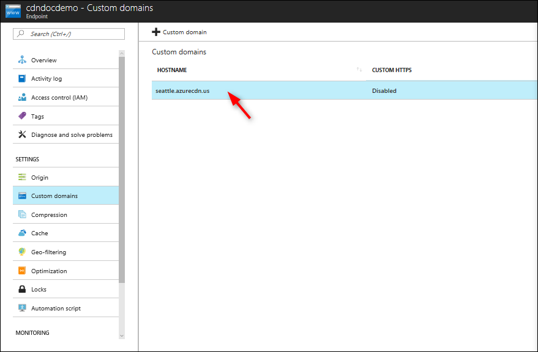
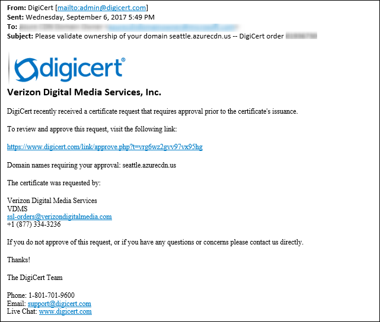
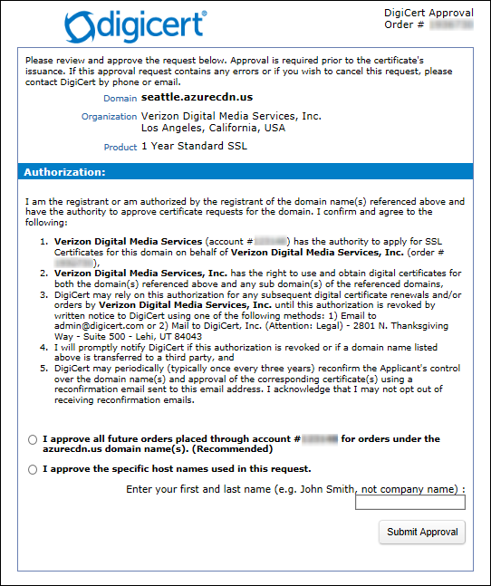
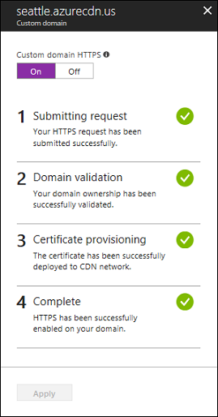
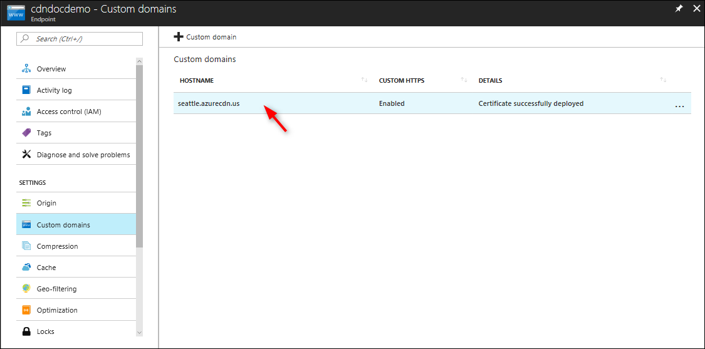
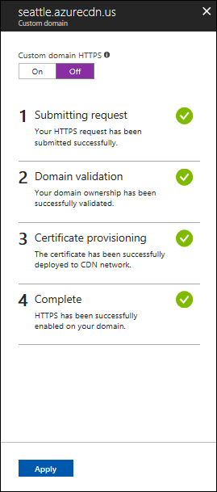
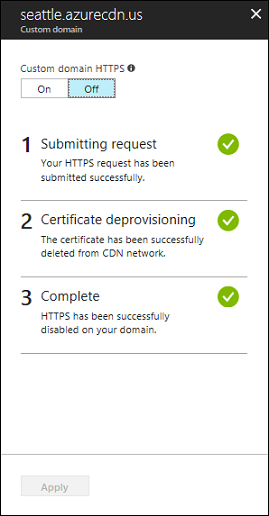

# Configure HTTPS on an Azure Content Delivery Network custom domain

[!INCLUDE [cdn-verizon-only](../../includes/cdn-verizon-only.md)]

Microsoft supports the HTTPS protocol for custom domains on Azure Content Delivery Network (CDN). With HTTPS custom domain support, you can deliver secure content via SSL by using your own domain name to improve the security of data while in transit. The workflow to enable HTTPS for your custom domain is simplified via one-click enablement and complete certificate management, all with no additional cost.

It's critical to ensure the privacy and data integrity of your web application's sensitive data while it is in transit. By using the HTTPS protocol, you ensure that your sensitive data is encrypted when it is sent across the internet. It provides trust, authentication, and protects your web applications from attacks. By default, Azure CDN supports HTTPS on a CDN endpoint. For example, if you create a CDN endpoint from Azure CDN (such as https:\//contoso.azureedge.net), HTTPS is automatically enabled. In addition, with custom domain HTTPS support, you can also enable secure delivery for a custom domain (for example, https:\//www.contoso.com). 

Some of the key attributes of the HTTPS feature are:

- No additional cost: There are no costs for certificate acquisition or renewal and no additional cost for HTTPS traffic. You pay only for GB egress from the CDN.

- Simple enablement: One-click provisioning is available from the [Azure portal](https://portal.azure.com). You can also use REST API or other developer tools to enable the feature.

- Complete certificate management: All certificate procurement and management is handled for you. Certificates are automatically provisioned and renewed prior to expiration, which removes the risks of service interruption due to a certificate expiring.

>[!NOTE] 
>Prior to enabling HTTPS support, you must have already established an [Azure CDN custom domain](./cdn-map-content-to-custom-domain.md).

## Enabling HTTPS

To enable HTTPS on a custom domain, follow these steps:

### Step 1: Enable the feature 

1. In the [Azure portal](https://portal.azure.com), browse to your **Azure CDN Standard from Verizon** or **Azure CDN Premium from Verizon** CDN profile.

2. In the list of endpoints, click the endpoint containing your custom domain.

3. Click the custom domain for which you want to enable HTTPS.

    

4. Click **On** to enable HTTPS, then click **Apply**.

    

### Step 2: Validate domain

>[!NOTE]
>If you have a Certificate Authority Authorization (CAA) record with your DNS provider, it must include DigiCert as a valid CA. A CAA record allows domain owners to specify with their DNS providers which CAs are authorized to issue certificates for their domain. If a CA receives an order for a certificate for a domain that has a CAA record and that CA is not listed as an authorized issuer, it is prohibited from issuing the certificate to that domain or subdomain. For  information about managing CAA records, see [Manage CAA records](https://support.dnsimple.com/articles/manage-caa-record/). For a CAA record tool, see [CAA Record Helper](https://sslmate.com/caa/).

#### Custom domain is mapped to CDN endpoint

When you added a custom domain to your endpoint, you created a CNAME record in the DNS table of your domain registrar to map to your CDN endpoint hostname. If that CNAME record still exists and does not contain the cdnverify subdomain, the DigiCert certificate authority (CA) uses it to validate ownership of your custom domain. 

Your CNAME record should be in the following format, where *Name* is your custom domain name and *Value* is your CDN endpoint hostname:

| Name            | Type  | Value                 |
|-----------------|-------|-----------------------|
| www.contoso.com | CNAME | contoso.azureedge.net |

For more information about CNAME records, see [Create the CNAME DNS record](https://docs.microsoft.com/en-us/azure/cdn/cdn-map-content-to-custom-domain#step-2-create-the-cname-dns-records).

If your CNAME record is in the correct format, DigiCert automatically verifies your custom domain name and adds it to the Subject Alternative Names (SAN) certificate. DigitCert won't send you a verification email and you won't need to approve your request. The certificate is valid for one year and will be auto-renewed before it expires. Proceed to [Step 3: Wait for propagation](#step-3-wait-for-propagation). 

#### CNAME record is not mapped to CDN endpoint

If the CNAME record entry for your endpoint no longer exists or it contains the cdnverify subdomain, follow the rest of the instructions in this step.

After you enable HTTPS on your custom domain, the DigiCert certificate authority (CA) validates ownership of your domain by contacting its registrant, according to the domain's [WHOIS](http://whois.domaintools.com/) registrant information. Contact is made via the email address (by default) or the phone number listed in the WHOIS registration. You must complete domain validation before HTTPS will be active on your custom domain. You have six business days to approve the domain. Requests that are not approved within six business days are automatically canceled. 

DigiCert also sends a verification email to additional email addresses. If the WHOIS registrant information is private, verify that you can approve directly from one of the following addresses:

admin@&lt;your-domain-name.com&gt;  
administrator@&lt;your-domain-name.com&gt;  
webmaster@&lt;your-domain-name.com&gt;  
hostmaster@&lt;your-domain-name.com&gt;  
postmaster@&lt;your-domain-name.com&gt;  

You should receive an email in a few minutes, similar to the following example, asking you to approve the request. If you are using a spam filter, add admin@digicert.com to its whitelist. If you don't receive an email within 24 hours, contact Microsoft support.
    

When you click on the approval link, you are directed to the following online approval form: 
	

Follow the instructions on the form; you have two verification options:

- You can approve all future orders placed through the same account for the same root domain; for example, contoso.com. This approach is recommended if you plan to add additional custom domains for the same root domain.

- You can approve just the specific host name used in this request. Additional approval is required for subsequent requests.

After approval, DigiCert adds your custom domain name to the SAN certificate. The certificate is valid for one year and will be auto-renewed before it's expired.

### Step 3: Wait for propagation

After the domain name is validated, it can take up to 6-8 hours for the custom domain HTTPS feature to be activated. When the process is complete, the custom HTTPS status in the Azure portal is set to **Enabled** and the four operation steps in the custom domain dialog are marked as complete. Your custom domain is now ready to use HTTPS.

### Operation progress

The following table shows the operation progress that occurs when you enable HTTPS. After you enable HTTPS, four operation steps appear in the custom domain dialog. As each step becomes active, additional substep details appear under the step as it progresses. Not all of these substeps will occur. After a step successfully completes, a green check mark appears next to it. 

| Operation step | Operation substep details | 
| --- | --- |
| 1 Submitting request | Submitting request |
| | Your HTTPS request is being submitted. |
| | Your HTTPS request has been submitted successfully. |
| 2 Domain validation | We have sent you an email asking you to validate the domain ownership. Waiting for your confirmation. ** |
| | Your domain ownership has been successfully validated. |
| | Domain ownership validation request expired (customer likely didn't respond within 6 days). HTTPS will not be enabled on your domain. * |
| | Domain ownership validation request was rejected by the customer. HTTPS will not be enabled on your domain. * |
| 3 Certificate provisioning | The certificate authority is currently issuing the certificate needed to enable HTTPS on your domain. |
| | The certificate has been issued and is currently being deployed to CDN network. This could take up to 6 hours. |
| | The certificate has been successfully deployed to CDN network. |
| 4 Complete | HTTPS has been successfully enabled on your domain. |

\* This message does not appear unless an error has occurred. 

\** This message does not appear if you have a CNAME entry for your custom domain that points directly to your CDN endpoint hostname.

If an error occurs before the request is submitted, the following error message is displayed:

<code>
We encountered an unexpected error while processing your HTTPS request. Please try again and contact support if the issue persists.
</code>

## Disabling HTTPS

After you have enabled HTTPS on a custom domain, you can later disable it. To disable HTTPS, follow these steps:

### Step 1: Disable the feature 

1. In the [Azure portal](https://portal.azure.com), browse to your **Azure CDN Standard from Verizon** or **Azure CDN Premium from Verizon** CDN profile.

2. In the list of endpoints, click the endpoint containing your custom domain.

3. Click the custom domain for which you want to disable HTTPS.

    

4. Click **Off** to disable HTTPS, then click **Apply**.

    

### Step 2: Wait for propagation

After the custom domain HTTPS feature is disabled, it can take up to 6-8 hours for it to take effect. When the process is complete, the custom HTTPS status in the Azure portal is set to **Disabled** and the three operation steps in the custom domain dialog are marked as complete. Your custom domain can no longer use HTTPS.

### Operation progress

The following table shows the operation progress that occurs when you disable HTTPS. After you disable HTTPS, three operation steps appear in the Custom domain dialog. As each step becomes active, additional details appear under the step. After a step successfully completes, a green check mark appears next to it. 

| Operation progress | Operation details | 
| --- | --- |
| 1 Submitting request | Submitting your request |
| 2 Certificate deprovisioning | Deleting certificate |
| 3 Complete | Certificate deleted |

## Frequently asked questions

1. *Who is the certificate provider and what type of certificate is used?*

    Microsoft uses a Subject Alternative Names (SAN) certificate provided by DigiCert. A SAN certificate can secure multiple fully qualified domain names with one certificate.

2. *Can I use my dedicated certificate?*
    
    Not currently, but it's on the roadmap.

3. *What if I don't receive the domain verification email from DigiCert?*

    Contact Microsoft support if you don't receive an email within 24 hours. If you have a CNAME entry for your custom domain that points directly to your endpoint hostname (and you are not using the cdnverify subdomain name), you won't receive a domain verification email. Validation occurs automatically.

4. *Is using a SAN certificate less secure than a dedicated certificate?*
	
	A SAN certificate follows the same encryption and security standards as a dedicated certificate. All issued SSL certificates use SHA-256 for enhanced server security.

5. *Can I use a custom domain HTTPS with Azure CDN from Akamai?*

	Currently, this feature is only available with Azure CDN from Verizon. Microsoft is working on supporting this feature with Azure CDN from Akamai in the coming months.

6. *Do I need a Certificate Authority Authorization record with my DNS provider?*

    No, a Certificate Authority Authorization record is not currently required. However, if you do have one, it must include DigiCert as a valid CA.

## Next steps

- Learn how to set up a [custom domain on your Azure CDN endpoint](./cdn-map-content-to-custom-domain.md)

