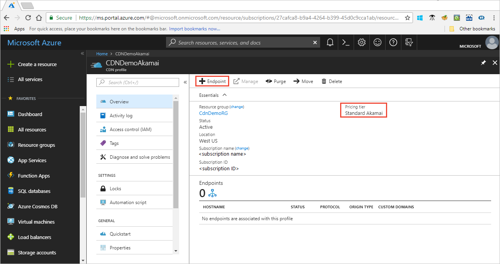
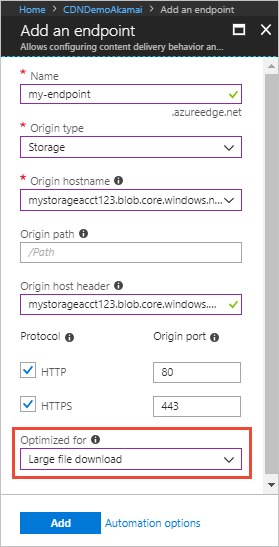

# Large file download optimization with Azure CDN

File sizes of content delivered over the internet continue to grow due to enhanced functionality, improved graphics, and rich media content. This growth gets driven by many factors: broadband penetration, larger inexpensive storage devices, widespread increase of high-definition video, and internet-connected devices (IoT). A fast and efficient delivery mechanism for large files is critical to ensure a smooth and enjoyable consumer experience.

Delivery of large files has several challenges. First, the average time to download a large file can be significant because applications might not download all data sequentially. In some cases, applications might download the last part of a file before the first part. When only a small amount of a file is requested or a user pauses a download, the download can fail. The download also might be delayed until after the content delivery network (CDN) retrieves the entire file from the origin server. 

Second, the latency between a user's machine and the file determines the speed at which they can view content. In addition, network congestion and capacity problems also affect throughput. Greater distances between servers and users create more opportunities for packet loss to occur, which reduces quality. The reduction in quality caused by limited throughput and increased packet loss might increase the wait time for a file download to finish. 

Third, many large files aren't delivered in their entirety. Users might cancel a download halfway through or watch only the first few minutes of a long MP4 video. Therefore, software and media delivery companies want to deliver only the portion of a file that's requested. Efficient distribution of the requested portions reduces the egress traffic from the origin server. Efficient distribution also reduces the memory and I/O pressure on the origin server. 

## Optimize for delivery of large files with Azure CDN from Microsoft

**Azure CDN Standard from Microsoft** endpoints deliver large files without a cap on file size. Extra features are turned on by default to make delivery of large files faster.

### Object chunking 

**Azure CDN Standard from Microsoft** uses a technique called object chunking. When a large file is requested, the CDN retrieves smaller pieces of the file from the origin. After the CDN POP server receives a full or byte-ranges file request, the CDN edge server requests the file from the origin in chunks of 8 MB. 

After the chunk arrives at the CDN edge, it's cached and immediately served to the user. The CDN then prefetches the next chunk in parallel. This prefetch ensures that the content stays one chunk ahead of the user, which reduces latency. This process continues until the entire file gets downloaded (if requested), all byte ranges are available (if requested), or the client terminates the connection. 

For more information on the byte-range request, see [RFC 7233](https://tools.ietf.org/html/rfc7233).

The CDN caches any chunks as they're received. The entire file doesn't need to be cached on the CDN cache. Subsequent requests for the file or byte ranges are served from the CDN cache. If not all the chunks are cached on the CDN, prefetch is used to request chunks from the origin. This optimization relies on the ability of the origin server to support byte-range requests. If the origin server doesn't support byte-range requests, requests to download data greater than 8-MB size fails. 

### Conditions for large file optimization
There are no limits on maximum file size.

### Chunked Transfer Encoding Support
Microsoft CDN supports transfer encoding response but only up to a maximum of 8-MB content size. For chunked transfer encoded response that greater than 8 MB, Microsoft CDN only cache and serve the first 8 MB of content.

## Optimize for delivery of large files with Azure CDN from Verizon

**Azure CDN Standard from Verizon** and **Azure CDN Premium from Verizon** endpoints deliver large files without a cap on file size. More features are turned on by default to make delivery of large files faster.

### Complete cache fill

The default complete cache fill feature enables the CDN to pull a file into the cache when an initial request is abandoned or lost. 

Complete cache fill is most useful for large assets. Typically, users don't download them from start to finish. They use progressive download. The default behavior forces the edge server to initiate a background fetch of the asset from the origin server. Afterward, the asset is in the edge server's local cache. After the full object is in the cache, the edge server fulfills byte-range requests to the CDN for the cached object.

The default behavior can be disabled through the rules engine in **Azure CDN Premium from Verizon**.

### Peer cache fill hot-filing

The default peer cache fills hot-filing feature uses a sophisticated proprietary algorithm. It uses extra edge caching servers based on bandwidth and aggregate requests metrics to fulfill client requests for large, highly popular objects. This feature prevents a situation in which large numbers of extra requests are sent to a user's origin server. 

### Conditions for large file optimization

Large file optimization features for **Azure CDN Standard from Verizon** and **Azure CDN Premium from Verizon** are turned on by default when you use the general web delivery optimization type. There are no limits on maximum file size. 

## Optimize for delivery of large files with Azure CDN Standard from Akamai

**Azure CDN Standard from Akamai** profile endpoints offer a feature that delivers large files efficiently to users across the globe at scale. The feature reduces latencies because it reduces the load on the origin servers.

The large file optimization type feature turns on network optimizations and configurations to deliver large files faster and more responsively. General web delivery with **Azure CDN Standard from Akamai** endpoints caches files only below 1.8 GB and can tunnel (not cache) files up to 150 GB. Large file optimization caches files up to 150 GB.

Large file optimization is effective when certain conditions are satisfied. Conditions include how the origin server operates and the sizes and types of the files that are requested. 

### Configure an Akamai CDN endpoint to optimize delivery of large files

You can configure your **Azure CDN Standard from Akamai** endpoint to optimize delivery for large files via the Azure portal. You can also use the REST APIs or any of the client SDKs to complete this task. The following steps show the process via the Azure portal for an **Azure CDN Standard from Akamai** profile:

1. To add a new endpoint, on an Akamai **CDN profile** page, select **Endpoint**.

    	
 
2. In the **Optimized for** drop-down list, select **Large file download**.

    

After you create the CDN endpoint, it applies the large file optimizations for all files that match certain criteria. The following section describes this process.

### Object chunking 

Large file optimization with **Azure CDN Standard from Akamai** uses a technique called object chunking. When a large file is requested, the CDN retrieves smaller pieces of the file from the origin. After the CDN POP server receives a full or byte-rangess file request, it checks whether the file type is supported for this optimization. It also checks whether the file type meets the file size requirements. If the file size is greater than 10 MB, the CDN edge server requests the file from the origin in chunks of 2 MB. 

After the chunk arrives at the CDN edge, it's cached and immediately served to the user. The CDN then prefetches the next chunk in parallel. This prefetch ensures that the content stays one chunk ahead of the user, which reduces latency. This process continues until the entire file gets downloaded (if requested), all byte ranges are available (if requested), or the client terminates the connection. 

For more information on the byte-range request, see [RFC 7233](https://tools.ietf.org/html/rfc7233).

The CDN caches any chunks as they're received. The entire file doesn't need to be cached on the CDN cache. Subsequent requests for the file or byte ranges are served from the CDN cache. If not all the chunks are cached on the CDN, prefetch is used to request chunks from the origin. This optimization relies on the ability of the origin server to support byte-range requests; if the origin server doesn't support byte-range requests, this optimization isn't effective.

### Caching
Large file optimization uses different default caching-expiration times from general web delivery. It differentiates between positive caching and negative caching based on HTTP response codes. If the origin server specifies an expiration time via a cache-control or expires header in the response, the CDN honors that value. When the origin doesn’t specify and the file matches the type and size conditions for this optimization type, the CDN uses the default values for large file optimization. Otherwise, the CDN uses defaults for general web delivery.

| Caching  | General web | Large file optimization 
--- | --- | --- 
Caching: Positive   HTTP 200, 203, 300,   301, 302, and 410 | Seven days |One day  
Caching: Negative   HTTP 204, 305, 404,   and 405 | None | 1 second 

### Deal with origin failure

The origin read-timeout length increases from two seconds for general web delivery to two minutes for the large file optimization type. This increase accounts for the larger file sizes to avoid a premature timeout connection.

When a connection times out, the CDN retries many times before it sends a "504 - Gateway Timeout" error to the client. 

### Conditions for large file optimization

The following table lists the set of criteria to be satisfied for large file optimization:

Condition | Values 
--- | --- 
Supported file types | 3g2, 3gp, asf, avi, bz2, dmg, exe, f4v, flv,   gz, hdp, iso, jxr, m4v, mkv, mov, mp4,   mpeg, mpg, mts, pkg, qt, rm, swf, tar,   tgz, wdp, webm, webp, wma, wmv, zip  
Minimum file size | 10 MB 
Maximum file size | 150 GB 
Origin server characteristics | Must support byte-range requests 

## Other considerations

Consider the following aspects for this optimization type:

- The chunking process generates more requests to the origin server. However, the overall volume of data delivered from the origin is smaller. Chunking results in better caching characteristics at the CDN.

- Memory and I/O pressure are reduced at the origin because smaller pieces of the file are delivered.

- For chunks cached at the CDN, there are no other requests to the origin until the content expires or it's evicted from the cache.

- Users can make range requests to the CDN, which are treated like any normal file. Optimization applies only if it's a valid file type and the byte range is between 10 MB and 150 GB. If the average file size requested is smaller than 10 MB, use general web delivery instead.

