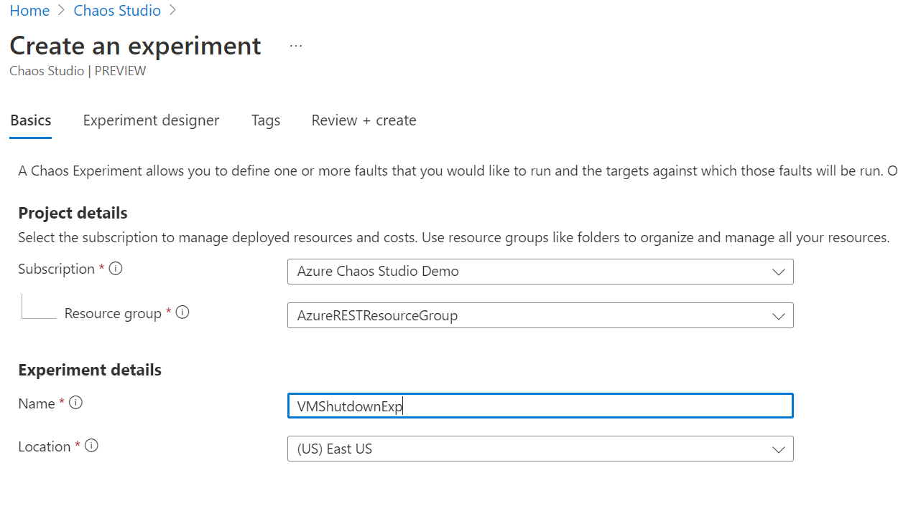
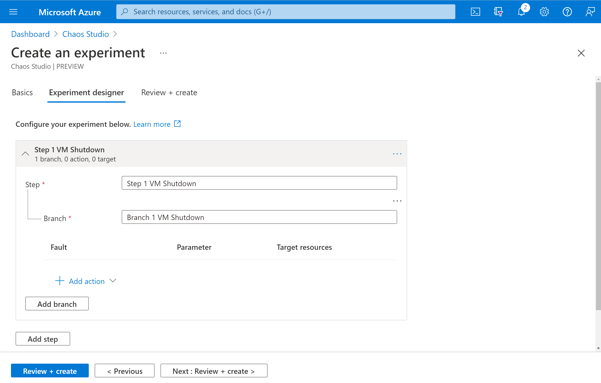
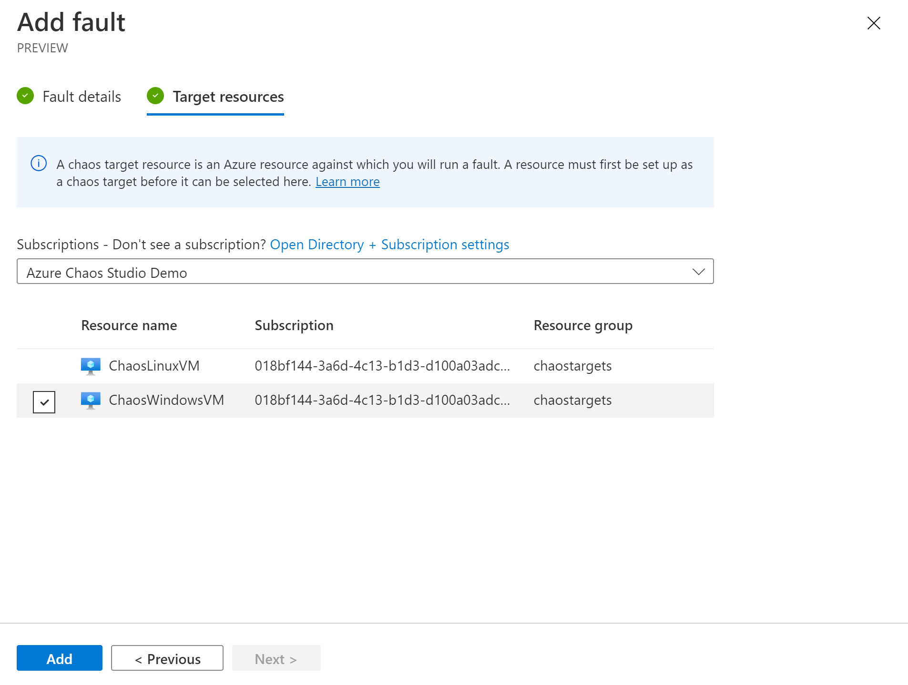
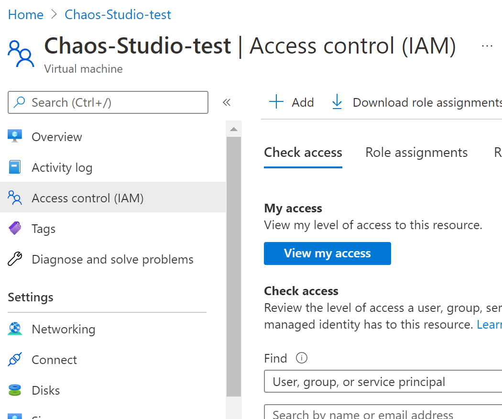

# Quickstart: Create and run a chaos experiment using Azure Chaos Studio 
Get started with Chaos Studio by using VM shutdown service-direct experiment to make your service more resilient to that failure in real-world. 

## Prerequisites
- An Azure subscription. [!INCLUDE [quickstarts-free-trial-note](../../includes/quickstarts-free-trial-note.md)] 
- A Linux virtual machine. If you do not have a virtual machine, you can [follow these steps to create one](../virtual-machines/linux/quick-create-portal.md).

## Register the Chaos Studio resource provider
If this is your first time using Chaos Studio, you must first register the Chaos Studio resource provider before onboarding resources and creating an experiment. This must be done for each subscription where you will be using Chaos Studio.

1. Open the [Azure portal](https://portal.azure.com).
2. Search for **Subscriptions** and open the subscription management page.
3. Click on the subscription where you will be using Chaos Studio.
4. In the left-hand navigation, click on **Resource providers**.
5. In the list of resource providers that appears, search for **Microsoft.Chaos**.
6. Click on the Microsoft.Chaos provider, and click the **Register** button.

## Enable Chaos Studio on the Virtual Machine you created
1. Open the [Azure portal](https://portal.azure.com).
2. Search for **Chaos Studio (preview)** in the search bar.
3. Click on **Targets** and navigate to your VM created.

4. Check the box next to your VM created and click **Enable targets** then **Enable service-direct targets** from the dropdown menu.

   

5. A notification will appear indicating that the resource(s) selected were successfully enabled.
   
   

## Create an experiment

1. Click on **Experiments**.                
   

2. Click **Add an experiment**.

   

3. Fill in the **Subscription**, **Resource Group**, and **Location** where you want to deploy the chaos experiment. Give your experiment a **Name**. Click **Next : Experiment designer >**

   

4. You are now in the Chaos Studio experiment designer. Give a friendly name to your **Step** and **Branch**, then click **Add fault**.

   

5. Select **VM Shutdown** from the dropdown, then fill in the **Duration** with the number of minutes you want the failure to last. 

   

6. Click **Next: Target resources >**.
   

7. Click **Add**.

   

8. Verify that your experiment looks correct, then click **Review + create**, then **Create**.

   

## Give experiment permission to your Virtual Machine
1. Navigate to your Virtual Machine and click on **Access control (IAM).**
   
2. Click **Add**

   

3. Click **Add role assignment**

   

4. Search for **Virtual Machine Contributor** and select the role. Click **Next**.

   
5. Click **Select members** and search for your experiment name. Select your experiment and click **Select**. 
   
 
6. Click **Review + assign** then **Review + assign.**

## Run the chaos experiment

1. Open the Azure portal:
    * If using an @microsoft.com account, [click this link](https://ms.portal.azure.com/?microsoft_azure_chaos_assettypeoptions={%22chaosStudio%22:{%22options%22:%22%22},%22chaosExperiment%22:{%22options%22:%22%22}}&microsoft_azure_chaos=true).
    * If using an external account, [click this link](https://portal.azure.com/?feature.customPortal=false&microsoft_azure_chaos_assettypeoptions={%22chaosStudio%22:{%22options%22:%22%22},%22chaosExperiment%22:{%22options%22:%22%22}}).
2. Check the box next to the experiments name and click **Start Experiment**.
    

3. Click **Yes** to confirm you want to start the chaos experiment.

    
4. (Optional) Click on the experiment name to see a detailed view of the execution status of the experiment.

## Clean up resources

1. Check the box next to the experiment name and click **Delete**.

   

2. Click **Yes** to confirm you want to delete the experiment.

3. Search the VM that you created on the Azure portal search bar.

   

4. Click on **Delete** to avoid being charged for the resource.

   

## Next steps
Now that you have run a VM shutdown service-direct experiment, you are ready to:
- [Create an experiment that uses agent-based faults](chaos-studio-tutorial-agent-based-portal.md)
