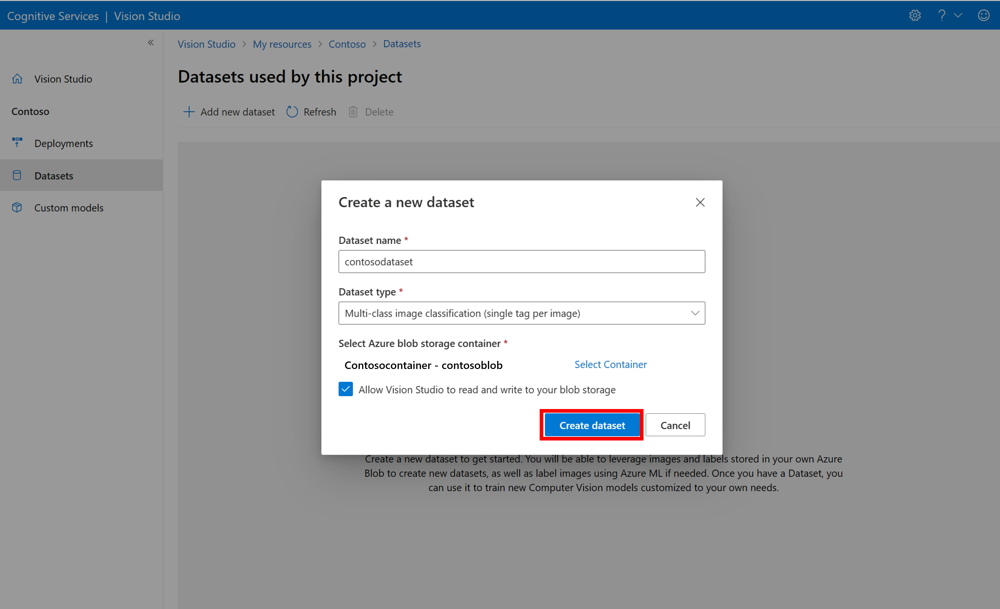
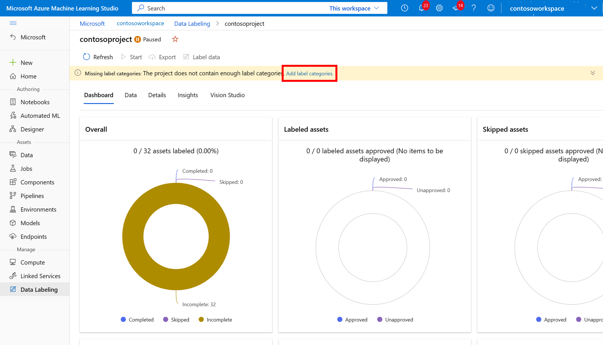
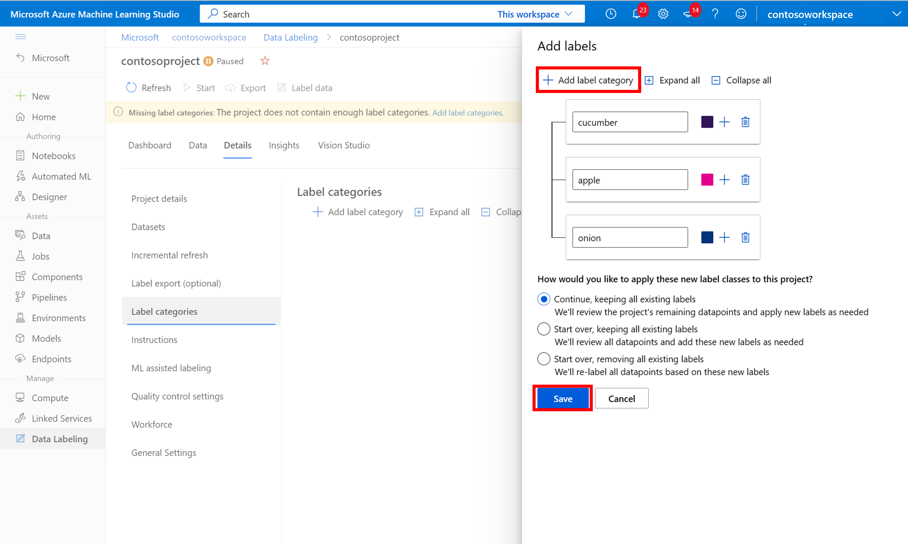
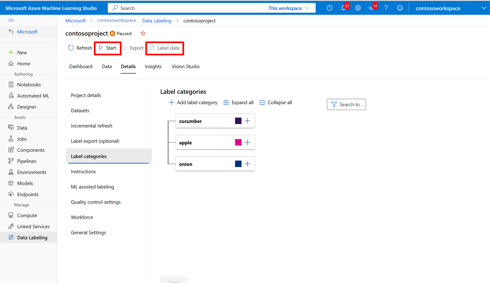
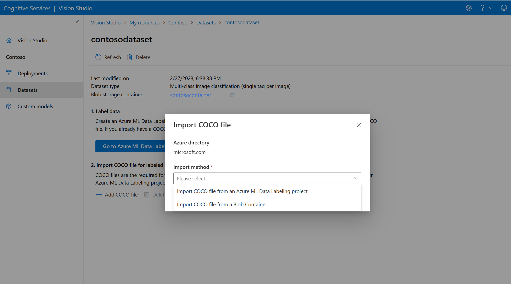
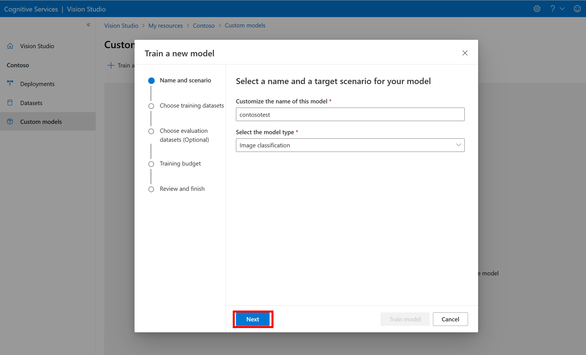
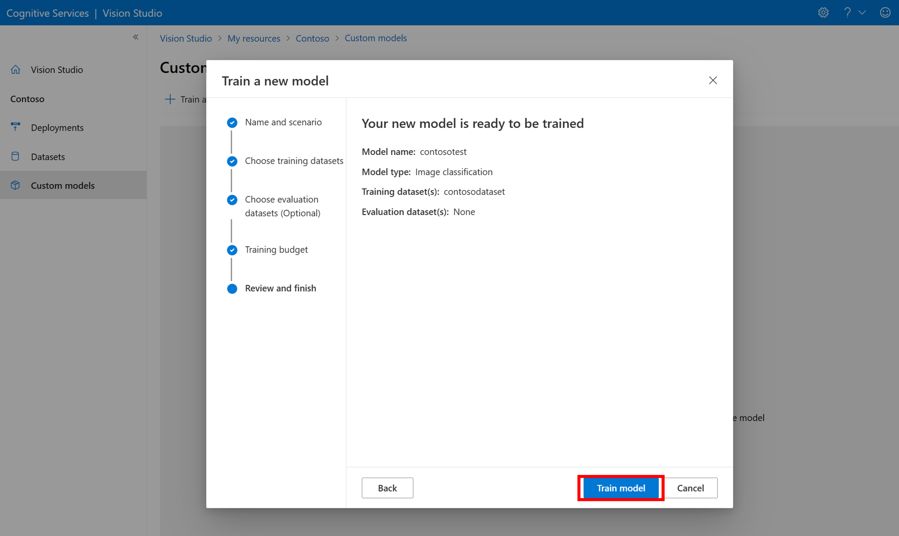
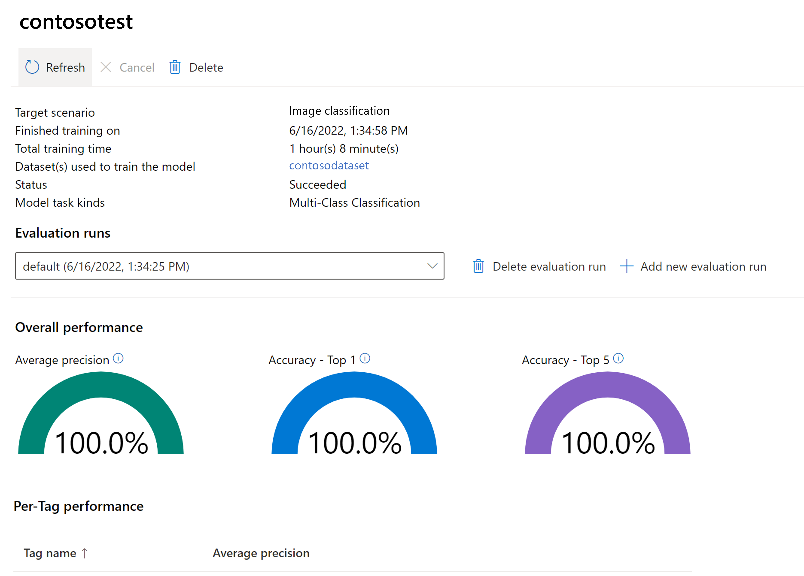
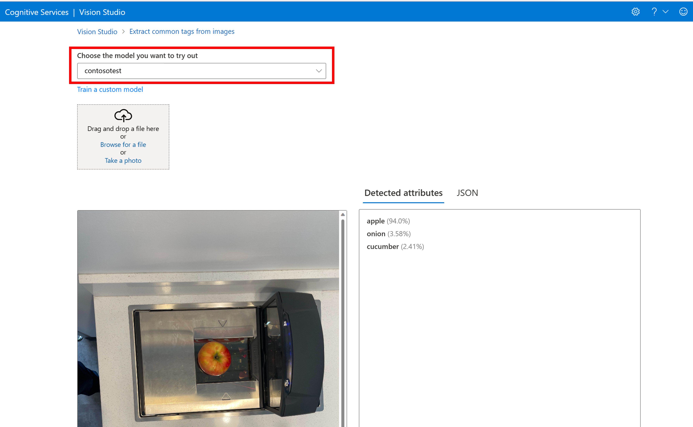

# Create a custom Image Analysis model (preview)

Image Analysis 4.0 allows you to train a custom model using your own training images. By manually labeling your images, you can train a model to apply custom tags to the images (image classification) or detect custom objects (object detection). Image Analysis 4.0 models are especially effective at few-shot learning, so you can get accurate models with less training data.

This guide shows you how to create and train a custom image classification model. The few differences between this and object detection models are noted.

## Prerequisites

* Azure subscription - [Create one for free](https://azure.microsoft.com/free/cognitive-services)
* Once you have your Azure subscription, <a href="https://portal.azure.com/#create/Microsoft.CognitiveServicesComputerVision"  title="Create a Computer Vision resource"  target="_blank">create a Computer Vision resource </a> in the Azure portal to get your key and endpoint. If you're following this guide using Vision Studio, you must create your resource in the East US region. After it deploys, select **Go to resource**. Copy the key and endpoint to a temporary location to use later on.
* An Azure Storage resource - [Create one](../../../storage/common/storage-account-create.md?tabs=azure-portal)
* A set of images with which to train your classification model. You can use the set of [sample images on GitHub](https://github.com/Azure-Samples/cognitive-services-sample-data-files/tree/master/CustomVision/ImageClassification/Images). Or, you can use your own images. You only need about 3-5 images per class.

> [!NOTE]
> We do not recommend you use custom models for business critical environments due to potential high latency. When customers train custom models in Vision Studio, those custom models belong to the Computer Vision resource that they were trained under and the customer is able to make calls to those models using the **Analyze Image** API. When they make these calls, the custom model is loaded in memory and the prediction infrastructure is initialized. While this happens, customers might experience longer than expected latency to receive prediction results.

#### [Vision Studio](#tab/studio)

## Create a new custom model

Begin by going to [Vision Studio](https://portal.vision.cognitive.azure.com/) and selecting the **Image analysis** tab. Then select either the **Extract common tags from images** tile for image classification or the **Extract common objects in images** tile for object detection. This guide will demonstrate a custom image classification model. 

> [!IMPORTANT]
> To train a custom model in Vision Studio, your Azure subscription needs to be approved for access. Please request access using [this form](https://aka.ms/visionaipublicpreview).

On the next screen, the **Choose the model you want to try out** drop-down lets you select the Pretrained Vision model (to do ordinary Image Analysis) or a custom trained model. Since you don't have a custom model yet, select **Train a custom model**.


## Prepare training images

You need to upload your training images to an Azure Blob Storage container. Go to your storage resource in the Azure portal and navigate to the **Storage browser** tab. Here you can create a blob container and upload your images. Put them all at the root of the container.

## Add a dataset

To train a custom model, you need to associate it with a **Dataset** where you provide images and their label information as training data. In Vision Studio, select the **Datasets** tab to view your datasets.

To create a new dataset, select **add new dataset**. Enter a name and select a dataset type: If you'd like to do image classification, select `Multi-class image classification`. If you'd like to do object detection, select `Object detection`.




Then, select the container from the Azure Blob Storage account where you stored the training images. Check the box to allow Vision Studio to read and write to the blob storage container. This is a necessary step to import labeled data. Create the dataset.

## Create an Azure Machine Learning labeling project

You need a COCO file to convey the labeling information. An easy way to generate a COCO file is to create an Azure Machine Learning project, which comes with a data-labeling workflow.

In the dataset details page, select **Add a new Data Labeling project**. Name it and select **Create a new workspace**. That will open a new Azure portal tab where you can create the Azure Machine Learning project.


Once the Azure Machine Learning project is created, return to the Vision Studio tab and select it under **Workspace**. The Azure Machine Learning portal will then open in a new browser tab.

## Azure Machine Learning: Create labels

To start labeling, follow the **Please add label classes** prompt to add label classes.





Once you've added all the class labels, save them, select **start** on the project, and then select **Label data** at the top.




### Azure Machine Learning: Manually label training data

Choose **Start labeling** and follow the prompts to label all of your images. When you're finished, return to the Vision Studio tab in your browser.

Now select **Add COCO file**, then select **Import COCO file from an Azure ML Data Labeling project**.  This will import the labeled data from Azure Machine Learning.

The COCO file you just created is now stored in the Azure Storage container that you linked to this project. You can now import it into the model customization workflow. Select it from the drop-down list. Once the COCO file is imported into the dataset, the dataset can be used for training a model.

> [!NOTE]
> ## Import COCO files from elsewhere
>
> If you have a ready-made COCO file you want to import, go to the **Datasets** tab and select `Add COCO files to this dataset`. You can choose to add a specific COCO file from a Blob storage account or import from the Azure Machine Learning labeling project. 
>
> Currently, Microsoft is addressing an issue which causes COCO file import to fail with large datasets when initiated in Vision Studio. To train using a large dataset, it's recommended to use the REST API instead.
>
> 
>
> [!INCLUDE [coco-files](../includes/coco-files.md)]

## Train the custom model

To start training a model with your COCO file, go to the **Custom models** tab and select **Add a new model**. Enter a name for the model and select `Image classification` or `Object detection` as the model type.



Select your dataset, which is now associated with the COCO file containing the labeling information.

Then select a time budget and train the model. For small examples, you can use a `1 hour` budget.



It may take some time for the training to complete. Image Analysis 4.0 models can be very accurate with only a small set of training data, but they take longer to train than previous models.

## Evaluate the trained model

After training has completed, you can view the model's performance evaluation. The following metrics are used:

- Image classification: Average Precision, Accuracy Top 1, Accuracy Top 5
- Object detection: Mean Average Precision @ 30, Mean Average Precision @ 50, Mean Average Precision @ 75

If an evaluation set is not provided when training the model, the reported performance is estimated based on part of the training set. We strongly recommend you use an evaluation dataset (using the same process as above) to have a reliable estimation of your model performance.



## Test custom model in Vision Studio

Once you've built a custom model, you can go back to the **Extract common tags from images** tile in Vision Studio and test it by selecting it in the drop-down menu and then uploading new images.



The prediction results will appear in the right column.

#### [REST API](#tab/rest)

## Prepare training data

The first thing you need to do is create a COCO file from your training data. You can create a COCO file by converting an old Custom Vision project using the [migration script](migrate-from-custom-vision.md). Or, you can create a COCO file from scratch using some other labeling tool. See the following specification:

[!INCLUDE [coco-files](../includes/coco-files.md)]

## Upload to storage

Upload your COCO file to a blob storage container, ideally the same blob container that holds the training images themselves.

## Create your training dataset

The `datasets/<dataset-name>` API lets you create a new dataset object that references the training data. Make the following changes to the cURL command below:

1. Replace `<endpoint>` with your Computer Vision endpoint.
1. Replace `<dataset-name>` with a name for your dataset.
1. Replace `<subscription-key>` with your Computer Vision key.
1. In the request body, set `"annotationKind"` to either `"MultiClassClassification"` or `"ObjectDetection"`, depending on your project.
1. In the request body, set the `"annotationFileUris"` array to an array of string(s) that show the URI location(s) of your COCO file(s) in blob storage.

```bash
curl.exe -v -X PUT "https://<endpoint>/computervision/datasets/<dataset-name>?api-version=2023-02-01-preview" -H "Content-Type: application/json" -H "Ocp-Apim-Subscription-Key: <subscription-key>" --data-ascii "
{
'annotationKind':'MultiClassClassification',
'annotationFileUris':['<URI>']
}"
```

## Create and train a model

The `models/<model-name>` API lets you create a new custom model and associate it with an existing dataset. It also starts the training process. Make the following changes to the cURL command below:

1. Replace `<endpoint>` with your Computer Vision endpoint.
1. Replace `<model-name>` with a name for your model.
1. Replace `<subscription-key>` with your Computer Vision key.
1. In the request body, set `"trainingDatasetName"` to the name of the dataset from the previous step.
1. In the request body, set `"modelKind"` to either `"Generic-Classifier"` or `"Generic-Detector"`, depending on your project.

```bash
curl.exe -v -X PUT "https://<endpoint>/computervision/models/<model-name>?api-version=2023-02-01-preview" -H "Content-Type: application/json" -H "Ocp-Apim-Subscription-Key: <subscription-key>" --data-ascii "
{
'trainingParameters': {
    'trainingDatasetName':'<dataset-name>',
    'timeBudgetInHours':1,
    'modelKind':'Generic-Classifier',
    }
}"
```

## Evaluate the model's performance on a dataset

The `models/<model-name>/evaluations/<eval-name>` API evaluates the performance of an existing model. Make the following changes to the cURL command below:

1. Replace `<endpoint>` with your Computer Vision endpoint.
1. Replace `<model-name>` with the name of your model.
1. Replace `<eval-name>` with a name that can be used to uniquely identify the evaluation.
1. Replace `<subscription-key>` with your Computer Vision key.
1. In the request body, set `"testDatasetName"` to the name of the dataset you want to use for evaluation. If you don't have a dedicated dataset, you can use the same dataset you used for training.

```bash
curl.exe -v -X PUT "https://<endpoint>/computervision/models/<model-name>/evaluations/<eval-name>?api-version=2023-02-01-preview" -H "Content-Type: application/json" -H "Ocp-Apim-Subscription-Key: <subscription-key>" --data-ascii "
{
'evaluationParameters':{
    'testDatasetName':'<dataset-name>'
    },
}"
```

The API call returns a **ModelPerformance** JSON object, which lists the model's scores in several categories. The following metrics are used:

- Image classification: Average Precision, Accuracy Top 1, Accuracy Top 5
- Object detection: Mean Average Precision @ 30, Mean Average Precision @ 50, Mean Average Precision @ 75

## Test the custom model on an image

The `imageanalysis:analyze` API does ordinary Image Analysis operations. By specifying some parameters, you can use this API to query your own custom model instead of the prebuilt Image Analysis models. Make the following changes to the cURL command below:

1. Replace `<endpoint>` with your Computer Vision endpoint.
1. Replace `<model-name>` with the name of your model.
1. Replace `<subscription-key>` with your Computer Vision key.
1. In the request body, set `"url"` to the URL of a remote image you want to test your model on.

```bash
curl.exe -v -X POST "https://<endpoint>/computervision/imageanalysis:analyze?model-version=<model-name>&api-version=2023-02-01-preview" -H "Content-Type: application/json" -H "Ocp-Apim-Subscription-Key: <subscription-key>" --data-ascii "
{'url':'https://upload.wikimedia.org/wikipedia/commons/thumb/a/af/Atomist_quote_from_Democritus.png/338px-Atomist_quote_from_Democritus.png'
}"
```

The API call returns an **ImageAnalysisResult** JSON object, which contains all the detected tags for an image classifier, or objects for an object detector, with their confidence scores.

```json
{
  "kind": "imageAnalysisResult",
  "metadata": {
    "height": 900,
    "width": 1260
  },
  "customModelResult": {
    "classifications": [
      {
        "confidence": 0.97970027,
        "label": "hemlock"
      },
      {
        "confidence": 0.020299695,
        "label": "japanese-cherry"
      }
    ],
    "objects": [],
    "imageMetadata": {
      "width": 1260,
      "height": 900
    }
  }
}
```
---


## Next steps

In this guide, you created and trained a custom image classification model using Image Analysis. Next, learn more about the Analyze Image 4.0 API, so you can call your custom model from an application using REST or library SDKs.

* [Call the Analyze Image API](./call-analyze-image-40.md#use-a-custom-model)
* See the [Model customization concepts](../concept-model-customization.md) guide for a broad overview of this feature and a list of frequently asked questions.