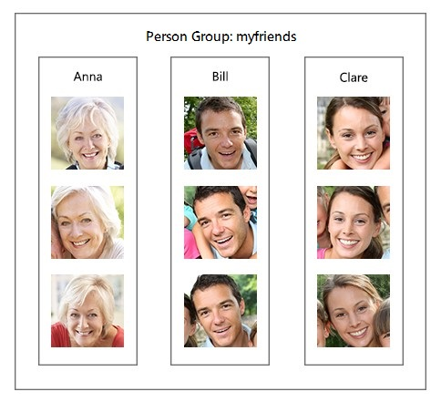

# What is the Azure Face service?

> [!WARNING]
> On June 11, 2020, Microsoft announced that it will not sell facial recognition technology to police departments in the United States until strong regulation, grounded in human rights, has been enacted. As such, customers may not use facial recognition features or functionality included in Azure Services, such as Face or Video Indexer, if a customer is, or is allowing use of such services by or for, a police department in the United States. When you create a new Face resource, you must acknowledge and agree in the Azure Portal that you will not use the service by or for a police department in the United States and that you have reviewed the Responsible AI documentation and will use this service in accordance with it.

[!INCLUDE [Gate notice](./includes/identity-gate-notice.md)]

The Azure Face service provides AI algorithms that detect, recognize, and analyze human faces in images. Facial recognition software is important in many different scenarios, such as identity verification, touchless access control, and face blurring for privacy.

You can use the Face service through a client library SDK or by calling the REST API directly. Follow the quickstart to get started.

> [!div class="nextstepaction"]
> [Quickstart](quickstarts-sdk/identity-client-library.md)

Or, you can try out the capabilities of Face service quickly and easily in your browser using Vision Studio.

> [!div class="nextstepaction"]
> [Try Vision Studio](https://vision.cognitive.azure.com/)

This documentation contains the following types of articles:
* The [quickstarts](./quickstarts-sdk/identity-client-library.md) are step-by-step instructions that let you make calls to the service and get results in a short period of time. 
* The [how-to guides](./how-to/identity-detect-faces.md) contain instructions for using the service in more specific or customized ways.
* The [conceptual articles](./concept-face-detection.md) provide in-depth explanations of the service's functionality and features.
* The [tutorials](./enrollment-overview.md) are longer guides that show you how to use this service as a component in broader business solutions.

For a more structured approach, follow a Microsoft Learn module for Face.
* [Detect and analyze faces with the Face service](/learn/modules/detect-analyze-faces/)

## Example use cases

**Identity verification**: Verify someone's identity against a government-issued ID card like a passport or driver's license or other enrollment image. You can use this verification to grant access to digital or physical services or to recover an account. Specific access scenarios include opening a new account, verifying a worker, or administering an online assessment. Identity verification can be done once when a person is onboarded, and repeated when they access a digital or physical service.

**Touchless access control**: Compared to today’s methods like cards or tickets, opt-in face identification enables an enhanced access control experience while reducing the hygiene and security risks from card sharing, loss, or theft. Facial recognition assists the check-in process with a human in the loop for check-ins in airports, stadiums, theme parks, buildings, reception kiosks at offices, hospitals, gyms, clubs, or schools.

**Face redaction**: Redact or blur detected faces of people recorded in a video to protect their privacy.

## Face detection and analysis

Face detection is required as a first step in all the other scenarios. The Detect API detects human faces in an image and returns the rectangle coordinates of their locations. It also returns a unique ID that represents the stored face data. This is used in later operations to identify or verify faces.

Optionally, face detection can extract a set of face-related attributes, such as head pose, age, emotion, facial hair, and glasses. These attributes are general predictions, not actual classifications. Some attributes are useful to ensure that your application is getting high-quality face data when users add themselves to a Face service. For example, your application could advise users to take off their sunglasses if they're wearing sunglasses.

[!INCLUDE [Sensitive attributes notice](./includes/identity-sensitive-attributes.md)]

For more information on face detection and analysis, see the [Face detection](concept-face-detection.md) concepts article. Also see the [Detect API](https://westus.dev.cognitive.microsoft.com/docs/services/563879b61984550e40cbbe8d/operations/563879b61984550f30395236) reference documentation.

## Identity verification

Modern enterprises and apps can use the Face identification and Face verification operations to verify that a user is who they claim to be.

### Identification

Face identification can address "one-to-many" matching of one face in an image to a set of faces in a secure repository. Match candidates are returned based on how closely their face data matches the query face. This scenario is used in granting building or airport access to a certain group of people or verifying the user of a device.

The following image shows an example of a database named `"myfriends"`. Each group can contain up to 1 million different person objects. Each person object can have up to 248 faces registered.

After you create and train a group, you can do identification against the group with a new detected face. If the face is identified as a person in the group, the person object is returned.

Try out the capabilities of face identification quickly and easily using Vision Studio.
> [!div class="nextstepaction"]
> [Try Vision Studio](https://vision.cognitive.azure.com/)

### Verification

The verification operation answers the question, "Do these two faces belong to the same person?". 

Verification is also a "one-to-one" matching of a face in an image to a single face from a secure repository or photo to verify that they're the same individual. Verification can be used for Identity Verification, such as a banking app that enables users to open a credit account remotely by taking a new picture of themselves and sending it with a picture of their photo ID.

For more information about identity verification, see the [Facial recognition](concept-face-recognition.md) concepts guide or the [Identify](https://westus.dev.cognitive.microsoft.com/docs/services/563879b61984550e40cbbe8d/operations/563879b61984550f30395239) and [Verify](https://westus.dev.cognitive.microsoft.com/docs/services/563879b61984550e40cbbe8d/operations/563879b61984550f3039523a) API reference documentation.

Try out the capabilities of face verification quickly and easily using Vision Studio.
> [!div class="nextstepaction"]
> [Try Vision Studio](https://vision.cognitive.azure.com/)

## Find similar faces

The Find Similar operation does face matching between a target face and a set of candidate faces, finding a smaller set of faces that look similar to the target face. This is useful for doing a face search by image. 

The service supports two working modes, **matchPerson** and **matchFace**. The **matchPerson** mode returns similar faces after filtering for the same person by using the [Verify API](https://westus.dev.cognitive.microsoft.com/docs/services/563879b61984550e40cbbe8d/operations/563879b61984550f3039523a). The **matchFace** mode ignores the same-person filter. It returns a list of similar candidate faces that may or may not belong to the same person.

The following example shows the target face:

And these images are the candidate faces:

To find four similar faces, the **matchPerson** mode returns A and B, which show the same person as the target face. The **matchFace** mode returns A, B, C, and D, which is exactly four candidates, even if some aren't the same person as the target or have low similarity. For more information, see the [Facial recognition](concept-face-recognition.md) concepts guide or the [Find Similar API](https://westus.dev.cognitive.microsoft.com/docs/services/563879b61984550e40cbbe8d/operations/563879b61984550f30395237) reference documentation.

## Group faces

The Group operation divides a set of unknown faces into several smaller groups based on similarity. Each group is a disjoint proper subset of the original set of faces. It also returns a single "messyGroup" array that contains the face IDs for which no similarities were found.

All of the faces in a returned group are likely to belong to the same person, but there can be several different groups for a single person. Those groups are differentiated by another factor, such as expression, for example. For more information, see the [Facial recognition](concept-face-recognition.md) concepts guide or the [Group API](https://westus.dev.cognitive.microsoft.com/docs/services/563879b61984550e40cbbe8d/operations/563879b61984550f30395238) reference documentation.

## Data privacy and security

As with all of the Cognitive Services resources, developers who use the Face service must be aware of Microsoft's policies on customer data. For more information, see the [Cognitive Services page](https://www.microsoft.com/trustcenter/cloudservices/cognitiveservices) on the Microsoft Trust Center.

## Next steps

Follow a quickstart to code the basic components of a face recognition app in the language of your choice.

- [Client library quickstart](quickstarts-sdk/identity-client-library.md).
