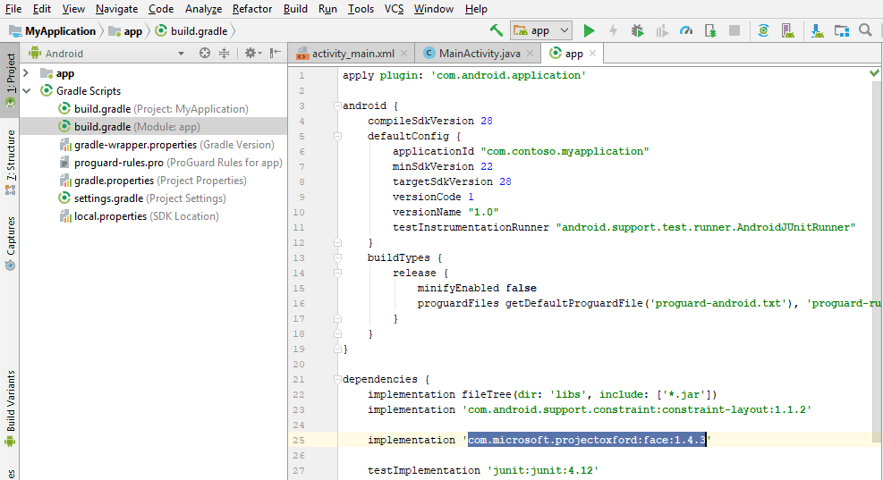

# Tutorial: Create an Android app to detect and frame faces in an image

In this tutorial, you will create a simple Android application that uses the Azure Face API, through the Java SDK, to detect human faces in an image. The application displays a selected image and draws a frame around each detected face.

This tutorial shows you how to:

> [!div class="checklist"]
> - Create an Android application
> - Install the Face API client library
> - Use the client library to detect faces in an image
> - Draw a frame around each detected face


The complete sample code is available in the [Cognitive Services Face Android](https://github.com/Azure-Samples/cognitive-services-face-android-sample) repository on GitHub.

If you don't have an Azure subscription, create a [free account](https://azure.microsoft.com/free/) before you begin. 

## Prerequisites

- A Face API subscription key. You can get a free trial subscription key from [Try Cognitive Services](https://azure.microsoft.com/try/cognitive-services/?api=face-api). Or, follow the instructions in [Create a Cognitive Services account](https://docs.microsoft.com/azure/cognitive-services/cognitive-services-apis-create-account) to subscribe to the Face API service and get your key.
- [Android Studio](https://developer.android.com/studio/) with API level 22 or later (required by the Face client library).

## Create the Android Studio project

Follow these steps to create a new Android application project.

1. In Android Studio, select **Start a new Android Studio project**.
1. On the **Create Android Project** screen, modify the default fields, if necessary, then click **Next**.
1. On the **Target Android Devices** screen, use the dropdown selector to choose **API 22** or later, then click **Next**.
1. Select **Empty Activity**, then click **Next**.
1. Uncheck **Backwards Compatibility**, then click **Finish**.

## Add the initial code

### Create the UI

Open *activity_main.xml*. In the Layout Editor, select the **Text** tab, then replace the contents with the following code.

[!code-xml[](~/cognitive-services-face-android-detect/FaceTutorial/app/src/main/res/layout/activity_main.xml?range=1-18)]

### Create the main class

Open *MainActivity.java* and replace the existing `import` statements with the following code.

[!code-java[](~/cognitive-services-face-android-detect/FaceTutorial/app/src/main/java/com/contoso/facetutorial/MainActivity.java?range=3-11)]

Then, replace the contents of the **MainActivity** class with the following code. This creates an event handler on the **Button** that starts a new activity to allow the user to select a picture. It displays the picture in the **ImageView**.

[!code-java[](~/cognitive-services-face-android-detect/FaceTutorial/app/src/main/java/com/contoso/facetutorial/MainActivity.java?range=29-68)]

### Try the app

Comment out the call to **detectAndFrame** in the **onActivityResult** method. Then press **Run** on the menu to test your app. When the app opens, either in an emulator or a connected device, click the **Browse** on the bottom. The device's file selection dialog should appear. Choose an image and verify that it displays in the window. Then, close the app and advance to the next step.


## Add the Face SDK

### Add the Gradle dependency

In the **Project** pane, use the dropdown selector to select **Android**. Expand **Gradle Scripts**, then open *build.gradle (Module: app)*. Add a dependency for the Face client library, `com.microsoft.projectoxford:face:1.4.3`, as shown in the screenshot below, then click **Sync Now**.



### Add the Face-related project code

Go back to **MainActivity.java** and add the following `import` statements:

[!code-java[](~/cognitive-services-face-android-detect/FaceTutorial/app/src/main/java/com/contoso/facetutorial/MainActivity.java?range=13-14)]

Then, insert the following code in the **MainActivity** class, above the **onCreate** method:

[!code-java[](~/cognitive-services-face-android-detect/FaceTutorial/app/src/main/java/com/contoso/facetutorial/MainActivity.java?range=17-27)]

You will need to replace `<Subscription Key>` with your subscription key. Also, replace `<API endpoint>` with the your Face API endpoint, using the appropriate region identifier for your key. Free trial subscription keys are generated in the **westus** region. An example API endpoint value would be:

```java
apiEndpoint = "https://westus.api.cognitive.microsoft.com/face/v1.0";
```

In the **Project** pane, expand **app**, then **manifests**, and open *AndroidManifest.xml*. Insert the following element as a direct child of the `manifest` element:

[!code-xml[](~/cognitive-services-face-android-detect/FaceTutorial/app/src/main/AndroidManifest.xml?range=5)]

## Upload image and detect faces

Your app will detect faces by calling the **FaceServiceClient.detect** method, which wraps the [Detect](https://westus.dev.cognitive.microsoft.com/docs/services/563879b61984550e40cbbe8d/operations/563879b61984550f30395236) REST API and returns a list of **Face** instances.

Each returned **Face** includes a rectangle to indicate its location, combined with a series of optional face attributes. In this example, only the face rectangles are requested.

Insert the following two methods into the **MainActivity** class. Note that when face detection completes, the app calls the **drawFaceRectanglesOnBitmap** method to modify the **ImageView**. You will define this method next.

[!code-java[](~/cognitive-services-face-android-detect/FaceTutorial/app/src/main/java/com/contoso/facetutorial/MainActivity.java?range=70-150)]

## Draw face rectangles

Insert the following helper method into the **MainActivity** class. This method draws a rectangle around each detected face, using the rectangle coordinates of each **Face** instance.

[!code-java[](~/cognitive-services-face-android-detect/FaceTutorial/app/src/main/java/com/contoso/facetutorial/MainActivity.java?range=152-173)]

Finally, uncomment the call to the **detectAndFrame** method in **onActivityResult**.

## Run the app

Run the application and browse for an image with a face. Wait a few seconds to allow the Face service to respond. You should see a red rectangle on each of the faces in the image.


## Next steps

In this tutorial, you learned the basic process for using the Face API Java SDK and created an application to detect and frame faces in an image. Next, learn more about the details of face detection.

> [!div class="nextstepaction"]
> [How to Detect Faces in an Image](../Face-API-How-to-Topics/HowtoDetectFacesinImage.md)