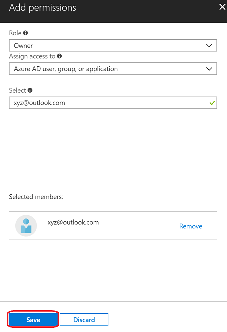

# Collaborate on your knowledge base

QnA Maker allows multiple people to collaborate on a knowledge base. This feature is provided with the Azure [Role-Based Access Control](https://docs.microsoft.com/azure/active-directory/role-based-access-control-configure). 

Perform the following steps to share your QnA Maker service with someone:

1. Log in to the Azure portal, and go to your QnA Maker resource.

    

2. Go to the **Access Control (IAM)** tab.

    

3. Select **Add**.

    

4. Select the **Owner** or the **Contributor** role.

    

5. Enter the email you want to share with, and press save.

    

Now when the person you shared your QnA Maker service with, logs into the [QnA Maker portal](https://qnamaker.ai) they can see all the knowledge bases in that service.

Remember, you cannot share a particular knowledge base in a QnA Maker service. If you want more granular access control, consider distributing your knowledge bases across different QnA Maker services.

## Next steps

> [!div class="nextstepaction"]
> [Test a knowledge base](./test-knowledge-base.md)
