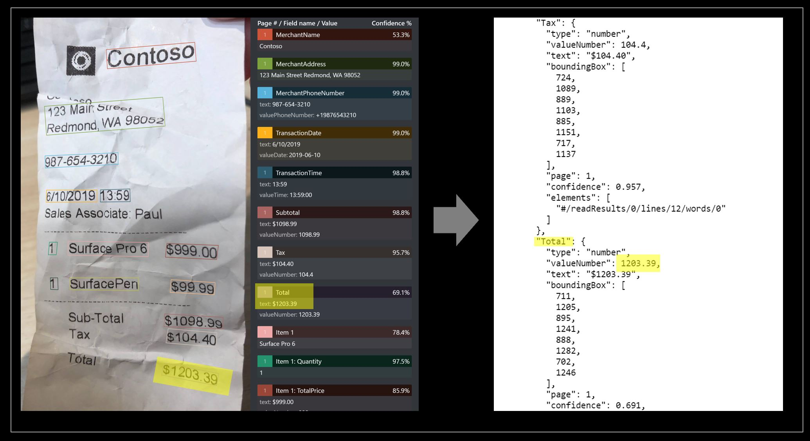
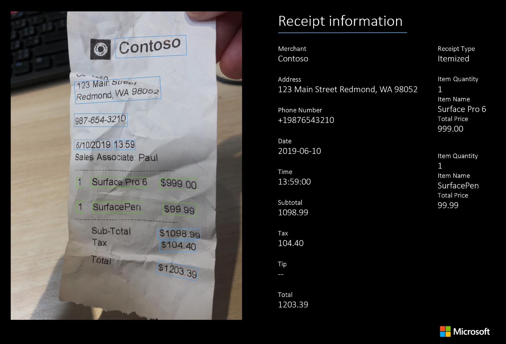

# Form Recognizer prebuilt receipt model

Azure Form Recognizer can analyze and extract information from sales receipts using its prebuilt receipt model. It combines our powerful [Optical Character Recognition (OCR)](../computer-vision/concept-recognizing-text.md) capabilities with receipt understanding deep learning models to extract key information from receipts in English. The Receipt API extracts key information from sales receipts in English, such as merchant name, transaction date, transaction total, line items, and more. 

## Understanding Receipts 

Many businesses and individuals still rely on manually extracting data from their sales receipts, whether for business expense reports, reimbursements, auditing, tax purposes, budgeting, marketing or other purposes. Often in these scenarios, images of the physical receipt are required for validation purposes.  

Automatically extracting data from these Receipts can be complicated. Receipts may be crumpled and hard to read, printed or handwritten parts and smartphone images of receipts may be low quality. Also, receipt templates and fields can vary greatly by market, region, and merchant. These challenges in both data extraction and field detection make receipt processing a unique problem.  

Using Optical Character Recognition (OCR) and our prebuilt receipt model, the Receipt API enables these receipt processing scenarios and extract data from the receipts e.g merchant name, tip, total, line items and more. With this API there is no need to train a model, just send the receipt image to the Analyze Receipt API and the data is extracted.




## What does the Receipt service do? 

The prebuilt Receipt service extracts the contents of sales receipts&mdash;the type of receipt you would commonly get at a restaurant, retailer, or grocery store.

### Fields extracted

|Name| Type | Description | Text | Value (standardized output) |
|:-----|:----|:----|:----| :----|
| ReceiptType | string | Type of sales receipt | Itemized |  |
| MerchantName | string | Name of the merchant issuing the receipt | Contoso |  |
| MerchantPhoneNumber | phoneNumber | Listed phone number of merchant | 987-654-3210 | +19876543210 |
| MerchantAddress | string | Listed address of merchant | 123 Main St Redmond WA 98052 |  |
| TransactionDate | date | Date the receipt was issued | June 06, 2019 | 2019-06-26  |
| TransactionTime | time | Time the receipt was issued | 4:49 PM | 16:49:00  |
| Total | number | Full transaction total of receipt | $14.34 | 14.34 |
| Subtotal | number | Subtotal of receipt, often before taxes are applied | $12.34 | 12.34 |
| Tax | number | Tax on receipt, often sales tax or equivalent | $2.00 | 2.00 |
| Tip | number | Tip included by buyer | $1.00 | 1.00 |
| Items | array of objects | Extracted line items, with name, quantity, unit price, and total price extracted | |
| Name | string | Item name | Surface Pro 6 | |
| Quantity | number | Quantity of each item | 1 | |
| Price | number | Individual price of each item unit | $999.00 | 999.00 |
| Total Price | number | Total price of line item | $999.00 | 999.00 |

### Additional features

The Receipt API also returns the following information:

* Field confidence level (each field returns an associated confidence value)
* OCR raw text (OCR-extracted text output for the entire receipt)
* Bounding box for each value, line and word

## Try it out

To try out the Form Recognizer receipt service, go to the online Sample UI Tool:

> [!div class="nextstepaction"]
> [Try Prebuilt Models](https://fott-preview.azurewebsites.net/)

## Input requirements

[!INCLUDE [input reqs](./includes/input-requirements-receipts.md)]

## Supported locales 

* **Pre-built Receipt v2.0** (GA) supports sales receipts in the EN-US locale
* **Pre-built Receipt v2.1-preview.2** (Public Preview) adds additional support for the following EN receipt locales: 
  * EN-AU 
  * EN-CA 
  * EN-GB 
  * EN-IN 

  > [!NOTE]
  > Language input 
  >
  > Prebuilt Receipt v2.1-preview.2 has an optional request parameter to specify a receipt locale from additional English markets. For sales receipts in English from Australia (EN-AU), Canada (EN-CA), Great Britain (EN-GB), and India (EN-IN), you can specify the locale to get improved results. If no locale is specified in v2.1-preview.2, the model will default to the EN-US model.


## The Analyze Receipt operation

The [Analyze Receipt](https://westcentralus.dev.cognitive.microsoft.com/docs/services/form-recognizer-api-v2-1-preview-2/operations/AnalyzeReceiptAsync) takes an image or PDF of a receipt as the input and extracts the values of interest and text. The call returns a response header field called `Operation-Location`. The `Operation-Location` value is a URL that contains the Result ID to be used in the next step.

|Response header| Result URL |
|:-----|:----|
|Operation-Location | `https://cognitiveservice/formrecognizer/v2.0/prebuilt/receipt/analyzeResults/56a36454-fc4d-4354-aa07-880cfbf0064f` |

## The Get Analyze Receipt Result operation

The second step is to call the [Get Analyze Receipt Result](https://westcentralus.dev.cognitive.microsoft.com/docs/services/form-recognizer-api-v2-1-preview-2/operations/GetAnalyzeReceiptResult) operation. This operation takes as input the Result ID that was created by the Analyze Receipt operation. It returns a JSON response that contains a **status** field with the following possible values. You call this operation iteratively until it returns with the **succeeded** value. Use an interval of 3 to 5 seconds to avoid exceeding the requests per second (RPS) rate.

|Field| Type | Possible values |
|:-----|:----:|:----|
|status | string | notStarted: The analysis operation has not started. |
| |  | running: The analysis operation is in progress. |
| |  | failed: The analysis operation has failed. |
| |  | succeeded: The analysis operation has succeeded. |

When the **status** field has the **succeeded** value, the JSON response will include the receipt understanding and text recognition results. The receipt understanding result is organized as a dictionary of named field values, where each value contains the extracted text, normalized value, bounding box, confidence and corresponding word elements. The text recognition result is organized as a hierarchy of lines and words, with text, bounding box and confidence information.



### Sample JSON output

See the following example of a successful JSON response:
The "readResults" node contains all of the recognized text. Text is organized by page, then by line, then by individual words. The "documentResults" node contains the business-card-specific values that the model discovered. This is where you'll find useful key/value pairs like the first name, last name, company name and more.

```json
{ 
  "status":"succeeded",
  "createdDateTime":"2019-12-17T04:11:24Z",
  "lastUpdatedDateTime":"2019-12-17T04:11:32Z",
  "analyzeResult":{ 
    "version":"2.0.0",
    "readResults":[ 
      { 
        "page":1,
        "angle":0.6893,
        "width":1688,
        "height":3000,
        "unit":"pixel",
        "language":"en",
        "lines":[ 
          { 
            "text":"Contoso",
            "boundingBox":[ 
              635,
              510,
              1086,
              461,
              1098,
              558,
              643,
              604
            ],
            "words":[ 
              { 
                "text":"Contoso",
                "boundingBox":[ 
                  639,
                  510,
                  1087,
                  461,
                  1098,
                  551,
                  646,
                  604
                ],
                "confidence":0.955
              }
            ]
          },
          ...
        ]
      }
    ],
    "documentResults":[ 
      { 
        "docType":"prebuilt:receipt",
        "pageRange":[ 
          1,
          1
        ],
        "fields":{ 
          "ReceiptType":{ 
            "type":"string",
            "valueString":"Itemized",
            "confidence":0.692
          },
          "MerchantName":{ 
            "type":"string",
            "valueString":"Contoso Contoso",
            "text":"Contoso Contoso",
            "boundingBox":[ 
              378.2,
              292.4,
              1117.7,
              468.3,
              1035.7,
              812.7,
              296.3,
              636.8
            ],
            "page":1,
            "confidence":0.613,
            "elements":[ 
              "#/readResults/0/lines/0/words/0",
              "#/readResults/0/lines/1/words/0"
            ]
          },
          "MerchantAddress":{ 
            "type":"string",
            "valueString":"123 Main Street Redmond, WA 98052",
            "text":"123 Main Street Redmond, WA 98052",
            "boundingBox":[ 
              302,
              675.8,
              848.1,
              793.7,
              809.9,
              970.4,
              263.9,
              852.5
            ],
            "page":1,
            "confidence":0.99,
            "elements":[ 
              "#/readResults/0/lines/2/words/0",
              "#/readResults/0/lines/2/words/1",
              "#/readResults/0/lines/2/words/2",
              "#/readResults/0/lines/3/words/0",
              "#/readResults/0/lines/3/words/1",
              "#/readResults/0/lines/3/words/2"
            ]
          },
          "MerchantPhoneNumber":{ 
            "type":"phoneNumber",
            "valuePhoneNumber":"+19876543210",
            "text":"987-654-3210",
            "boundingBox":[ 
              278,
              1004,
              656.3,
              1054.7,
              646.8,
              1125.3,
              268.5,
              1074.7
            ],
            "page":1,
            "confidence":0.99,
            "elements":[ 
              "#/readResults/0/lines/4/words/0"
            ]
          },
          "TransactionDate":{ 
            "type":"date",
            "valueDate":"2019-06-10",
            "text":"6/10/2019",
            "boundingBox":[ 
              265.1,
              1228.4,
              525,
              1247,
              518.9,
              1332.1,
              259,
              1313.5
            ],
            "page":1,
            "confidence":0.99,
            "elements":[ 
              "#/readResults/0/lines/5/words/0"
            ]
          },
          "TransactionTime":{ 
            "type":"time",
            "valueTime":"13:59:00",
            "text":"13:59",
            "boundingBox":[ 
              541,
              1248,
              677.3,
              1261.5,
              668.9,
              1346.5,
              532.6,
              1333
            ],
            "page":1,
            "confidence":0.977,
            "elements":[ 
              "#/readResults/0/lines/5/words/1"
            ]
          },
          "Items":{ 
            "type":"array",
            "valueArray":[ 
              { 
                "type":"object",
                "valueObject":{ 
                  "Quantity":{ 
                    "type":"number",
                    "text":"1",
                    "boundingBox":[ 
                      245.1,
                      1581.5,
                      300.9,
                      1585.1,
                      295,
                      1676,
                      239.2,
                      1672.4
                    ],
                    "page":1,
                    "confidence":0.92,
                    "elements":[ 
                      "#/readResults/0/lines/7/words/0"
                    ]
                  },
                  "Name":{ 
                    "type":"string",
                    "valueString":"Cappuccino",
                    "text":"Cappuccino",
                    "boundingBox":[ 
                      322,
                      1586,
                      654.2,
                      1601.1,
                      650,
                      1693,
                      317.8,
                      1678
                    ],
                    "page":1,
                    "confidence":0.923,
                    "elements":[ 
                      "#/readResults/0/lines/7/words/1"
                    ]
                  },
                  "TotalPrice":{ 
                    "type":"number",
                    "valueNumber":2.2,
                    "text":"$2.20",
                    "boundingBox":[ 
                      1107.7,
                      1584,
                      1263,
                      1574,
                      1268.3,
                      1656,
                      1113,
                      1666
                    ],
                    "page":1,
                    "confidence":0.918,
                    "elements":[ 
                      "#/readResults/0/lines/8/words/0"
                    ]
                  }
                }
              },
              ...
            ]
          },
          "Subtotal":{ 
            "type":"number",
            "valueNumber":11.7,
            "text":"11.70",
            "boundingBox":[ 
              1146,
              2221,
              1297.3,
              2223,
              1296,
              2319,
              1144.7,
              2317
            ],
            "page":1,
            "confidence":0.955,
            "elements":[ 
              "#/readResults/0/lines/13/words/1"
            ]
          },
          "Tax":{ 
            "type":"number",
            "valueNumber":1.17,
            "text":"1.17",
            "boundingBox":[ 
              1190,
              2359,
              1304,
              2359,
              1304,
              2456,
              1190,
              2456
            ],
            "page":1,
            "confidence":0.979,
            "elements":[ 
              "#/readResults/0/lines/15/words/1"
            ]
          },
          "Tip":{ 
            "type":"number",
            "valueNumber":1.63,
            "text":"1.63",
            "boundingBox":[ 
              1094,
              2479,
              1267.7,
              2485,
              1264,
              2591,
              1090.3,
              2585
            ],
            "page":1,
            "confidence":0.941,
            "elements":[ 
              "#/readResults/0/lines/17/words/1"
            ]
          },
          "Total":{ 
            "type":"number",
            "valueNumber":14.5,
            "text":"$14.50",
            "boundingBox":[ 
              1034.2,
              2617,
              1387.5,
              2638.2,
              1380,
              2763,
              1026.7,
              2741.8
            ],
            "page":1,
            "confidence":0.985,
            "elements":[ 
              "#/readResults/0/lines/19/words/0"
            ]
          }
        }
      }
    ]
  }
}
```


## Customer scenarios  

The data extracted with the Receipt API can be used to perform a variety of tasks. The following are a few examples of what our customers have accomplished with the Receipt API. 

### Business expense reporting  

Often filing business expenses involves spending time manually entering data from images of receipts. With the Receipt API, you can use the extracted fields to partially automate this process and analyze your receipts quickly.  

Because the Receipt API has a simple JSON output, you can use the extracted field values in multiple ways. Integrate with internal expense applications to pre-populate expense reports. For more on this scenario, read about how Acumatica is utilizing Receipt API to [make expense reporting a less painful process](https://customers.microsoft.com/story/762684-acumatica-partner-professional-services-azure).  

### Auditing and accounting 

The Receipt API output can also be used to perform analysis on a large number of expenses at various points in the expense reporting and reimbursement process. You can process receipts to triage them for manual audit or quick approvals.  

The Receipt output is also useful for general book-keeping for business or personal use. Use the Receipt API to transform any raw receipt image/PDF data into a digital output that is actionable.

### Consumer behavior 

Receipts contain useful data which you can use to analyze consumer behavior and shopping trends.

The Receipt API also powers the [AI Builder Receipt Processing feature](/ai-builder/prebuilt-receipt-processing).

## Next steps

- Complete a [Form Recognizer quickstart](quickstarts/client-library.md) to get started writing a receipt processing app with Form Recognizer in the language of your choice.

## See also

* [What is Form Recognizer?](./overview.md)
* [REST API reference docs](./index.yml)