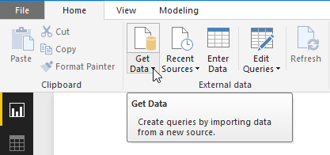
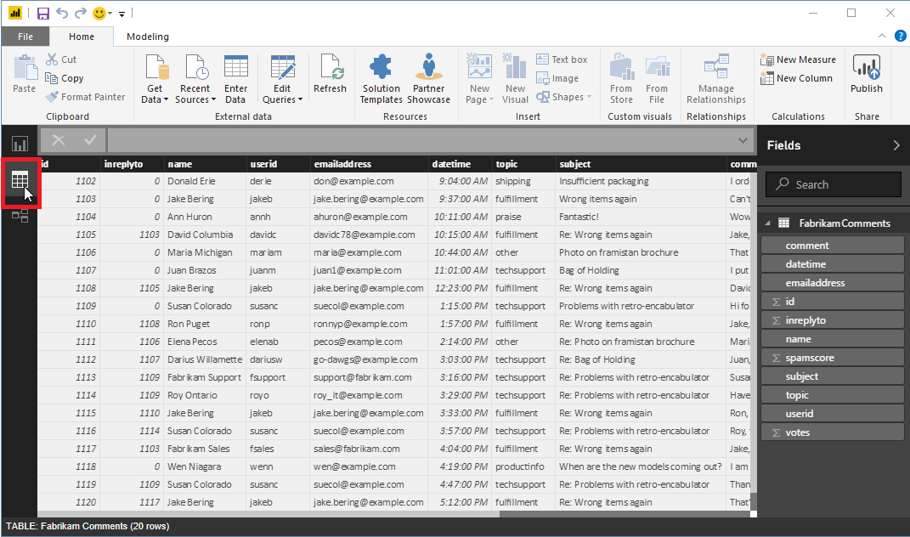
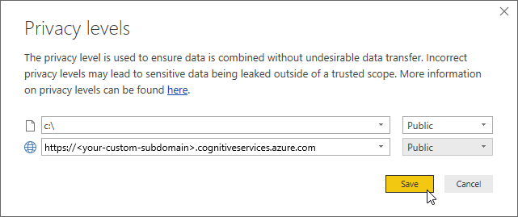
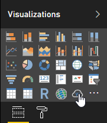

# Tutorial: Extract key phrases from text stored in Power BI

Microsoft Power BI Desktop is a free application that lets you connect to, transform, and visualize your data. Key phrase extraction, one of the features of Azure Cognitive Service for Language, provides natural language processing. Given raw unstructured text, it can extract the most important phrases, analyze sentiment, and identify well-known entities such as brands. Together, these tools can help you quickly see what your customers are talking about and how they feel about it.

In this tutorial, you'll learn how to:

> [!div class="checklist"]
> * Use Power BI Desktop to import and transform data
> * Create a custom function in Power BI Desktop
> * Integrate Power BI Desktop with the Key Phrase Extraction feature of Azure Cognitive Service for Language
> * Use Key Phrase Extraction to get the most important phrases from customer feedback
> * Create a word cloud from customer feedback

## Prerequisites

- Microsoft Power BI Desktop. [Download at no charge](https://powerbi.microsoft.com/get-started/).
- A Microsoft Azure account. [Create a free account](https://azure.microsoft.com/free/cognitive-services/) or [sign in](https://portal.azure.com/).
- A Language resource. If you don't have one, you can [create one](https://portal.azure.com/#create/Microsoft.CognitiveServicesTextAnalytics).
- The [Language resource key](../../../cognitive-services-apis-create-account.md#get-the-keys-for-your-resource) that was generated for you during sign-up.
- Customer comments. You can use [our example data](https://aka.ms/cogsvc/ta) or your own data. This tutorial assumes you're using our example data.

## Load customer data

To get started, open Power BI Desktop and load the comma-separated value (CSV) file `FabrikamComments.csv` that you downloaded in [Prerequisites](#prerequisites). This file represents a day's worth of hypothetical activity in a fictional small company's support forum.

> [!NOTE]
> Power BI can use data from a wide variety of web-based sources, such as SQL databases. See the [Power Query documentation](/power-query/connectors/) for more information.

In the main Power BI Desktop window, select the **Home** ribbon. In the **External data** group of the ribbon, open the **Get Data** drop-down menu and select **Text/CSV**.



The Open dialog appears. Navigate to your Downloads folder, or to the folder where you downloaded the `FabrikamComments.csv` file. Click `FabrikamComments.csv`, then the **Open** button. The CSV import dialog appears.


The CSV import dialog lets you verify that Power BI Desktop has correctly detected the character set, delimiter, header rows, and column types. This information is all correct, so click **Load**.

To see the loaded data, click the **Data View** button on the left edge of the Power BI workspace. A table opens that contains the data, like in Microsoft Excel.



## Prepare the data

You may need to transform your data in Power BI Desktop before it's ready to be processed by Key Phrase Extraction.

The sample data contains a `subject` column and a `comment` column. With the Merge Columns function in Power BI Desktop, you can extract key phrases from the data in both these columns, rather than just the `comment` column.

In Power BI Desktop, select the **Home** ribbon. In the **External data** group, click **Edit Queries**.


Select `FabrikamComments` in the **Queries** list at the left side of the window if it isn't already selected.

Now select both the `subject` and `comment` columns in the table. You may need to scroll horizontally to see these columns. First click the `subject` column header, then hold down the Control key and click the `comment` column header.


Select the **Transform** ribbon. In the **Text Columns** group of the ribbon, click **Merge Columns**. The Merge Columns dialog appears.


In the Merge Columns dialog, choose `Tab` as the separator, then click **OK.**

You might also consider filtering out blank messages using the Remove Empty filter, or removing unprintable characters using the Clean transformation. If your data contains a column like the `spamscore` column in the sample file, you can skip "spam" comments using a Number Filter.

## Understand the API

[Key Phrase Extraction](https://westus.dev.cognitive.microsoft.com/docs/services/TextAnalytics-V3-1/operations/KeyPhrases) can process up to a thousand text documents per HTTP request. Power BI prefers to deal with records one at a time, so in this tutorial your calls to the API will include only a single document each. The Key Phrases API requires the following fields for each document being processed.

| Field | Description |
| - | - |
| `id`  | A unique identifier for this document within the request. The response also contains this field. That way, if you process more than one document, you can easily associate the extracted key phrases with the document they came from. In this tutorial, because you're processing only one document per request, you can hard-code the value of `id` to be the same for each request.|
| `text`  | The text to be processed. The value of this field comes from the `Merged` column you created in the [previous section](#prepare-the-data), which contains the combined subject line and comment text. The Key Phrases API requires this data be no longer than about 5,120 characters.|
| `language` | The code for the natural language the document is written in. All the messages in the sample data are in English, so you can hard-code the value `en` for this field.|

## Create a custom function

Now you're ready to create the custom function that will integrate Power BI and Key Phrase Extraction. The function receives the text to be processed as a parameter. It converts data to and from the required JSON format and makes the HTTP request to the Key Phrases API. The function then parses the response from the API and returns a string that contains a comma-separated list of the extracted key phrases.

> [!NOTE]
> Power BI Desktop custom functions are written in the [Power Query M formula language](/powerquery-m/power-query-m-reference), or just "M" for short. M is a functional programming language based on [F#](/dotnet/fsharp/). You don't need to be a programmer to finish this tutorial, though; the required code is included below.

In Power BI Desktop, make sure you're still in the Query Editor window. If you aren't, select the **Home** ribbon, and in the **External data** group, click **Edit Queries**.

Now, in the **Home** ribbon, in the **New Query** group, open the **New Source** drop-down menu and select **Blank Query**. 

A new query, initially named `Query1`, appears in the Queries list. Double-click this entry and name it `KeyPhrases`.

Now, in the **Home** ribbon, in the **Query** group, click **Advanced Editor** to open the Advanced Editor window. Delete the code that's already in that window and paste in the following code. 

> [!NOTE]
> Replace the example endpoint below (containing `<your-custom-subdomain>`) with the endpoint generated for your Language resource. You can find this endpoint by signing in to the [Azure portal](https://azure.microsoft.com/features/azure-portal/), navigating to your resource, and selecting **Key and endpoint**.


```fsharp
// Returns key phrases from the text in a comma-separated list
(text) => let
    apikey      = "YOUR_API_KEY_HERE",
    endpoint    = "https://<your-custom-subdomain>.cognitiveservices.azure.com/text/analytics" & "/v3.0/keyPhrases",
    jsontext    = Text.FromBinary(Json.FromValue(Text.Start(Text.Trim(text), 5000))),
    jsonbody    = "{ documents: [ { language: ""en"", id: ""0"", text: " & jsontext & " } ] }",
    bytesbody   = Text.ToBinary(jsonbody),
    headers     = [#"Ocp-Apim-Subscription-Key" = apikey],
    bytesresp   = Web.Contents(endpoint, [Headers=headers, Content=bytesbody]),
    jsonresp    = Json.Document(bytesresp),
    keyphrases  = Text.Lower(Text.Combine(jsonresp[documents]{0}[keyPhrases], ", "))
in  keyphrases
```

Replace `YOUR_API_KEY_HERE` with your Language resource key. You can also find this key by signing in to the [Azure portal](https://azure.microsoft.com/features/azure-portal/), navigating to your Language resource, and selecting the **Key and endpoint** page. Be sure to leave the quotation marks before and after the key. Then click **Done.**

## Use the custom function

Now you can use the custom function to extract the key phrases from each of the customer comments and store them in a new column in the table. 

In Power BI Desktop, in the Query Editor window, switch back to the `FabrikamComments` query. Select the **Add Column** ribbon. In the **General** group, click **Invoke Custom Function**.

<br><br>

The Invoke Custom Function dialog appears. In **New column name**, enter `keyphrases`. In **Function query**, select the custom function you created, `KeyPhrases`.

A new field appears in the dialog, **text (optional)**. This field is asking which column we want to use to provide values for the `text` parameter of the Key Phrases API. (Remember that you already hard-coded the values for the `language` and `id` parameters.) Select `Merged` (the column you created [previously](#prepare-the-data) by merging the subject and message fields) from the drop-down menu.


Finally, click **OK.**

If everything is ready, Power BI calls your custom function once for each row in the table. It sends the queries to the Key Phrases API and adds a new column to the table to store the results. But before that happens, you may need to specify authentication and privacy settings.

## Authentication and privacy

After you close the Invoke Custom Function dialog, a banner may appear asking you to specify how to connect to the Key Phrases API.


Click **Edit Credentials,** make sure `Anonymous` is selected in the dialog, then click **Connect.** 

> [!NOTE]
> You select `Anonymous` because Key Phrase Extraction authenticates requests using your access key, so Power BI does not need to provide credentials for the HTTP request itself.

> [!div class="mx-imgBorder"]
> 

If you see the Edit Credentials banner even after choosing anonymous access, you may have forgotten to paste your Language resource key into the code in the `KeyPhrases` [custom function](#create-a-custom-function).

Next, a banner may appear asking you to provide information about your data sources' privacy. 


Click **Continue** and choose `Public` for each of the data sources in the dialog. Then click **Save.**



## Create the word cloud

Once you have dealt with any banners that appear, click **Close & Apply** in the Home ribbon to close the Query Editor.

Power BI Desktop takes a moment to make the necessary HTTP requests. For each row in the table, the new `keyphrases` column contains the key phrases detected in the text by the Key Phrases API. 

Now you'll use this column to generate a word cloud. To get started, click the **Report** button in the main Power BI Desktop window, to the left of the workspace.

> [!NOTE]
> Why use extracted key phrases to generate a word cloud, rather than the full text of every comment? The key phrases provide us with the *important* words from our customer comments, not just the *most common* words. Also, word sizing in the resulting cloud isn't skewed by the frequent use of a word in a relatively small number of comments.

If you don't already have the Word Cloud custom visual installed, install it. In the Visualizations panel to the right of the workspace, click the three dots (**...**) and choose **Import From Market**. If the word "cloud" is not among the displayed visualization tools in the list, you can search for "cloud" and click the **Add** button next the Word Cloud visual. Power BI installs the Word Cloud visual and lets you know that it installed successfully.

<br><br>

First, click the Word Cloud icon in the Visualizations panel.



A new report appears in the workspace. Drag the `keyphrases` field from the Fields panel to the Category field in the Visualizations panel. The word cloud appears inside the report.

Now switch to the Format page of the Visualizations panel. In the Stop Words category, turn on **Default Stop Words** to eliminate short, common words like "of" from the cloud. However, because we're visualizing key phrases, they might not contain stop words.


Down a little further in this panel, turn off **Rotate Text** and **Title**.


Click the Focus Mode tool in the report to get a better look at our word cloud. The tool expands the word cloud to fill the entire workspace, as shown below.


## Using other features

Azure Cognitive Service for Language also provides sentiment analysis and language detection. The language detection in particular is useful if your customer feedback isn't all in English.

Both of these other APIs are similar to the Key Phrases API. That means you can integrate them with Power BI Desktop using custom functions that are nearly identical to the one you created in this tutorial. Just create a blank query and paste the appropriate code below into the Advanced Editor, as you did earlier. (Don't forget your access key!) Then, as before, use the function to add a new column to the table.

The Sentiment Analysis function below returns a label indicating how positive the sentiment expressed in the text is.

```fsharp
// Returns the sentiment label of the text, for example, positive, negative or mixed.
(text) => let
    apikey = "YOUR_API_KEY_HERE",
    endpoint = "<your-custom-subdomain>.cognitiveservices.azure.com" & "/text/analytics/v3.1/sentiment",
    jsontext = Text.FromBinary(Json.FromValue(Text.Start(Text.Trim(text), 5000))),
    jsonbody = "{ documents: [ { language: ""en"", id: ""0"", text: " & jsontext & " } ] }",
    bytesbody = Text.ToBinary(jsonbody),
    headers = [#"Ocp-Apim-Subscription-Key" = apikey],
    bytesresp = Web.Contents(endpoint, [Headers=headers, Content=bytesbody]),
    jsonresp = Json.Document(bytesresp),
    sentiment   = jsonresp[documents]{0}[sentiment] 
    in sentiment
```

Here are two versions of a Language Detection function. The first returns the ISO language code (for example, `en` for English), while the second returns the "friendly" name (for example, `English`). You may notice that only the last line of the body differs between the two versions.

```fsharp
// Returns the two-letter language code (for example, 'en' for English) of the text
(text) => let
    apikey      = "YOUR_API_KEY_HERE",
    endpoint    = "https://<your-custom-subdomain>.cognitiveservices.azure.com" & "/text/analytics/v3.1/languages",
    jsontext    = Text.FromBinary(Json.FromValue(Text.Start(Text.Trim(text), 5000))),
    jsonbody    = "{ documents: [ { id: ""0"", text: " & jsontext & " } ] }",
    bytesbody   = Text.ToBinary(jsonbody),
    headers     = [#"Ocp-Apim-Subscription-Key" = apikey],
    bytesresp   = Web.Contents(endpoint, [Headers=headers, Content=bytesbody]),
    jsonresp    = Json.Document(bytesresp),
    language    = jsonresp [documents]{0}[detectedLanguage] [iso6391Name] in language 
```
```fsharp
// Returns the name (for example, 'English') of the language in which the text is written
(text) => let
    apikey      = "YOUR_API_KEY_HERE",
    endpoint    = "https://<your-custom-subdomain>.cognitiveservices.azure.com" & "/text/analytics/v3.1/languages",
    jsontext    = Text.FromBinary(Json.FromValue(Text.Start(Text.Trim(text), 5000))),
    jsonbody    = "{ documents: [ { id: ""0"", text: " & jsontext & " } ] }",
    bytesbody   = Text.ToBinary(jsonbody),
    headers     = [#"Ocp-Apim-Subscription-Key" = apikey],
    bytesresp   = Web.Contents(endpoint, [Headers=headers, Content=bytesbody]),
    jsonresp    = Json.Document(bytesresp),
    language    jsonresp [documents]{0}[detectedLanguage] [iso6391Name] in language 
```

Finally, here's a variant of the Key Phrases function already presented that returns the phrases as a list object, rather than as a single string of comma-separated phrases. 

> [!NOTE]
> Returning a single string simplified our word cloud example. A list, on the other hand, is a more flexible format for working with the returned phrases in Power BI. You can manipulate list objects in Power BI Desktop using the Structured Column group in the Query Editor's Transform ribbon.

```fsharp
// Returns key phrases from the text as a list object
(text) => let
    apikey      = "YOUR_API_KEY_HERE",
    endpoint    = "https://<your-custom-subdomain>.cognitiveservices.azure.com" & "/text/analytics/v3.1/keyPhrases",
    jsontext    = Text.FromBinary(Json.FromValue(Text.Start(Text.Trim(text), 5000))),
    jsonbody    = "{ documents: [ { language: ""en"", id: ""0"", text: " & jsontext & " } ] }",
    bytesbody   = Text.ToBinary(jsonbody),
    headers     = [#"Ocp-Apim-Subscription-Key" = apikey],
    bytesresp   = Web.Contents(endpoint, [Headers=headers, Content=bytesbody]),
    jsonresp    = Json.Document(bytesresp),
    keyphrases  = jsonresp[documents]{0}[keyPhrases]
in  keyphrases
```

## Next steps

Learn more about Azure Cognitive Service for Language, the Power Query M formula language, or Power BI.

* [Azure Cognitive Service for Language overview](../../overview.md)
* [Power Query M reference](/powerquery-m/power-query-m-reference)
* [Power BI documentation](https://powerbi.microsoft.com/documentation/powerbi-landing-page/)
