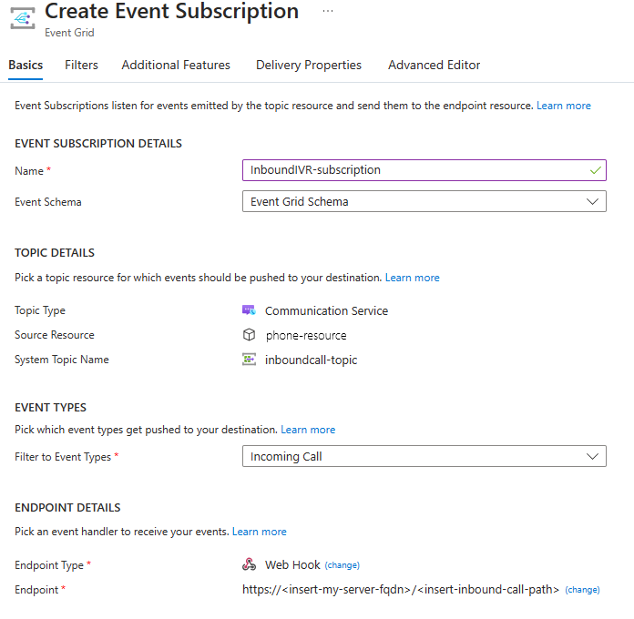

# Incoming call concepts

[!INCLUDE [Public Preview Notice](../../includes/public-preview-include.md)]

Azure Communication Services Call Automation provides developers the ability to build applications, which can make and receive calls. Azure Communication Services relies on Event Grid subscriptions to deliver each `IncomingCall` event, so setting up your environment to receive these notifications is critical to your application being able to redirect or answer a call.

## Calling scenarios

First, we need to define which scenarios can trigger an `IncomingCall` event. The primary concept to remember is that a call to an Azure Communication Services identity or Public Switched Telephone Network (PSTN) number will trigger an `IncomingCall` event. The following are examples of these resources:

1. An Azure Communication Services identity
2. A PSTN phone number owned by your Azure Communication Services resource

Given the above examples, the following scenarios will trigger an `IncomingCall` event sent to Event Grid:

| Source | Destination | Scenario(s) |
| ------ | ----------- | -------- |
| Azure Communication Services identity | Azure Communication Services identity | Call, Redirect, Add Participant, Transfer |
| Azure Communication Services identity | PSTN number owned by your Azure Communication Services resource  | Call, Redirect, Add Participant, Transfer
| Public PSTN | PSTN number owned by your Azure Communication Services resource  | Call, Redirect, Add Participant, Transfer

> [!NOTE]
> An important concept to remember is that an Azure Communication Services identity can be a user or application. Although there is no ability to explicitly assign an identity to a user or application in the platform, this can be done by your own application or supporting infrastructure. Please review the [identity concepts guide](../identity-model.md) for more information on this topic.

## Receiving an incoming call notification from Event Grid

Since Azure Communication Services relies on Event Grid to deliver the `IncomingCall` notification through a subscription, how you choose to handle the notification is up to you. Additionally, since the Call Automation API relies specifically on Webhook callbacks for events, a common Event Grid subscription used would be a 'Webhook'. However, you could choose any one of the available subscription types offered by the service.

This architecture has the following benefits:

- Using Event Grid subscription filters, you can route the `IncomingCall` notification to specific applications.
- PSTN number assignment and routing logic can exist in your application versus being statically configured online.
- As identified in the above [calling scenarios](#calling-scenarios) section, your application can be notified even when users make calls between each other. You can then combine this scenario together with the [Call Recording APIs](../voice-video-calling/call-recording.md) to meet compliance needs.

To check out a sample payload for the event and to learn about other calling events published to Event Grid, check out this [guide](../../../event-grid/communication-services-voice-video-events.md#microsoftcommunicationincomingcall).

Below is an example of an Event Grid Webhook subscription where the event type filter is listening only to the `IncomingCall` event.

## Call routing in Call Automation or Event Grid

You can use [advanced filters](../../../event-grid/event-filtering.md) in your Event Grid subscription to subscribe to an `IncomingCall` notification for a specific source/destination phone number or Azure Communication Services identity and sent it to an endpoint such as a Webhook subscription. That endpoint application can then make a decision to **redirect** the call using the Call Automation SDK to another Azure Communication Services identity or to the PSTN.

> [!NOTE]
> In many cases you will want to configure filtering in Event Grid due to the scenarios described above generating an `IncomingCall` event so that your application only receives events it should be responding to. For example, if you want to redirect an inbound PSTN call to an ACS endpoint and you don't use a filter, your Event Grid subscription will receive two `IncomingCall` events; one for the PSTN call and one for the ACS user even though you had not intended to receive the second notification. Failure to handle these scenarios using filters or some other mechanism in your application can cause infinite loops and/or other undesired behavior.

Below is an example of an advanced filter on an Event Grid subscription watching for the `data.to.PhoneNumber.Value` string starting with a PSTN phone number of `+18005551212.

## Number assignment

Since the `IncomingCall` notification doesn't have a specific destination other than the Event Grid subscription you've created, you're free to associate any particular number to any endpoint in Azure Communication Services. For example, if you acquired a PSTN phone number of `+14255551212` and want to assign it to a user with an identity of `375f0e2f-e8db-4449-9bf7-2054b02e42b4` in your application, you'll maintain a mapping of that number to the identity. When an `IncomingCall` notification is sent matching the phone number in the **to** field, you'll invoke the `Redirect` API and supply the identity of the user. In other words, you maintain the number assignment within your application and route or answer calls at runtime.

## Next steps
- [Build a Call Automation application](../../quickstarts/call-automation/callflows-for-customer-interactions.md) to simulate a customer interaction.
- [Redirect an inbound PSTN call](../../quickstarts/call-automation/redirect-inbound-telephony-calls.md) to your resource.