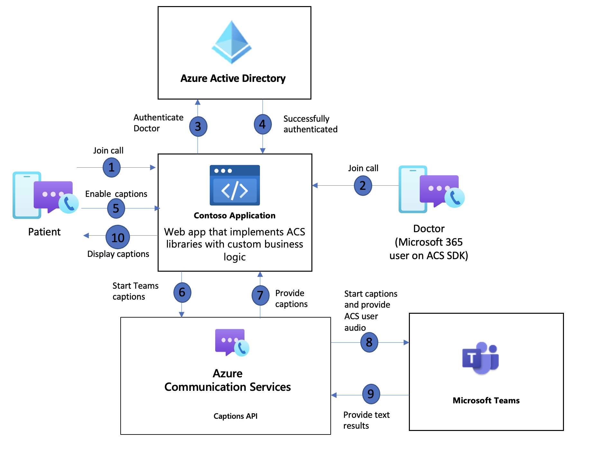

# Enable Closed captions with Teams Interoperability

[!INCLUDE [Public Preview](../../includes/public-preview-include-document.md)]

Closed captions are a textual representation of a voice or video conversation that is displayed to users in real-time. Azure Communication Services Closed captions offer developers the ability to allow users to select when they wish to toggle captions on or off. These captions are only available during the call/meeting for the user that has selected to enable captions, ACS does **not** store these captions anywhere. Closed captions can be accessed through Azure Communication Services client-side SDKs for Web, Windows, iOS and Android.

In this document, we're going to be looking at specifically Teams interoperability scenarios. For example, an Azure Communication Services user joins a Teams meeting and enabling captions or two Microsoft 365 users using Azure Communication Calling SDK to join a call or meeting. 

## Supported scenarios

### Basic Closed Captions
| Feature | ACS user | Microsoft 365 user with ACS calling SDK | Teams user in Teams app |
| ------- | ------------ | -------------- | -------------- | 
| Enable captions in ACS call | N/A | ✔︎ | ✔︎ | 
| Enable captions in ACS rooms  | N/A | ✔︎ | ✔︎ | 
| Enable captions in Teams meeting | ✔︎ | ✔︎ | ✔︎ | 
| Enable captions in Teams call | ✔︎ | ✔︎ | ✔︎ | 

*✕ = not supprted in current release.*

### Translated Captions

| Feature | ACS user | Microsoft 365 user with ACS calling SDK | Teams user in Teams app |
| ------- | -------------- | -------------- | -------------- | 
| Enable captions in ACS call | N/A | ✔︎ | ✔︎ | 
| Enable captions in ACS rooms  | N/A | ✔︎ | ✔︎ | 
| Enable captions in Teams meeting | ✔︎ | ✔︎ | ✔︎ | 
| Enable captions in Teams call | ✔︎ | ✔︎ | ✔︎ | 

*Usage of translations through Teams generated captions requires the organizer to have assigned a Teams Premium license, or in the case of Microsoft 365 users they must have a Teams premium license. More information about Teams Premium can be found [here](https://www.microsoft.com/microsoft-teams/premium#tabx93f55452286a4264a2778ef8902fb81a).*

In scenarios where there's a Teams user on a Teams client or a Microsoft 365 user with ACS SDKs in the call, the developer can use Teams caption. This allows developers to work with the Teams captioning technology that may already be familiar with today. With Teams captions developers are limited to what their Teams license allows. Basic captions allow only one spoken and one caption language for the call. With Teams premium license developers can use the translation functionality offered by Teams to provide one spoken language for the call and translated caption languages on a per user basis. In a Teams interop scenario, captions enabled through ACS follows the same policies that are defined in Teams for [meetings](/powershell/module/skype/set-csteamsmeetingpolicy) and [calls](/powershell/module/skype/set-csteamscallingpolicy). 

## Common use cases

### Building accessible experiences
Accessibility – For people with hearing impairments or who are new to the language to participate in calls and meetings. A key feature requirement in the Telemedical industry is to help patients communicate effectively with their health care providers.

### Teams interoperability 
Use Teams – Organizations using ACS and Teams can use Teams closed captions to improve their applications by providing closed captions capabilities to users. Those organizations can keep using Microsoft Teams for all calls and meetings without third party applications providing this capability.

### Global inclusivity 
Provide translation – Use the translation functions provided to provide translated captions for users who may be new to the language or for companies that operate at a global scale and have offices around the world, their teams can have conversations even if some people might not be familiar with the spoken language.

## Sample architecture of ACS user using captions in a Teams meeting

## Sample architecture of an ACS user using captions in a meeting with a Microsoft 365 user on ACS SDK

## Privacy concerns

Closed captions are only available during the call or meeting for the participant that has selected to enable captions, ACS doesn't store these captions anywhere. Many countries and states have laws and regulations that apply to storing of data. It is your responsibility to use the closed captions in compliance with the law should you choose to store any of the data generated through closed captions. You must obtain consent from the parties involved in a manner that complies with the laws applicable to each participant. 
 
Interoperability between Azure Communication Services and Microsoft Teams enables your applications and users to participate in Teams calls, meetings, and chats. It is your responsibility to ensure that the users of your application are notified when closed captions are enabled in a Teams call or meeting and being stored.
 
Microsoft indicates to you via the Azure Communication Services API that recording or closed captions has commenced, and you must communicate this fact, in real-time, to your users within your application's user interface. You agree to indemnify Microsoft for all costs and damages incurred due to your failure to comply with this obligation.

## Known limitations
- Closed captions feature isn't supported on Firefox. 

## Next steps

- Learn how to use [closed captions for Teams interoperability](../../how-tos/calling-sdk/closed-captions-teams-interop-how-to.md).

