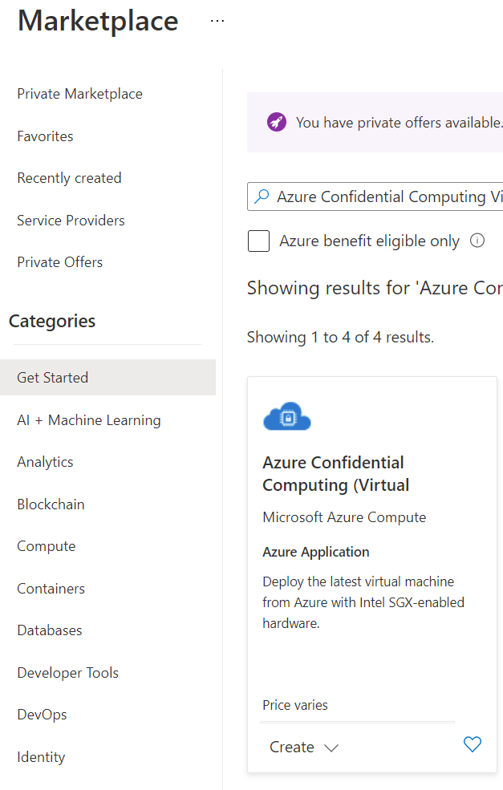

# Quickstart: Create Intel SGX VM in the Azure Marketplace

This tutorial guides you through the process of deploying Intel SGX VMs using Azure Marketplace. Otherwise, we recommend following the VM deployment flow [using portal or CLI.](quick-create-portal.md)

## Prerequisites

If you don't have an Azure subscription, [create an account](https://azure.microsoft.com/pricing/purchase-options/pay-as-you-go/) before you begin.

> [!NOTE]
> Free trial accounts do not have access to the VMs in this tutorial. Please upgrade to a Pay-As-You-Go subscription.


## Sign in to Azure

1. Sign in to the [Azure portal](https://portal.azure.com/).

1. At the top, select **Create a resource**.

1. In the **Get Started** default pane, search **Azure Confidential Computing (Virtual Machine)** .

1. Click the **Azure Confidential Computing (Virtual Machine)** template.

    

1. On the Virtual machine landing page, select **Create**.


## Configure an Intel SGX Virtual Machine

1. In the **Basics** tab, select your **Subscription** and **Resource Group** (group needs to be empty to deploy this template).

1. For **Virtual machine name**, enter a name for your new VM.

1. Type or select the following values:

   * **Region**: Select the Azure region that's right for you.

        > [!NOTE]
        > Intel SGX VMs run on specialized hardware in specific regions. For the latest regional availability, look for DCsv2-series or DCsv3/DCdsv3-series in [available regions](https://azure.microsoft.com/global-infrastructure/services/?products=virtual-machines).

1. Configure the operating system image that you would like to use for your virtual machine. This setup only support Gen 2 VM and image deployments

    * **Choose Image**: For this tutorial, select Ubuntu 20.04 LTS (Gen 2). You may also select Windows Server Datacenter 2019, or and Ubuntu 18.04 LTS. If you choose to do so, you'll be redirected in this tutorial accordingly.
   
1. Fill in the following information in the Basics tab:

   * **Authentication type**: Select **SSH public key** if you're creating a Linux VM.

        > [!NOTE]
        > You have the choice of using an SSH public key or a Password for authentication. SSH is more secure. For instructions on how to generate an SSH key, see [Create SSH keys on Linux and Mac for Linux VMs in Azure](../virtual-machines/linux/mac-create-ssh-keys.md).

    * **Username**: Enter the Administrator name for the VM.

    * **SSH public key**: If applicable, enter your RSA public key.
    
    * **Password**: If applicable, enter your password for authentication.
    
1. Fill in the following information in the "Virtual Machine Settings" tab:

   * Choose the VM SKU Size
   * **DCsv2-series** supports **Standard SSD**, **Premium SSD** is supported across DC1, DC2 and DC4. 
   * **DCsv3 and DCdsv3-series** supports **Standard SSD**, **Premium SSD** and **Ultra Disk**
   
   * **Public inbound ports**: Choose **Allow selected ports** and select **SSH (22)** and **HTTP (80)** in the **Select public inbound ports** list. If you're deploying a Windows VM, select **HTTP (80)** and **RDP (3389)**. In this quickstart, this step is necessary to connect to the VM.
   
    >[!Note]
    > Allowing RDP/SSH ports is not recommended for production deployments.  

     


1. Choose the **Monitoring** option if necessary

1. Select **Review + create**.

1. In the **Review + create** pane, select **Create**.

> [!NOTE]
> Proceed to the next section and continue with this tutorial if you deployed a Linux VM. If you deployed a Windows VM, [follow these steps to connect to your Windows VM](../virtual-machines/windows/connect-logon.md)


## Connect to the Linux VM

Open your SSH client of choice, like Bash on Linux or PowerShell on Windows. The `ssh` command is typically included in Linux, macOS, and Windows. If you are using Windows 7 or older, where Win32 OpenSSH is not included by default, consider installing [WSL](/windows/wsl/about) or using [Azure Cloud Shell](../cloud-shell/overview.md) from the browser. In the following command, replace the VM user name and IP address to connect to your Linux VM.

```bash
ssh azureadmin@40.55.55.555
```

You can find the Public IP address of your VM in the Azure portal, under the Overview section of your virtual machine.

:::image type="content" source="media/quick-create-portal/public-ip-virtual-machine.png" alt-text="IP address in Azure portal":::

## Intel SGX Drivers

> [!NOTE]
> Intel SGX drivers as already part of the Ubuntu & Windows Azure Gallery Images. To ensure you are using the latest drivers, visit the [Intel SGX DCAP drivers list](https://01.org/intel-software-guard-extensions/downloads).

## Clean up resources

When no longer needed, you can delete the resource group, virtual machine, and all related resources. 

Select the resource group for the virtual machine, then select **Delete**. Confirm the name of the resource group to finish deleting the resources.

## Next steps

In this quickstart, you deployed and connected to your Intel SGX VM. For more information, see [Solutions on Virtual Machines](virtual-machine-solutions-sgx.md). 

Discover how you can build confidential computing applications, by continuing to the Open Enclave SDK samples on GitHub. 

> [!div class="nextstepaction"]
> [Building Open Enclave SDK Samples](https://github.com/openenclave/openenclave/blob/master/samples/README.md)
