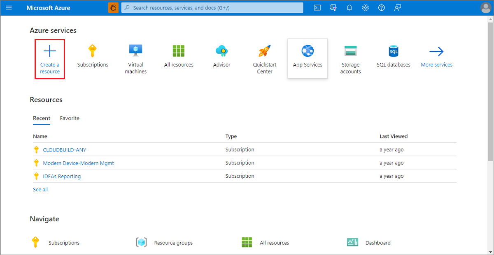
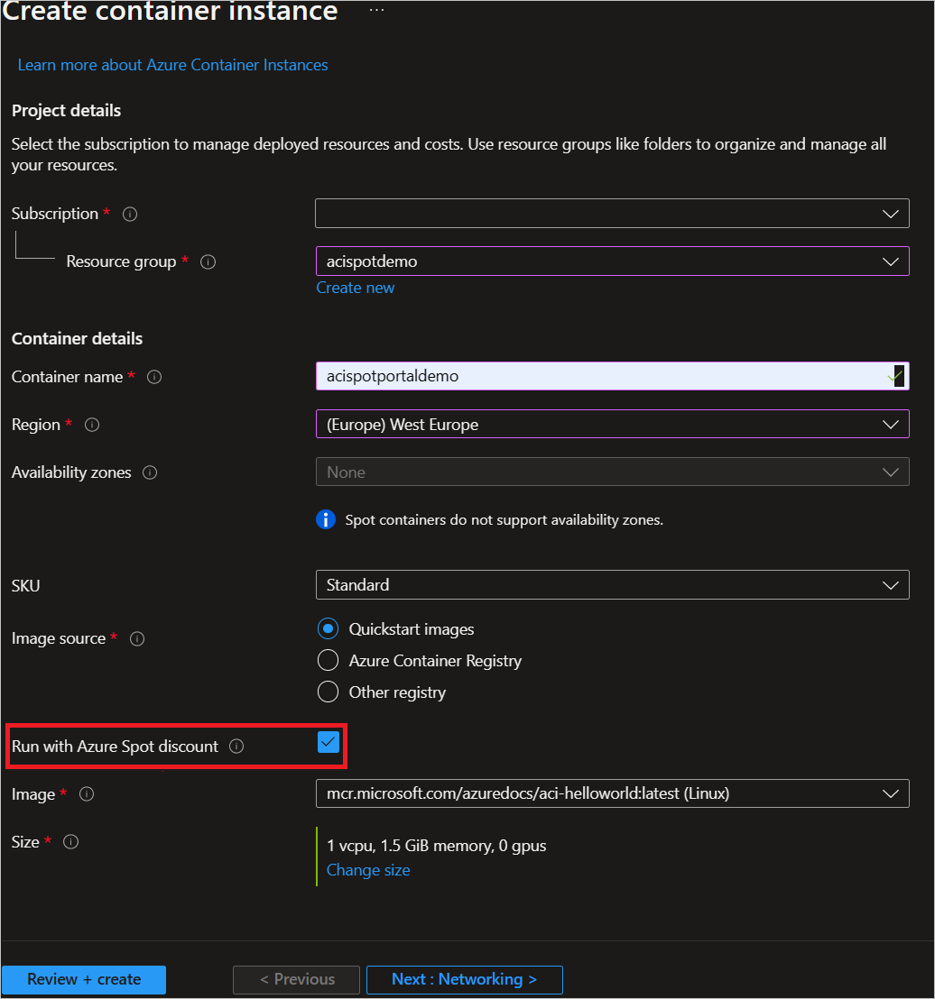

# Tutorial: Deploy a Spot container with Azure Container Instances using the Azure portal (Preview)

In this tutorial, you will use Azure portal to deploy a spot container to Azure Container Instances with a default quota. After deploying the container, you can browse to the running application. 

## Sign in to Azure 

Sign in to the Azure portal at https://portal.azure.com

If you don't have an Azure subscription, create a [free account][azure-free-account] before you begin.

## Create a Spot container on Azure Container Instances 

On the Azure portal homepage, select **Create a resource**.

   

Select **Containers** > **Container Instances**.

On the **Basics** page, choose a subscription and enter the following values for **Resource group**, **Container name**, **Image source**, and **Container image**. Then to deploy ACI Spot container, opt for Spot discount by selecting **Run with Spot discount** field. This will enforce limitations for this feature in preview release automatically and allow you to deploy only in supported regions.

* Resource group: **Create new** > `acispotdemo`
* Container name: `acispotportaldemo`
* Region: One of `West Europe`/`East US2`/`West US`
* SKU: `Standard`
* Image source: **Quickstart images**
* Container image: `mcr.microsoft.com/azuredocs/aci-helloworld:v1` (Linux)

   

When deploying Spot container on Azure Container Instances you need to select only regions supported in public preview. You can change the restart policy, region, type of container images and compute resources. If you want more than default quota offered, please file a support request.
 
Leave all other settings as their defaults, then select **Review + create**.

When the validation completes, you're shown a summary of the container's settings. Select **Create** to submit your container deployment request.

When the deployment starts, a notification appears that indicates the deployment is in progress. Another notification is displayed when the container group has been deployed.

Open the overview for the container group by navigating to **Resource Groups** > **acispotdemo** > **acispotportaldemo**. Make a note of the **priority** property of the container instance and its **Status**.

1. On the **Overview** page, note the **Status** of the instance.

1. Once its status is *Running*, navigate to the AZ CLI and run the below command to check you are able to listen to container on default port 80. 

   

Congratulations! You have deployed a spot container on Azure Container Instances which is running sample hello world container application. 

## Clean up resources

When you're done with the container, select **Overview** for the *helloworld* container instance, then select **Delete**.

## Next steps

In this tutorial, you created a Spot container on Azure Container Instances with a default quota and eviction policy using the Azure portal.

* [ACI Spot containers overview](container-instances-spot-containers-overview.md)
* [Try out Spot containers with Azure Container Instances using the Azure CLI](container-instances-tutorial-deploy-spot-containers-cli.md)

<!-- LINKS - External -->
[azure-free-account]: https://azure.microsoft.com/free/