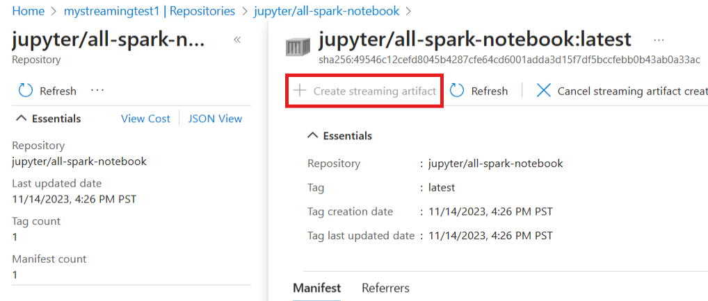
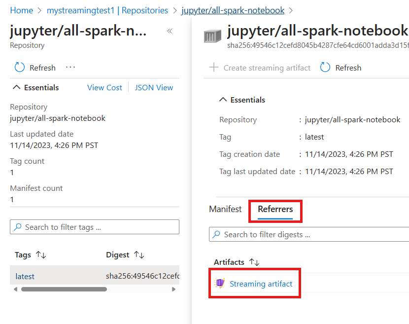
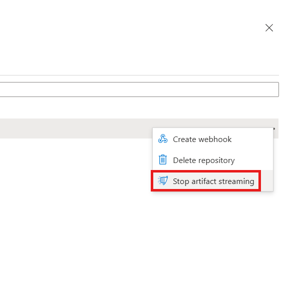

# Artifact streaming in Azure Container Registry (Preview)

Artifact streaming is a feature in Azure Container Registry that allows you to store container images within a single registry, manage, and stream the container images to Azure Kubernetes Service (AKS) clusters in multiple regions. This feature is designed to accelerate containerized workloads for Azure customers using AKS. With artifact streaming, you can easily scale workloads without having to wait for slow pull times for your node.

## Use cases

Here are few scenarios to use artifact streaming:

**Deploying containerized applications to multiple regions**: With artifact streaming, you can store container images within a single registry and manage and stream container images to AKS clusters in multiple regions. Artifact streaming deploys container applications to multiple regions without consuming time and resources.

**Reducing image pull latency**: Artifact streaming can reduce time to pod readiness by over 15%, depending on the size of the image, and it works best for images < 30 GB. This feature reduces image pull latency and fast container startup, which is beneficial for software developers and system architects.

**Effective scaling of containerized applications**:  Artifact streaming provides the opportunity to design, build, and deploy containerized applications at a high scale.

## Artifact streaming aspects

Here are some brief aspects of artifact streaming:

* Customers with new and existing registries can start artifact streaming for specific repositories or tags.

* Customers are able to store both the original and the streaming artifact in the ACR by starting artifact streaming.

* Customers have access to the original and the streaming artifact even after turning off artifact streaming for repositories or artifacts.

* Customers with artifact streaming and Soft Delete enabled, deletes a repository or artifact then both the original and artifact streaming versions are deleted. However, only the original version is available on the soft delete portal.

## Availability and pricing information

Artifact streaming is only available in the **Premium** [service tiers](container-registry-skus.md) (also known as SKUs). Artifact streaming has potential to increase the overall registry storage consumption. Customers are subjected to more storage charges as outlined in our [pricing](https://azure.microsoft.com/pricing/details/container-registry/) if the consumption exceeds the included 500 GiB Premium SKU threshold.

## Preview limitations

Artifact streaming is currently in preview. The following limitations apply:

* Only images with Linux AMD64 architecture are supported in the preview release.
* The preview release doesn't support Windows-based container images and ARM64 images.
* The preview release partially support multi-architecture images only the AMD64 architecture is supported.
* For creating Ubuntu based node pool in AKS, choose Ubuntu version 20.04 or higher.
* For Kubernetes, use Kubernetes version 1.26 or higher or Kubernetes version > 1.25. 
* Only premium SKU registries support generating streaming artifacts in the preview release. The nonpremium SKU registries don't offer this functionality during the preview.
* The CMK (Customer-Managed Keys) registries are NOT supported in the preview release.
* Kubernetes regcred is currently NOT supported.

## Prerequisites

* You can use the [Azure Cloud Shell][Azure Cloud Shell] or a local installation of the Azure CLI to run the command examples in this article. If you'd like to use it locally, version 2.54.0 or later is required. Run `az --version` for finding the version. If you need to install or upgrade, see [Install Azure CLI][Install Azure CLI].

* Sign in to the [Azure portal](https://ms.portal.azure.com/). 


## Start artifact streaming 

Start artifact streaming with a series with Azure CLI commands and Azure portal for pushing, importing, and generating streaming artifacts for container images in an Azure Container Registry (ACR). These instructions outline the process for creating a *Premium* [SKU](container-registry-skus.md) ACR, importing an image, generating a streaming artifact, and managing the artifact streaming operation. Make sure to replace the placeholders with your actual values where necessary.

<!-- markdownlint-disable MD044 -->
:::zone target="docs" pivot="development-environment-azure-cli"
<!-- markdownlint-enable MD044 -->

### Push/Import the image and generate the streaming artifact  - Azure CLI

Artifact streaming is available in the **Premium** container registry service tier. To start Artifact streaming, update a registry using the Azure CLI (version 2.54.0 or above). To install or upgrade, see [Install Azure CLI](/cli/azure/install-azure-cli).

Start artifact streaming, by following these general steps:

>[!NOTE]
> If you already have a premium container registry, you can skip this step. If the user is on Basic of Standard SKUs, the following commands will fail. 
> The code is written in Azure CLI and can be executed in an interactive mode. 
> Please note that the placeholders should be replaced with actual values before executing the command.

1. Create a new Azure Container Registry (ACR) using the premium SKU through:

    For example, run the [az group create][az-group-create] command to create an Azure Resource Group with name `my-streaming-test` in the West US region and then run the [az acr create][az-acr-create] command to create a premium Azure Container Registry with name `mystreamingtest` in that resource group.

    ```azurecli-interactive
    az group create -n my-streaming-test -l westus
    az acr create -n mystreamingtest -g my-streaming-test -l westus --sku premium
    ```

2. Push or import an image to the registry through:

    For example, run the [az configure] command to configure the default ACR and [az acr import][az-acr-import] command to import a Jupyter Notebook image from Docker Hub into the `mystreamingtest` ACR.

    ```azurecli-interactive
    az configure --defaults acr="mystreamingtest"
    az acr import -source docker.io/jupyter/all-spark-notebook:latest -t jupyter/all-spark-notebook:latest
    ```

3. Create an artifact streaming from the Image
    
    Initiates the creation of a streaming artifact from the specified image.
    
    For example, run the [az acr artifact-streaming create][az-acr-artifact-streaming-create] commands to create a streaming artifact from the `jupyter/all-spark-notebook:latest` image in the `mystreamingtest` ACR.

    ```azurecli-interactive
    az acr artifact-streaming create --image jupyter/all-spark-notebook:latest
    ```

>[!NOTE]
> An operation ID is generated during the process for future reference to verify the status of the operation.

4. Verify the generated artifact streaming in the Azure CLI.

    For example, run the [az acr manifest list-referrers][az-acr-manifest-list-referrers] command to list the streaming artifacts for the `jupyter/all-spark-notebook:latest` image in the `mystreamingtest` ACR.
    
    ```azurecli-interactive
    az acr manifest list-referrers -n jupyter/all-spark-notebook:latest
    ```

5. Cancel the artifact streaming creation (if needed)

    Cancel the streaming artifact creation if the conversion isn't finished yet. It stops the operation.
    
    For example, run the [az acr artifact-streaming operation cancel][az-acr-artifact-streaming-operation-cancel] command to cancel the conversion operation for the `jupyter/all-spark-notebook:latest` image in the `mystreamingtest` ACR.

    ```azurecli-interactive
    az acr artifact-streaming operation cancel --repository jupyter/all-spark-notebook --id c015067a-7463-4a5a-9168-3b17dbe42ca3
    ```

6. Start autoconversion on the repository

    Start autoconversion in the repository for newly pushed or imported images. When started, new images pushed into that repository trigger the generation of streaming artifacts.

    >[!NOTE]
    > Auto-conversion does not apply to existing images. Existing images can be manually converted.
    
    For example, run the [az acr artifact-streaming update][az-acr-artifact-streaming-update] command to start autoconversion for the `jupyter/all-spark-notebook` repository in the `mystreamingtest` ACR.

    ```azurecli-interactive
    az acr artifact-streaming update --repository jupyter/all-spark-notebook --enable-streaming true
    ```

7. Verify the streaming conversion progress, after pushing a new image `jupyter/all-spark-notebook:newtag` to the above repository.

    For example, run the [az acr artifact-streaming operation show][az-acr-artifact-streaming-operation-show] command to check the status of the conversion operation for the `jupyter/all-spark-notebook:newtag` image in the `mystreamingtest` ACR.

    ```azurecli-interactive
    az acr artifact-streaming operation show --image jupyter/all-spark-notebook:newtag
    ```


:::zone-end


>[!NOTE]
> Artifact streaming can work across regions, regardless of whether geo-replication is started or not.
> Artifact streaming can work through a private endpoint and attach to it.

<!-- markdownlint-disable MD044 -->
:::zone target="docs" pivot="development-environment-azure-portal"
<!-- markdownlint-enable MD044 -->

### Push/Import the image and generate the streaming artifact - Azure portal

Artifact streaming is available in the *premium* [SKU](container-registry-skus.md) Azure Container Registry. To start artifact streaming, update a registry using the Azure portal.

Follow the steps to create artifact streaming in the [Azure portal](https://portal.azure.com). 

1. Navigate to your Azure Container Registry. 

2. In the side **Menu**, under the **Services**, select **Repositories**.

3. Select the latest imported image.

4. Convert the image and create artifact streaming in Azure portal.

   > [!div class="mx-imgBorder"]
   > [](./media/container-registry-artifact-streaming/01-create-artifact-streaming-expanded.png#lightbox)


5. Check the streaming artifact generated from the image in Referrers tab.     
   
   > [!div class="mx-imgBorder"]
   > [](./media/container-registry-artifact-streaming/02-artifact-streaming-generated-expanded.png#lightbox)

6. You can also delete the artifact streaming from the repository. 

   > [!div class="mx-imgBorder"]
   > [](./media/container-registry-artifact-streaming/04-delete-artifact-streaming-expanded.png#lightbox)

7. You can also enable autoconversion by accessing the repository on portal. Active means autoconversion is enabled on the repository. Inactive means autoconversion is disabled on the repository. 
    
   > [!div class="mx-imgBorder"]
   > [](./media/container-registry-artifact-streaming/03-start-artifact-streaming-expanded.png#lightbox)

> [!NOTE]
> The state of artifact streaming in a repository (inactive or active) determines whether newly pushed compatible images will be automatically converted. By default, all repositories are in an inactive state for artifact streaming. This means that when new compatible images are pushed to the repository, artifact streaming will not be triggered, and the images will not be automatically converted. If you want to start automatic conversion of newly pushed images, you need to set the repository's artifact streaming to the active state. Once the repository is in the active state, any new compatible container images that are pushed to the repository will trigger artifact streaming. This will start the automatic conversion of those images.


:::zone-end


## Next steps

> [!div class="nextstepaction"]
> [Troubleshoot Artifact streaming](troubleshoot-artifact-streaming.md)

<!-- LINKS - External -->
[Install Azure CLI]: /cli/azure/install-azure-cli
[Azure Cloud Shell]: /azure/cloud-shell/quickstart
[az-group-create]: /cli/azure/group#az-group-create
[az-acr-import]: /cli/azure/acr#az-acr-import
[az-acr-artifact-streaming-create]: /cli/azure/acr/artifact-streaming#az-acr-artifact-streaming-create
[az-acr-manifest-list-referrers]: /cli/azure/acr/manifest#az-acr-manifest-list-referrers
[az-acr-create]: /cli/azure/acr#az-acr-create
[az-acr-artifact-streaming-operation-cancel]: /cli/azure/acr/artifact-streaming/operation#az-acr-artifact-streaming-operation-cancel
[az-acr-artifact-streaming-operation-show]: /cli/azure/acr/artifact-streaming/operation#az-acr-artifact-streaming-operation-show
[az-acr-artifact-streaming-update]: /cli/azure/acr/artifact-streaming#az-acr-artifact-streaming-update
