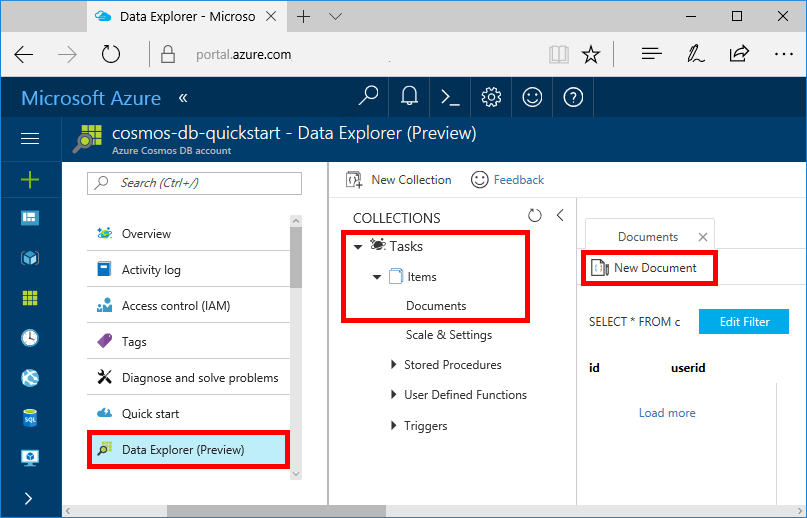
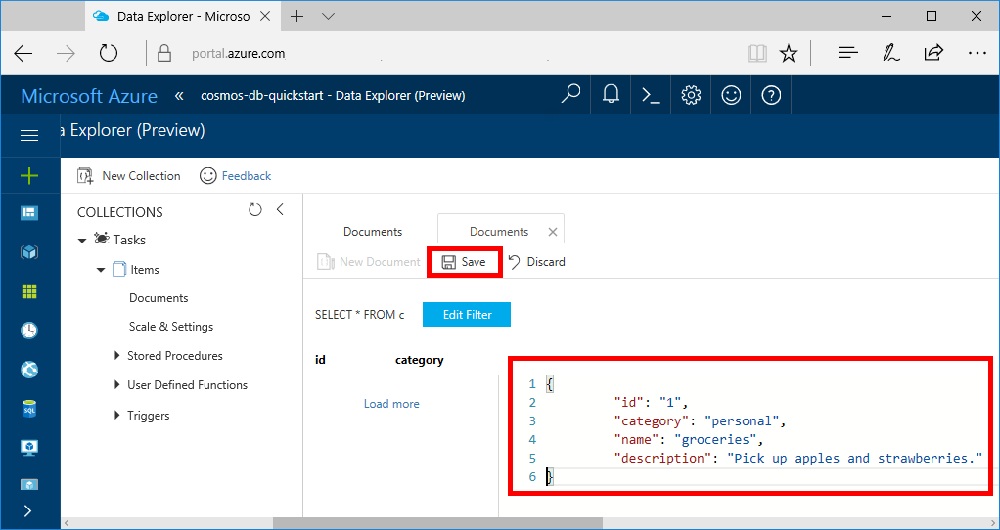
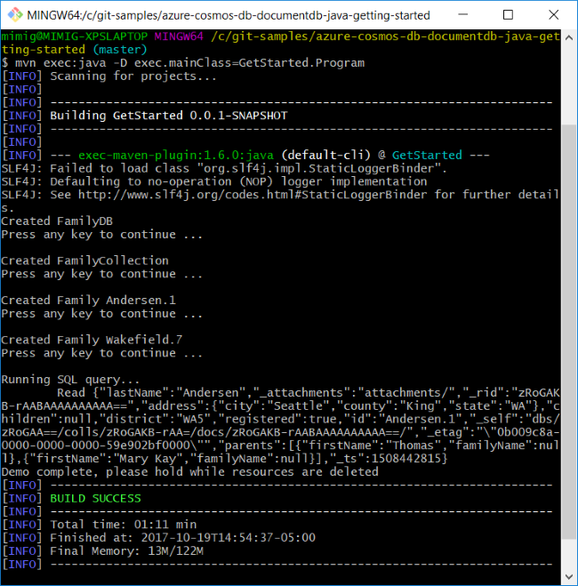

# Azure Cosmos DB: Create a document database using Java and the Azure portal

Azure Cosmos DB is Microsoft’s globally distributed multi-model database service. You can quickly create and query document, key/value, and graph databases, all of which benefit from the global distribution and horizontal scale capabilities at the core of Azure Cosmos DB. 

This quickstart creates a document database using the Azure portal tools for Azure Cosmos DB. This quickstart also shows you how to quickly create a Java console app using the [DocumentDB Java API](documentdb-sdk-java.md). The instructions in this quickstart can be followed on any operating system that is capable of running Java. By completing this quickstart you'll be familiar with creating and modifying document database resources in either the UI or programatically, whichever is your preference.

## Prerequisites

* [Java Development Kit (JDK) 1.7+](http://www.oracle.com/technetwork/java/javase/downloads/jdk8-downloads-2133151.html)
    * On Ubuntu, run `apt-get install default-jdk` to install the JDK.
    * Be sure to set the JAVA_HOME environment variable to point to the folder where the JDK is installed.
* [Download](http://maven.apache.org/download.cgi) and [install](http://maven.apache.org/install.html) a [Maven](http://maven.apache.org/) binary archive
    * On Ubuntu, you can run `apt-get install maven` to install Maven.
* [Git](https://www.git-scm.com/)
    * On Ubuntu, you can run `sudo apt-get install git` to install Git.

[!INCLUDE [quickstarts-free-trial-note](../../includes/quickstarts-free-trial-note.md)]

## Create a database account

Before you can create a graph database, you need to create a SQL (DocumentDB) database account with Azure Cosmos DB.

[!INCLUDE [cosmos-db-create-dbaccount](../../includes/cosmos-db-create-dbaccount.md)]

## Add a collection

[!INCLUDE [cosmos-db-create-collection](../../includes/cosmos-db-create-collection.md)]

<a id="add-sample-data"></a>
## Add sample data

You can now add data to your new collection using Data Explorer.

1. In Data Explorer, the new database appears in the Collections pane. Expand the **Tasks** database, expand the **Items** collection, click **Documents**, and then click **New Documents**. 

   
  
2. Now add a document to the collection with the following structure.

     ```json
     {
         "id": "1",
         "category": "personal",
         "name": "groceries",
         "description": "Pick up apples and strawberries.",
         "isComplete": false
     }
     ```

3. Once you've added the json to the **Documents** tab, click **Save**.

    

4.  Create and save one more document where you insert a unique value for the `id` property, and change the other properties as you see fit. Your new documents can have any structure you want as Azure Cosmos DB doesn't impose any schema on your data.

     You can now use queries in Data Explorer to retrieve your data by clicking the **Edit Filter** and **Apply Filter** buttons. By default, Data Explorer uses `SELECT * FROM c` to retrieve all documents in the collection, but you can change that to a different [SQL query](documentdb-sql-query.md), such as `SELECT * FROM c ORDER BY c._ts DESC`, to return all the documents in descending order based on their timestamp. 
 
     You can also use Data Explorer to create stored procedures, UDFs, and triggers to perform server-side business logic as well as scale throughput. Data Explorer exposes all of the built-in programmatic data access available in the APIs, but provides easy access to your data in the Azure portal.

## Clone the sample application

Now let's switch to working with code. Let's clone a DocumentDB API app from GitHub, set the connection string, and run it. You see how easy it is to work with data programmatically. 

1. Open a git terminal window, such as git bash, and `CD` to a working directory.  

2. Run the following command to clone the sample repository. 

    ```bash
    git clone https://github.com/Azure-Samples/azure-cosmos-db-documentdb-java-getting-started.git
    ```

## Review the code

Let's make a quick review of what's happening in the app. Open the `Program.java` file from the \src\GetStarted folder, and find these lines of code that create the Azure Cosmos DB resources. 

* The `DocumentClient` is initialized.

    ```java
    this.client = new DocumentClient("https://FILLME.documents.azure.com",
            "FILLME", 
            new ConnectionPolicy(),
            ConsistencyLevel.Session);
    ```

* A new database is created.

    ```java
    Database database = new Database();
    database.setId(databaseName);
    
    this.client.createDatabase(database, null);
    ```

* A new collection is created.

    ```java
    DocumentCollection collectionInfo = new DocumentCollection();
    collectionInfo.setId(collectionName);

    ...

    this.client.createCollection(databaseLink, collectionInfo, requestOptions);
    ```

* Some documents are created.

    ```java
    // Any Java object within your code can be serialized into JSON and written to Azure Cosmos DB
    Family andersenFamily = new Family();
    andersenFamily.setId("Andersen.1");
    andersenFamily.setLastName("Andersen");
    // More properties

    String collectionLink = String.format("/dbs/%s/colls/%s", databaseName, collectionName);
    this.client.createDocument(collectionLink, family, new RequestOptions(), true);
    ```

* A SQL query over JSON is performed.

    ```java
    FeedOptions queryOptions = new FeedOptions();
    queryOptions.setPageSize(-1);
    queryOptions.setEnableCrossPartitionQuery(true);

    String collectionLink = String.format("/dbs/%s/colls/%s", databaseName, collectionName);
    FeedResponse<Document> queryResults = this.client.queryDocuments(
        collectionLink,
        "SELECT * FROM Family WHERE Family.lastName = 'Andersen'", queryOptions);

    System.out.println("Running SQL query...");
    for (Document family : queryResults.getQueryIterable()) {
        System.out.println(String.format("\tRead %s", family));
    }
    ```    

## Update your connection string

Now go back to the Azure portal to get your connection string information and copy it into the app. This will enable your app to communicate with your hosted database.

1. In the [Azure portal](http://portal.azure.com/), in your Azure Cosmos DB account, in the left navigation click **Keys**, and then click **Read-write Keys**. You'll use the copy buttons on the right side of the screen to copy the URI and PRIMARY KEY into the `Program.java` file in the next step.

    

2. In the open `Program.java` file, copy your URI value from the portal (using the copy button) and make it the value of the endpoint to the DocumentClient constructor in `Program.java`. 

    `"https://FILLME.documents.azure.com"`

4. Then copy your PRIMARY KEY value from the portal and paste it over “FILLME”, making it the second parameter in the DocumentClient constructor. You've now updated your app with all the info it needs to communicate with Azure Cosmos DB. 
    
## Run the app

1. In the git terminal window, `cd` to the azure-cosmos-db-documentdb-java-getting-started folder.

2. In the git terminal window, type `mvn package` to install the required Java packages.

3. In the git terminal window, run `mvn exec:java -D exec.mainClass=GetStarted.Program` in the terminal window to start your Java application.

    In the terminal window, you'll receive notification that the FamilyDB database was created, and to press a key to continue. Press a key to create the database, then switch to the Data Explorer and you'll see that it now contains a FamilyDB database. Continue to press keys to create the collection and the documents and then perform a query. When the project completes, the resources are deleted from your account. 

    


## Review SLAs in the Azure portal

[!INCLUDE [cosmosdb-tutorial-review-slas](../../includes/cosmos-db-tutorial-review-slas.md)]

## Clean up resources

If you're not going to continue to use this app, delete all resources created by this quickstart in the Azure portal with the following steps:

1. From the left-hand menu in the Azure portal, click **Resource groups** and then click the name of the resource you created. 
2. On your resource group page, click **Delete**, type the name of the resource to delete in the text box, and then click **Delete**.

## Next steps

In this quickstart, you've learned how to create an Azure Cosmos DB account, document database, and collection using the Data Explorer, and run an app to do the same thing programmatically. You can now import additional data to your Cosmos DB account. 

> [!div class="nextstepaction"]
> [Import data into Azure Cosmos DB](import-data.md)


