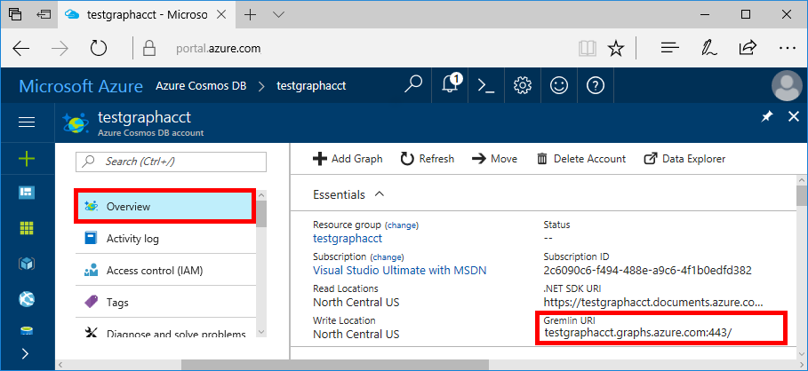
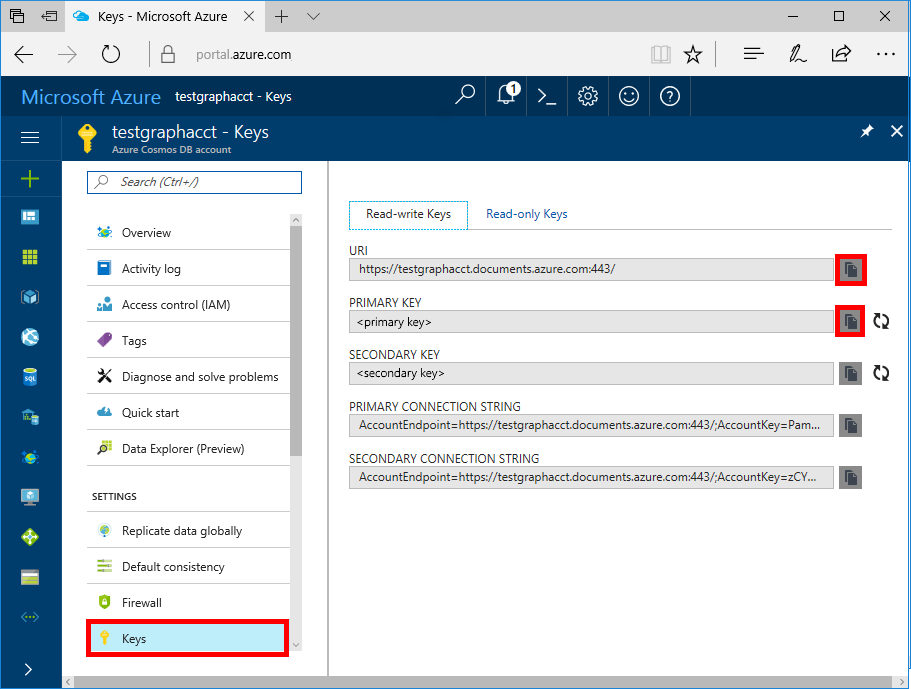

# Azure Cosmos DB: Create, query, and traverse a graph in the Gremlin console

> [!div class="op_single_selector"]
> * [Gremlin console](create-graph-gremlin-console.md)
> * [.NET](create-graph-dotnet.md)
> * [Java](create-graph-java.md)
> * [Node.js](create-graph-nodejs.md)
> * [Python](create-graph-python.md)
> * [PHP](create-graph-php.md)
>  

Azure Cosmos DB is Microsoft’s globally distributed multi-model database service. You can quickly create and query document, key/value, and graph databases, all of which benefit from the global distribution and horizontal scale capabilities at the core of Azure Cosmos DB. 

This quick start demonstrates how to create an Azure Cosmos DB [Gremlin API](graph-introduction.md) account, database, and graph (container) using the Azure portal and then use the [Gremlin Console](https://tinkerpop.apache.org/docs/current/reference/#gremlin-console) from  [Apache TinkerPop](http://tinkerpop.apache.org) to work with Gremlin API data. In this tutorial, you create and query vertices and edges, updating a vertex property, query vertices, traverse the graph, and drop a vertex.


The Gremlin console is Groovy/Java based and runs on Linux, Mac, and Windows. You can download it from the [Apache TinkerPop site](http://tinkerpop.apache.org/downloads.html).

## Prerequisites

You need to have an Azure subscription to create an Azure Cosmos DB account for this quickstart.

[!INCLUDE [quickstarts-free-trial-note](../../includes/quickstarts-free-trial-note.md)]

You also need to install the [Gremlin Console](http://tinkerpop.apache.org/). Use version 3.2.5 or above. (To use Gremlin Console on Windows, you need to install [Java Runtime](https://www.oracle.com/technetwork/java/javase/overview/index.html).)

## Create a database account

[!INCLUDE [cosmos-db-create-dbaccount-graph](../../includes/cosmos-db-create-dbaccount-graph.md)]

## Add a graph

[!INCLUDE [cosmos-db-create-graph](../../includes/cosmos-db-create-graph.md)]

## <a id="ConnectAppService"></a>Connect to your app service
1. Before starting the Gremlin Console, create or modify the remote-secure.yaml configuration file in the `apache-tinkerpop-gremlin-console-3.2.5/conf` directory.
2. Fill in your *host*, *port*, *username*, *password*, *connectionPool*, and *serializer* configurations as defined in the following table:

    Setting|Suggested value|Description
    ---|---|---
    hosts|[*account-name*.gremlin.cosmosdb.azure.com] or [*account-name*.graphs.azure.com] for accounts created before December 20th, 2017|See the following screenshot. This is the Gremlin URI value on the Overview page of the Azure portal, in square brackets, with the trailing :443/ removed.
    port|443|Set to 443.
    username|*Your username*|The resource of the form `/dbs/<db>/colls/<coll>` where `<db>` is your database name and `<coll>` is your collection name.
    password|*Your primary key*| See second screenshot below. This is your primary key, which you can retrieve from the Keys page of the Azure portal, in the Primary Key box. Use the copy button on the left side of the box to copy the value.
    connectionPool|{enableSsl: true}|Your connection pool setting for SSL.
    serializer|{ className: org.apache.tinkerpop.gremlin.<br>driver.ser.GraphSONMessageSerializerV1d0,<br> config: { serializeResultToString: true }}|Set to this value and delete any `\n` line breaks when pasting in the value.

    For the hosts value, copy the **Gremlin URI** value from the **Overview** page:


    For the password value, copy the **Primary key** from the **Keys** page:


Your remote-secure.yaml file should look like this:

```
hosts: [your_database_server.gremlin.cosmosdb.azure.com]
port: 443
username: /dbs/your_database_account/colls/your_collection
password: your_primary_key
connectionPool: {
  enableSsl: true
}
serializer: { className: org.apache.tinkerpop.gremlin.driver.ser.GraphSONMessageSerializerV1d0, config: { serializeResultToString: true }}
```

3. In your terminal, run `bin/gremlin.bat` or `bin/gremlin.sh` to start the [Gremlin Console](http://tinkerpop.apache.org/docs/3.2.5/tutorials/getting-started/).
4. In your terminal, run `:remote connect tinkerpop.server conf/remote-secure.yaml` to connect to your app service.

    > [!TIP]
    > If you receive the error `No appenders could be found for logger` ensure that you updated the serializer value in the remote-secure.yaml file as described in step 2. 

5. Next run `:remote console` to redirect all console commands to the remote server.

   > [!NOTE]
   > If you don't run the `:remote console` command but would like to redirect all console commands to the remote server, you should prefix the command with `:>`, for example you should run the command as `:> g.V().count()`. This prefix is a part of the command and it is important when using the Gremlin console with Azure Cosmos DB. Omitting this prefix instructs the console to execute the command locally, often against an in-memory graph. Using this prefix `:>` tells the console to execute a remote command, in this case against Azure Cosmos DB (either the localhost emulator, or an Azure instance).

Great! Now that we finished the setup, let's start running some console commands.

Let's try a simple count() command. Type the following into the console at the prompt:

```
g.V().count()
```

## Create vertices and edges

Let's begin by adding five person vertices for *Thomas*, *Mary Kay*, *Robin*, *Ben*, and *Jack*.

Input (Thomas):

```
g.addV('person').property('firstName', 'Thomas').property('lastName', 'Andersen').property('age', 44).property('userid', 1)
```

Output:

```
==>[id:796cdccc-2acd-4e58-a324-91d6f6f5ed6d,label:person,type:vertex,properties:[firstName:[[id:f02a749f-b67c-4016-850e-910242d68953,value:Thomas]],lastName:[[id:f5fa3126-8818-4fda-88b0-9bb55145ce5c,value:Andersen]],age:[[id:f6390f9c-e563-433e-acbf-25627628016e,value:44]],userid:[[id:796cdccc-2acd-4e58-a324-91d6f6f5ed6d|userid,value:1]]]]
```
Input (Mary Kay):

```
g.addV('person').property('firstName', 'Mary Kay').property('lastName', 'Andersen').property('age', 39).property('userid', 2)

```

Output:

```
==>[id:0ac9be25-a476-4a30-8da8-e79f0119ea5e,label:person,type:vertex,properties:[firstName:[[id:ea0604f8-14ee-4513-a48a-1734a1f28dc0,value:Mary Kay]],lastName:[[id:86d3bba5-fd60-4856-9396-c195ef7d7f4b,value:Andersen]],age:[[id:bc81b78d-30c4-4e03-8f40-50f72eb5f6da,value:39]],userid:[[id:0ac9be25-a476-4a30-8da8-e79f0119ea5e|userid,value:2]]]]

```

Input (Robin):

```
g.addV('person').property('firstName', 'Robin').property('lastName', 'Wakefield').property('userid', 3)
```

Output:

```
==>[id:8dc14d6a-8683-4a54-8d74-7eef1fb43a3e,label:person,type:vertex,properties:[firstName:[[id:ec65f078-7a43-4cbe-bc06-e50f2640dc4e,value:Robin]],lastName:[[id:a3937d07-0e88-45d3-a442-26fcdfb042ce,value:Wakefield]],userid:[[id:8dc14d6a-8683-4a54-8d74-7eef1fb43a3e|userid,value:3]]]]
```

Input (Ben):

```
g.addV('person').property('firstName', 'Ben').property('lastName', 'Miller').property('userid', 4)

```

Output:

```
==>[id:ee86b670-4d24-4966-9a39-30529284b66f,label:person,type:vertex,properties:[firstName:[[id:a632469b-30fc-4157-840c-b80260871e9a,value:Ben]],lastName:[[id:4a08d307-0719-47c6-84ae-1b0b06630928,value:Miller]],userid:[[id:ee86b670-4d24-4966-9a39-30529284b66f|userid,value:4]]]]
```

Input (Jack):

```
g.addV('person').property('firstName', 'Jack').property('lastName', 'Connor').property('userid', 5)
```

Output:

```
==>[id:4c835f2a-ea5b-43bb-9b6b-215488ad8469,label:person,type:vertex,properties:[firstName:[[id:4250824e-4b72-417f-af98-8034aa15559f,value:Jack]],lastName:[[id:44c1d5e1-a831-480a-bf94-5167d133549e,value:Connor]],userid:[[id:4c835f2a-ea5b-43bb-9b6b-215488ad8469|userid,value:5]]]]
```


Next, let's add edges for relationships between our people.

Input (Thomas -> Mary Kay):

```
g.V().hasLabel('person').has('firstName', 'Thomas').addE('knows').to(g.V().hasLabel('person').has('firstName', 'Mary Kay'))
```

Output:

```
==>[id:c12bf9fb-96a1-4cb7-a3f8-431e196e702f,label:knows,type:edge,inVLabel:person,outVLabel:person,inV:0d1fa428-780c-49a5-bd3a-a68d96391d5c,outV:1ce821c6-aa3d-4170-a0b7-d14d2a4d18c3]
```

Input (Thomas -> Robin):

```
g.V().hasLabel('person').has('firstName', 'Thomas').addE('knows').to(g.V().hasLabel('person').has('firstName', 'Robin'))
```

Output:

```
==>[id:58319bdd-1d3e-4f17-a106-0ddf18719d15,label:knows,type:edge,inVLabel:person,outVLabel:person,inV:3e324073-ccfc-4ae1-8675-d450858ca116,outV:1ce821c6-aa3d-4170-a0b7-d14d2a4d18c3]
```

Input (Robin -> Ben):

```
g.V().hasLabel('person').has('firstName', 'Robin').addE('knows').to(g.V().hasLabel('person').has('firstName', 'Ben'))
```

Output:

```
==>[id:889c4d3c-549e-4d35-bc21-a3d1bfa11e00,label:knows,type:edge,inVLabel:person,outVLabel:person,inV:40fd641d-546e-412a-abcc-58fe53891aab,outV:3e324073-ccfc-4ae1-8675-d450858ca116]
```

## Update a vertex

Let's update the *Thomas* vertex with a new age of *45*.

Input:
```
g.V().hasLabel('person').has('firstName', 'Thomas').property('age', 45)
```
Output:

```
==>[id:ae36f938-210e-445a-92df-519f2b64c8ec,label:person,type:vertex,properties:[firstName:[[id:872090b6-6a77-456a-9a55-a59141d4ebc2,value:Thomas]],lastName:[[id:7ee7a39a-a414-4127-89b4-870bc4ef99f3,value:Andersen]],age:[[id:a2a75d5a-ae70-4095-806d-a35abcbfe71d,value:45]]]]
```

## Query your graph

Now, let's run a variety of queries against your graph.

First, let's try a query with a filter to return only people who are older than 40 years old.

Input (filter query):

```
g.V().hasLabel('person').has('age', gt(40))
```

Output:

```
==>[id:ae36f938-210e-445a-92df-519f2b64c8ec,label:person,type:vertex,properties:[firstName:[[id:872090b6-6a77-456a-9a55-a59141d4ebc2,value:Thomas]],lastName:[[id:7ee7a39a-a414-4127-89b4-870bc4ef99f3,value:Andersen]],age:[[id:a2a75d5a-ae70-4095-806d-a35abcbfe71d,value:45]]]]
```

Next, let's project the first name for the people who are older than 40 years old.

Input (filter + projection query):

```
g.V().hasLabel('person').has('age', gt(40)).values('firstName')
```

Output:

```
==>Thomas
```

## Traverse your graph

Let's traverse the graph to return all of Thomas's friends.

Input (friends of Thomas):

```
g.V().hasLabel('person').has('firstName', 'Thomas').outE('knows').inV().hasLabel('person')
```

Output: 

```
==>[id:f04bc00b-cb56-46c4-a3bb-a5870c42f7ff,label:person,type:vertex,properties:[firstName:[[id:14feedec-b070-444e-b544-62be15c7167c,value:Mary Kay]],lastName:[[id:107ab421-7208-45d4-b969-bbc54481992a,value:Andersen]],age:[[id:4b08d6e4-58f5-45df-8e69-6b790b692e0a,value:39]]]]
==>[id:91605c63-4988-4b60-9a30-5144719ae326,label:person,type:vertex,properties:[firstName:[[id:f760e0e6-652a-481a-92b0-1767d9bf372e,value:Robin]],lastName:[[id:352a4caa-bad6-47e3-a7dc-90ff342cf870,value:Wakefield]]]]
```

Next, let's get the next layer of vertices. Traverse the graph to return all the friends of Thomas's friends.

Input (friends of friends of Thomas):

```
g.V().hasLabel('person').has('firstName', 'Thomas').outE('knows').inV().hasLabel('person').outE('knows').inV().hasLabel('person')
```
Output:

```
==>[id:a801a0cb-ee85-44ee-a502-271685ef212e,label:person,type:vertex,properties:[firstName:[[id:b9489902-d29a-4673-8c09-c2b3fe7f8b94,value:Ben]],lastName:[[id:e084f933-9a4b-4dbc-8273-f0171265cf1d,value:Miller]]]]
```

## Drop a vertex

Let's now delete a vertex from the graph database.

Input (drop Jack vertex):

```
g.V().hasLabel('person').has('firstName', 'Jack').drop()
```

## Clear your graph

Finally, let's clear the database of all vertices and edges.

Input:

```
g.E().drop()
g.V().drop()
```

Congratulations! You've completed this Azure Cosmos DB: Gremlin API tutorial!

## Review SLAs in the Azure portal

[!INCLUDE [cosmosdb-tutorial-review-slas](../../includes/cosmos-db-tutorial-review-slas.md)]

## Clean up resources

[!INCLUDE [cosmosdb-delete-resource-group](../../includes/cosmos-db-delete-resource-group.md)]

## Next steps

In this quickstart, you've learned how to create an Azure Cosmos DB account, create a graph using the Data Explorer, create vertices and edges, and traverse your graph using the Gremlin console. You can now build more complex queries and implement powerful graph traversal logic using Gremlin. 

> [!div class="nextstepaction"]
> [Query using Gremlin](tutorial-query-graph.md)
