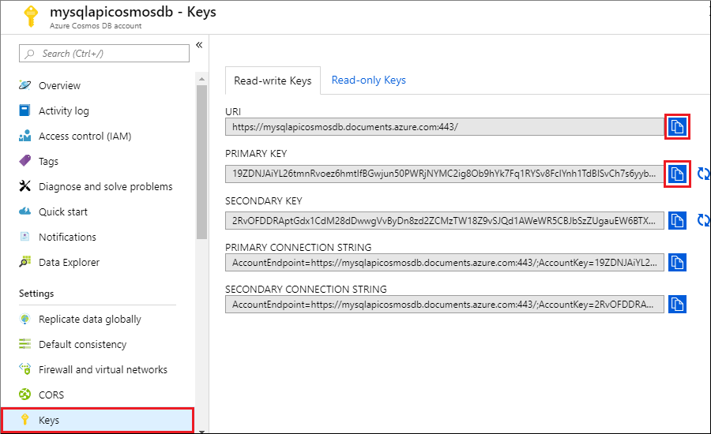

# Azure Cosmos DB: Build a SQL API app with Node.js and the Azure portal

Azure Cosmos DB is Microsoft’s globally distributed multi-model database service. You can quickly create and query document, key/value, and graph databases, all of which benefit from the global distribution and horizontal scale capabilities at the core of Azure Cosmos DB. 

This quick start demonstrates how to create an Azure Cosmos DB [SQL API](sql-api-introduction.md) account, document database, and collection using the Azure portal. You then build and run a console app built on the [SQL Node.js API](sql-api-sdk-node.md).

## Prerequisites

[!INCLUDE [quickstarts-free-trial-note](../../includes/quickstarts-free-trial-note.md)] 
[!INCLUDE [cosmos-db-emulator-docdb-api](../../includes/cosmos-db-emulator-docdb-api.md)]

* In addition:
	* [Node.js](https://nodejs.org/en/) version v0.10.29 or higher
	* [Git](http://git-scm.com/)

## Create a database account

[!INCLUDE [cosmos-db-create-dbaccount](../../includes/cosmos-db-create-dbaccount.md)]

## Add a collection

[!INCLUDE [cosmos-db-create-collection](../../includes/cosmos-db-create-collection.md)]

## Add sample data

[!INCLUDE [cosmos-db-create-sql-api-add-sample-data](../../includes/cosmos-db-create-sql-api-add-sample-data.md)]

## Query your data

[!INCLUDE [cosmos-db-create-sql-api-query-data](../../includes/cosmos-db-create-sql-api-query-data.md)]

## Clone the sample application

Now let's clone a SQL API app from github, set the connection string, and run it. You see how easy it is to work with data programmatically. 

1. Open a command prompt, create a new folder named git-samples, then close the command prompt.

    ```bash
    md "C:\git-samples"
    ```

2. Open a git terminal window, such as git bash, and use the `cd` command to change to the new folder to install the sample app.

    ```bash
    cd "C:\git-samples"
    ```

3. Run the following command to clone the sample repository. This command creates a copy of the sample app on your computer.

    ```bash
    git clone https://github.com/Azure-Samples/azure-cosmos-db-documentdb-nodejs-getting-started.git
    ```

## Review the code

This step is optional. If you're interested in learning how the database resources are created in the code, you can review the following snippets. Otherwise, you can skip ahead to [Update your connection string](#update-your-connection-string). 

The following snippets are all taken from the app.js file.

* The `documentClient` is initialized.

    ```nodejs
    var client = new documentClient(config.endpoint, { "masterKey": config.primaryKey });
    ```

* A new database is created.

    ```nodejs
    client.createDatabase(config.database, (err, created) => {
        if (err) reject(err)
        else resolve(created);
    });
    ```

* A new collection is created.

    ```nodejs
    client.createCollection(databaseUrl, config.collection, { offerThroughput: 400 }, (err, created) => {
        if (err) reject(err)
        else resolve(created);
    });
    ```

* Some documents are created.

    ```nodejs
    client.createDocument(collectionUrl, document, (err, created) => {
        if (err) reject(err)
        else resolve(created);
    });
    ```

* A SQL query over JSON is performed.

    ```nodejs
    client.queryDocuments(
        collectionUrl,
        'SELECT VALUE r.children FROM root r WHERE r.lastName = "Andersen"'
    ).toArray((err, results) => {
        if (err) reject(err)
        else {
            for (var queryResult of results) {
                let resultString = JSON.stringify(queryResult);
                console.log(`\tQuery returned ${resultString}`);
            }
            console.log();
            resolve(results);
        }
    });
    ```    

## Update your connection string

Now go back to the Azure portal to get your connection string information and copy it into the app.

1. In the [Azure portal](http://portal.azure.com/), in your Azure Cosmos DB account, in the left navigation click **Keys**, and then click **Read-write Keys**. You'll use the copy buttons on the right side of the screen to copy the URI and Primary Key into the `config.js` file in the next step.

    

2. In Open the `config.js` file. 

3. Copy your URI value from the portal (using the copy button) and make it the value of the endpoint key in `config.js`. 

    `config.endpoint = "https://FILLME.documents.azure.com"`

4. Then copy your PRIMARY KEY value from the portal and make it the value of the `config.primaryKey` in `config.js`. You've now updated your app with all the info it needs to communicate with Azure Cosmos DB. 

    `config.primaryKey "FILLME"`
    
## Run the app
1. Run `npm install` in a terminal to install required npm modules

2. Run `node app.js` in a terminal to start your node application.

You can now go back to Data Explorer and see query, modify, and work with this new data. 

## Review SLAs in the Azure portal

[!INCLUDE [cosmosdb-tutorial-review-slas](../../includes/cosmos-db-tutorial-review-slas.md)]

## Clean up resources

[!INCLUDE [cosmosdb-delete-resource-group](../../includes/cosmos-db-delete-resource-group.md)]

## Next steps

In this quickstart, you've learned how to create an Azure Cosmos DB account, create a collection using the Data Explorer, and run an app. You can now import additional data to your Cosmos DB account. 

> [!div class="nextstepaction"]
> [Import data into Azure Cosmos DB](import-data.md)


