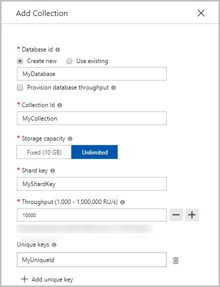

# Create an Azure Cosmos container

This article explains the different ways to create a container (collection, table, or graph). You use the Azure portal, the Azure CLI, or supported SDKs. This article demonstrates how to create a container, specify the partition key, and provision throughput.

## Create a container by using Azure portal

### <a id="portal-sql"></a>SQL API

1. Sign in to the [Azure portal](https://portal.azure.com/).

1. [Create a new Azure Cosmos DB account](create-sql-api-dotnet.md#create-a-database-account), or select an existing account.

1. Open the **Data Explorer** pane, and select **New Collection**. Next, provide the following details:

   * Indicate whether you are creating a new database or using an existing one.
   * Enter a collection ID.
   * Enter a partition key.
   * Enter a throughput (for example, 1000 RUs).
   * Select **OK**.


### <a id="portal-mongodb"></a>Azure Cosmos DB API for MongoDB

1. Sign in to the [Azure portal](https://portal.azure.com/).

1. [Create a new Azure Cosmos DB account](create-mongodb-dotnet.md#create-a-database-account), or select an existing account.

1. Open the **Data Explorer** pane, and select **New Collection**. Next, provide the following details:

   * Indicate whether you are creating a new database or using an existing one.
   * Enter a collection ID.
   * Select **Unlimited** storage capacity.
   * Enter a shard key.
   * Enter a throughput (for example, 1000 RUs).
   * Select **OK**.



### <a id="portal-cassandra"></a>Cassandra API

1. Sign in to the [Azure portal](https://portal.azure.com/).

1. [Create a new Azure Cosmos DB account](create-cassandra-dotnet.md#create-a-database-account), or select an existing account.

1. Open the **Data Explorer** pane, and select **New Table**. Next, provide the following details:

   * Indicate whether you are creating a new keyspace, or using an existing one.
   * Enter a table name.
   * Enter the properties and specify a primary key.
   * Enter a throughput (for example, 1000 RUs).
   * Select **OK**.


> [!NOTE]
> For Cassandra API, the primary key is used as the partition key.

### <a id="portal-gremlin"></a>Gremlin API

1. Sign in to the [Azure portal](https://portal.azure.com/).

1. [Create a new Azure Cosmos DB account](create-graph-dotnet.md#create-a-database-account), or select an existing account.

1. Open the **Data Explorer** pane, and select **New Graph**. Next, provide the following details:

   * Indicate whether you are creating a new database, or using an existing one.
   * Enter a graph ID.
   * Select **Unlimited** storage capacity.
   * Enter a partition key for vertices.
   * Enter a throughput (for example, 1000 RUs).
   * Select **OK**.


### <a id="portal-table"></a>Table API

1. Sign in to the [Azure portal](https://portal.azure.com/).

1. [Create a new Azure Cosmos DB account](create-table-dotnet.md#create-a-database-account), or select an existing account.

1. Open the **Data Explorer** pane, and select **New Table**. Next, provide the following details:

   * Enter a table ID.
   * Select **Unlimited** storage capacity.
   * Enter a throughput (for example, 1000 RUs).
   * Select **OK**.


> [!Note]
> For Table API, the partition key is specified each time you add a new row.

## Create a container by using Azure CLI

### <a id="cli-sql"></a>SQL API

```azurecli-interactive
# Create a container with a partition key and provision 1000 RU/s throughput.

az cosmosdb collection create \
    --resource-group $resourceGroupName \
    --collection-name $containerName \
    --name $accountName \
    --db-name $databaseName \
    --partition-key-path /myPartitionKey \
    --throughput 1000
```

### <a id="cli-mongodb"></a>Azure Cosmos DB API for MongoDB

```azurecli-interactive
# Create a collection with a shard key and provision 1000 RU/s throughput.
az cosmosdb collection create \
    --resource-group $resourceGroupName \
    --collection-name $collectionName \
    --name $accountName \
    --db-name $databaseName \
    --partition-key-path /myShardKey \
    --throughput 1000
```

### <a id="cli-cassandra"></a>Cassandra API

```azurecli-interactive
# Create a table with a partition/primary key and provision 1000 RU/s throughput.
az cosmosdb collection create \
    --resource-group $resourceGroupName \
    --collection-name $tableName \
    --name $accountName \
    --db-name $keyspaceName \
    --partition-key-path /myPrimaryKey \
    --throughput 1000
```

### <a id="cli-gremlin"></a>Gremlin API

```azurecli-interactive
# Create a graph with a partition key and provision 1000 RU/s throughput.
az cosmosdb collection create \
    --resource-group $resourceGroupName \
    --collection-name $graphName \
    --name $accountName \
    --db-name $databaseName \
    --partition-key-path /myPartitionKey \
    --throughput 1000
```

### <a id="cli-table"></a>Table API

```azurecli-interactive
# Create a table with 1000 RU/s
# Note: you don't need to specify partition key in the following command because the partition key is set on each row.
az cosmosdb collection create \
    --resource-group $resourceGroupName \
    --collection-name $tableName \
    --name $accountName \
    --db-name $databaseName \
    --throughput 1000
```

## Create a container by using .NET SDK

### <a id="dotnet-sql-graph"></a>SQL API and Gremlin API

```csharp
// Create a container with a partition key and provision 1000 RU/s throughput.
DocumentCollection myCollection = new DocumentCollection();
myCollection.Id = "myContainerName";
myCollection.PartitionKey.Paths.Add("/myPartitionKey");

await client.CreateDocumentCollectionAsync(
    UriFactory.CreateDatabaseUri("myDatabaseName"),
    myCollection,
    new RequestOptions { OfferThroughput = 1000 });
```

### <a id="dotnet-mongodb"></a>Azure Cosmos DB API for MongoDB

```csharp
// Create a collection with a partition key by using Mongo Shell:
db.runCommand( { shardCollection: "myDatabase.myCollection", key: { myShardKey: "hashed" } } )
```

> [!Note]
MongoDB wire protocol does not request units. To create a new collection with throughput, use the Azure portal or SQL API.

### <a id="dotnet-cassandra"></a>Cassandra API

```csharp
// Create a Cassandra table with a partition/primary key and provision 1000 RU/s throughput.
session.Execute(CREATE TABLE myKeySpace.myTable(
    user_id int PRIMARY KEY,
    firstName text,
    lastName text) WITH cosmosdb_provisioned_throughput=1000);
```

## Next steps

- [Partitioning in Azure Cosmos DB](partitioning-overview.md)
