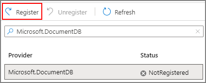
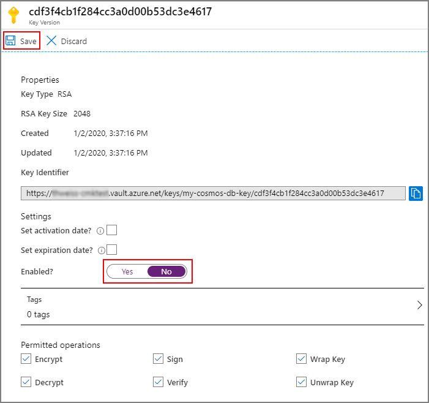

# Configure customer-managed keys for your Azure Cosmos DB account

> [!NOTE]
> At this time, you must request access to use this capability. To do so, please contact [cosmosdbpm@microsoft.com](mailto:cosmosdbpm@microsoft.com).

Data stored in your Azure Cosmos DB account is automatically and seamlessly encrypted. Azure Cosmos DB offers two options for managing the keys used to encrypt your data at rest:
- **Service-managed keys**. By default, Microsoft manages the keys used to encrypt your Azure Cosmos DB account.
- **Customer-managed keys (CMK)**. You can optionally choose to add a second layer of encryption with keys you manage.

Customer-managed keys must be stored in [Azure Key Vault](../key-vault/key-vault-overview.md). A key must be provided for each CMK-enabled account and is used to encrypt all the data stored in that account.

## Setup

Currently, customer-managed keys are only available for new accounts and need to be set up during account creation.

### 1. Make sure the Azure Cosmos DB resource provider is registered for your Azure subscription

From the Azure portal, go to your Azure subscription and select **Resource providers** from the left menu:


Search for the **Microsoft.DocumentDB** resource provider.
- If the resource provider is already marked as registered, nothing needs to be done.
- If not, select it and click on **Register**:

    

### 2. Configure your Azure Key Vault instance

Using customer-managed keys with Azure Cosmos DB requires two properties to be set on the Azure Key Vault instance you plan to use to host your encryption keys: **Soft Delete** and **Do Not Purge**. These properties aren't enabled by default but can be enabled using either PowerShell or the Azure CLI.

To learn how to enable these properties on an existing Azure Key Vault instance, see the sections titled Enabling soft-delete and Enabling Purge Protection in one of the following articles:
- [How to use soft-delete with PowerShell](../key-vault/key-vault-soft-delete-powershell.md)
- [How to use soft-delete with Azure CLI](../key-vault/key-vault-soft-delete-cli.md)

### 3. Add an access policy to your Azure Key Vault instance

From the Azure portal, go to the Azure Key Vault instance you plan to use to host your encryption keys. Then, select **Access Policies** from the left menu:


- Select **+ Add Access Policy**
- Under the **Key permissions** dropdown menu, select **Get**, **Unwrap Key** and **Wrap Key**:

    

- Under **Select principal**, select **None selected**. Then, search for and select the **Azure Cosmos DB** principal. Finally, click **Select** at the bottom (if the **Azure Cosmos DB** principal can't be found, you may need to re-register the **Microsoft.DocumentDB** resource provider at step 1):

    

- Select **Add** to add the new access policy

### 4. Generate a key in Azure Key Vault

From the Azure portal, go the Azure Key Vault instance you plan to use to host your encryption keys. Then, select **Keys** from the left menu:


- Select **Generate/Import**
- Provide a name for the new key, select an RSA key size (a minimum of 3072 is recommended for best security) and select **Create**:

    

- Once the key is created, click on the newly created key, then on its current version
- Copy the key’s **Key Identifier** except the part after the last forward slash:

    

### 5. Create a new Azure Cosmos DB account

#### Using the Azure portal

When creating a new Azure Cosmos DB account from the Azure portal, choose **Customer-managed key** at the **Encryption** step. In the **Key URI** field, pass the URI of the Azure Key Vault key copied from step 4:


#### Using PowerShell

When creating a new Azure Cosmos DB account with PowerShell,
- pass the URI of the Azure Key Vault key copied from step 4 under the **keyVaultKeyUri** property in the **PropertyObject**,
- make sure to use "2019-12-12" as the API version.

> [!IMPORTANT]
> The `Location` parameter has to be set explicitly for the account to be successfully created with CMK.

```powershell
$resourceGroupName = "myResourceGroup"
$accountLocation = "West US 2"
$accountName = "mycosmosaccount"

$failoverLocations = @(
    @{ "locationName"="West US 2"; "failoverPriority"=0 }
)

$CosmosDBProperties = @{
    "databaseAccountOfferType"="Standard";
    "locations"=$failoverLocations;
    "keyVaultKeyUri" = "https://<my-vault>.vault.azure.net/keys/<my-key>";
}

New-AzResource -ResourceType "Microsoft.DocumentDb/databaseAccounts" `
    -ApiVersion "2019-12-12" -ResourceGroupName $resourceGroupName `
    -Location $accountLocation -Name $accountName -PropertyObject $CosmosDBProperties
```

#### Using Azure Resource Manager templates

When creating a new Azure Cosmos DB account through an Azure Resource Manager template:
- pass the URI of the Azure Key Vault key copied from step 4 under the **keyVaultKeyUri** property in the **properties** object
- make sure to use "2019-12-12" as the API version

> [!IMPORTANT]
> The `location` parameter has to be set explicitly for the account to be successfully created with CMK.

```json
{
    "$schema": "https://schema.management.azure.com/schemas/2015-01-01/deploymentTemplate.json#",
    "contentVersion": "1.0.0.0",
    "parameters": {
        "accountName": {
            "type": "string"
        },
        "location": {
            "type": "string"
        },
        "keyVaultKeyUri": {
            "type": "string"
        }
    },
    "resources": 
    [
        {
            "type": "Microsoft.DocumentDB/databaseAccounts",
            "name": "[parameters('accountName')]",
            "apiVersion": "2019-12-12",
            "kind": "GlobalDocumentDB",
            "location": "[parameters('location')]",
            "properties": {
                "locations": [ 
                    {
                        "locationName": "[parameters('location')]",
                        "failoverPriority": 0,
                        "isZoneRedundant": false
                    }
                ],
                "databaseAccountOfferType": "Standard",
                "keyVaultKeyUri": "[parameters('keyVaultKeyUri')]"
            }
        }
    ]
}

```

```powershell
$resourceGroupName = "myResourceGroup"
$accountName = "mycosmosaccount"
$accountLocation = "West US 2"
$keyVaultKeyUri = "https://<my-vault>.vault.azure.net/keys/<my-key>"

New-AzResourceGroupDeployment `
    -ResourceGroupName $resourceGroupName `
    -TemplateFile "deploy.json" `
    -accountName $accountName `
    -location $accountLocation `
    -keyVaultKeyUri $keyVaultKeyUri
```

## Frequently asked questions

### Is there any additional charge when using customer-managed keys?

Yes. To account for the additional compute load that is required to manage data encryption and decryption with customer-managed keys, all operations executed against the Azure Cosmos DB account get a 25% increase in [Request Units](./request-units.md) consumed.

### What data gets encrypted with the CMK?

All the data stored in your Azure Cosmos DB account gets encrypted with the CMK, except for the following meta-data:
- the names of your Azure Cosmos DB [accounts, databases and containers](./account-overview.md#elements-in-an-azure-cosmos-account),
- the names of your [stored procedures](./stored-procedures-triggers-udfs.md),
- the property paths declared in your [indexing policies](./index-policy.md),
- the values of your containers' [partition key](./partitioning-overview.md).

### Will customer-managed keys be supported for existing accounts?

This feature is currently available for new accounts only.

### Is there a plan to support finer granularity than account-level keys?

Not currently, however container-level keys are being considered.

### How does customer-managed keys affect backups?

Azure Cosmos DB takes [regular and automatic backups](./online-backup-and-restore.md) of the data stored in your account. This operation backs up the encrypted data. For a restored backup to be usable, the encryption key used at the time of the backup must still be available. This means that no revocation shall have been made and the version of the key that was used at the time of the backup shall still be enabled.

### How do I revoke an encryption key?

Key revocation is done by disabling the latest version of the key:



Alternatively, to revoke all keys from an Azure Key Vault instance, you can delete the access policy granted to the Azure Cosmos DB principal:


### What operations are available after a customer-managed key is revoked?

The only operation possible when the encryption key has been revoked is account deletion.

## Next steps

- Learn more about [data encryption in Azure Cosmos DB](./database-encryption-at-rest.md)
- Get an overview of [secure access to data in Cosmos DB](secure-access-to-data.md)