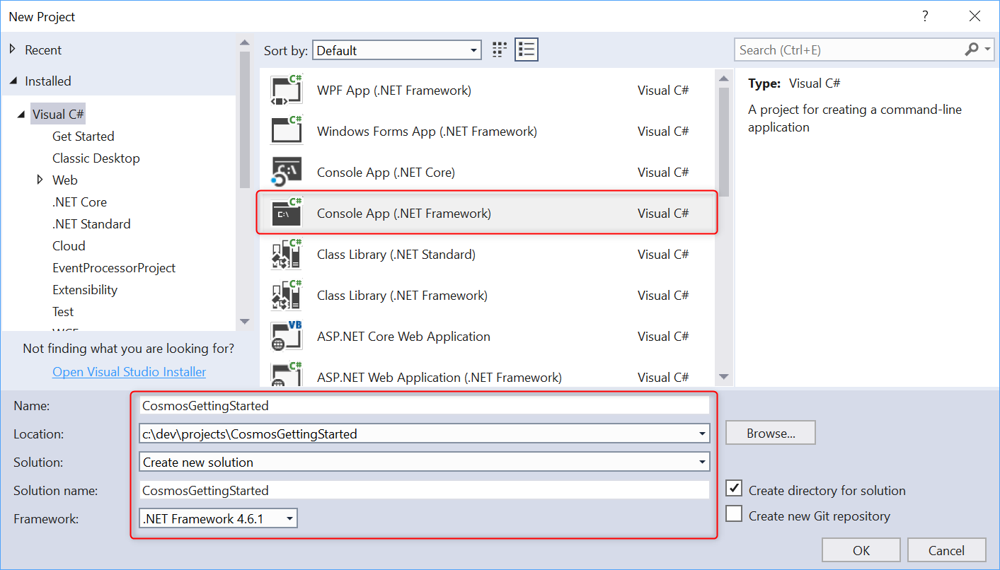
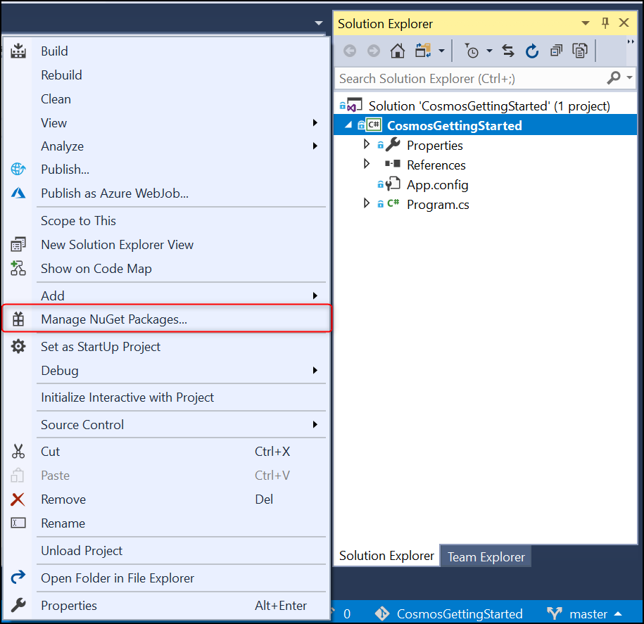
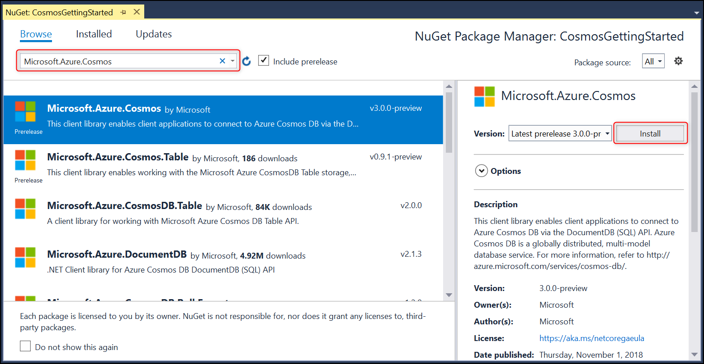
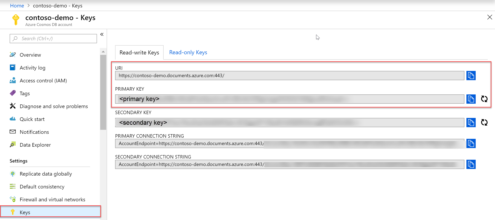
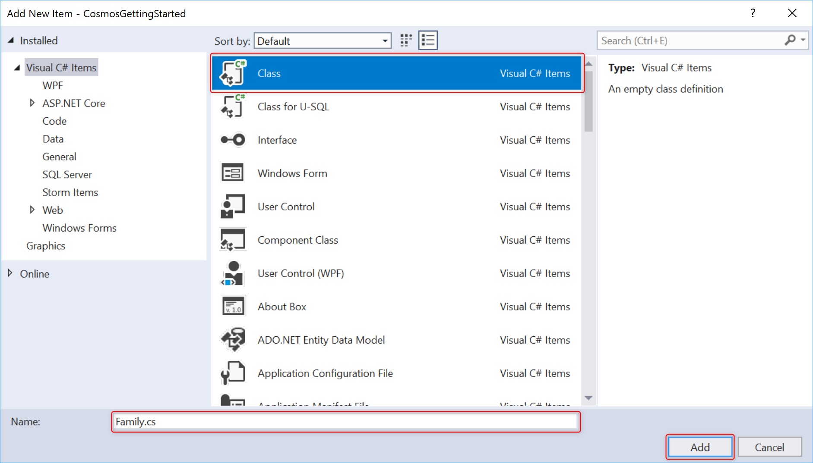

# Build a .NET console app to manage data in Azure Cosmos DB SQL API account (SDK Version 3 Preview)

> [!div class="op_single_selector"]
> * [.NET (Preview)](sql-api-dotnet-get-started-preview.md)
> * [.NET](sql-api-get-started.md)
> * [.NET Core](sql-api-dotnetcore-get-started.md)
> * [.NET Core (Preview)](sql-api-dotnet-core-get-started-preview.md)
> * [Java](sql-api-java-get-started.md)
> * [Async Java](sql-api-async-java-get-started.md)
> * [Node.js](sql-api-nodejs-get-started.md)
> 

Welcome to the Azure Cosmos DB SQL API getting started tutorial! After following this tutorial, you'll have a console application that creates and queries Azure Cosmos DB resources. This tutorial uses [Version 3.0+](https://www.nuget.org/packages/Microsoft.Azure.Cosmos) of the Azure Cosmos DB .NET SDK, which targets [.NET Standard 2.0.](https://docs.microsoft.com/dotnet/standard/net-standard)

This tutorial covers:

> [!div class="checklist"]
> * Creating and connecting to an Azure Cosmos account
> * Configuring your project in Visual Studio
> * Creating a database and a container
> * Adding items to the container
> * Querying the container
> * CRUD operations on the item
> * Deleting the database

Don't have time? Don't worry! The complete solution is available on [GitHub](https://github.com/Azure-Samples/cosmos-dotnet-getting-started). Jump to the [Get the complete tutorial solution section](#GetSolution) for quick instructions.

Now let's get started!

## Prerequisites

* An active Azure account. If you don't have one, you can sign up for a [free account](https://azure.microsoft.com/free/). 

  [!INCLUDE [cosmos-db-emulator-docdb-api](../../includes/cosmos-db-emulator-docdb-api.md)]

* [!INCLUDE [cosmos-db-emulator-vs](../../includes/cosmos-db-emulator-vs.md)]

## Step 1: Create an Azure Cosmos DB account
Let's create an Azure Cosmos DB account. If you already have an account you want to use, you can skip ahead to [Setup your Visual Studio Solution](#SetupVS). If you are using the Azure Cosmos DB Emulator, follow the steps at [Azure Cosmos DB Emulator](local-emulator.md) to setup the emulator and skip ahead to [Setup your Visual Studio project](#SetupVS).

[!INCLUDE [create-dbaccount-preview](../../includes/cosmos-db-create-dbaccount-preview.md)]

## <a id="SetupVS"></a>Step 2: Setup your Visual Studio project
1. Open **Visual Studio 2017** on your computer.
1. On the **File** menu, select **New**, and then choose **Project**.
1. In the **New Project** dialog, select **Visual C#** / **Console App (.NET Framework)**, name your project, and then click **OK**.
    
1. In the **Solution Explorer**, right click on your new console application, which is under your Visual Studio solution, and then click **Manage NuGet Packages...**
    
    
1. In the **NuGet** tab, click **Browse**, and type **Microsoft.Azure.Cosmos** in the search box. Be sure to check *Include prelease* to find the preview.
1. Within the results, find **Microsoft.Azure.Cosmos** and click **Install**.
   The package ID for the Azure Cosmos DB SQL API Client Library is [Microsoft Azure Cosmos DB Client Library](https://www.nuget.org/packages/Microsoft.Azure.Cosmos/).
   

    If you get a message about reviewing changes to the solution, click **OK**. If you get a message about license acceptance, click **I accept**.

Great! Now that we finished the setup, let's start writing some code. You can find a completed code project of this tutorial at [GitHub](https://github.com/Azure-Samples/cosmos-dotnet-getting-started).

## <a id="Connect"></a>Step 3: Connect to an Azure Cosmos DB account
1. First, replace the references at the beginning of your C# application, in the **Program.cs** file with these references:

   ```csharp
   using System;
   using System.Threading.Tasks;
   using System.Configuration;
   using Microsoft.Azure.Cosmos;
   using System.Collections.Generic;
   using System.Net;
   ```

1. Now, add these constants and variables into your public class ``Program``.
    ```csharp
    public class Program
    {
        // ADD THIS PART TO YOUR CODE

        // The Azure Cosmos DB endpoint for running this sample.
        private static readonly string EndpointUri = "<your endpoint here>";
        // The primary key for the Azure Cosmos account.
        private static readonly string PrimaryKey = "<your primary key>";

        // The Cosmos client instance
        private CosmosClient cosmosClient;

        // The database we will create
        private CosmosDatabase database;

        // The container we will create.
        private CosmosContainer container;

        // The name of the database and container we will create
        private string databaseId = "FamilyDatabase";
        private string containerId = "FamilyContainer";
    }
    ```
    Note, if you are familiar with the previous version of the .NET SDK, you may be used to seeing the terms 'collection' and 'document.' Because Azure Cosmos DB supports multiple API models, version 3.0+ of the .NET SDK uses the generic terms 'container' and 'item.' A container can be a collection, graph, or table. An item can be a document, edge/vertex, or row, and is the content inside a container. [Learn more about databases, containers, and items.](databases-containers-items.md)

1. Retrieve your endpoint URL and primary key from the [Azure portal](https://portal.azure.com).

    In the Azure portal, navigate to your Azure Cosmos DB account, and then click **Keys**.

    Copy the URI from the portal and paste it into `<your endpoint URL>` in the ```Program.cs``` file. Copy the PRIMARY KEY from the portal and paste it into `<your primary key>`.

   

1. Next, we'll create a new instance of ```CosmosClient``` and set up some scaffolding for our program.

    Below the **Main** method, add a new asynchronous task called **GetStartedDemoAsync**, which will instantiate our new ```CosmosClient```. We will use **GetStartedDemoAsync** as the entry point that calls methods that operate on Azure Cosmos DB resources.

    ```csharp
    public static async Task Main(string[] args)
    {
    }

    // ADD THIS PART TO YOUR CODE
    /*
        Entry point to call methods that operate on Azure Cosmos DB resources in this sample
    */   
    public async Task GetStartedDemoAsync()
    {
        // Create a new instance of the Cosmos Client
        this.cosmosClient = new CosmosClient(EndpointUri, PrimaryKey);
    }
    ```

1. Add the following code to run the **GetStartedDemoAsync** asynchronous task from your **Main** method. The **Main** method will catch exceptions and write them to the console.
    ```csharp
    public static async Task Main(string[] args)
    {
        // ADD THIS PART TO YOUR CODE
        try
        {
            Console.WriteLine("Beginning operations...\n");
            Program p = new Program();
            await p.GetStartedDemoAsync();
        }
        catch (CosmosException de)
        {
            Exception baseException = de.GetBaseException();
            Console.WriteLine("{0} error occurred: {1}\n", de.StatusCode, de);
        }
        catch (Exception e)
        {
            Console.WriteLine("Error: {0}\n", e);
        }
        finally
        {
            Console.WriteLine("End of demo, press any key to exit.");
            Console.ReadKey();
        }
    }
    ```

1. Select **F5** to run your application. The console window output displays the message `End of demo, press any key to exit.` confirming that the connection to Azure Cosmos DB was made. You can then close the console window. 

Congratulations! You have successfully connected to an Azure Cosmos DB account. 

## Step 4: Create a database
A database can be created by using either the [**CreateDatabaseIfNotExistsAsync**](https://docs.microsoft.com/dotnet/api/microsoft.azure.cosmos.cosmosdatabases) or [**CreateDatabaseAsync**](https://docs.microsoft.com/dotnet/api/microsoft.azure.cosmos.cosmosdatabases) function of the ``CosmosDatabases`` class. A database is the logical container of items partitioned across containers.
    
1. Copy and paste the **CreateDatabase** method below your **GetStartedDemoAsync** method. **CreateDatabase**  will create a new database with id ``FamilyDatabase`` if it does not already exist, with the id specified from the ``databaseId`` field. 

    ```csharp
    /*
        Create the database if it does not exist
    */    
    private async Task CreateDatabase()
    {
        // Create a new database
        this.database = await this.cosmosClient.Databases.CreateDatabaseIfNotExistsAsync(databaseId);
        Console.WriteLine("Created Database: {0}\n", this.database.Id);
    }
    ```

1. Copy and paste the code below where you instantiated the CosmosClient to call the **CreateDatabase** method you just added.

    ```csharp
    public async Task GetStartedDemoAsync()
    {
        // Create a new instance of the Cosmos Client
        this.cosmosClient = new CosmosClient(EndpointUri, PrimaryKey);

        //ADD THIS PART TO YOUR CODE
        await this.CreateDatabase(); 
    }
    ```

    At this point, your code should now look like this, with your endpoint and primary key filled in.
    ```csharp
    using System;
    using System.Threading.Tasks;
    using System.Configuration;
    using Microsoft.Azure.Cosmos;
    using System.Collections.Generic;
    using System.Net;

    namespace CosmosGettingStarted
    {
        class Program
        {
            // The Azure Cosmos DB endpoint for running this sample.
            private static readonly string EndpointUri = "<your endpoint here>";
            // The primary key for the Azure Cosmos account.
            private static readonly string PrimaryKey = "<your primary key>";

            // The Cosmos client instance
            private CosmosClient cosmosClient;
        
            // The database we will create
            private CosmosDatabase database;

            // The container we will create.
            private CosmosContainer container;

            // The name of the database and container we will create
            private string databaseId = "FamilyDatabase";
            private string containerId = "FamilyContainer";

            public static async Task Main(string[] args)
            {
                try
                {
                    Console.WriteLine("Beginning operations...");
                    Program p = new Program();
                    await p.GetStartedDemoAsync();
                }
                catch (CosmosException de)
                {
                    Exception baseException = de.GetBaseException();
                    Console.WriteLine("{0} error occurred: {1}\n", de.StatusCode, de);
                }
                catch (Exception e)
                {
                    Console.WriteLine("Error: {0}\n", e);
                }
                finally
                {
                    Console.WriteLine("End of demo, press any key to exit.");
                    Console.ReadKey();
                }
            }

            /*
                Entry point to call methods that operate on Azure Cosmos DB resources in this sample
            */
            public async Task GetStartedDemoAsync()
            {
                // Create a new instance of the Cosmos Client
                this.cosmosClient = new CosmosClient(EndpointUri, PrimaryKey);
                await this.CreateDatabase();
            }

            /*
                Create the database if it does not exist
            */    
            private async Task CreateDatabase()
            {
                // Create a new database
                this.database = await this.cosmosClient.Databases.CreateDatabaseIfNotExistsAsync(databaseId);
                Console.WriteLine("Created Database: {0}\n", this.database.Id);
            }
        }
    }
    ```

Select **F5** to run your application.

Congratulations! You have successfully created an Azure Cosmos DB database.  

## <a id="CreateColl"></a>Step 5: Create a container
> [!WARNING]
> Calling the method **CreateContainerIfNotExistsAsync** will create a new container, which has pricing implications. For more details, please visit our [pricing page](https://azure.microsoft.com/pricing/details/cosmos-db/).
> 
> 

A container can be created by using either the [**CreateContainerIfNotExistsAsync**](https://docs.microsoft.com/dotnet/api/microsoft.azure.cosmos.cosmoscontainers) or [**CreateContainerAsync**](https://docs.microsoft.com/dotnet/api/microsoft.azure.cosmos.cosmoscontainers) function in the **CosmosContainers** class. A container consists of items (which in the case of the SQL API is JSON documents) and associated JavaScript server-side application logic, e.g. stored procedures, user-defined functions, and triggers.

1. Copy and paste the **CreateContainer** method below your **CreateDatabase** method. **CreateContainer**  will create a new container with id ``FamilyContainer`` if it does not already exist, with the id specified from the ``containerId`` field. 

    ```csharp
    /*
        Create the container if it does not exist. 
        Specify "/LastName" as the partition key since we're storing family information, to ensure good distribution of requests and storage.
    */
    private async Task CreateContainer()
    {
        // Create a new container
        this.container = await this.database.Containers.CreateContainerIfNotExistsAsync(containerId, "/LastName");
        Console.WriteLine("Created Container: {0}\n", this.container.Id);
    }
    ```

1. Copy and paste the code below where you instantiated the CosmosClient to call the **CreateContainer** method you just added.

    ```csharp
    public async Task GetStartedDemoAsync()
    {
        // Create a new instance of the Cosmos Client
        this.cosmosClient = new CosmosClient(EndpointUri, PrimaryKey);
        await this.CreateDatabase(); 

        //ADD THIS PART TO YOUR CODE
        await this.CreateContainer();
    }
    ```
Select **F5** to run your application.

Congratulations! You have successfully created an Azure Cosmos DB container.  

## <a id="CreateDoc"></a>Step 6: Add items to the container
An item can be created by using the [**CreateItemAsync**](https://docs.microsoft.com/dotnet/api/microsoft.azure.cosmos.cosmositems) function of the **CosmosItems** class. When using the SQL API, items are projected as documents, which are user-defined (arbitrary) JSON content. You can now insert an item into your Azure Cosmos DB container.

First, we need to create a **Family** class that will represent objects stored within Azure Cosmos DB in this sample. We will also create **Parent**, **Child**, **Pet**, **Address** subclasses that are used within **Family**. Note that documents must have an **Id** property serialized as **id** in JSON. 
1. Select **Ctrl+Shift+A** to open the **Add New Item** dialog. Add a new class **Family.cs** to your project. 

    

1. Copy and paste the **Family**, **Parent**, **Child**, **Pet**, and **Address** class into **Family.cs**. 
    ```csharp
    using Newtonsoft.Json;

    namespace CosmosGettingStarted
    {
        public class Family
        {
            [JsonProperty(PropertyName = "id")]
            public string Id { get; set; }
            public string LastName { get; set; }
            public Parent[] Parents { get; set; }
            public Child[] Children { get; set; }
            public Address Address { get; set; }
            public bool IsRegistered { get; set; }
            public override string ToString()
            {
                return JsonConvert.SerializeObject(this);
            }
        }

        public class Parent
        {
            public string FamilyName { get; set; }
            public string FirstName { get; set; }
        }

        public class Child
        {
            public string FamilyName { get; set; }
            public string FirstName { get; set; }
            public string Gender { get; set; }
            public int Grade { get; set; }
            public Pet[] Pets { get; set; }
        }

        public class Pet
        {
            public string GivenName { get; set; }
        }

        public class Address
        {
            public string State { get; set; }
            public string County { get; set; }
            public string City { get; set; }
        }
    }
    ```
1. Navigate back to **Program.cs** and add the **AddItemsToContainer** method under your **CreateContainer** method. 
The code checks to make sure an item with the same id does not already exist before creating it. We will insert two items, one each for the Andersen Family and the Wakefield Family.

    ```csharp
    /*
        Add Family items to the container
    */
    private async Task AddItemsToContainer()
    {
        // Create a family object for the Andersen family
        Family andersenFamily = new Family
        {
            Id = "Andersen.1",
            LastName = "Andersen",
            Parents = new Parent[]
            {
                new Parent { FirstName = "Thomas" },
                new Parent { FirstName = "Mary Kay" }
            },
            Children = new Child[]
            {
                new Child
                {
                    FirstName = "Henriette Thaulow",
                    Gender = "female",
                    Grade = 5,
                    Pets = new Pet[]
                    {
                        new Pet { GivenName = "Fluffy" }
                    }
                }
            },
            Address = new Address { State = "WA", County = "King", City = "Seattle" },
            IsRegistered = true
        };

        // Read the item to see if it exists. Note ReadItemAsync will not throw an exception if an item does not exist. Instead, we check the StatusCode property off the response object. 
        CosmosItemResponse<Family> andersenFamilyResponse = await this.container.Items.ReadItemAsync<Family>(andersenFamily.LastName, andersenFamily.Id);

        if (andersenFamilyResponse.StatusCode == HttpStatusCode.NotFound)
        {
            // Create an item in the container representing the Andersen family. Note we provide the value of the partition key for this item, which is "Andersen"
            andersenFamilyResponse = await this.container.Items.CreateItemAsync<Family>(andersenFamily.LastName, andersenFamily);

            // Note that after creating the item, we can access the body of the item with the Resource property off the CosmosItemResponse. 
            //We can also access the RequestCharge property to see the amount of RUs consumed on this request.
            Console.WriteLine("Created item in database with id: {0} Operation consumed {1} RUs.\n", andersenFamilyResponse.Resource.Id, andersenFamilyResponse.RequestCharge);
        }
        else
        {
            Console.WriteLine("Item in database with id: {0} already exists\n", andersenFamilyResponse.Resource.Id);
        }

        // Create a family object for the Wakefield family
        Family wakefieldFamily = new Family
        {
            Id = "Wakefield.7",
            LastName = "Wakefield",
            Parents = new Parent[]
            {
                new Parent { FamilyName = "Wakefield", FirstName = "Robin" },
                new Parent { FamilyName = "Miller", FirstName = "Ben" }
            },
            Children = new Child[]
            {
                new Child
                {
                    FamilyName = "Merriam",
                    FirstName = "Jesse",
                    Gender = "female",
                    Grade = 8,
                    Pets = new Pet[]
                    {
                        new Pet { GivenName = "Goofy" },
                        new Pet { GivenName = "Shadow" }
                    }
                },
                new Child
                {
                    FamilyName = "Miller",
                    FirstName = "Lisa",
                    Gender = "female",
                    Grade = 1
                }
            },
            Address = new Address { State = "NY", County = "Manhattan", City = "NY" },
            IsRegistered = false
        };

        // Read the item to see if it exists
        CosmosItemResponse<Family> wakefieldFamilyResponse = await this.container.Items.ReadItemAsync<Family>(wakefieldFamily.LastName, wakefieldFamily.Id);

        if (wakefieldFamilyResponse.StatusCode == HttpStatusCode.NotFound)
        {
            // Create an item in the container representing the Wakefield family. Note we provide the value of the partition key for this item, which is "Wakefield"
            wakefieldFamilyResponse = await this.container.Items.CreateItemAsync<Family>(wakefieldFamily.LastName, wakefieldFamily);

            // Note that after creating the item, we can access the body of the item with the Resource property off the CosmosItemResponse. 
            //We can also access the RequestCharge property to see the amount of RUs consumed on this request.
            Console.WriteLine("Created item in database with id: {0} Operation consumed {1} RUs.\n", wakefieldFamilyResponse.Resource.Id, wakefieldFamilyResponse.RequestCharge);
        }
        else
        {
            Console.WriteLine("Item in database with id: {0} already exists\n", wakefieldFamilyResponse.Resource.Id);
        }
    }
    ```
1. Add a call to ``AddItemsToContainer`` in the ``GetStartedDemoAsync`` method.

    ```csharp
    public async Task GetStartedDemoAsync()
    {
        // Create a new instance of the Cosmos Client
        this.cosmosClient = new CosmosClient(EndpointUri, PrimaryKey);
        await this.CreateDatabase(); 
        await this.CreateContainer();

        //ADD THIS PART TO YOUR CODE
        await this.AddItemsToContainer();
    }
    ```

Select **F5** to run your application.

Congratulations! You have successfully created two Azure Cosmos DB items.  


## <a id="Query"></a>Step 7: Query Azure Cosmos DB resources
Azure Cosmos DB supports rich [queries](sql-api-sql-query.md) against JSON documents stored in each collection. The following sample code shows how to run a query against the items we inserted in the previous step.

1. Copy and paste the **RunQuery** method below your **AddItemsToContainer** method.

    ```csharp
    /*
        Run a query (using Azure Cosmos DB SQL syntax) against the container
    */
    private async Task RunQuery()
    {
        var sqlQueryText = "SELECT * FROM c WHERE c.LastName = 'Andersen'";
        var partitionKeyValue = "Andersen";

        Console.WriteLine("Running query: {0}\n", sqlQueryText);

        CosmosSqlQueryDefinition queryDefinition = new CosmosSqlQueryDefinition(sqlQueryText);
        CosmosResultSetIterator<Family> queryResultSetIterator = this.container.Items.CreateItemQuery<Family>(queryDefinition, partitionKeyValue);

        List<Family> families = new List<Family>();

        while (queryResultSetIterator.HasMoreResults)
        {
            CosmosQueryResponse<Family> currentResultSet = await queryResultSetIterator.FetchNextSetAsync();
            foreach (Family family in currentResultSet)
            {
                families.Add(family);
                Console.WriteLine("\tRead {0}\n", family);
            }
        }
    }
    ```
1. Add a call to ``RunQuery`` in the ``GetStartedDemoAsync`` method.

    ```csharp
    public async Task GetStartedDemoAsync()
    {
        // Create a new instance of the Cosmos Client
        this.cosmosClient = new CosmosClient(EndpointUri, PrimaryKey);
        await this.CreateDatabase(); 
        await this.CreateContainer();
        await this.AddItemsToContainer();

        //ADD THIS PART TO YOUR CODE
        await this.RunQuery();
    }
    ```

Select **F5** to run your application.

Congratulations! You have successfully queried against an Azure Cosmos DB container.

## <a id="ReplaceItem"></a>Step 8: Replace a JSON item
Now, we will update an item in Azure Cosmos DB.

1. Copy and paste the **ReplaceFamilyItem** method below your **RunQuery** method. Note we are changing the ``IsRegistered`` property of the Family and the ``Grade`` of one of the children.
    ```csharp
    /*
    Update an item in the container
    */
    private async Task ReplaceFamilyItem()
    {
        CosmosItemResponse<Family> wakefieldFamilyResponse = await this.container.Items.ReadItemAsync<Family>("Wakefield", "Wakefield.7");
        var itemBody = wakefieldFamilyResponse.Resource;
        
        // update registration status from false to true
        itemBody.IsRegistered = true;
        // update grade of child
        itemBody.Children[0].Grade = 6;

        // replace the item with the updated content
        wakefieldFamilyResponse = await this.container.Items.ReplaceItemAsync<Family>(itemBody.LastName, itemBody.Id, itemBody);
        Console.WriteLine("Updated Family [{0},{1}]\n. Body is now: {2}\n", itemBody.LastName, itemBody.Id, wakefieldFamilyResponse.Resource);
    }
    ```
1. Add a call to ``ReplaceFamilyItem`` in the ``GetStartedDemo`` method.

    ```csharp
    public async Task GetStartedDemoAsync()
    {
        // Create a new instance of the Cosmos Client
        this.cosmosClient = new CosmosClient(EndpointUri, PrimaryKey);
        await this.CreateDatabase(); 
        await this.CreateContainer();
        await this.AddItemsToContainer();
        await this.RunQuery();

        //ADD THIS PART TO YOUR CODE
        await this.ReplaceFamilyItem();
    }
    ```
Select **F5** to run your application.

Congratulations! You have successfully replaced an Azure Cosmos DB item.

## <a id="DeleteDocument"></a>Step 9: Delete item
Now, we will delete an item in Azure Cosmos DB.

1. Copy and paste the **DeleteFamilyItem** method below your **ReplaceFamilyItem** method.
    ```csharp
    /*
    Delete an item in the container
    */
    private async Task DeleteFamilyItem()
    {
        var partitionKeyValue = "Wakefield";
        var familyId = "Wakefield.7";

        // Delete an item. Note we must provide the partition key value and id of the item to delete
        CosmosItemResponse<Family> wakefieldFamilyResponse = await this.container.Items.DeleteItemAsync<Family>(partitionKeyValue, familyId);
        Console.WriteLine("Deleted Family [{0},{1}]\n", partitionKeyValue, familyId);
    }
    ```
1. Add a call to ``DeleteFamilyItem`` in the ``GetStartedDemo`` method.

    ```csharp
    public async Task GetStartedDemoAsync()
    {
        // Create a new instance of the Cosmos Client
        this.cosmosClient = new CosmosClient(EndpointUri, PrimaryKey);
        await this.CreateDatabase(); 
        await this.CreateContainer();
        await this.AddItemsToContainer();
        await this.RunQuery();
        await this.ReplaceFamilyItem();

        //ADD THIS PART TO YOUR CODE
        await this.DeleteFamilyItem();
    }
    ```

Select **F5** to run your application.

Congratulations! You have successfully deleted an Azure Cosmos DB item.

## <a id="DeleteDatabase"></a>Step 10: Delete the database
Now we will delete our database. Deleting the created database will remove the database and all children resources (containers, items, and any stored procedures, user-defined functions, and triggers). We will also dispose of the **CosmosClient** instance.

1. Copy and paste the **DeleteDatabaseAndCleanup** method below your **DeleteFamilyItem** method.
    ```csharp
    /*
    Delete the database and dispose of the Cosmos Client instance
    */
    private async Task DeleteDatabaseAndCleanup()
    {
        CosmosDatabaseResponse databaseResourceResponse = await this.database.DeleteAsync();
        // Also valid: await this.cosmosClient.Databases["FamilyDatabase"].DeleteAsync();

        Console.WriteLine("Deleted Database: {0}\n", this.databaseId);

        //Dispose of CosmosClient
        this.cosmosClient.Dispose();
    }
    ```
1. Add a call to ``DeleteDatabaseAndCleanup`` in the ``GetStartedDemo`` method.
    
    ```csharp
    public async Task GetStartedDemoAsync()
    {
        // Create a new instance of the Cosmos Client
        this.cosmosClient = new CosmosClient(EndpointUri, PrimaryKey);
        await this.CreateDatabase(); 
        await this.CreateContainer();
        await this.AddItemsToContainer();
        await this.RunQuery();
        await this.ReplaceFamilyItem();
        await this.DeleteFamilyItem();

        //ADD THIS PART TO YOUR CODE        
        await this.DeleteDatabaseAndCleanup();
    }
    ```

Select **F5** to run your application.

Congratulations! You have successfully deleted an Azure Cosmos DB database.

## <a id="Run"></a>Step 11: Run your C# console application all together!
Select F5 in Visual Studio to build and run the application in debug mode.

You should see the output of your entire app in a console window. The output will show the results of the queries we added and should match the example text below.

```
Beginning operations...

Created Database: FamilyDatabase

Created Container: FamilyContainer

Created item in database with id: Andersen.1 Operation consumed 11.43 RUs.

Created item in database with id: Wakefield.7 Operation consumed 14.29 RUs.

Running query: SELECT * FROM c WHERE c.LastName = 'Andersen'

        Read {"id":"Andersen.1","LastName":"Andersen","Parents":[{"FamilyName":null,"FirstName":"Thomas"},{"FamilyName":null,"FirstName":"Mary Kay"}],"Children":[{"FamilyName":null,"FirstName":"Henriette Thaulow","Gender":"female","Grade":5,"Pets":[{"GivenName":"Fluffy"}]}],"Address":{"State":"WA","County":"King","City":"Seattle"},"IsRegistered":false}

Updated Family [Wakefield,Wakefield.7].
        Body is now: {"id":"Wakefield.7","LastName":"Wakefield","Parents":[{"FamilyName":"Wakefield","FirstName":"Robin"},{"FamilyName":"Miller","FirstName":"Ben"}],"Children":[{"FamilyName":"Merriam","FirstName":"Jesse","Gender":"female","Grade":6,"Pets":[{"GivenName":"Goofy"},{"GivenName":"Shadow"}]},{"FamilyName":"Miller","FirstName":"Lisa","Gender":"female","Grade":1,"Pets":null}],"Address":{"State":"NY","County":"Manhattan","City":"NY"},"IsRegistered":true}

Deleted Family [Wakefield,Wakefield.7]

Deleted Database: FamilyDatabase

End of demo, press any key to exit.
```

Congratulations! You've completed the tutorial and have a working C# console application!

## <a id="GetSolution"></a> Get the complete tutorial solution
If you didn't have time to complete the steps in this tutorial, or just want to download the code samples, you can get it from [GitHub](https://github.com/Azure-Samples/cosmos-dotnet-getting-started). 

To build the GetStarted solution, you will need the following:

* An active Azure account. If you don't have one, you can sign up for a [free account](https://azure.microsoft.com/free/).
* An [Azure Cosmos DB account][cosmos-db-create-account].
* The [GetStarted](https://github.com/Azure-Samples/cosmos-dotnet-getting-started) solution available on GitHub.

To restore the references to the Azure Cosmos DB .NET SDK in Visual Studio, right-click the **GetStarted** solution in Solution Explorer, and then click **Restore NuGet Packages**. Next, in the App.config file, update the EndPointUri and PrimaryKey values as described in [Connect to an Azure Cosmos DB account](#Connect).

That's it, build it, and you're on your way!


## Next steps
* Want a more complex ASP.NET MVC tutorial? See [ASP.NET MVC Tutorial: Web application development with Azure Cosmos DB](sql-api-dotnet-application-preview.md).
* Want to perform scale and performance testing with Azure Cosmos DB? See [Performance and scale testing with Azure Cosmos DB](performance-testing.md)
* Learn how to [monitor Azure Cosmos DB requests, usage, and storage](monitor-accounts.md).
* Run queries against our sample dataset in the [Query Playground](https://www.documentdb.com/sql/demo).
* To learn more about Azure Cosmos DB, see [Welcome to Azure Cosmos DB](https://docs.microsoft.com/azure/cosmos-db/introduction).

[cosmos-db-create-account]: create-sql-api-dotnet-preview.md#create-account
