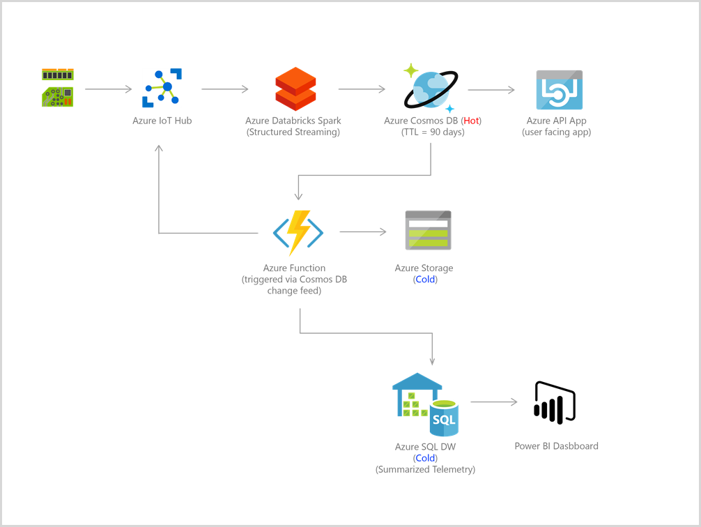
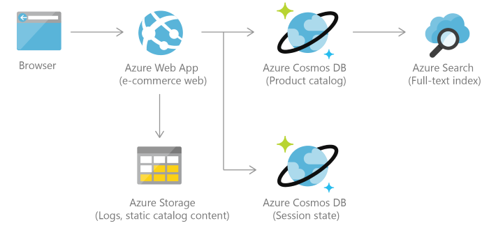
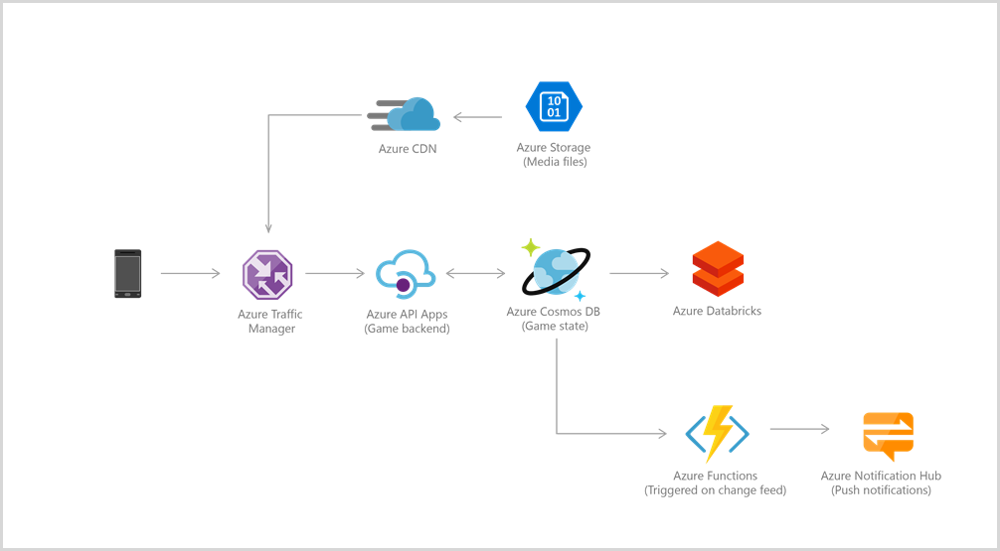
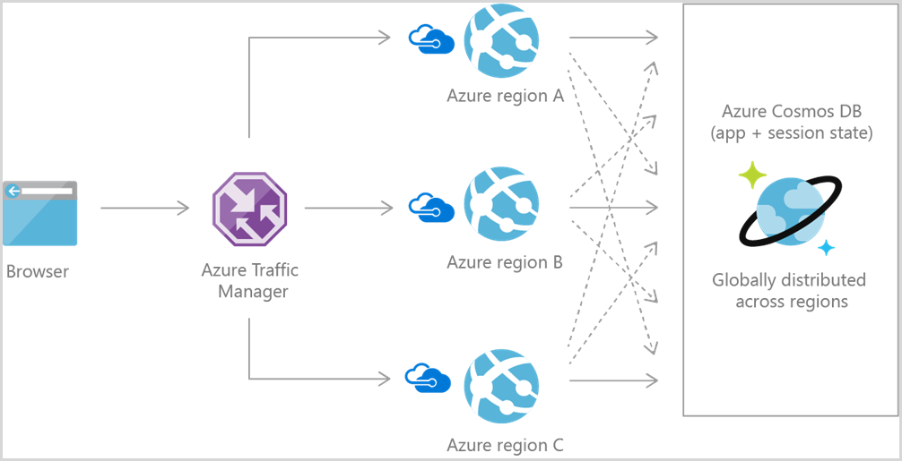
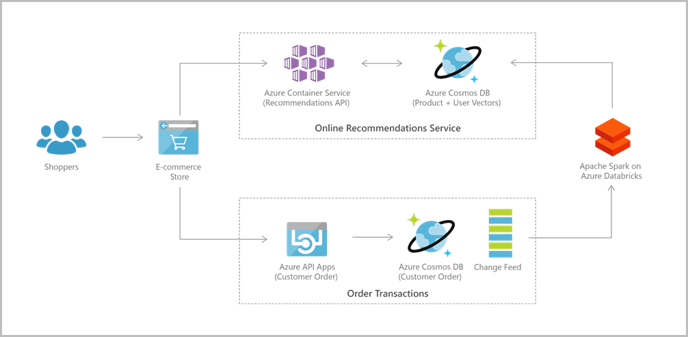

# Common Azure Cosmos DB use cases
This article provides an overview of several common use cases for Azure Cosmos DB.  The recommendations in this article serve as a starting point as you develop your application with Cosmos DB.   

After reading this article, you'll be able to answer the following questions: 

* What are the common use cases for Azure Cosmos DB?
* What are the benefits of using Azure Cosmos DB for retail applications?
* What are the benefits of using Azure Cosmos DB as a data store for Internet of Things (IoT) systems?
* What are the benefits of using Azure Cosmos DB for web and mobile applications?

## Introduction
[Azure Cosmos DB](../cosmos-db/introduction.md) is Microsoft’s globally distributed database service. The service is designed to allow customers to elastically (and independently) scale throughput and storage across any number of geographical regions. Azure Cosmos DB is the first globally distributed database service in the market today to offer comprehensive [service level agreements](https://azure.microsoft.com/support/legal/sla/cosmos-db/) encompassing throughput, latency, availability, and consistency. 

The Azure Cosmos DB project started in 2011 as "Project Florence" to address developer pain-points that are faced by large Internet-scale applications inside Microsoft. Observing that these problems are not unique to Microsoft’s applications, we decided to make Azure Cosmos DB generally available to external developers in 2015 in the form of [Azure DocumentDB](https://azure.microsoft.com/blog/documentdb-moving-to-general-availability/). The service is used ubiquitously internally within Microsoft, and is one of the fastest-growing services used by Azure developers externally. 

Azure Cosmos DB is a global distributed, multi-model database that is used in a wide range of applications and use cases. It is a good choice for any [serverless](http://www.azure.com/serverless) application that needs low order-of-millisecond response times, and needs to scale rapidly and globally. It supports multiple data models (key-value, documents, graphs and columnar) and many APIs for data access including [MongoDB](mongodb-introduction.md), [DocumentDB SQL](documentdb-introduction.md), [Gremlin](graph-introduction.md), and [Azure Tables](table-introduction.md) natively, and in an extensible manner. 

The following are some attributes of Azure Cosmos DB that make it well-suited for high-performance applications with global ambition.

* Azure Cosmos DB natively partitions your data for high availability and scalability. Azure Cosmos DB offers 99.99% guarantees for availability, throughput, low latency, and consistency.
* Azure Cosmos DB has SSD backed storage with low-latency order-of-millisecond response times.
* Azure Cosmos DB's support for consistency levels like eventual, consistent prefix, session, and bounded-staleness allows for full flexibility and low cost-to-performance ratio. No database service offers as much flexibility as Azure Cosmos DB in levels consistency. 
* Azure Cosmos DB has a flexible data-friendly pricing model that meters storage and throughput independently.
* Azure Cosmos DB's reserved throughput model allows you to think in terms of number of reads/writes instead of CPU/memory/IOPs of the underlying hardware.
* Azure Cosmos DB's design lets you scale to massive request volumes in the order of trillions of requests per day.

These attributes are beneficial in web, mobile, gaming, and IoT applications that need low response times and need to handle massive amounts of reads and writes.

## IoT and telematics
IoT use cases commonly share some patterns in how they ingest, process, and store data.  First, these systems need to ingest bursts of data from device sensors of various locales. Next, these systems process and analyze streaming data to derive real-time insights. The data is then archived to cold storage for batch analytics. Microsoft Azure offers rich services that can be applied for IoT use cases including Azure Cosmos DB, Azure Event Hubs, Azure Stream Analytics, Azure Notification Hub, Azure Machine Learning, Azure HDInsight, and PowerBI. 

Bursts of data can be ingested by Azure Event Hubs as it offers high throughput data ingestion with low latency. Data ingested that needs to be processed for real-time insight can be funneled to Azure Stream Analytics for real-time analytics. Data can be loaded into Azure Cosmos DB for adhoc querying. Once the data is loaded into Azure Cosmos DB, the data is ready to be queried.  The data in Azure Cosmos DB can be used as reference data as part of real-time analytics. In addition, data can further be refined and processed by connecting Azure Cosmos DB data to HDInsight for Pig, Hive or Map/Reduce jobs.  Refined data is then loaded back to Azure Cosmos DB for reporting.   

For a sample IoT solution using Azure Cosmos DB, EventHubs and Storm, see the [hdinsight-storm-examples repository on GitHub](https://github.com/hdinsight/hdinsight-storm-examples/).

For more information on Azure offerings for IoT, see [Create the Internet of Your Things](http://www.microsoft.com/server-cloud/internet-of-things.aspx). 

## Retail and marketing
Azure Cosmos DB is used extensively in Microsoft's own e-commerce platforms, that run the Windows Store and XBox Live. It is also used in the retail industry for storing catalog data. Catalog data usage scenarios involve storing and querying a set of attributes for entities such as people, places, and products.  Some examples of catalog data are user accounts, product catalogs, device registries for IoT, and bill of materials systems.  Attributes for this data may vary and can change over time to fit application requirements.  

Consider an example of a product catalog for an automotive parts supplier. Every part may have its own attributes in addition to the common attributes that all parts share.  Furthermore, attributes for a specific part can change the following year when a new model is released.  Azure Cosmos DB supports flexible schemas and hierarchical data, and thus it is well suited for storing product catalog data.

 In addition, data stored in Azure Cosmos DB can be integrated with HDInsight for big data analytics via Pig, Hive, or Map/Reduce jobs. For details on the Hadoop Connector for Azure Cosmos DB, see [Run a Hadoop job with Cosmos DB and HDInsight](run-hadoop-with-hdinsight.md).

## Gaming
The database tier is a crucial component of gaming applications. Modern games perform graphical processing on mobile/console clients, but rely on the cloud to deliver customized and personalized content like in-game stats, social media integration, and high-score leaderboards. Games often require single-millisecond latencies for reads and writes to provide an engaging in-game experience. A game database needs to be fast and be able to handle massive spikes in request rates during new game launches and feature updates.

Azure Cosmos DB is used by games like [The Walking Dead: No Man's Land](https://azure.microsoft.com/blog/the-walking-dead-no-mans-land-game-soars-to-1-with-azure-documentdb/) by [Next Games](http://www.nextgames.com/), and [Halo 5: Guardians](https://azure.microsoft.com/blog/how-halo-5-guardians-implemented-social-gameplay-using-azure-documentdb/). Azure Cosmos DB provides the following benefits to game developers:

* Azure Cosmos DB allows performance to be scaled up or down elastically. This allows games to handle updating profile and stats from dozens to millions of simultaneous gamers by making a single API call.
* Azure Cosmos DB supports millisecond reads and writes to help avoid any lags during game play.
* Azure Cosmos DB's automatic indexing allows for filtering against multiple different properties in real-time, e.g. locate players by their internal player IDs, or their GameCenter, Facebook, Google IDs, or query based on player membership in a guild. This is possible without building complex indexing or sharding infrastructure.
* Social features including in-game chat messages, player guild memberships, challenges completed, high-score leaderboards, and social graphs are easier to implement with a flexible schema.
* Azure Cosmos DB as a managed platform-as-a-service (PaaS) required minimal setup and management work to allow for rapid iteration, and reduce time to market.

## Web and mobile applications
Azure Cosmos DB is commonly used within web and mobile applications, and is particularly well suited for modeling social interactions, integrating with third-party services, and for building rich personalized experiences. The Cosmos DB SDKs can be used build rich iOS and Android applications using the popular [Xamarin framework](mobile-apps-with-xamarin.md).  

### Social Applications
A common use case for Azure Cosmos DB is to store and query user generated content (UGC) for web and mobile applications, particularly social media applications. Some examples of UGC are chat sessions, tweets, blog posts, ratings, and comments. Often, the UGC in social media applications is a blend of free form text, properties, tags, and relationships that are not bounded by rigid structure. Content such as chats, comments, and posts can be stored in Cosmos DB without requiring transformations or complex object to relational mapping layers.  Data properties can be added or modified easily to match requirements as developers iterate over the application code, thus promoting rapid development.  

Applications that integrate with third-party social networks must respond to changing schemas from these networks. As data is automatically indexed by default in Cosmos DB, data is ready to be queried at any time. Hence, these applications have the flexibility to retrieve projections as per their respective needs.

Many of the social applications run at global scale and can exhibit unpredictable usage patterns. Flexibility in scaling the data store is essential as the application layer scales to match usage demand.  You can scale out by adding additional data partitions under a Cosmos DB account.  In addition, you can also create additional Cosmos DB accounts across multiple regions. For Cosmos DB service region availability, see [Azure Regions](https://azure.microsoft.com/regions/#services).

### Personalization
Nowadays, modern applications come with complex views and experiences. These are typically dynamic, catering to user preferences or moods and branding needs. Hence, applications need to be able to retrieve personalized settings effectively to render UI elements and experiences quickly. 

JSON, a format supported by Cosmos DB, is an effective format to represent UI layout data as it is not only lightweight, but also can be easily interpreted by JavaScript. Cosmos DB offers tunable consistency levels that allow fast reads with low latency writes. Hence, storing UI layout data including personalized settings as JSON documents in Cosmos DB is an effective means to get this data across the wire.

## Next steps
To get started with Azure Cosmos DB, follow our [quick starts](create-documentdb-dotnet.md) which will walk you through creating an account and getting started with Cosmos DB. 

Or, if you'd like to read more about customers using Cosmos DB, the following customer stories are available:

* [Jet.com](https://jet.com). E-commerce challenger eyes the top spot, runs on the Microsoft cloud, leverages Cosmos DB at a global scale.
* [Asos.com](http://www.asos.com/). Asos.com is a British online fashion and beauty store. Primarily aimed at young adults, Asos sells over 850 brands as well as its own range of clothing and accessories.
* [Toyota](https://www.toyota.com/). Toyota Motor Corporation is a Japanese automotive manufacturer. Toyota leveraged Cosmos DB for a global IoT app.
* [Citrix](https://customers.microsoft.com/story/citrix). Citrix develops single-sign-on solution using Azure Service Fabric and Azure Cosmos DB
* [TEXA](https://customers.microsoft.com/story/texaspa)
TEXA’s revolutionary IoT solution for vehicle owners helps save time, money, gas—and possibly lives.
* [Domino's Pizza](https://www.dominos.com). Domino's Pizza Inc. is an American pizza restaurant chain.
* [Johnson Controls](http://www.johnsoncontrols.com). Johnson Controls is a global diversified technology and multi industrial leader serving a wide range of customers in more than 150 countries.
* [Microsoft Windows, Universal Store, Azure IoT Hub, Xbox Live, and other Internet-scale services](https://azure.microsoft.com/blog/how-azure-documentdb-planet-scale-nosql-helps-run-microsoft-s-own-businesses/). How Microsoft builds massively scalable services using Azure Cosmos DB.
* [Microsoft Data and Analytics team](https://customers.microsoft.com/story/microsoftdataandanalytics). Microsoft’s Data and Analytics team achieves planet-scale big-data collection with Azure Cosmos DB
* [Sulekha.com](https://customers.microsoft.com/story/sulekha-uses-azure-documentdb-to-connect-customers-and-businesses-across-india). Sulekha uses Azure Cosmos DB to connect customers and businesses across India  .
* [NewOrbit](https://customers.microsoft.com/story/neworbit-takes-flight-with-azure-documentdb). NewOrbit takes flight with Azure Cosmos DB.
* [Affinio](https://customers.microsoft.com/doclink/affinio-switches-from-aws-to-azure-documentdb-to-harness-social-data-at-scale). Affinio switches from AWS to Azure Cosmos DB to harness social data at scale.
* [Next Games](https://azure.microsoft.com//blog/the-walking-dead-no-mans-land-game-soars-to-1-with-azure-documentdb/). The Walking Dead: No Man's Land game soars to #1 supported by Azure Cosmos DB.
* [Halo](https://azure.microsoft.com/blog/how-halo-5-guardians-implemented-social-gameplay-using-azure-documentdb/). How Halo 5 implemented social gameplay using Azure Cosmos DB.
* [Cortana Analytics Gallery](https://azure.microsoft.com/blog/cortana-analytics-gallery-a-scalable-community-site-built-on-azure-documentdb/). Cortana Analytics Gallery - a scalable community site built on Azure Cosmos DB.
* [Breeze](https://customers.microsoft.com/Pages/CustomerStory.aspx?recid=18602). Leading Integrator Gives Multinational Firms Global Insight in Minutes with Flexible Cloud Technologies.
* [News Republic](https://customers.microsoft.com/Pages/CustomerStory.aspx?recid=18639). Adding intelligence to the news to provide information with purpose for engaged citizens. 
* [SGS International](https://customers.microsoft.com/Pages/CustomerStory.aspx?recid=18653). For consistent color across the globe, major brands turn to SGS. And SGS turns to Azure.
* [Telenor](https://customers.microsoft.com/Pages/CustomerStory.aspx?recid=18608). Global leader Telenor uses the cloud to move with the speed of a startup. 
* [XOMNI](https://customers.microsoft.com/Pages/CustomerStory.aspx?recid=18667). The store of the future runs on speedy search and the easy flow of data.
* [Nucleo](https://customers.microsoft.com/story/azure-based-software-platform-breaks-down-barriers-bet). Azure-based software platform breaks down barriers between businesses and customers
* [Weka](https://customers.microsoft.com/story/weka-smart-fridge-improves-vaccine-management-so-more-people-can-be-protected-against-diseases). Weka Smart Fridge improves vaccine management so more people can be protected against diseases
* [Orange Tribes](https://customers.microsoft.com/story/theres-more-to-that-food-app-than-meets-the-eye-or-the-mouth). There’s more to that food app than meets the eye, or the mouth.
* [Real Madrid](https://customers.microsoft.com/story/real-madrid-brings-the-stadium-closer-to-450-million-f). Real Madrid brings the stadium closer to 450 million fans around the globe, with the Microsoft Cloud.
* [Tuku](https://customers.microsoft.com/story/tuku-makes-car-buying-fun-with-help-from-azure-services). TUKU makes car buying fun with help from Azure services
