# Common cost analysis uses

Azure Cost Management users often want answers to questions that many others ask. This article walks you through getting results for common cost analysis tasks in Cost Management.

## View cost breakdown by Azure service

Viewing costs by an Azure service can help you to better understand the parts of your infrastructure that cost the most. For example, VM compute costs might be small. Yet you might accrue significant networking costs because of the amount of information emitting from the VMs. Understanding the primary cost drivers of your Azure services is essential so that you can adjust service usage, as needed.

1. In the Azure portal, navigate to cost analysis for your scope. For example: **Cost Management + Billing** > **Cost Management** > **Cost analysis**.
1. Select **Cost by service** and then group by **Service tier**.
1. Change the view to **Table**.

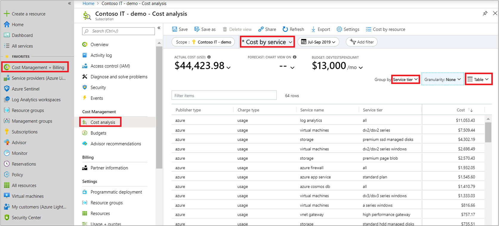

## View cost breakdown by Azure resource

Your services are built with Azure resources. Reviewing costs based on resources can help you quickly identify your primary cost contributors. If a service has resources that are too expensive, consider making changes to reduce your costs.

1. In the Azure portal, navigate to cost analysis for your scope. For example: **Cost Management + Billing** > **Cost Management** > **Cost analysis**.
1. Select **Cost by resource**.
1. Change the view to **Table**.

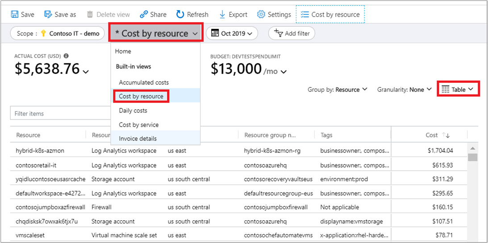

## View cost breakdown by selected dimensions

Dimensions allow you to organize your costs based on various metadata values shown in your charges. For example, you could group your costs by location.

1. In the Azure portal, navigate to cost analysis for your scope. For example: **Cost Management + Billing** > **Cost Management** > **Cost analysis**.
1. Select the **Group by** filter.  
    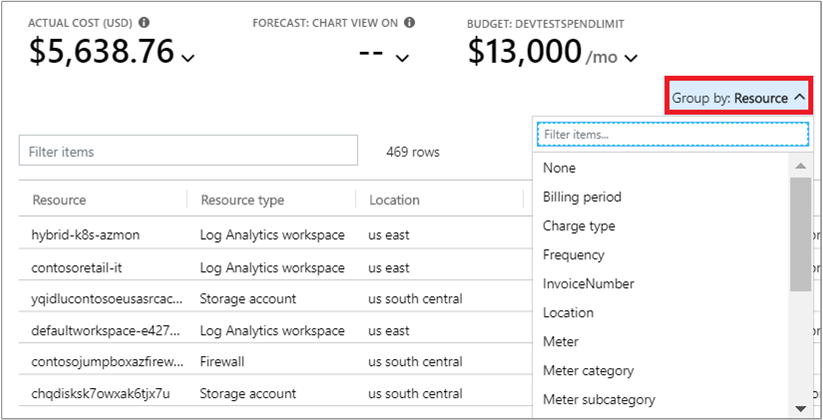
1. Optionally, you save the view for later use.
1. Click a pie chart below the graph to view more detailed data.  
    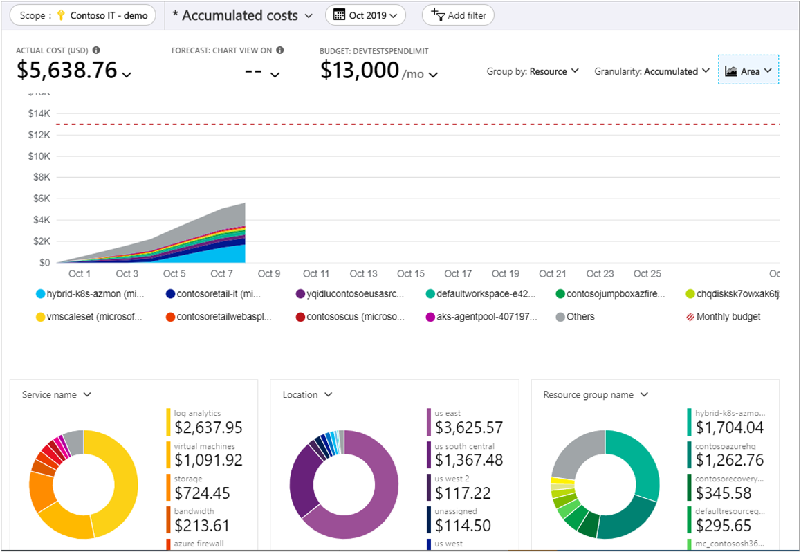

## View costs per day or by month

Looking at daily and monthly costs can help you to better understand if there's a time of the week or year where your costs are higher. If you have more customer traffic in a holiday period, does that lead to a corresponding increase in your Azure costs? Is Friday a more costly day than Monday?

1. In the Azure portal, navigate to cost analysis for your scope. For example: **Cost Management + Billing** > **Cost Management** > **Cost analysis**.
1. Set the **Granularity** to **Monthly** or **Daily**.

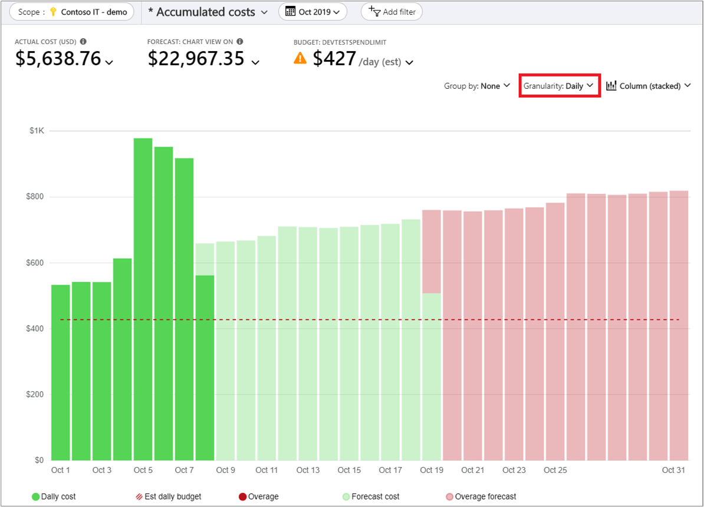

## View your reservation charges

Reserved instances provide a way for you to save money with Azure. With reservations, you spend money up front for a given number of resources over time. Cost analysis shows the charges as they appear on your bill. The charges are shown as actual costs or amortized over the course of your reservation period.

1. In the Azure portal, navigate to cost analysis for your scope. For example, **Cost Management + Billing** > **Cost Management** > **Cost analysis**.
1. Add a filter for **Pricing Model: Reservation**.
1. Under **Scope** and next to the cost shown, click the down arrow symbol, select either **Actual cost** or **Amortized cost** metric.

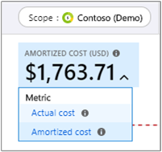

Each metric affects how data is shown for your reservation charges.

**Actual cost** - Shows the purchase as it appears on your bill. For example, if you bought a one-year reservation for $1200 in January, cost analysis shows a $1200 cost in the month of January for the reservation. It doesn't show a reservation cost for other months of the year. If you group your actual costs by VM, then a VM that received the reservation benefit for a given month would have zero cost for the month.

**Amortized cost** - Shows a reservation purchase split as an amortized cost over the duration of the reservation term. Using the same example above, cost analysis shows a $100 cost for each month throughout the year, if you purchased a one-year reservation for $1200 in January. If you group costs by VM in this example, you'd see cost attributed to each VM that received the reservation benefit.

## View your Spot VM charges

Spot VMs can provide large cost savings for workloads that can handle interruptions. Workloads are run on unused Azure capacity. Since they can be evicted at any time, Spot VMs get a significant discount. Use the following steps to view your Spot VM charges.

1. In the Azure portal, navigate to cost analysis for your scope. For example, **Cost Management + Billing** > **Cost Management** > **Cost analysis**.
2. Add a filter for **Pricing Model: Spot**.

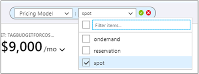

The Pricing Model dimension is also used to view on demand and reservation charges.

## View your reservation utilization

After you buy a reservation, it's important to track its utilization so that you get what you paid for. For example, if you bought 10 VMs for a year and only use five of them, then essentially half of the purchase is wasted. There are two different ways to assess your utilization:

### View unused RI costs in cost analysis

To identify how much cost is currently being wasted each month for your reservation purchase, follow the steps below.

1. In the Azure portal, navigate to cost analysis for the scope where your reservation is applied. For example, **Cost Management + Billing** > **Cost Management** > **Cost analysis**.
1. Add a filter for **Pricing Model: Reservation**.
1. Select the **Amortized Cost** view.
1. Set the granularity to **Monthly**.
1. Set the time period to the current year or your reservation term.
1. Set the chart type to **Column (stacked)**.
1. Group charges by **Charge Type**.
1. Review the results for `unusedreservation` values.

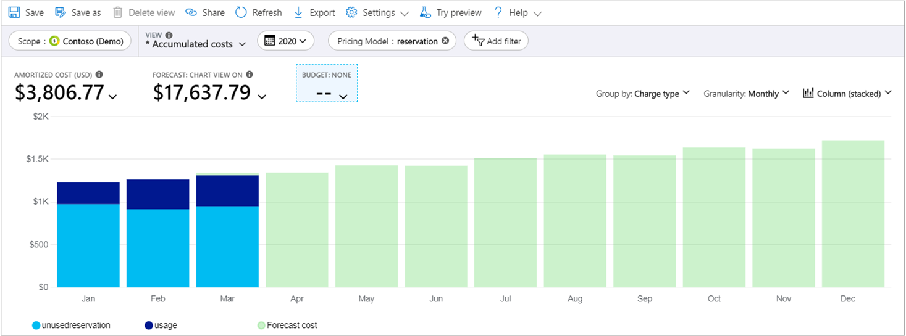

### View utilization in Reservations

For detailed instructions, see [Optimize reservation use](../reservations/manage-reserved-vm-instance.md#optimize-reservation-use).

## View costs for a specific tag

Many Azure users apply tags to their resources such as a cost center or development environment (production and test) to better categorize charges. Tags appear as a dimension in cost analysis. You can use the dimension to gain insights into your custom tagging categorizations.

Support for tags applies to usage reported *after* the tag was applied to the resource. Tags aren't applied retroactively for cost rollups.

1. In the Azure portal, navigate to cost analysis for your scope. For example: **Cost Management + Billing** > **Cost Management** > **Cost analysis**.
1. Select **Group by** for your tag.

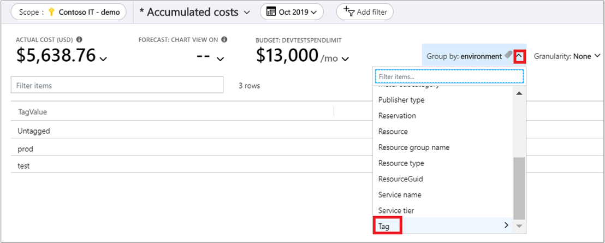

## Download your usage details

Your usage details report file, in CSV format, provides a breakdown of all the charges that accrued towards an invoice. You can use the report to compare it to, and better understand, your invoice. Each billed charge on your invoice corresponds to broken-down charges in the usage report.

1. In the Azure portal, navigate to the **Usage and Charges** tab for a billing account or subscription. For example: **Cost Management + Billing** > **Billing** > **Usage + charges**.
1. Select the line item to download from and then click the download symbol.  
    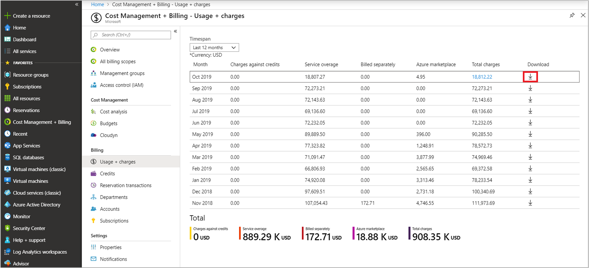
1.  Select the usage file to download.  
    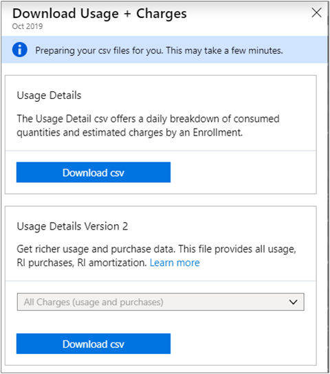

## View monthly EA cost breakdown

Your EA enrollment accrues costs for your entire organization. Understanding how costs accrue and are invoiced over time helps you to engage the appropriate stakeholders to ensure that costs are managed responsibly.

Costs are only shown for your active enrollment. If you transferred an enrollment (inactive) to a new one (active), costs for the previous enrollment aren't shown in Cost Management.

1. In the Azure portal, navigate to **Cost Management + Billing** > **Overview**.
1. Click **Breakdown** for the current month and view your monetary commitment burn down.  
    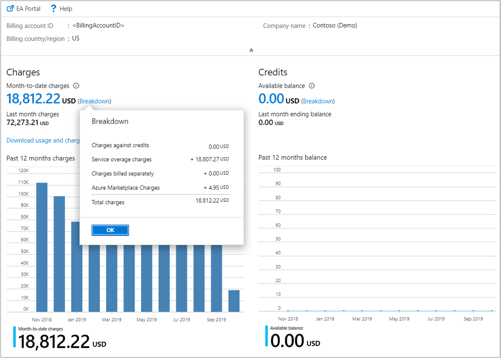
1.  Click the **Usage and Charges** tab and view the prior month's breakdown in the chosen timespan.  
    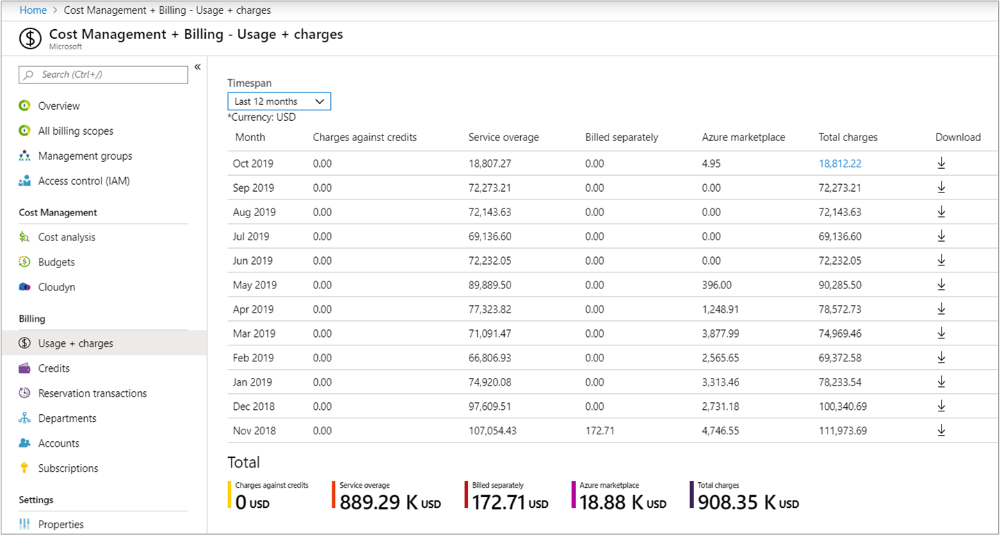

## View enrollment monthly cost by term

Use a graphical view of your enrollment's monthly costs to understand the cost trends and invoiced amounts for a given period.

1. In the Azure portal, navigate to cost analysis for your scope. For example: **Cost Management + Billing** > **Cost Management** > **Cost analysis**.
1. Select your enrollment and set the enrollment term.
1. Set the granularity to monthly and then set the view to **Column     (stacked)**.

You can group by and filter your data for a more detailed analysis.

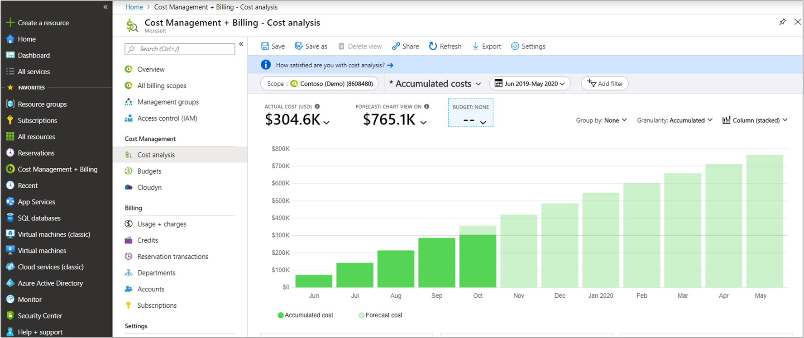

## View EA enrollment accumulated costs

View the net accumulated charges over time to understand overall expenditures for your organization for a given period.

1. In the Azure portal, navigate to cost analysis for your scope. For example: **Cost Management + Billing** > **Cost Management** > **Cost analysis**.
1. Select your enrollment and then view your current accumulated costs.

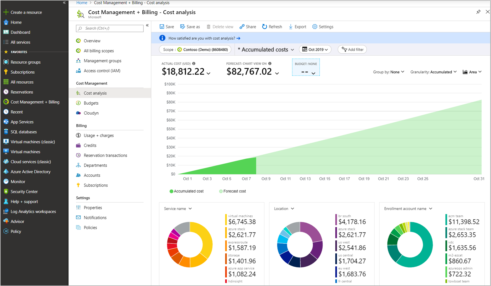

## Next steps
- If you haven't already completed the first quickstart for Cost Management, read it at [Start analyzing costs](quick-acm-cost-analysis.md).
- Read the [Cost Management documentation](../index.yml).
