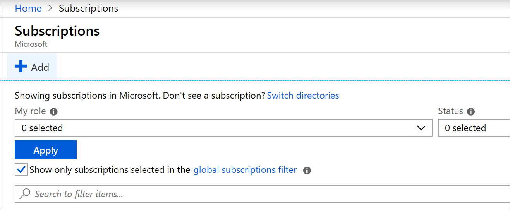

# Create an additional Azure subscription

You can create an additional subscription for your [Enterprise Agreement (EA)](https://azure.microsoft.com/pricing/enterprise-agreement/), [Microsoft Customer Agreement](https://azure.microsoft.com/pricing/purchase-options/microsoft-customer-agreement/) or [Microsoft Partner Agreement](https://www.microsoft.com/licensing/news/introducing-microsoft-partner-agreement) billing account in the Azure portal. You may want an additional subscription to avoid hitting subscription limits, to create separate environments for security, or to isolate data for compliance reasons.

If you have a Microsoft Online Service Program (MOSP) billing account, you can create additional subscriptions in the [Azure portal](https://portal.azure.com/#blade/Microsoft_Azure_Billing/SubscriptionsBlade).

To learn more about billing accounts and identify the type of your billing account, see [View billing accounts in Azure portal](view-all-accounts.md).

## Permission required to create Azure subscriptions

You need the following permissions to create subscriptions:

|Billing account  |Permission  |
|---------|---------|
|Enterprise Agreement (EA) |  Account Owner role on the Enterprise Agreement enrollment. For more information, see [Understand Azure Enterprise Agreement administrative roles in Azure](understand-ea-roles.md).    |
|Microsoft Customer Agreement (MCA) |  Owner or contributor role on the invoice section, billing profile or billing account. Or Azure subscription creator role on the invoice section.  For more information, see [Subscription billing roles and task](understand-mca-roles.md#subscription-billing-roles-and-tasks).    |
|Microsoft Partner Agreement (MPA) |   Global Admin and Admin Agent role in the CSP partner organization. To learn more, see [Partner Center - Assign users roles and permissions](/partner-center/permissions-overview).  The user needs to sign to partner tenant to create Azure subscriptions.   |

## Create a subscription in the Azure portal

1. Sign in to the [Azure portal](https://portal.azure.com).
1. Search for **Subscriptions**.

   

1. Select **Add**.

   

1. If you have access to multiple billing accounts, select the billing account for which you want to create the subscription.

1. Fill the form and select **Create**. The tables below list the fields on the form for each type of billing account.

**Enterprise Agreement**

|Field  |Definition  |
|---------|---------|
|Name     | The display name that helps you easily identify the subscription in the Azure portal.  |
|Offer     | Select EA Dev/Test, if you plan to use this subscription for development or testing workloads else use Microsoft Azure Enterprise. DevTest offer must be enabled for your enrollment account to create EA Dev/Test subscriptions.|

**Microsoft Customer Agreement**

|Field  |Definition  |
|---------|---------|
|Billing profile     | The charges for your subscription will be billed to the billing profile that you select. If you have access to only one billing profile, the selection will be greyed out.     |
|Invoice section     | The charges for your subscription will appear on this section of the billing profile's invoice. If you have access to only one invoice section, the selection will be greyed out.  |
|Plan     | Select Microsoft Azure Plan for DevTest, if you plan to use this subscription for development or testing workloads else use Microsoft Azure Plan. If only one plan is enabled for the billing profile, the selection will be greyed out.  |
|Name     | The display name that helps you easily identify the subscription in the Azure portal.  |

**Microsoft Partner Agreement**

|Field  |Definition  |
|---------|---------|
|Customer    | The subscription is created for the customer that you select. If you have only one customer, the selection will be greyed out.  |
|Reseller    | The reseller that will provide services to the customer. This is an optional field, which is only applicable to Indirect providers in the CSP two-tier model. |
|Name     | The display name that helps you easily identify the subscription in the Azure portal.  |

## Create a subscription as a partner for a customer

Partners with a Microsoft Partner Agreement use the following steps to create a new Microsoft Azure Plan subscription for their customers. The subscription is created under the partner’s billing account and billing profile.

1.	Sign in to the Azure portal using your Partner Center account.
Make sure you are in your Partner Center directory (tenant), not a customer’s tenant.
1.	Navigate to **Cost Management + Billing**.
1.	Select the Billing scope for the billing account where the customer account resides.
1.	In the left menu under **Billing**, select **Customers**.
1.	On the Customers page, select the customer.
1.	In the left menu, under **Products + services**, select **Azure Subscriptions**.
1.	On the Azure subscription page, select **+ Add** to create a subscription.
1.	Enter details about the subscription and when complete, select **Review + create**.

## Create an additional Azure subscription programmatically

You can also create additional subscriptions programmatically. For more information, see:

- [Create EA subscriptions programmatically with latest API](programmatically-create-subscription-enterprise-agreement.md)
- [Create MCA subscriptions programmatically with latest API](programmatically-create-subscription-microsoft-customer-agreement.md)
- [Create MPA subscriptions programmatically with latest API](Programmatically-create-subscription-microsoft-customer-agreement.md)

## Next steps

- [Add or change Azure subscription administrators](add-change-subscription-administrator.md)
- [Move resources to new resource group or subscription](../../azure-resource-manager/management/move-resource-group-and-subscription.md)
- [Create management groups for resource organization and management](../../governance/management-groups/create-management-group-portal.md)
- [Cancel your subscription for Azure](cancel-azure-subscription.md)

## Need help? Contact us.

If you have questions or need help, [create a support request](https://go.microsoft.com/fwlink/?linkid=2083458).