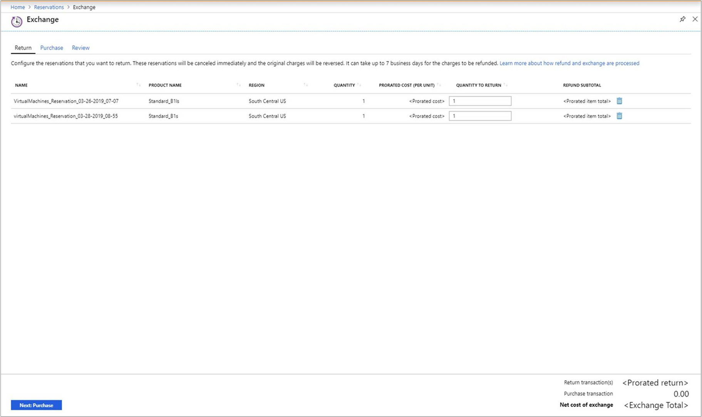
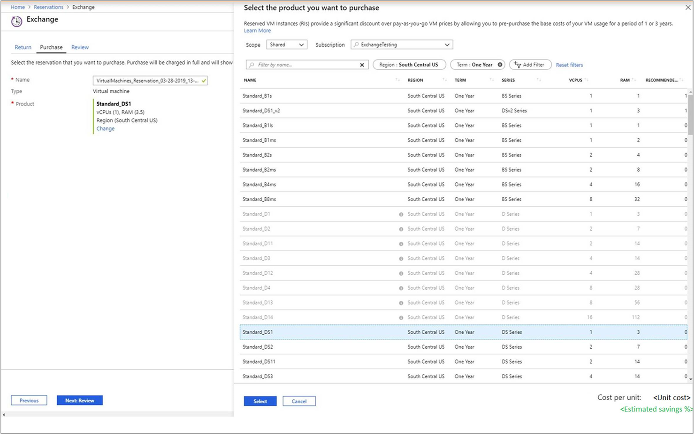

# Self-service exchanges and refunds for Azure Reservations

Azure Reservations provide flexibility to help meet your evolving needs. You can exchange reservations for another reservation of the same type. For example, you can return multiple compute reservations including Azure Dedicated Host, Azure VMware Solution, and Azure Virtual Machines with each other all at once. In other words, reservation products are interchangeable with each other if they're the same type of reservation. In an other example, you can exchange multiple SQL database reservation types including Managed Instances and Elastic Pool with each other.

However, you can't exchange dissimilar reservations. For example, you can't exchange a Cosmos DB reservation for SQL Database.

You can also exchange a reservation to purchase another reservation of a similar type in a different region. For example, you can exchange a reservation that's in West US 2 for one that's in West Europe.

When you exchange a reservation, you can change your term from one-year to three-year.

You can also refund reservations, but the sum total of all canceled reservation commitment in your billing scope (such as EA, Microsoft Customer Agreement, and Microsoft Partner Agreement) can't exceed USD 50,000 in a 12 month rolling window.

Azure Databricks reserved capacity, Azure VMware solution by CloudSimple reservation, Azure Red Hat Open Shift reservation, Red Hat plans and, SUSE Linux plans aren't eligible for refunds.

> [!NOTE]
> - **You must have owner access on the Reservation Order to exchange or refund an existing reservation**. You can [Add or change users who can manage a reservation](./manage-reserved-vm-instance.md#who-can-manage-a-reservation-by-default).
> - Microsoft is not currently charging early termination fees for reservation refunds. We might charge the fees for refunds made in the future. We currently don't have a date for enabling the fee.

## How to exchange or refund an existing reservation

You can exchange your reservation from [Azure portal](https://portal.azure.com/#blade/Microsoft_Azure_Reservations/ReservationsBrowseBlade).

1. Select the reservations that you want to refund and select **Exchange**.  
    
1. Select the VM product that you want to purchase and type a quantity. Make sure that the new purchase total is more than the return total. [Determine the right size before you purchase](../../virtual-machines/prepay-reserved-vm-instances.md#determine-the-right-vm-size-before-you-buy).  
    
1. Review and complete the transaction.  
    

To refund a reservation, go to **Reservation Details** and select **Refund**.

## Exchange multiple reservations

You can return similar types of reservations in one action.

When you exchange reservations, the new purchase currency amount must be greater than the refund amount. If your new purchase amount is less than the refund amount, you'll get an error. If you see the error, reduce the quantity that you want to return or increase the amount to purchase.

1. Sign in to the Azure portal and navigate to **Reservations**.
1. In the list of reservations, select the box for each reservation that you want to exchange.
1. At the top of the page, select **Exchange**.
1. If needed, revise the quantity to return for each reservation.
1. If you select the auto-fill return quantity, you can choose to **Refund all** to fill the list with the full quantity that you own for each reservation or **Optimize for utilization (7-day)** to fill the list with a quantity that optimizes for utilization based on the last seven days of usage. **Select Apply**.
1. At the bottom of the page, select **Next: Purchase**.
1. On the purchase tab, select the available products that you want to exchange for. You can select multiple products of different types.
1. In the Select the product you want to purchase pane, select the products you want and then select **Add to cart** and then select **Close**.
1. When done, select **Next: Review**.
1. Review your reservations to return and new reservations to purchase and then select **Confirm exchange**.

## Exchange non-premium storage for premium storage

You can exchange a reservation purchased for a VM size that doesn't support premium storage to a corresponding VM size that does. For example, an _F1_ for an _F1s_. To make the exchange, go to Reservation Details and select **Exchange**. The exchange doesn't reset the term of the reserved instance or create a new transaction.
If you are exchanging for a different size, series, region or payment frequency, the term will be reset for the new reservation. 

## How transactions are processed

First, Microsoft cancels the existing reservation and refunds the pro-rated amount for that reservation. If there's an exchange, the new purchase is processed. Microsoft processes refunds using one of the following methods, depending on your account type and payment method:

### Enterprise agreement customers

Money is added to the Azure Prepayment (previously called monetary commitment) for exchanges and refunds if the original purchase was made using one. If the Azure Prepayment term using the reservation was purchased is no longer active, then credit is added to your current enterprise agreement Azure Prepayment term. The credit is valid for 90 days from the date of refund. Unused credit expires at the end of 90 days.

If the original purchase was made as an overage, the original invoice on which the reservation was purchased and all later invoices are reopened and readjusted. Microsoft issues a credit memo for the refunds.

### Pay-as-you-go invoice payments and CSP program

The original reservation purchase invoice is canceled and then a new invoice is created for the refund. For exchanges, the new invoice shows the refund and the new purchase. The refund amount is adjusted against the purchase. If you only refunded a reservation, then the prorated amount stays with Microsoft and it's adjusted against a future reservation purchase. If you bought a reservation at pay-as-you-go rates and later move to a CSP, the reservation can be returned and repurchased without a penalty.

Although a CSP customer can’t exchange, cancel, renew, or refund a reservation themself, they can ask their partner to do it on their behalf.

### Pay-as-you-go credit card customers

The original invoice is canceled, and a new invoice is created. The money is refunded to the credit card that was used for the original purchase. If you've changed your card, [contact support](https://portal.azure.com/#blade/Microsoft_Azure_Support/HelpAndSupportBlade/newsupportrequest).

## Cancel, exchange, and refund policies

Azure has the following policies for cancellations, exchanges, and refunds.

**Exchange policies**

- You can return multiple existing reservations to purchase one new reservation of the same type. You can't exchange reservations of one type for another. For example, you can't return a VM reservation to purchase a SQL reservation. You can change a reservation property such as family, series, version, SKU, region, quantity, and term with an exchange.
- Only reservation owners can process an exchange. [Learn how to Add or change users who can manage a reservation](manage-reserved-vm-instance.md#who-can-manage-a-reservation-by-default).
- An exchange is processed as a refund and a repurchase – different transactions are created for the cancellation and the new reservation purchase. The prorated reservation amount is refunded for the reservations that's traded-in. You're charged fully for the new purchase. The prorated reservation amount is the daily prorated residual value of the reservation being returned.
- You can exchange or refund reservations even if the enterprise agreement used to purchase the reservation is expired and was renewed as a new agreement.
- The new reservation's lifetime commitment should equal or be greater than the returned reservation's remaining commitment. Example: for a three-year reservation that's $100 per month and exchanged after the 18th payment, the new reservation's lifetime commitment should be $1,800 or more (paid monthly or upfront).
- The new reservation purchased as part of exchange has a new term starting from the time of exchange.
- There's no penalty or annual limits for exchanges.

**Refund policies**

- We're currently not charging an early termination fee, but in the future there might be a 12% early termination fee for cancellations.
- The total canceled commitment can't exceed 50,000 USD in a 12-month rolling window for a billing profile or single enrollment. For example, for a three-year reservation that's 100 USD per month and it's refunded in the 18th month, the canceled commitment is 1,800 USD. After the refund, your new available limit for refund will be 48,200 USD. In 365 days from the refund, the 48,200 USD limit will be increased by 1,800 USD and your new pool will be 50,000 USD. Any other reservation cancellation for the billing profile or EA enrollment will deplete the same pool, and the same replenishment logic will apply.
- Azure won't process any refund that will exceed the 50,000 USD limit in a 12-month window for a billing profile or EA enrollment.
    - Refunds that result from an exchange don't count against the refund limit.
- Refunds are calculated based on the lowest price of either your purchase price or the current price of the reservation.
- Only reservation order owners can process a refund. [Learn how to Add or change users who can manage a reservation](manage-reserved-vm-instance.md#who-can-manage-a-reservation-by-default).
- For CSP program, the 50,000 USD limit is per customer.

## Need help? Contact us.

If you have questions or need help, [create a support request](https://portal.azure.com/#blade/Microsoft_Azure_Support/HelpAndSupportBlade/newsupportrequest).

## Next steps

- To learn how to manage a reservation, see [Manage Azure Reservations](manage-reserved-vm-instance.md).
- To learn more about Azure Reservations, see the following articles:
    - [What are Azure Reservations?](save-compute-costs-reservations.md)
    - [Manage Reservations in Azure](manage-reserved-vm-instance.md)
    - [Understand how the reservation discount is applied](../manage/understand-vm-reservation-charges.md)
    - [Understand reservation usage for your Pay-As-You-Go subscription](understand-reserved-instance-usage.md)
    - [Understand reservation usage for your Enterprise enrollment](understand-reserved-instance-usage-ea.md)
    - [Windows software costs not included with reservations](reserved-instance-windows-software-costs.md)
    - [Azure Reservations in the CSP program](/partner-center/azure-reservations)
