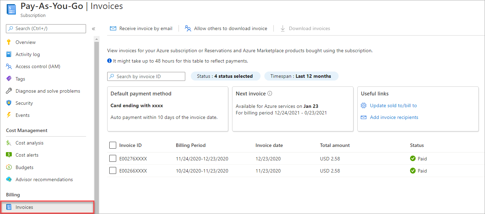
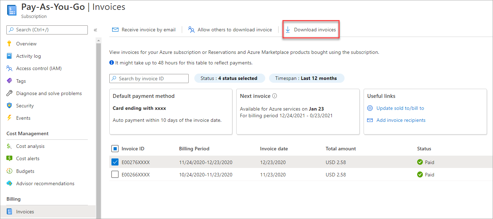
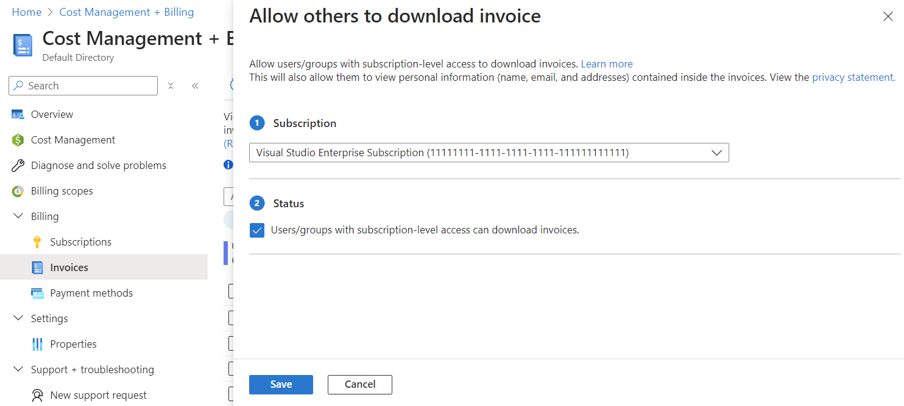
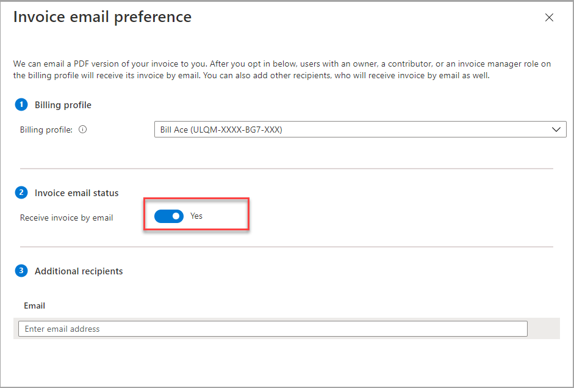
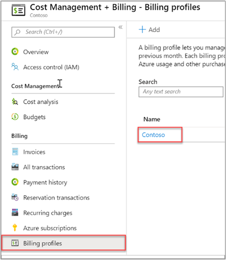
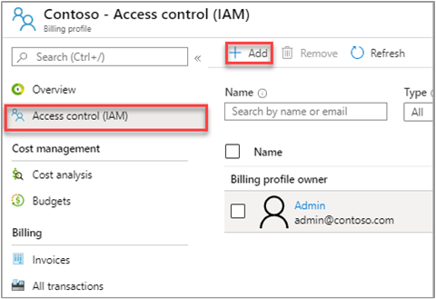
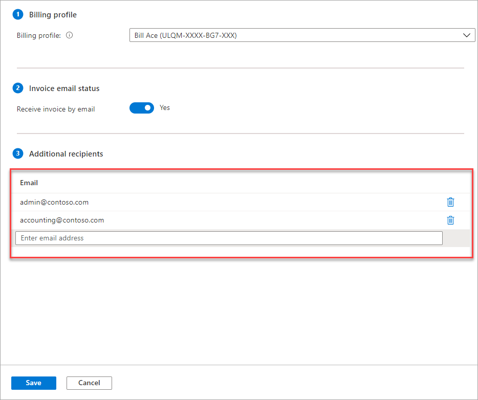
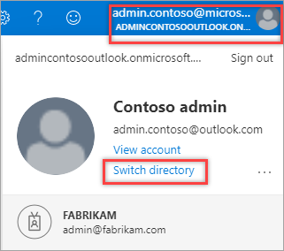
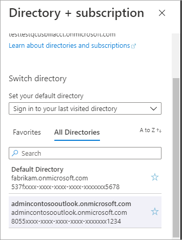

# View and download your Microsoft Azure invoice

You can download your invoice in the [Azure portal](https://portal.azure.com/) or have it sent in email. If you're an Azure customer with an Enterprise Agreement (EA customer), you can't download your organization's invoice. Instead, invoices are sent to the person set to receive invoices for the enrollment.

## When invoices are generated

An invoice is generated based on your billing account type. Invoices are created for Microsoft Online Service Program (MOSP), Microsoft Customer Agreement (MCA), and Microsoft Partner Agreement (MPA) billing accounts. Invoices are also generated for Enterprise Agreement (EA) billing accounts. However, invoices for EA billing accounts aren't shown in the Azure portal.

To learn more about billing accounts and identify your billing account type, see [View billing accounts in Azure portal](../manage/view-all-accounts.md).

### Invoice status

When you review your invoice status in the Azure portal, each invoice has one of the following status symbols.

|  Status symbol | Description  |
|---|---|
|  | *Due* is displayed when an invoice is generated, but it hasn't been paid yet. |
|   | *Past due* is displayed when Azure tried to charge your payment method, but the payment was declined. |
|   | *Paid* status is displayed when Azure has successfully charged your payment method. |

When an invoice is created, it appears in the Azure portal with *Due* status. Due status is normal and expected.  

When an invoice hasn't been paid, its status is shown as *Past due*. A past due subscription will get disabled if the invoice isn't paid.

## Invoices for MOSP billing accounts

An MOSP billing account is created when you sign up for Azure through the Azure website. For example, when you sign up for an [Azure Free Account](https://azure.microsoft.com/offers/ms-azr-0044p/), [account with pay-as-you-go rates](https://azure.microsoft.com/offers/ms-azr-0003p/) or as a [Visual studio subscriber](https://azure.microsoft.com/pricing/member-offers/credit-for-visual-studio-subscribers/).

Customers in select regions, who sign up through the Azure website for an [account with pay-as-you-go rates](https://azure.microsoft.com/offers/ms-azr-0003p/) or an [Azure Free Account](https://azure.microsoft.com/offers/ms-azr-0044p/) can have a billing account for an MCA.

If you're unsure of your billing account type, see [Check your billing account type](../manage/view-all-accounts.md#check-the-type-of-your-account) before following the instructions in this article. 

An MOSP billing account can have the following invoices:

**Azure service charges** - An invoice is generated for each Azure subscription that contains Azure resources used by the subscription. The invoice contains charges for a billing period. The billing period is determined by the day of the month when the subscription is created.

For example, John creates *Azure sub 01* on 5 March and *Azure sub 02* on 10 March. The invoice for *Azure sub 01* will have charges from the fifth day of a month to the fourth day of next month. The invoice for *Azure sub 02* will have charges from the tenth day of a month to the ninth day of next month. The invoices for all Azure subscriptions are normally generated on the day of the month that the account was created but can be up to two days later. In this example, if John created his account on 2 February, the invoices for both *Azure sub 01* and *Azure sub 02* will normally be generated on the second day of each month but could be up to two days later.

**Azure Marketplace, reservations, and spot VMs** - An invoice is generated for reservations, marketplace products, and spot VMs purchased using a subscription. The invoice shows respective charges from the previous month. For example, John purchased a reservation on 1 March and another reservation on 30 March. A single invoice will be generated for both the reservations in April. The invoice for Azure Marketplace, reservations, and spot VMs are always generated around the ninth day of the month.

If you pay for Azure with a credit card and you buy reservation, Azure generates an immediate invoice. However, when billed by an invoice, you're charged for the reservation on your next monthly invoice.

**Azure support plan** - An invoice is generated each month for your support plan subscription. The first invoice is generated on the day of purchase or up to two days later. Later support plan invoices are normally generated on the same day of the month that the account was created but could be generated up to two days later.

## Download your MOSP Azure subscription invoice

An invoice is only generated for a subscription that belongs to a billing account for an MOSP. [Check your access to an MOSP account](../manage/view-all-accounts.md#check-the-type-of-your-account). 

You must have an account admin role for a subscription to download its invoice. Users with owner, contributor, or reader roles can download its invoice, if the account admin has given them permission. For more information, see [Allow users to download invoices](../manage/manage-billing-access.md#opt-in).

1. Select your subscription from the [Subscriptions page](https://portal.azure.com/#blade/Microsoft_Azure_Billing/SubscriptionsBlade) in the Azure portal.
1. Select **Invoices** from the billing section.  
    
1. Select the invoice that you want to download and then click **Download invoices**.  
    
1. You can also download a daily breakdown of consumed quantities and charges by clicking the download icon and then clicking **Prepare Azure usage file** button under the usage details section. It may take a few minutes to prepare the CSV file.  
    

For more information about your invoice, see [Understand your bill for Microsoft Azure](../understand/review-individual-bill.md). For help identify unusual costs, see [Analyze unexpected charges](analyze-unexpected-charges.md).

## Download your MOSP support plan invoice

An invoice is only generated for a support plan subscription that belongs to an MOSP billing account. [Check your access to an MOSP account](../manage/view-all-accounts.md#check-the-type-of-your-account).

You must have an account admin role on the support plan subscription to download its invoice.

1. Sign in to the [Azure portal](https://portal.azure.com).
1. Search for **Cost Management + Billing**.  
    
1. Select **Invoices** from the left-hand side.
1. Select your support plan subscription.  
    
1. Select the invoice that you want to download and then click **Download invoices**.  
    

## Allow others to download your subscription invoice

To download an invoice:

1.  Sign in to the [Azure portal](https://portal.azure.com) as an account admin for the subscription.

2.  Search for **Cost Management + Billing**.

    

3.  Select **Invoices** from the left-hand side.

4.  Select your Azure subscription and then click **Allow others to download invoice**.

    

5.  Select **On** and then **Save** at the top of the page.  
    
    
> [!NOTE]
> Microsoft doesn’t recommend sharing any of your confidential or personally identifiable information with third parties. This recommendation applies to sharing your Azure bill or invoice with a third party for cost optimizations. For more information, see https://azure.microsoft.com/support/legal/ and https://www.microsoft.com/trust-center.

## Get MOSP subscription invoice in email

You must have an account admin role on a subscription or a support plan to opt in to receive its invoice by email. Once you've opted-in you can add additional recipients, who receive the invoice by email as well.

1.  Sign in to the [Azure portal](https://portal.azure.com).
2.  Search for **Cost Management + Billing**.  
3.  Select **Invoices** from the left-hand side.
4.  Select your Azure subscription or support plan subscription and then select **Receive invoice by email**.  
    
5. Click **Email invoice** and accept the terms.  
    
6. The invoice is sent to your preferred communication email. Select **Update profile** to update the email.  
    

## Share subscription and support plan invoice

You may want to share the invoice for your subscription and support plan every month with your accounting team or send them to one of your other email addresses. 

1. Follow the steps in [Get your subscription's and support plan's invoices in email](#get-mosp-subscription-invoice-in-email) and select **Configure recipients**.  
    
1. Enter an email address, and then select **Add recipient**. You can add multiple email addresses.  
    
1. Once you've added all the email addresses, select **Done** from the bottom of the screen.

## Invoices for MCA and MPA billing accounts

An MCA billing account is created when your organization works with a Microsoft representative to sign an MCA. Some customers in select regions, who sign up through the Azure website for an [account with pay-as-you-go rates](https://azure.microsoft.com/offers/ms-azr-0003p/) or an [Azure Free Account](https://azure.microsoft.com/offers/ms-azr-0044p/) may have a billing account for an MCA as well. For more information, see [Get started with your MCA billing account](../understand/mca-overview.md).

An MPA billing account is created for Cloud Solution Provider (CSP) partners to manage their customers in the new commerce experience. Partners need to have at least one customer with an [Azure plan](/partner-center/purchase-azure-plan) to manage their billing account in the Azure portal. For more information, see [Get started with your MPA billing account](../understand/mpa-overview.md).

A monthly invoice is generated at the beginning of the month for each billing profile in your account. The invoice contains respective charges for all Azure subscriptions and other purchases from the previous month. For example, John created *Azure sub 01* on 5 March, *Azure sub 02* on 10 March. He purchased *Azure support 01* subscription on 28 March using *Billing profile 01*. John will get a single invoice in the beginning of April that will contain charges for both Azure subscriptions and the support plan.

##  Download an MCA or MPA billing profile invoice

You must have an owner, contributor, reader, or an invoice manager role on a billing profile to download its invoice in the Azure portal. Users with an owner, contributor, or a reader role on a billing account can download invoices for all the billing profiles in the account.

1.  Sign in to the [Azure portal](https://portal.azure.com).

2.  Search for **Cost Management + Billing**.

    

3. Select **Invoices** from the left-hand side.

    

4. In the invoices table, select the invoice that you want to download.

5. Click on the **Download invoice pdf** button at the top of the page.

    

6. You can also download your daily breakdown of consumed quantities and estimated charges by clicking **Download Azure usage**. It may take a few minutes to prepare the csv file.

## Get your billing profile's invoice in email

You must have an owner or a contributor role on the billing profile or its billing account to update its email invoice preference. Once you have opted-in, all users with an owner, contributor, readers, and invoice manager roles on a billing profile will get its invoice in email. 

1.  Sign in to the [Azure portal](https://portal.azure.com).
1.  Search for **Cost Management + Billing**.  
1.  Select **Invoices** from the left-hand side and then select **Invoice email preference** from the top of the page.  
    
1.  If you have multiple billing profiles, select a billing profile and then select **Yes**.  
    
1.  Select **Save**.

You give others access to view, download, and pay invoices by assigning them the invoice manager role for an MCA or MPA billing profile. If you've opted in to get your invoice in email, users also get the invoices in email.

1. Sign in to the [Azure portal](https://portal.azure.com).
1. Search for **Cost Management + Billing**.  
1. Select **Billing profiles** from the left-hand side. From the billing profiles list, select a billing profile for which you want to assign an invoice manager role.  
   
1. Select **Access Control (IAM)** from the left-hand side and then select **Add** from the top of the page.  
    
1. In the Role drop-down list, select **Invoice Manager**. Enter the email address of the user to give access. Select **Save** to assign the role.  
    
   

## Share your billing profile's invoice

You may want to share your invoice every month with your accounting team or send them to one of your other email addresses without giving your accounting team or the other email permissions to your billing profile.

1.  Sign in to the [Azure portal](https://portal.azure.com).
1.  Search for **Cost Management + Billing**.  
1.  Select **Invoices** from the left-hand side and then select **Invoice email preference** from the top of the page.  
    
1.  If you have multiple billing profiles, select a billing profile.
1.  In the additional recipients section, add the email addresses to receive invoices.
    
1.  Select **Save**.

## Azure Government support for invoices

Azure Government users use the same agreement types as other Azure users.

Azure Government billing owners can opt in to receive invoices by email. However, they can't allow others to get invoices by email.

To download your invoice, follow the steps above at [Download your MOSP Azure subscription invoice](#download-your-mosp-azure-subscription-invoice).

##  Why you might not see an invoice

There could be several reasons that you don't see an invoice:

- The invoice is not ready yet
    
    - It's less than 30 days from the day you subscribed to Azure. 

    - Azure bills you a few days after the end of your billing period. So, an invoice might not have been generated yet.

- You don't have permission to view invoices. 
    
    - If you have an MCA or MPA billing account, you must have an Owner, Contributor, Reader, or Invoice manager role on a billing profile or an Owner, Contributor, or Reader role on the billing account to view invoices. 
    
    - For other billing accounts, you might not see the invoices if you aren't the Account Administrator.

- Your account doesn't support an invoice.

    - If you have a billing account for Microsoft Online Services Program (MOSP) and you signed up for an Azure Free Account or a subscription with a monthly credit amount, you only get an invoice when you exceed the monthly credit amount.

    - If you have a billing account for a Microsoft Customer Agreement (MCA) or a Microsoft Partner Agreement (MPA), you always receive an invoice.

- You have access to the invoice through one of your other accounts.

    - This situation typically happens when you click on a link in the email, asking you to view your invoice in the portal. You click on the link and you see an error message - `We can't display your invoices. Please try again`. Verify that you're signed in with the email address that has permissions to view the invoices.

- You have access to the invoice through a different identity. 

    - Some customers have two identities with the same email address - a work account and a Microsoft account. Typically, only one of their identities has permissions to view invoices. If they sign in with the identity that doesn't have permission, they would not see the invoices. Verify that you're using the correct identity to sign in.

- You have signed in to the incorrect Azure Active Directory (Azure AD) tenant. 

    - Your billing account is associated with an Azure AD tenant. If you're signed in to an incorrect tenant, you won't see the invoice for subscriptions in your billing account. Verify that you're signed in to the correct Azure AD tenant. If you aren't signed in the correct tenant, use the following to switch the tenant in the Azure portal:

        1. Select your email from the top right of the page.

        2. Select **Switch directory**.

           

        3. Select **Switch** for a directory from the **All directories** section.

           

## Need help? Contact us.

If you have questions or need help, [create a support request](https://go.microsoft.com/fwlink/?linkid=2083458).

## Next steps

To learn more about your invoice and charges, see:

- [View and download your Microsoft Azure usage and charges](download-azure-daily-usage.md)
- [Understand your bill for Microsoft Azure](review-individual-bill.md)
- [Understand terms on your Azure invoice](understand-invoice.md)

If you have an MCA, see:

- [Understand the charges on the invoice for your billing profile](review-customer-agreement-bill.md)
- [Understand terms on the invoice for your billing profile](mca-understand-your-invoice.md)
- [Understand the Azure usage and charges file for your billing profile](mca-understand-your-usage.md)