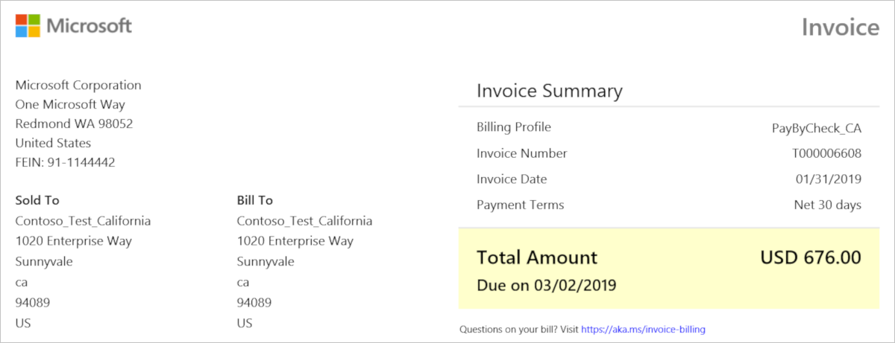
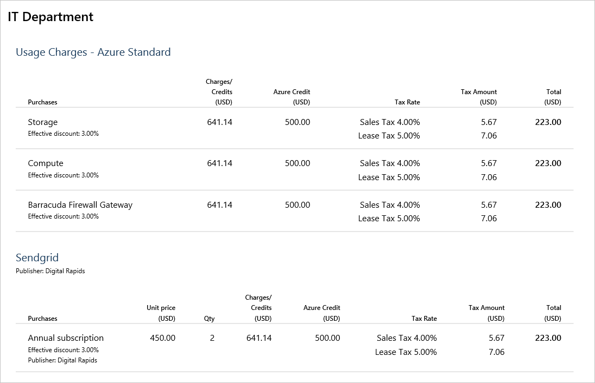

# Terms in your Microsoft Customer Agreement invoice

This article applies to an Azure billing account for a Microsoft Customer Agreement. [Check if you have access to a Microsoft Customer Agreement](#check-access-to-a-microsoft-customer-agreement).

Your invoice provides a summary of your charges and instructions for payment. It’s available for download in the Portable Document Format (.pdf) from the [Azure portal](https://portal.azure.com/) or can be sent via email. For more information, see [View and download your Microsoft Azure invoice](download-azure-invoice.md).

Watch the [Understand your Microsoft Customer Agreement invoice](https://www.youtube.com/watch?v=e2LGZZ7GubA) video to learn about your invoice and how to analyze the charges on it.

>[!VIDEO https://www.youtube.com/embed/e2LGZZ7GubA]

## Billing period

You're invoiced on a monthly basis. You can find out which day of the month you receive invoices by checking *invoice date* under billing profile properties in the [Azure portal](https://portal.azure.com/). Charges occurring between the end of the billing period and the invoice date are included in the next month's invoice, since they are in the next billing period. The billing period start and end dates for each invoice are listed in the invoice PDF above **Billing Summary**.

If you're migrating from an EA to a Microsoft Customer Agreement, you continue to receive invoices for your EA until the migration date. The new invoice for your Microsoft Customer Agreement is generated on the fifth day of the month after you migrate. The first invoice shows a partial charge from the migration date. Later invoices are generated every month and show all the charges for each month.

### Changes for pay-as-you-go subscriptions

When a subscription is transitioned, transferred, or canceled, the last invoice generated contains charges for the previous billing cycle and the new incomplete billing cycle.

For example:

Assume that your pay-as-you-go subscription billing cycle is from the day 8 to day 7 of each month. The subscription was transferred to a Microsoft Customer Agreement on November 16. The last pay-as-you-go invoice has charges for October 8, 2020 through November 7, 2020. It also has the charges for the new partial billing cycle for the Microsoft Customer Agreement from November 8, 2020 through November 16, 2020. Here's an example image.

:::image type="content" source="./media/mca-understand-your-invoice/last-invoice-billing-cycle.png" alt-text="Example image of an invoice showing the last billing cycle." lightbox="./media/mca-understand-your-invoice/last-invoice-billing-cycle.png" :::

## Invoice terms and descriptions

The following sections list important terms that you see on your invoice and provide descriptions for each term.

### Invoice summary

The **Invoice Summary** is at the top of the first page and shows information about your billing profile and how you pay.

| Term | Description |
| --- | --- |
| Sold to |Address of your legal entity, found in billing account properties|
| Bill to |Billing address of the billing profile receiving the invoice, found in billing profile properties|
| Billing Profile |The name of the billing profile receiving the invoice |
| P.O. number |An optional purchase order number, assigned by you for tracking |
| Invoice number |A unique, Microsoft-generated invoice number used for tracking purposes |
| Invoice date |Date that the invoice is generated, typically five to 12 days after end of the Billing cycle. You can check your invoice date in billing profile properties.|
| Payment terms |How you pay for your Microsoft bill. The *Net 30 days* term means you pay within 30 days of the invoice date. |

### Billing summary

The **Billing Summary**  shows the charges against the billing profile since the previous billing period, any credits that were applied, tax, and the total amount due.

| Term | Description |
| --- | --- |
| Charges|Total number of Microsoft charges for the billing profile since the last billing period |
| Credits |Credits you received from returns |
| Azure credits applied | Azure credits that are automatically applied to Azure charges each billing period |
| Subtotal |The pre-tax amount due |
| Tax |The type and amount of tax that you pay, depending on the country/region of your billing profile. If you don't have to pay tax, then you won't see tax on your invoice. |
| Estimated total savings |The estimated total amount you saved from effective discounts. If applicable, effective discount rates are listed beneath the purchase line items in Details by Invoice Section. |

### Invoice sections

For each invoice section under your billing profile, you'll see the charges, the amount of Azure credits applied, tax, and the total amount due.

`Total = Charges - Azure Credit + Tax`

### Details by invoice section

The details show the cost for each invoice section broken down by product order. Within each product order, cost is broken down by the type of service. You can find daily charges for your products and services in the Azure portal and Azure usage and charges CSV. For more information, see [Understand the charges on your invoice for a Microsoft Customer Agreement](review-customer-agreement-bill.md).

The total amount due for each service family is calculated by subtracting *Azure credits* from *Credits/charges* and adding *Tax*:

| Term |Description |
| --- | --- |
| Unit price | The effective unit price of the service (in pricing currency) that is used to the rate the usage. It's unique for a product, service family, meter, and offer. |
| Qty | Quantity purchased or consumed during the billing period |
| Charges/Credits | Net amount of charges after credits/refunds are applied |
| Azure Credit | The amount of Azure credits applied to the Charges/Credits|
| Tax rate | Tax rate(s) depending on country/region |
| Tax amount | Amount of tax applied to purchase based on tax rate |
| Total | The total amount due for the purchase |

### How to pay

At the bottom of the invoice, there are instructions for paying your bill. You can pay by check, wire, or online. If you pay online, you can use a credit card or Azure credits, if applicable.

### Publisher information

If you have third-party services in your bill, the name and address of each publisher is listed at the bottom of your invoice.

## What is the Modern Limited Risk Distributor model?

A Limited Risk Distributor (LRD) is a subsidiary that Microsoft established as buy-sell distributor who sells directly or indirectly. The model affects customers buying directly from Microsoft through the Microsoft Customer Agreement. It also demonstrates the Microsoft commitment to our business in the following countries/regions:

- Australia
- New Zealand
- Canada
- France
- United Kingdom
- Germany
- Austria
- Belgium
- Denmark
- Finland
- Italy
- Netherlands
- Norway
- Sweden
- Switzerland
- Spain

Under the LRD model:

- The selling entity is the local LRD subsidiary (sales and distribution rights have been extended to the LRDs).
- The payment methods won't change for customers.
- The LRD can only sell to customers located in the LRD country/region and agreed territories as defined by Tax.
- For LRD sales, the Licensor is either MS Corp or MIOL.
    - For the Americas, the Licensor is MS Corp (1010).
    - For EMEA and APAC, the Licensor is MIOL (1062).

For customers not part of the LRD model and for legacy/ regular invoices, the billing entity is:

- For EMEA, the billing entity is Microsoft Ireland Operations Limited (MIOL).
- For Americas, the billing entity is Microsoft Corporation.
- For APAC, the billing entity is Microsoft Regional Sales Pte LTD.
- For Japan, the billing entity is Microsoft Japan Co., LTD.
- For Korea, the billing entity is Microsoft Korea Inc.
- For India, the billing entity is Microsoft Corporation India Private Limited.
- For Brazil, the billing entity is A MICROSOFT DO BRASIL IMP E COM DE SOFTWARE E VIDEO GAMES LTDA.

Microsoft has received guidance that due to decimal point rounding, some LRD invoices may show tax that's under or overcharged. The taxes are compared to the amount that should have been calculated based on the local tax regulation.

*While we work to resolve this issue, you're only required to pay the VAT amount calculated at the subtotal level of the invoice*. Microsoft will be reporting the same amount in its VAT return and will write off the difference for any overcharges. Microsoft is bearing the risk of the undercharged VAT if there are audits. Unfortunately, it's currently impossible for Microsoft to reissue an amended invoice due to a system limitation.

## Check access to a Microsoft Customer Agreement
[!INCLUDE [billing-check-mca](../../../includes/billing-check-mca.md)]

## Need help? Contact us.

If you have questions or need help, [create a support request](https://go.microsoft.com/fwlink/?linkid=2083458).

## Next steps

- [Understand the charges on your billing profile's invoice](review-customer-agreement-bill.md)
- [How to get your Azure billing invoice and daily usage data](../manage/download-azure-invoice-daily-usage-date.md)
- [View your organization's Azure pricing](../manage/ea-pricing.md)
- [View tax documents for your billing profile](mca-download-tax-document.md)
