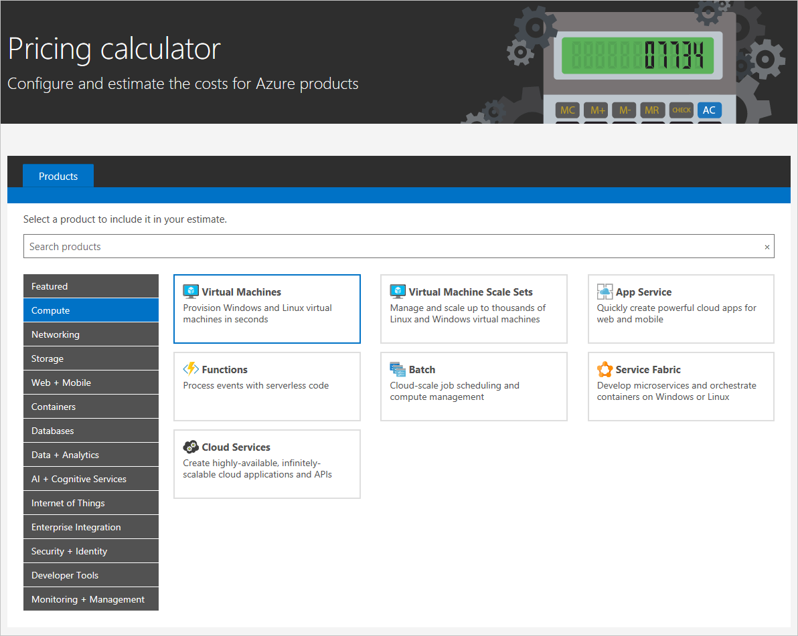
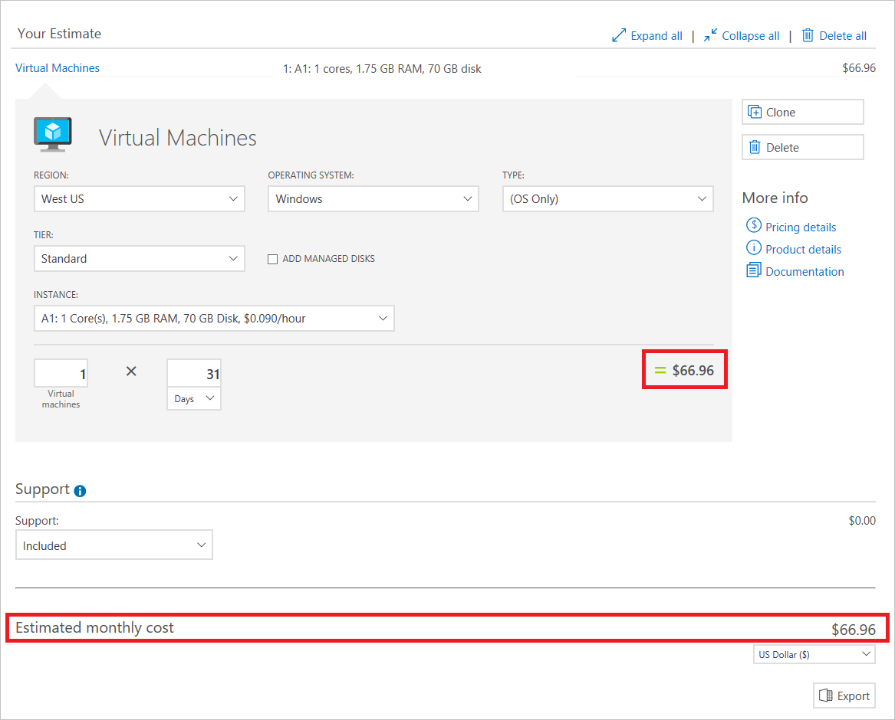
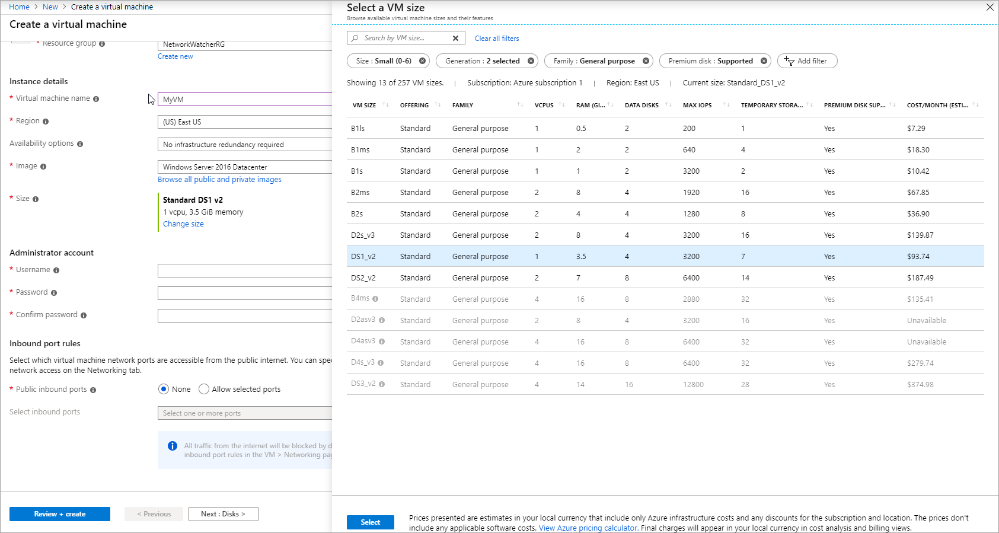
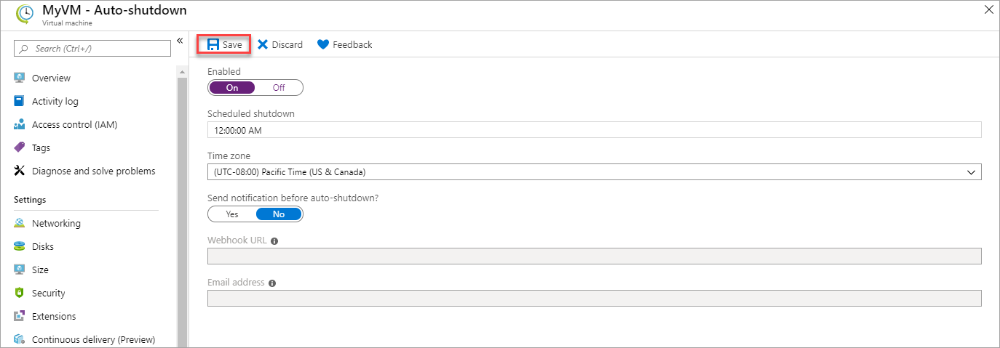

# Plan to manage Azure costs

This article helps you get started with how to plan to manage your Azure costs. When you sign up for Azure, there are several things you can do to get a better idea of your spending:

- Get estimated costs before adding services using [pricing calculator](https://azure.microsoft.com/pricing/calculator/), Azure price sheet or while adding services in the Azure portal.
- Monitor costs with [budgets](../costs/tutorial-acm-create-budgets.md), [alerts](../costs/cost-mgt-alerts-monitor-usage-spending.md), and [cost analysis](../costs/quick-acm-cost-analysis.md).
- Review the charges on your invoice by comparing them with [detailed usage files](../manage/download-azure-invoice-daily-usage-date.md).
- Integrate billing and cost data with your own reporting system using [billing](/rest/api/billing/) and [consumption](/rest/api/consumption/) APIs.
- Use additional resources and tools for Enterprise Agreement (EA), Cloud Solution Provider (CSP), and Azure Sponsorship customers.
- Make use of [some of the most popular Azure services for free for 12 months](../manage/create-free-services.md) available with the [Azure free account](https://azure.microsoft.com/free/). Along with the recommendations listed below, see [Avoid getting charged for free account](../manage/avoid-charges-free-account.md).

If you need to cancel your Azure subscription, see [Cancel your Azure subscription](../manage/cancel-azure-subscription.md).

## Get estimated costs before adding Azure services

Use one of the following tools to estimate the cost of using an Azure service:
- Azure pricing calculator
- Azure price sheet
- Azure portal

The images in the following sections show example pricing in US Dollars. The mentioned prices are for example purposes only. They are not intended to imply actual costs. 

### Estimate cost online using the pricing calculator

Check out the [pricing calculator](https://azure.microsoft.com/pricing/calculator/) to get an estimated monthly cost of the service that you want to add. You can change the currency to get the estimate in your local currency.

You can view estimated cost for any first party Azure service. For example, in the screenshot below, an A1 Windows Virtual Machine (VM) is estimated to cost $66.96 per month in compute hours if you leave it running the whole time:

The mentioned prices are for example purposes only. They are not intended to imply actual costs.

For more information about pricing, see the [Pricing FAQ](https://azure.microsoft.com/pricing/faq/). If you want to talk to an Azure salesperson, call the phone number shown at the top of the FAQ page.

### Review prices

If you have access to Azure through an Enterprise Agreement (EA) or a Microsoft Customer Agreement (MCA), you can view and download the price sheet for your Azure account. The price sheet is an excel file that contains prices for all Azure services. For more information, see [View and download your Azure pricing](../manage/ea-pricing.md).

For other subscription types, you can get standard retail prices with the [Azure Retail Prices API](/rest/api/cost-management/retail-prices/azure-retail-prices).

### Review estimated costs in the Azure portal

You can view the estimated cost per month while adding a service in the Azure portal. For example, when you choose the size of your Windows VM, you see the estimated monthly cost for the compute hours:

The mentioned prices are for example purposes only. They are not intended to imply actual costs.

## Monitor costs when using Azure services
You can monitor costs with the following tools:

- Budget and cost alerts
- Cost analysis

### Track costs with budgets and cost alerts

Create [budgets](../costs/tutorial-acm-create-budgets.md) to manage costs and create [alerts](../costs/cost-mgt-alerts-monitor-usage-spending.md) that automatically notify you are your stakeholders of spending anomalies and overspending.

###  Explore and analyze costs with cost analysis

After you have your Azure services running, regularly check costs to track your Azure spending. You can use cost analysis to understand where costs originated for your Azure usage.

Visit the [Cost Management + Billing page in the Azure portal](https://portal.azure.com/#blade/Microsoft_Azure_Billing/ModernBillingMenuBlade).

Select **Cost analysis** from the left side of the screen to see the current cost broken down by various pivots such as service, location, and subscription. After you add a service or make a purchase, wait 24 hours for the data to display. By default, cost analysis shows the cost for the scope that you are in. For example, in the screenshot below, cost for Contoso billing account is displayed. Use the Scope pill to switch to a different scope in cost analysis. For more information about scopes, see [Understand and work with scopes](../costs/understand-work-scopes.md#scopes)

You can filter by various properties such as tags, resource type, and time span. Select **Add filter** to add the filter for a property and select the values to filter. Select **Export** to export the view to a comma-separated values (.csv) file.

Additionally, you can select the labels of the chart to see the daily spend history for that label. For example, in the screenshot below, selecting a virtual machine displays the daily cost of running your VMs.

:::image type="content" source="./media/plan-manage-costs/cost-history.png" alt-text="Screenshot of the spend history view in Azure portal" lightbox="./media/plan-manage-costs/cost-history.png" :::

## Optimize and reduce costs

If you're unfamiliar with the principles of cost management, read [How to optimize your cloud investment with Cost Management](../costs/cost-mgt-best-practices.md).

In the Azure portal, you can also optimize and reduce Azure costs with auto shutdown for VMs and Advisor recommendations.

### Consider cost-cutting features like auto shutdown for VMs

Depending on your scenario, you can configure auto shutdown for your VMs in the Azure portal. For more information, see [Auto shutdown for VMs using Azure Resource Manager](https://azure.microsoft.com/blog/announcing-auto-shutdown-for-vms-using-azure-resource-manager/).

Auto shutdown isn't the same as when you shut down within the VM with power options. Auto shutdown stops and deallocates your VMs to stop additional usage charges. For more information, see pricing FAQ for [Linux VMs](https://azure.microsoft.com/pricing/details/virtual-machines/linux/) and [Windows VMs](https://azure.microsoft.com/pricing/details/virtual-machines/windows/) about VM states.

For more cost-cutting features for your development and test environments, check out [Azure DevTest Labs](https://azure.microsoft.com/services/devtest-lab/).

### Turn on and review Azure Advisor recommendations

[Azure Advisor](../../advisor/advisor-overview.md) helps you reduce costs by identifying resources with low usage. Search for **Advisor** in the Azure portal:

Select **Cost** from the left-hand side. You'll see actionable recommendations in the **Cost** tab:

The mentioned prices are for example purposes only. They are not intended to imply actual costs.

Review the [Optimize costs from recommendations](../costs/tutorial-acm-opt-recommendations.md) tutorial for a guided tutorial about cost-saving Advisor recommendations.

## Integrate with billing and Cost Management APIs

Use the Azure [billing](/rest/api/billing/) and [Cost Management automation APIs](../automate/automation-overview.md) to programmatically get billing and cost data. Use the RateCard API and the Usage API together to get your billed usage.

##  Additional resources and special cases

### EA, CSP, and Sponsorship customers
Talk to your account manager or Azure partner to get started.

| Offer | Resources |
|-------------------------------|-----------------------------------------------------------------------------------|
| Enterprise Agreement (EA) | [EA portal](https://ea.azure.com/), [help docs](https://ea.azure.com/helpdocs), and [Power BI report](https://powerbi.microsoft.com/documentation/powerbi-content-pack-azure-enterprise/) |
| Cloud Solution Provider (CSP) | Talk to your provider |
| Azure Sponsorship | [Sponsorship portal](https://www.microsoftazuresponsorships.com/) |

If you're managing IT for a large organization, we recommend reading [Azure enterprise scaffold](/azure/architecture/cloud-adoption-guide/subscription-governance) and the [enterprise IT white paper](https://download.microsoft.com/download/F/F/F/FFF60E6C-DBA1-4214-BEFD-3130C340B138/Azure_Onboarding_Guide_for_IT_Organizations_EN_US.pdf) (.pdf download, English only).

###  Enterprise Agreement cost views in the Azure portal

Enterprise cost views are currently in Public Preview. Items to note:

- Subscription costs are based on usage and don't include prepaid amounts, overages, included quantities, adjustments, and taxes. Actual charges are computed at the Enrollment level.
- Amounts shown in the Azure portal might be different than what's in the Enterprise portal. Updates in the Enterprise portal may take a few minutes before the changes are shown in the Azure portal.
- If you aren't seeing costs, it might be for one of the following reasons:
    - You don't have permissions at the subscription level. To see enterprise cost views, you must be a Billing Reader, Reader, Contributor, or Owner at the subscription level.
    - You're an Account Owner and your Enrollment Administrator has disabled the "AO view charges" setting.  Contact your Enrollment Administrator to get access to costs.
    - You're a Department Administrator and your Enrollment Administrator has disabled the **DA view charges** setting.  Contact your Enrollment Administrator to get access.
    - You bought Azure through a channel partner, and the partner didn't release pricing information.  
- If you update settings related to cost,  access in the Enterprise portal, there's a delay of a few minutes before the changes are shown in the Azure portal.
- Direct EA customers can update cost-related settings in the [Azure portal](https://portal.azure.com/). Navigate to the Policies menu to change settings.
- Spending limit, and invoice guidance don't apply to EA Subscriptions.

### Check your subscription and access

To view costs, you need account or subscription level access to cost or billing information. The access varies by type of billing account. To learn more about billing accounts and check the type of your billing account, see [View billing accounts in Azure portal](../manage/view-all-accounts.md).

If you have access to Azure through a Microsoft Online Service Program (MOSP) billing account, see [Manage access to billing information for Azure](../manage/manage-billing-access.md).

If you have access to Azure through an Enterprise Agreement (EA) billing account, see [Understand Azure Enterprise Agreement administrative roles in Azure](../manage/understand-ea-roles.md).

If you have access to Azure through a Microsoft Customer Agreement (MCA) billing account, see [Understand Microsoft Customer Agreement administrative roles in Azure](../manage/understand-mca-roles.md).

### Request a Service Level Agreement credit for a service incident

The Service Level Agreement (SLA) describes Microsoft's commitments for uptime and connectivity. A service incident is reported when Azure services experience an issue that impacts uptime or connectivity, often referred to as an *outage*. If we do not achieve and maintain the Service Levels for each service as described in the SLA, then you might be eligible for a credit towards a portion of your monthly service fees.

To request a credit:

Sign in to the [Azure portal](https://portal.azure.com/). If you have multiple accounts, make sure that you use the one that was affected by Azure downtime. Then, create a new support request.

Under **Issue type**, select **Billing** and then under **Problem type**, select **Refund Request**.

Add details to specify that you're asking for an SLA credit, mention the date/time/time-zone as well as the impacted services (VMs, Web Sites, etc.)

Finally, verify your contact details and select **Create** to submit your request.

For some services, there are prerequisites for the SLA to apply. For example, virtual machines must have two or more instances deployed in the same Availability Set.

For more information, see [Service Level Agreements](https://azure.microsoft.com/support/legal/sla/) and the [SLA summary for Azure services](https://azure.microsoft.com/support/legal/sla/summary/) documentation.

## Next steps
- Learn about using [spending limits](../manage/spending-limit.md) to prevent overspending.
- Start [analyzing your Azure costs](../costs/quick-acm-cost-analysis.md).
