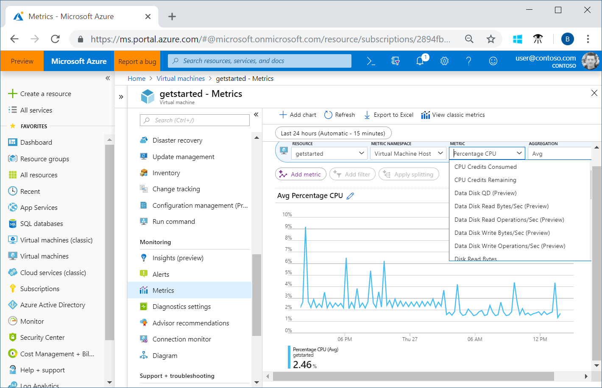
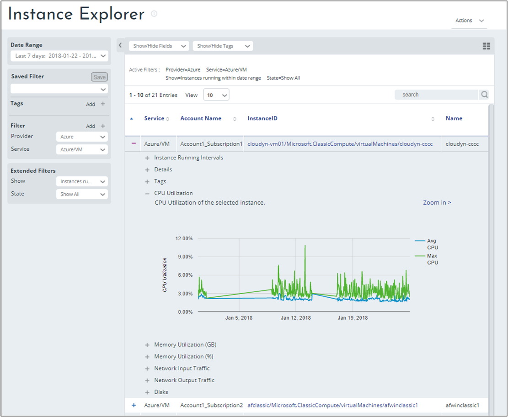

# Add extended metrics for Azure virtual machines

Cost Management uses Azure metric data from your Azure VMs to show you detailed information about their resources. Metric data, also called performance counters, is used by Cost Management to generate reports. However, Cost Management does not automatically gather all Azure metric data from guest VMs—you must enable metric collection. This article helps you enable and configure additional diagnostics metrics for your Azure VMs.

After you enable metric collection, you can:

- Know when your VMs are reaching their memory, disk, and CPU limits.
- Detect usage trends and anomalies.
- Control your costs by sizing according to usage.
- Get cost effective sizing optimization recommendations from Cost Management.

For example, you might want to monitor the CPU % and Memory % of your Azure VMs. The Azure VM metrics correspond to _[Host] Percentage CPU_ and _[Guest] Memory percentage_.

## Verify that metrics are enabled on VMs

1. Log in to the Azure portal at http://portal.azure.com.
2. Under **Virtual machines**, select a VM and then under **Monitoring**, select **Metrics**. A list of available metrics is shown.
3. Select some metrics and a graph displays data for them.  
    

In the preceding example, a limited set of standard metrics are available for your hosts, but memory metrics are not. Memory metrics are part of extended metrics. You must perform some additional steps to enable extended metrics. The following information guides you through enabling them.

## Enable extended metrics in the Azure portal

Standard metrics are host computer metrics. The _[Host] Percentage CPU_ metric is one example. There are also basic metrics for guest VMs and they're also called extended metrics. Examples of extended metrics include _[Guest] Memory percentage_ and _[Guest] Memory available_.

Enabling extended metrics is straightforward. For each VM, enable guest-level monitoring. When you enable guest-level monitoring, the Azure diagnostics agent is installed on the VM. The following process is the same for classic and regular VMs and the same for Windows and Linux VMs.

### Enable guest-level monitoring on existing VMs

1. In **Virtual Machines**, view your list of your VMs and then select a VM.
2. Under **Monitoring**, select **Metrics**.
3. Click **Diagnostic settings**.
4. On the Diagnostics settings page, click **Enable guest-level monitoring**. Linux VMs require an existing storage account. If you don't choose a storage account for a Windows VM, then one is created for you.  
    
5. After a few minutes, the Azure diagnostics agent is installed on the VM. Refresh the page and the list of available metrics is updated with guest metrics.  
    

### Enable guest-level monitoring on new VMs

When you create new VMs, ensure that you select **Guest OS diagnostics**. Linux VMs require an existing storage account. If you don't choose a storage account for a Windows VM, then one is created for you.

## Resource Manager credentials

After you enable extended metrics, ensure that Cost Management has access to your [Resource Manager credentials](activate-subs-accounts.md). Your credentials are required for Cost Management to collect and display performance data for your VMs. They're also used to create cost optimization recommendations. Cost Management needs at least three days of performance data from an instance to determine if it is a candidate for a downsizing recommendation.

## Enable VM metrics with a script

You can enable VM metrics with Azure PowerShell scripts. When you have many VMs that you want to enable metrics on, you can use a script to automate the process. Example scripts are on GitHub at [Azure Enable Diagnostics](https://github.com/Cloudyn/azure-enable-diagnostics).

## View Azure performance metrics

To view performance metrics on your Azure Instances in the Cloudyn portal, navigate to **Assets** > **Compute** > **Instance Explorer**. In the list of VM instances, expand an instance and then expand a resource to view details.

## Next steps

- If you haven't already enabled Azure Resource Manager API access for your accounts, proceed to [Activate Azure subscriptions and accounts](activate-subs-accounts.md)
