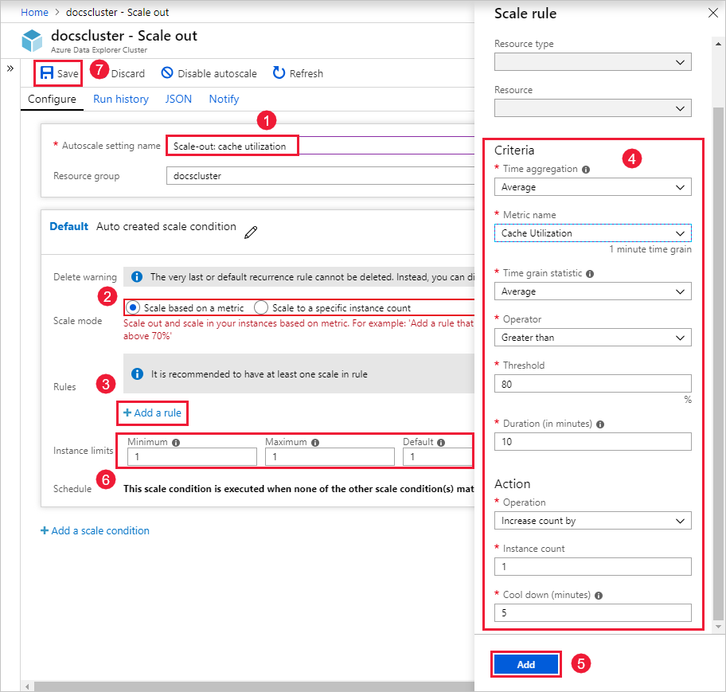

# Manage cluster scale out to accommodate changing demand

Sizing a cluster appropriately is critical to the performance of Azure Data Explorer. But demand on a cluster can’t be predicted with 100% accuracy. A static cluster size can lead to under-utilization or over-utilization, neither of which is ideal. A better approach is to *scale* a cluster, adding and removing capacity with changing demand. This article shows you how to manage cluster scale out.

Navigate to your cluster, and under **Settings** select **Scale out**. Under **Configure**, select **Enable autoscale**.

The following graphic shows the flow of the next several steps. We provide more details below the graphic.

1. Under **Autoscale setting name**, provide a name, such as *Scale-out: cache utilization*.

1. Under **Scale mode**, select **Scale based on a metric**. This mode provides dynamic scaling; you can also select **Scale to a specific instance count**.

1. Select **Add a rule**.

1. In the **Scale rule** section on the right, provide values for each setting.

    | Setting | Description and value |
    | --- | --- | --- |
    | **Time aggregation** | Select an aggregation criteria, such as **Average**. |
    | **Metric name** | Select the metric you want the scale operation to be based on, such as **Cache Utilization**. |
    | **Time grain statistic** | Choose between **Average**, **Minimum**, **Maximum**, and **Sum**. |
    | **Operator** | Choose the appropriate option, such as **Greater than or equal to**. |
    | **Threshold** | Choose an appropriate value. For example, for cache utilization, 80% is a good starting point. |
    | **Duration** | Choose an appropriate amount of time for the system to look back when calculating metrics. Start with the default of ten minutes. |
    | **Operation** | Choose the appropriate option to scale in or scale out. |
    | **Instance count** | Choose the number of nodes or instances you want to add or remove when a metric condition is met. |
    | **Cool down (minutes)** | Choose an appropriate time interval to wait between scale operations. Start with the default of five minutes. |
    |  |  |

1. Select **Add**.

1. In the **Instance limits** section on the left, provide values for each setting.

    | Setting | Description and value |
    | --- | --- | --- |
    | *Minimum* | This is the number of instances that your cluster will not scale below, regardless of utilization. |
    | *Maximum* | This is the number of instances that your cluster will not scale above, regardless of utilization. |
    | *Default* | The default number of instances, used if there is a problem reading resource metrics. |
    |  |  |

1. Select **Save**.

You've now configured a scale-out operation for your Azure Data Explorer cluster. Add another rule for a scale-in operation. This enables your cluster to scale dynamically based on metrics that you specify.

If you need assistance with cluster scaling issues, open a support request in the [Azure portal](https://portal.azure.com/#blade/Microsoft_Azure_Support/HelpAndSupportBlade/overview).