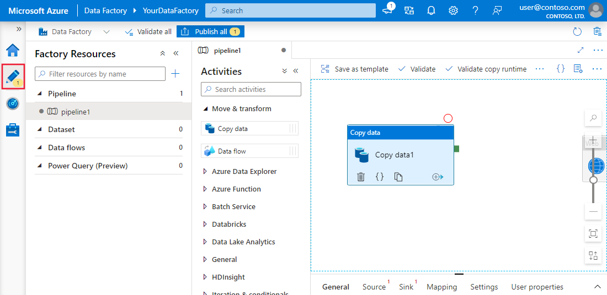
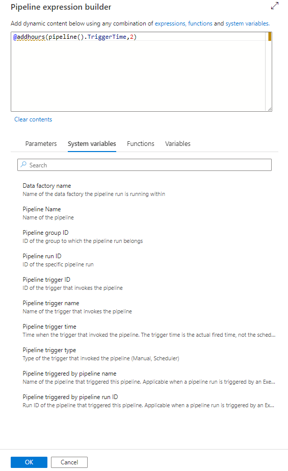
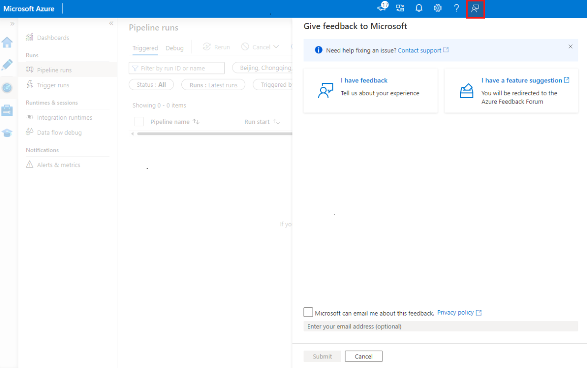

# Visual authoring in Azure Data Factory

[!INCLUDE[appliesto-adf-asa-md](includes/appliesto-adf-asa-md.md)]

The Azure Data Factory user interface experience (UX) lets you visually author and deploy resources for your data factory without having to write any code. You can drag activities to a pipeline canvas, perform test runs, debug iteratively, and deploy and monitor your pipeline runs.

Currently, the Azure Data Factory UX is only supported in Microsoft Edge and Google Chrome.

## Authoring canvas

To open the **authoring canvas**, click on the pencil icon. 

Here, you will author the pipelines, activities, datasets, linked services, data flows, triggers, and integration runtimes that comprise your factory. To get started building a pipeline using the authoring canvas, see [Copy data using the copy Activity](tutorial-copy-data-portal.md). 

The default visual authoring experience is directly working with the Data Factory service. Azure Repos Git or GitHub integration is also supported to allow source control and collaboration for work on your data factory pipelines. To learn more about the differences between these authoring experiences, see [Source control in Azure Data Factory](source-control.md).

### Properties pane

For top-level resources such as pipelines, datasets, and data flows, high-level properties are editable in the properties pane on the right-hand side of the canvas. The properties pane contains properties such as name, description, annotations, and other high-level properties. Subresources such as pipeline activities and data flow transformations are edited using the panel at the bottom of the canvas. 

The properties pane will only be open by default on resource creation. To edit it, click on the properties pane icon located in the top-right corner of the canvas.

## Expressions and functions

Expressions and functions can be used instead of static values to specify many properties in Azure Data Factory.

To specify an expression for a property value, select **Add Dynamic Content** or click **Alt + P** while focusing on the field.

This opens the **Data Factory Expression Builder** where you can build expressions from supported system variables, activity output, functions, and user-specified variables or parameters. 

For information about the expression language, see [Expressions and functions in Azure Data Factory](control-flow-expression-language-functions.md).

## Provide feedback

Select **Feedback** to comment about features or to notify Microsoft about issues with the tool:

## Next steps

To learn more about monitoring and managing pipelines, see [Monitor and manage pipelines programmatically](monitor-programmatically.md).
