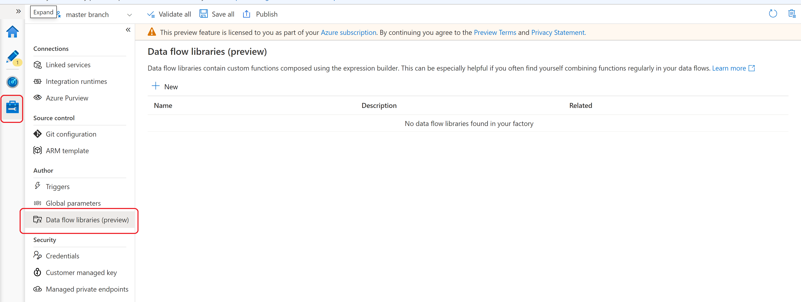
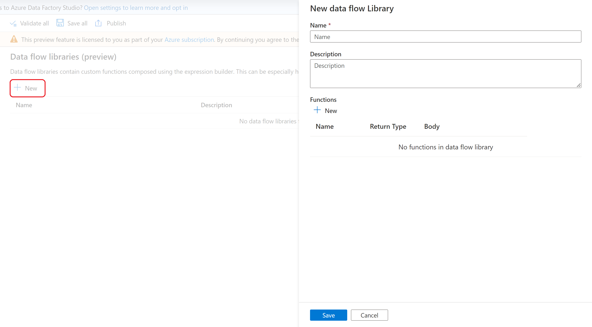
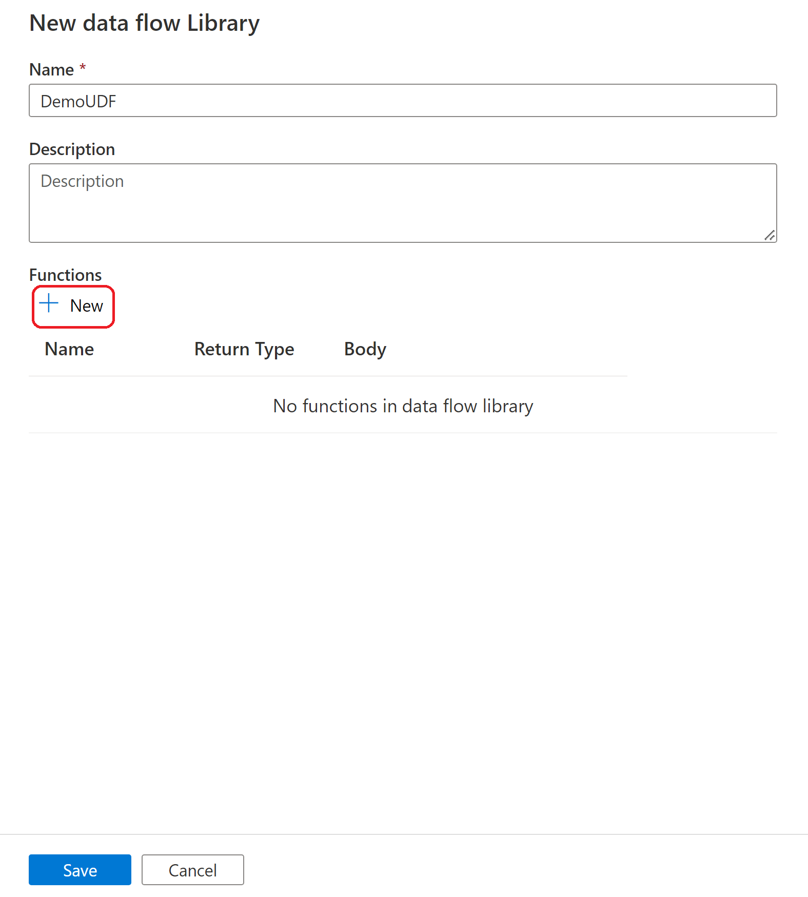
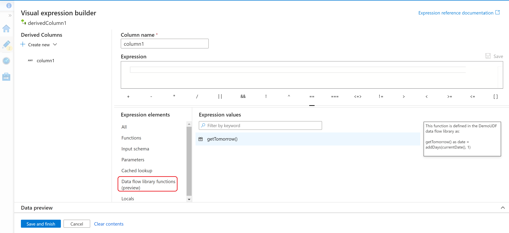

# User defined functions (Preview) in mapping data flow 

[!INCLUDEappliesto-adf-asa-md]

[!INCLUDEdata-flow-preamble]

A user defined function is a customized expression you can define to be able to reuse logic across multiple mapping data flows. User defined functions live in a collection called a data flow library to be able to easily group up common sets of customized functions.

Whenever you find yourself building the same logic in an expression in across multiple mapping data flows this would be a good opportunity to turn that into a user defined function.

> [!IMPORTANT]
> User defined functions and mapping data flow libraries are currently in public preview.

## Getting started

To get started with user defined functions, you must first create a data flow library. Navigate to the management page and then find data flow libraries under the author section.

## Data flow library

From here, you can click on +New button to create a new data flow library. Fill out the name and description and then you are ready to create your user defined function.

## New user defined function

To create a user defined function, from the data flow library you want to create the function in, click the +New button.

Fill in the name of your user defined function.
> [!Note]
> You cannot use the name of an existing mapping data flow expression. For a list of the current mapping data flow expressions,  see [Data transformation expressions in mapping data flow | Microsoft Docs](data-transformation-functions.md)

User defined functions can have zero or more arguments. Arguments allow you to pass in values when your function is called and refer to those arguments in your expression logic. Arguments are automatically named from i1, i2, etc. and you can choose the data type of the argument from the dropdown.

The body of the user defined function is where you specify the logic of your function. The editor provides the full [expression builder | Microsoft Docs](concepts-data-flow-expression-builder.md) experience and allows you to reference your arguments created and any [data transformation expressions in mapping data flow | Microsoft Docs](data-transformation-functions.md).

> [!Note]
> A user defined function cannot refer to another user defined function.

## Using a user defined function in the expression builder

User defined functions will appear in the mapping data flow expression builder under Data flow library functions. From here, you can use your custom created functions and pass in appropriate arguments (if any) that you've defined.

