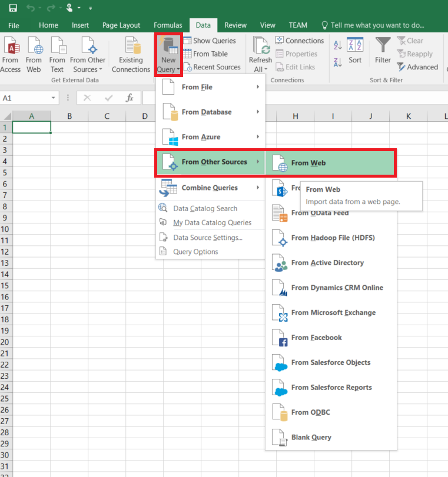
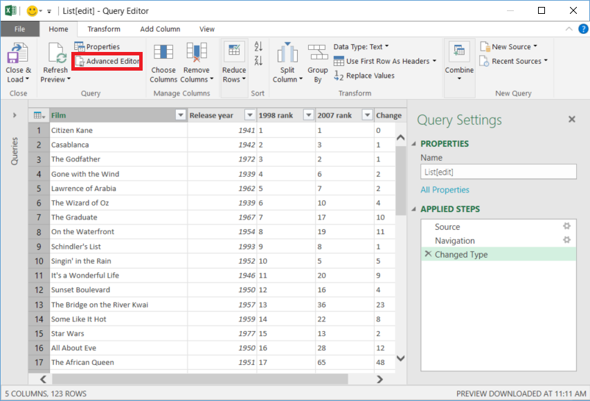

# Copy data from Web table by using Azure Data Factory
> [!div class="op_single_selector" title1="Select the version of Data Factory service you are using:"]
> * [Version 1 - GA](v1/data-factory-web-table-connector.md)
> * [Version 2 - Preview](connector-web-table.md)

This article outlines how to use the Copy Activity in Azure Data Factory to copy data from a Web table database. It builds on the [copy activity overview](copy-activity-overview.md) article that presents a general overview of copy activity.

> [!NOTE]
> This article applies to version 2 of Data Factory, which is currently in preview. If you are using version 1 of the Data Factory service, which is generally available (GA), see [Web Table connector in V1](v1/data-factory-web-table-connector.md).

## Supported capabilities

You can copy data from Web table database to any supported sink data store. For a list of data stores that are supported as sources/sinks by the copy activity, see the [Supported data stores](copy-activity-overview.md#supported-data-stores-and-formats) table.

Specifically, this Web table connector supports **extracting table content from an HTML page**. To retrieve data from a HTTP/s endpoint, use [HTTP connector](connector-http.md) instead.

## Prerequisites

To use this Web table connector, you need to set up a Self-hosted Integration Runtime. See [Self-hosted Integration Runtime](create-self-hosted-integration-runtime.md) article for details.

## Getting started

[!INCLUDE [data-factory-v2-connector-get-started-2](../../includes/data-factory-v2-connector-get-started-2.md)]

The following sections provide details about properties that are used to define Data Factory entities specific to Web table connector.

## Linked service properties

The following properties are supported for Web table linked service:

| Property | Description | Required |
|:--- |:--- |:--- |
| type | The type property must be set to: **Web** |Yes |
| url | URL to the Web source |Yes |
| authenticationType | Allowed value is: **Anonymous**. |Yes |
| connectVia | The [Integration Runtime](concepts-integration-runtime.md) to be used to connect to the data store. A Self-hosted Integration Runtime is required as mentioned in [Prerequisites](#prerequisites). |Yes |

**Example:**

```json
{
    "name": "WebLinkedService",
    "properties": {
        "type": "Web",
        "typeProperties": {
            "url" : "https://en.wikipedia.org/wiki/",
            "authenticationType": "Anonymous"
        },
        "connectVia": {
            "referenceName": "<name of Integration Runtime>",
            "type": "IntegrationRuntimeReference"
        }
    }
}
```

## Dataset properties

For a full list of sections and properties available for defining datasets, see the datasets article. This section provides a list of properties supported by Web table dataset.

To copy data from Web table, set the type property of the dataset to **RelationalTable**. The following properties are supported:

| Property | Description | Required |
|:--- |:--- |:--- |
| type | The type property of the dataset must be set to: **WebTable** | Yes |
| path |A relative URL to the resource that contains the table. |No. When path is not specified, only the URL specified in the linked service definition is used. |
| index |The index of the table in the resource. See [Get index of a table in an HTML page](#get-index-of-a-table-in-an-html-page) section for steps to getting index of a table in an HTML page. |Yes |

**Example:**

```json
{
    "name": "WebTableInput",
    "properties": {
        "type": "WebTable",
        "linkedServiceName": "WebLinkedService",
        "typeProperties": {
            "index": 1,
            "path": "AFI's_100_Years...100_Movies"
        }
    }
}
```

## Copy activity properties

For a full list of sections and properties available for defining activities, see the [Pipelines](concepts-pipelines-activities.md) article. This section provides a list of properties supported by Web table source.

### Web table as source

To copy data from Web table, set the source type in the copy activity to **WebSource**, no additional properties are supported.

**Example:**

```json
"activities":[
    {
        "name": "CopyFromWebTable",
        "type": "Copy",
        "inputs": [
            {
                "referenceName": "<Web table input dataset name>",
                "type": "DatasetReference"
            }
        ],
        "outputs": [
            {
                "referenceName": "<output dataset name>",
                "type": "DatasetReference"
            }
        ],
        "typeProperties": {
            "source": {
                "type": "WebSource"
            },
            "sink": {
                "type": "<sink type>"
            }
        }
    }
]
```

## Get index of a table in an HTML page

1. Launch **Excel 2016** and switch to the **Data** tab.
2. Click **New Query** on the toolbar, point to **From Other Sources** and click **From Web**.

    
3. In the **From Web** dialog box, enter **URL** that you would use in linked service JSON (for example: https://en.wikipedia.org/wiki/) along with path you would specify for the dataset (for example: AFI%27s_100_Years...100_Movies), and click **OK**.

    

    URL used in this example: https://en.wikipedia.org/wiki/AFI%27s_100_Years...100_Movies
4. If you see **Access Web content** dialog box, select the right **URL**, **authentication**, and click **Connect**.

   
5. Click a **table** item in the tree view to see content from the table and then click **Edit** button at the bottom.  

   
6. In the **Query Editor** window, click **Advanced Editor** button on the toolbar.

    
7. In the Advanced Editor dialog box, the number next to "Source" is the index.

    

If you are using Excel 2013, use [Microsoft Power Query for Excel](https://www.microsoft.com/download/details.aspx?id=39379) to get the index. See [Connect to a web page](https://support.office.com/article/Connect-to-a-web-page-Power-Query-b2725d67-c9e8-43e6-a590-c0a175bd64d8) article for details. The steps are similar if you are using [Microsoft Power BI for Desktop](https://powerbi.microsoft.com/desktop/).


## Next steps
For a list of data stores supported as sources and sinks by the copy activity in Azure Data Factory, see [supported data stores](copy-activity-overview.md#supported-data-stores-and-formats).