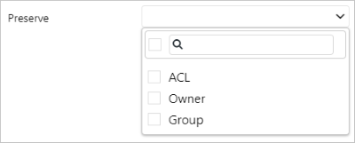

#  Preserve metadata and ACLs using copy activity in Azure Data Factory

When you use Azure Data Factory copy activity to copy data from source to sink, in the following scenarios, you can also preserve the metadata and ACLs along.

## <a name="preserve-metadata"></a> Preserve metadata for lake migration

When you migrate data from one data lake to another including [Amazon S3](connector-amazon-simple-storage-service.md), [Azure Blob](connector-azure-blob-storage.md), and [Azure Data Lake Storage Gen2](connector-azure-data-lake-storage.md), you can choose to preserve the file metadata along with data.

Copy activity supports preserving the following attributes during data copy:

- **All the customer specified metadata** 
- And the following **five data store built-in system properties**: `contentType`, `contentLanguage` (except for Amazon S3), `contentEncoding`, `contentDisposition`, `cacheControl`.

When you copy files as-is from Amazon S3/Azure Data Lake Storage Gen2/Azure Blob to Azure Data Lake Storage Gen2/Azure Blob with binary format, you can find the **Preserve** option on the **Copy Activity** > **Settings** tab for activity authoring or the **Settings** page in Copy Data Tool.


Here's an example of copy activity JSON configuration (see `preserve`): 

```json
"activities":[
    {
        "name": "CopyFromGen1ToGen2",
        "type": "Copy",
        "typeProperties": {
            "source": {
                "type": "BinarySource",
                "storeSettings": {
                    "type": "AmazonS3ReadSettings",
                    "recursive": true
                }
            },
            "sink": {
                "type": "BinarySink",
                "storeSettings": {
                    "type": "AzureBlobFSWriteSettings"
                }
            },
            "preserve": [
                "Attributes"
            ]
        },
        "inputs": [
            {
                "referenceName": "<Binary dataset Amazon S3/Azure Blob/ADLS Gen2 source>",
                "type": "DatasetReference"
            }
        ],
        "outputs": [
            {
                "referenceName": "<Binary dataset for Azure Blob/ADLS Gen2 sink>",
                "type": "DatasetReference"
            }
        ]
    }
]
```

## <a name="preserve-acls"></a> Preserve ACLs from Data Lake Storage Gen1 to Gen2

When you upgrade from Azure Data Lake Storage Gen1 to Gen2, you can choose to preserve the POSIX access control lists (ACLs) along with data files. For more information on access control, see [Access control in Azure Data Lake Storage Gen1](../data-lake-store/data-lake-store-access-control.md) and [Access control in Azure Data Lake Storage Gen2](../storage/blobs/data-lake-storage-access-control.md).

Copy activity supports preserving the following types of ACLs during data copy. You can select one or more types:

- **ACL**: Copy and preserve POSIX access control lists on files and directories. It copies the full existing ACLs from source to sink. 
- **Owner**: Copy and preserve the owning user of files and directories. Super-user access to sink Data Lake Storage Gen2 is required.
- **Group**: Copy and preserve the owning group of files and directories. Super-user access to sink Data Lake Storage Gen2 or the owning user (if the owning user is also a member of the target group) is required.

If you specify to copy from a folder, Data Factory replicates the ACLs for that given folder and the files and directories under it, if `recursive` is set to true. If you specify to copy from a single file, the ACLs on that file are copied.

>[!IMPORTANT]
>When you choose to preserve ACLs, make sure you grant high enough permissions for Data Factory to operate against your sink Data Lake Storage Gen2 account. For example, use account key authentication or assign the Storage Blob Data Owner role to the service principal or managed identity.

When you configure source as Data Lake Storage Gen1 with binary format or the binary copy option, and sink as Data Lake Storage Gen2 with binary format or the binary copy option, you can find the **Preserve** option on the **Settings** page in Copy Data Tool or on the **Copy Activity** > **Settings** tab for activity authoring.



Here's an example of copy activity JSON configuration (see `preserve`): 

```json
"activities":[
    {
        "name": "CopyFromGen1ToGen2",
        "type": "Copy",
        "typeProperties": {
            "source": {
                "type": "BinarySource",
                "storeSettings": {
                    "type": "AzureDataLakeStoreReadSettings",
                    "recursive": true
                }
            },
            "sink": {
                "type": "BinarySink",
                "storeSettings": {
                    "type": "AzureBlobFSWriteSettings"
                }
            },
            "preserve": [
                "ACL",
                "Owner",
                "Group"
            ]
        },
        "inputs": [
            {
                "referenceName": "<Binary dataset name for Azure Data Lake Storage Gen1 source>",
                "type": "DatasetReference"
            }
        ],
        "outputs": [
            {
                "referenceName": "<Binary dataset name for Azure Data Lake Storage Gen2 sink>",
                "type": "DatasetReference"
            }
        ]
    }
]
```

## Next steps

See the other Copy Activity articles:

- [Copy activity overview](copy-activity-overview.md)
- [Copy activity performance](copy-activity-performance.md)
