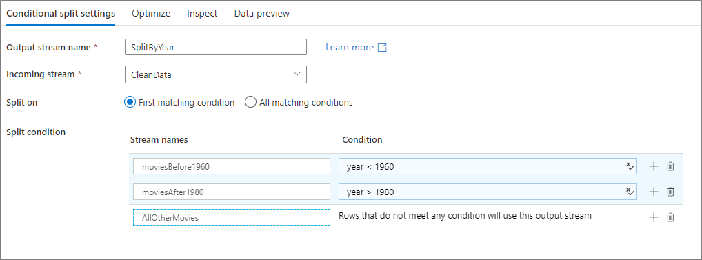

# Mapping data flow conditional split transformation

The Conditional Split transformation can route data rows to different streams depending on the content of the data. The implementation of the Conditional Split transformation is similar to a CASE decision structure in a programming language. The transformation evaluates expressions, and based on the results, directs the data row to the specified stream. This transformation also provides a default output, so that if a row matches no expression it is directed to the default output.

## Multiple paths

To add additional conditions, select "Add Stream" in the bottom configuration pane and click in the Expression Builder text box to build your expression.

## Next steps

Common data flow transformations used with conditional split: [Join transformation](data-flow-join.md), [Lookup transformation](data-flow-lookup.md), [Select transformation](data-flow-select.md)
