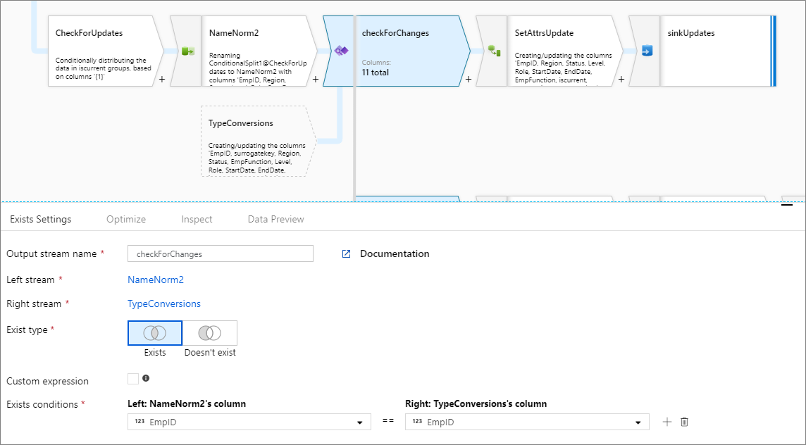
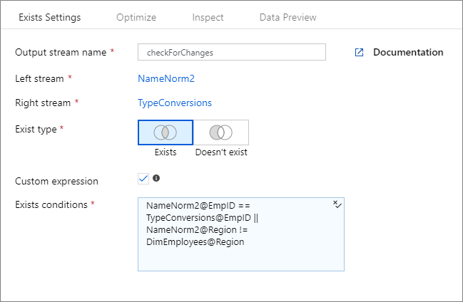
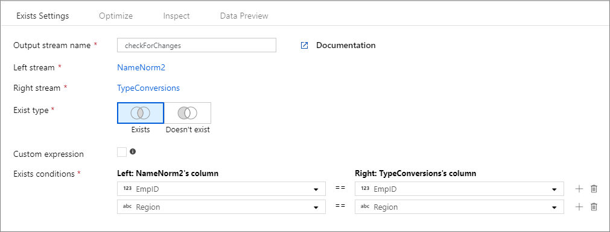

# Exists transformation in mapping data flow

The exists transformation is a row filtering transformation that checks whether your data exists in another source or stream. The output stream includes all rows in the left stream that either exist or don't exist in the right stream. The exists transformation is similar to ```SQL WHERE EXISTS``` and ```SQL WHERE NOT EXISTS```.

## Configuration

Choose which data stream you're checking for existence in the **Right stream** dropdown.

Specify whether you're looking for the data to exist or not exist in the **Exist type** setting.

Choose which key columns you want to compare as your exists conditions. By default, data flow looks for equality between one column in each stream. To compare via a compute value, hover over the column dropdown and select **Computed column**.



### Multiple exists conditions

To compare multiple columns from each stream, add a new exists condition by clicking the plus icon next to an existing row. Each additional condition is joined by an "and" statement. Comparing two columns is the same as the following expression:

`source1@column1 == source2@column1 && source1@column2 == source2@column2`

### Custom expression

To create a free-form expression that contains operators other than "and" and "equals to", select the **Custom expression** field. Enter a custom expression via the data flow expression builder by clicking on the blue box.



## Data flow script

### Syntax

```
<leftStream>, <rightStream>
    exists(
        <conditionalExpression>,
        negate: { true | false },
        broadcast: {'none' | 'left' | 'right' | 'both'}
    ) ~> <existsTransformationName>
```

### Example

The below example is an exists transformation named `checkForChanges` that takes left stream `NameNorm2` and right stream `TypeConversions`.  The exists condition is the expression `NameNorm2@EmpID == TypeConversions@EmpID && NameNorm2@Region == DimEmployees@Region` that returns true if both the `EMPID` and `Region` columns in each stream matches. As we're checking for existence, `negate` is false. We aren't enabling any broadcasting in the optimize tab so `broadcast` has value `'none'`.

In the Data Factory UX, this transformation looks like the below image:



The data flow script for this transformation is in the snippet below:

```
NameNorm2, TypeConversions
    exists(
        NameNorm2@EmpID == TypeConversions@EmpID && NameNorm2@Region == DimEmployees@Region,
	    negate:false,
	    broadcast: 'none'
    ) ~> checkForChanges
```

## Next steps

Similar transformations are [Lookup](data-flow-lookup.md) and [Join](data-flow-join.md).
