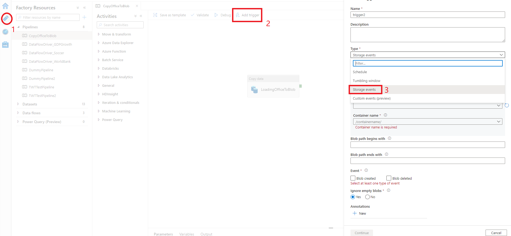
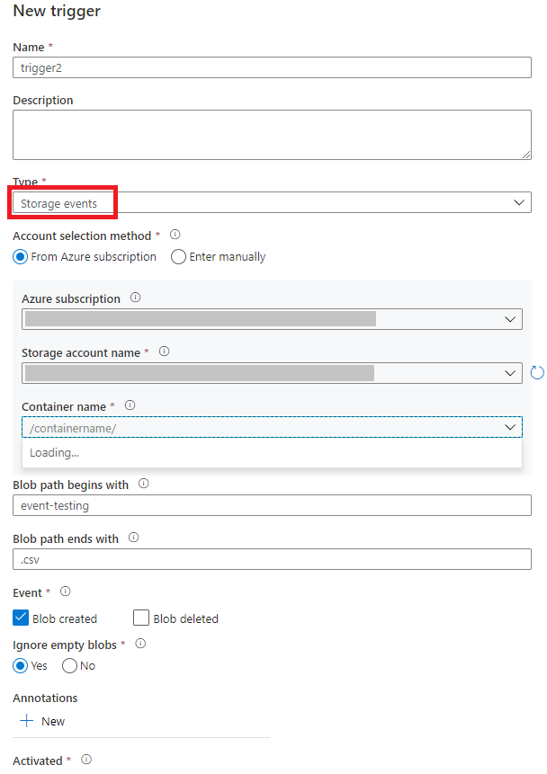
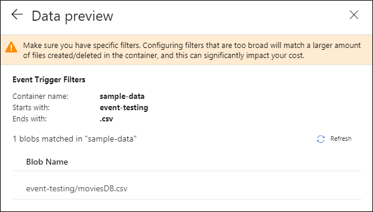

# Create a trigger that runs a pipeline in response to an event

This article describes the event-based triggers that you can create in your Data Factory pipelines.

Event-driven architecture (EDA) is a common data integration pattern that involves production, detection, consumption, and reaction to events. Data integration scenarios often require Data Factory customers to trigger pipelines based on events. Data Factory is now integrated with [Azure Event Grid](https://azure.microsoft.com/services/event-grid/), which lets you trigger pipelines on an event.

> [!NOTE]
> The integration described in this article depends on [Azure Event Grid](https://azure.microsoft.com/services/event-grid/). Make sure that your subscription is registered with the Event Grid resource provider. For more info, see [Resource providers and types](../azure-resource-manager/resource-manager-supported-services.md#portal).

## Data Factory UI

### Create a new event trigger

A typical event is the arrival of a file, or the deletion of a file, in your Azure Storage account. You can  create a trigger that responds to this event in your Data Factory pipeline.

> [!NOTE]
> This integration supports only version 2 Storage accounts (General purpose).

### Configure the event trigger

With the **Blob path begins with** and **Blob path ends with** properties, you can specify the containers, folders, and blob names for which you want to receive events. You can use variety of patterns for both **Blob path begins with** and **Blob path ends with** properties, as shown in the examples later in this article. At least one of these properties is required.

### Select the event trigger type

As soon as the file arrives in your storage location and the corresponding blob is created, this event triggers and runs your Data Factory pipeline. You can create a trigger that responds to a blob creation event, a blob deletion event, or both events, in your Data Factory pipelines.

## JSON schema

The following table provides an overview of the schema elements that are related to event-based triggers:

| **JSON Element** | **Description** | **Type** | **Allowed Values** | **Required** |
| ---------------- | --------------- | -------- | ------------------ | ------------ |
| **scope** | The Azure Resource Manager resource ID of the Storage Account. | String | Azure Resource Manager ID | Yes |
| **events** | The type of events that cause this trigger to fire. | Array    | Microsoft.Storage.BlobCreated, Microsoft.Storage.BlobDeleted | Yes, any combination. |
| **blobPathBeginsWith** | The blob path must begin with the pattern provided for trigger to fire. For example, '/records/blobs/december/' will only fire the trigger for blobs in the december folder under the records container. | String   | | At least one of these properties must be provided: blobPathBeginsWith, blobPathEndsWith. |
| **blobPathEndsWith** | The blob path must end with the pattern provided for trigger to fire. For example, 'december/boxes.csv' will only fire the trigger for blobs named boxes in a december folder. | String   | | At least one of these properties must be provided: blobPathBeginsWith, blobPathEndsWith. |

## Examples of event-based triggers

This section provides examples of event-based trigger settings.

-   **Blob path begins with**('/containername/') – Receives events for any blob in the container.
-   **Blob path begins with**('/containername/blobs/foldername') – Receives events for any blobs in the containername container and foldername folder.
-   **Blob path begins with**('/containername/blobs/foldername/file.txt') – Receives events for a blob named file.txt in the foldername folder under the containername container.
-   **Blob path ends with**('file.txt') – Receives events for a blob named file.txt at any path.
-   **Blob path ends with**('/containername/blobs/file.txt') – Receives events for a blob named file.txt under container containername.
-   **Blob path ends with**('foldername/file.txt') – Receives events for a blob named file.txt in foldername folder under any container.

> [!NOTE]
> You have to include the `/blobs/` segment of the path whenever you specify container and folder, container and file, or container, folder, and file.

## Map trigger properties to pipeline parameters

When an event trigger fires for a specific blob, the event captures the folder path and file name of the blob into the properties `@triggerBody().folderPath` and `@triggerBody().fileName`. To use the values of these properties in a pipeline, you must map the properties to pipeline parameters. After mapping the properties to parameters, you can access the values captured by the trigger through the `@pipeline.parameters.parameterName` expression throughout the pipeline.

For example, in the preceding screenshot. the trigger is configured to fire when a blob path ending in `.csv` is created in the Storage Account. As a result, when a blob with the `.csv` extension is created anywhere in the Storage Account, the `folderPath` and `fileName` properties capture the location of the new blob. For example, `@triggerBody().folderPath` has a value like `/containername/foldername/nestedfoldername` and `@triggerBody().fileName` has a value like `filename.csv`. These values are mapped in the example to the pipeline parameters `sourceFolder` and `sourceFile`. You can use them throughout the pipeline as `@pipeline.parameters.sourceFolder` and `@pipeline.parameters.sourceFile` respectively.

## Next steps
For detailed information about triggers, see [Pipeline execution and triggers](concepts-pipeline-execution-triggers.md#triggers).
