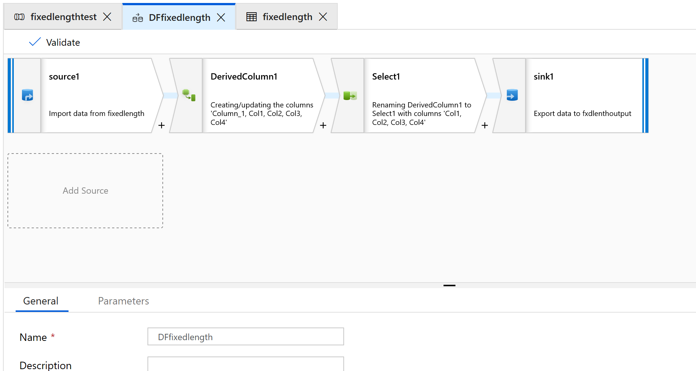
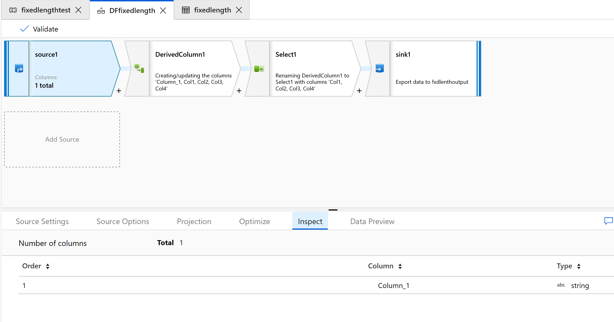

# Process fixed-length text files using Data Factory Mapping Data Flows

Data Factory Mapping Data Flows supports transformation data from fixed-width text files. You will define a dataset for a text file without a delimiter and then set up substring splits based on ordinal position.

## Create a pipeline

1. Go to **+New Pipeline** to start a new pipeline

2. Add a data flow activity which will be used for processing fixed-width files

  

3. In the Data Flow activity, select New Mapping Data Flow

4. Add a Source transformation, Derived Column, Select, and Sink Transformation

  

5. Configure the Source transformation to use a new dataset that will be of type Delimited Text

6. Set no column delimiter and no headers

We're going to simply set field starting points and lengths for this file contents:

```
1234567813572468
1234567813572468
1234567813572468
1234567813572468
1234567813572468
1234567813572468
1234567813572468
1234567813572468
1234567813572468
1234567813572468
1234567813572468
1234567813572468
1234567813572468
```

7. On the Projection tab of your Source transformation, you should see one string column called "Column_1"

8. Now in the Derived Column, create a new column

9. We'll give the columns simple names like col1

10. Then in the expression builder, type:

  ```substring(Column_1,1,4)```

  

10. Repeat this for all the columns you need to parse

12. Click on the Inspect tab to see the new columns that will be generated

  

13. Use the Select transform to remove any of the columns that you will not need for transformation

  

14. Finally, use Sink to output the data to a folder:

  

  Here is what the output will look like:

  

  The fixed-width data is now split with four characters each and assigned to Col1, Col2, Col3, Col4, ...
  Based on the above example I am splitting the data into 4 columns

## Next steps

* Build the rest of your data flow logic using Mapping Data Flow [transformations](concepts-data-flow-overview.md)
